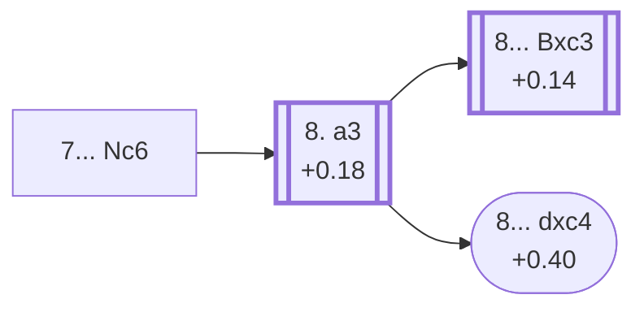

<a name="_TOP_"></a>

# E56 Nimzo-Indian Defense: Normal Variation, Bernstein Defense <br> 1. d4 Nf6 2. c4 e6 3. Nc3 Bb4 4. e3 O-O 5. Nf3 d5 6. Bd3 c5 7. O-O Nc6 #

Spun off from [E53's own "7.O-O" node](https://github.com/onclemarcel/chess_flashcards/blob/main/d4_openings/E53_Nimzo_Indian_Rubinstein_Main_Line_c5.md#_OO_): masters' clear main try at Black's own 7th move (42.7%), developing the last minor piece before resolving the centre. Live-tagged the *Bernstein Defense* — a real name `eco.md`'s own entry never carries anywhere in this whole E56-E59 spine (it only ever writes bare "Main line" labels), yet the live explorer attaches this same name consistently at every node down the chain, through E57, E58 and E59. Stated here once, rather than re-flagged as a surprise on each of the three cards that follow.

### Overview

<!-- content-diagram:start -->

<!-- content-diagram:end -->

<a name="_initial_move_"></a>

[](https://lichess.org/analysis/standard/r1bq1rk1/pp3ppp/2n1pn2/2pp4/1bPP4/2NBPN2/PP3PPP/R1BQ1RK1_w_-_-_2_8)

*... 7... Nc6 — Bernstein Defense*

```
r1bq1rk1/pp3ppp/2n1pn2/2pp4/1bPP4/2NBPN2/PP3PPP/R1BQ1RK1 w - - 2 8
```

|  | +0.39 |
| --- | --- |

<!-- lichess-stats:start fen="r1bq1rk1/pp3ppp/2n1pn2/2pp4/1bPP4/2NBPN2/PP3PPP/R1BQ1RK1 w - - 2 8" db="lichess,masters" speeds="bullet,blitz" ratings="1800,2000,2200,2500" moves="4" -->
| Move | Online | W/D/B | Masters | W/D/B | |
| :--- | ---: | :--- | ---: | :--- | :-- |
| a3 | 28 k (59.0%) | ⬜⬜⬜⬜⬜🟫⬛⬛⬛⬛ 49/6/45 | 2.9 k (88.4%) | ⬜⬜⬜🟫🟫🟫🟫🟫⬛⬛ 28/52/20 |  |
| cxd5 | 10 k (21.5%) | ⬜⬜⬜⬜⬜🟫⬛⬛⬛⬛ 49/6/45 | 311 (9.6%) | ⬜⬜⬜🟫🟫🟫🟫🟫⬛⬛ 30/54/16 |  |
| dxc5 | 2.8 k (5.9%) | ⬜⬜⬜⬜⬜🟫⬛⬛⬛⬛ 50/5/45 | 27 (0.8%) | ⬜⬜⬜🟫🟫🟫⬛⬛⬛⬛ 30/33/37 |  |
| Ne2 | 1.4 k (2.9%) | ⬜⬜⬜⬜⬜⬛⬛⬛⬛⬛ 50/5/45 | 17 (0.5%) | — |  |

*Online: bullet/blitz, 1800+ — 48 k games. Masters: 3.2 k games. [Open in the explorer](https://lichess.org/analysis/standard/r1bq1rk1/pp3ppp/2n1pn2/2pp4/1bPP4/2NBPN2/PP3PPP/R1BQ1RK1_w_-_-_2_8#explorer) — updated 2026-09-09*
<!-- lichess-stats:end -->

**8. a3** is masters' overwhelming main try (88.4%), forcing Black's bishop to declare itself.

* [**8. a3**](#_a3_) (88.4% masters, +0.18): covered below.
* **8. cxd5** (9.6% masters): resolves the tension instead. Not built out further here (backlog).

[*Back to TOP*](#_TOP_)

---

<a name="_a3_"></a>

## 8. a3

[](https://lichess.org/analysis/standard/r1bq1rk1/pp3ppp/2n1pn2/2pp4/1bPP4/P1NBPN2/1P3PPP/R1BQ1RK1_b_-_-_0_8)

*... 7... Nc6 8. a3*

```
r1bq1rk1/pp3ppp/2n1pn2/2pp4/1bPP4/P1NBPN2/1P3PPP/R1BQ1RK1 b - - 0 8
```

|  | +0.18 |
| --- | --- |

<!-- lichess-stats:start fen="r1bq1rk1/pp3ppp/2n1pn2/2pp4/1bPP4/P1NBPN2/1P3PPP/R1BQ1RK1 b - - 0 8" db="lichess,masters" speeds="bullet,blitz" ratings="1800,2000,2200,2500" moves="6" -->
| Move | Online | W/D/B | Masters | W/D/B | |
| :--- | ---: | :--- | ---: | :--- | :-- |
| Bxc3 | 22 k (77.9%) | ⬜⬜⬜⬜⬜🟫⬛⬛⬛⬛ 49/6/45 | 2.6 k (89.4%) | ⬜⬜⬜🟫🟫🟫🟫🟫⬛⬛ 27/52/21 |  |
| cxd4 | 2.9 k (10.2%) | ⬜⬜⬜⬜⬜🟫⬛⬛⬛⬛ 52/6/42 | 44 (1.5%) | ⬜⬜⬜🟫🟫🟫🟫🟫⬛⬛ 34/48/18 |  |
| Ba5 | 2.6 k (9.3%) | ⬜⬜⬜⬜⬜🟫⬛⬛⬛⬛ 48/6/46 | 221 (7.7%) | ⬜⬜⬜🟫🟫🟫🟫🟫⬛⬛ 29/52/19 |  |
| dxc4 | 694 (2.5%) | ⬜⬜⬜⬜⬜🟫⬛⬛⬛⬛ 51/6/43 | 36 (1.3%) | ⬜⬜⬜⬜🟫🟫🟫🟫🟫⬛ 39/47/14 |  |
| Qa5 | 17 (0.1%) | — | 0 | — |  |
| b6 | 6 (0.0%) | — | 1 (0.0%) | — |  |

*Online: bullet/blitz, 1800+ — 28 k games. Masters: 2.9 k games. [Open in the explorer](https://lichess.org/analysis/standard/r1bq1rk1/pp3ppp/2n1pn2/2pp4/1bPP4/P1NBPN2/1P3PPP/R1BQ1RK1_b_-_-_0_8#explorer) — updated 2026-09-09*
<!-- lichess-stats:end -->

**8... Bxc3** is masters' overwhelming main try (89.4%), giving up the bishop pair rather than let it get trapped or misplaced.

* [**8... Bxc3**](https://github.com/onclemarcel/chess_flashcards/blob/main/d4_openings/E58_Nimzo_Indian_Main_Line_Bxc3.md) (89.4% masters, +0.14): live-confirmed its own code, **E58** — covered on its own card.
* **8... Ba5** (7.7% masters): retreats instead of trading; a real, secondary try with no code of its own in this range. Not built out further here (backlog).
* **8... cxd4** (1.5% masters, 10.2% online): checked directly against this repo's own numeric bar — the ratio is 6.8×, just under the 8× threshold required for a blitz-trap classification, so this stays unclassified despite the visible gap. Not built out further here (backlog).
* [**8... dxc4**](#_dxc4_) (1.3% masters, 2.5% online, +0.40): the E57-coded continuation — covered below. This is `eco.md`'s own rarest coded line in the whole E50-E59 batch: masters 1.3% and online 2.5% both clear the *stadium* ("understudied everywhere") bar cleanly, a genuinely under-2%-everywhere line still carrying its own code.

[*Back to TOP*](#_TOP_)

---

> [!NOTE]
> **8... dxc4**, heading into the E57-coded `9.Bxc4 cxd4` continuation, is genuinely rare at both levels (masters 1.3%, online 2.5%) — mentioned here as the branch point; the full line is built out on [E57's own card](https://github.com/onclemarcel/chess_flashcards/blob/main/d4_openings/E57_Nimzo_Indian_Main_Line_dc_cd.md).
>
> <a name="_dxc4_"></a>
>
> ### 8... dxc4
>
> [](https://lichess.org/analysis/standard/r1bq1rk1/pp3ppp/2n1pn2/2p5/1bpP4/P1NBPN2/1P3PPP/R1BQ1RK1_w_-_-_0_9)
>
> ```
> r1bq1rk1/pp3ppp/2n1pn2/2p5/1bpP4/P1NBPN2/1P3PPP/R1BQ1RK1 w - - 0 9
> ```
>
> [**9. Bxc4 cxd4**](https://github.com/onclemarcel/chess_flashcards/blob/main/d4_openings/E57_Nimzo_Indian_Main_Line_dc_cd.md) (+0.40): live-confirmed its own code, **E57** — covered on its own card.
>
> [*Back to previous move*](#_a3_)
> [*Back to TOP*](#_TOP_)
