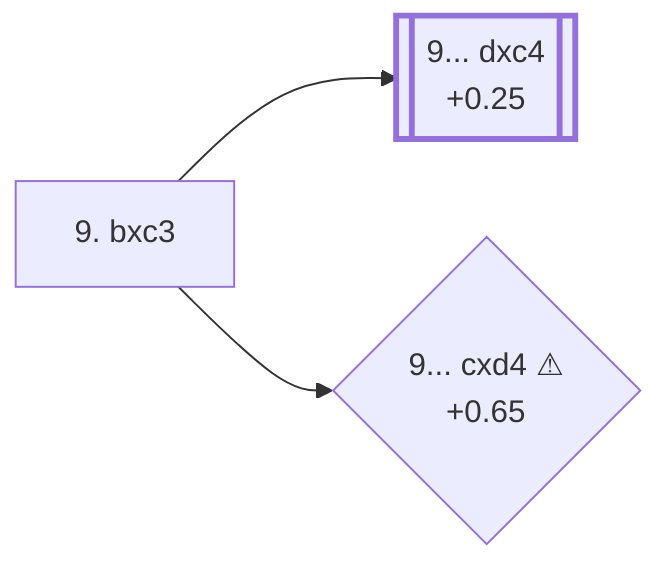

<a name="_TOP_"></a>

# E58 Nimzo-Indian Defense: Normal Variation, Bernstein Defense, Exchange Line <br> 1. d4 Nf6 2. c4 e6 3. Nc3 Bb4 4. e3 O-O 5. Nf3 d5 6. Bd3 c5 7. O-O Nc6 8. a3 Bxc3 9. bxc3 #

Spun off from [E56's own "8.a3" node](https://github.com/onclemarcel/chess_flashcards/blob/main/d4_openings/E56_Nimzo_Indian_Main_Line_Nc6.md#_a3_): masters' overwhelming main try at Black's own 8th move (89.4%), giving up the bishop pair for a healthy pawn structure rather than risk it getting shut in. Live-tagged the *Bernstein Defense, Exchange Line*.

### Overview

<!-- content-diagram:start -->

<!-- content-diagram:end -->

<a name="_initial_move_"></a>

[](https://lichess.org/analysis/standard/r1bq1rk1/pp3ppp/2n1pn2/2pp4/2PP4/P1PBPN2/5PPP/R1BQ1RK1_b_-_-_0_9)

*... 8... Bxc3 9. bxc3 — Exchange Line*

```
r1bq1rk1/pp3ppp/2n1pn2/2pp4/2PP4/P1PBPN2/5PPP/R1BQ1RK1 b - - 0 9
```

|  | +0.14 |
| --- | --- |

<!-- lichess-stats:start fen="r1bq1rk1/pp3ppp/2n1pn2/2pp4/2PP4/P1PBPN2/5PPP/R1BQ1RK1 b - - 0 9" db="lichess,masters" speeds="bullet,blitz" ratings="1800,2000,2200,2500" moves="6" -->
| Move | Online | W/D/B | Masters | W/D/B | |
| :--- | ---: | :--- | ---: | :--- | :-- |
| dxc4 | 10 k (35.3%) | ⬜⬜⬜⬜⬜⬛⬛⬛⬛⬛ 48/6/46 | 1.0 k (40.0%) | ⬜⬜⬜🟫🟫🟫🟫🟫⬛⬛ 30/48/22 |  |
| b6 | 7.0 k (23.7%) | ⬜⬜⬜⬜⬜⬛⬛⬛⬛⬛ 47/6/48 | 167 (6.4%) | ⬜⬜⬜⬜🟫🟫🟫🟫🟫⬛ 36/54/10 |  |
| cxd4 | 3.8 k (13.0%) | ⬜⬜⬜⬜⬜🟫⬛⬛⬛⬛ 54/5/40 | 0 | — | ⚠ |
| Qc7 | 2.4 k (8.2%) | ⬜⬜⬜⬜🟫⬛⬛⬛⬛⬛ 43/7/50 | 1.3 k (51.6%) | ⬜⬜⬜🟫🟫🟫🟫🟫⬛⬛ 25/54/21 |  |
| Re8 | 1.7 k (5.7%) | ⬜⬜⬜⬜⬜⬛⬛⬛⬛⬛ 48/5/47 | 24 (0.9%) | ⬜⬜🟫🟫🟫🟫🟫🟫⬛⬛ 17/67/17 |  |
| a6 | 928 (3.1%) | ⬜⬜⬜⬜⬜🟫⬛⬛⬛⬛ 51/5/44 | 0 | — | ⚠ |
| Na5 | 0 | — | 18 (0.7%) | — |  |
| Qe7 | 0 | — | 6 (0.2%) | — |  |

*Online: bullet/blitz, 1800+ — 30 k games. Masters: 2.6 k games. [Open in the explorer](https://lichess.org/analysis/standard/r1bq1rk1/pp3ppp/2n1pn2/2pp4/2PP4/P1PBPN2/5PPP/R1BQ1RK1_b_-_-_0_9#explorer) — updated 2026-09-14*
<!-- lichess-stats:end -->

**9... Qc7** is actually masters' single most popular reply here (51.6%) — well ahead of the E59-coded **9... dxc4** (40.0%, only second). This is a clean instance of the "coded line trails a top uncoded rival" pattern already seen repeatedly in this repo's D-series QGD sweep (D60, D64, D68): `eco.md` codes the second-most-popular masters try, not the first.

* **9... Qc7** (51.6% masters, 8.2% online): a real, secondary try — masters' own top pick here — with no code of its own in this range. Not built out further here (backlog). Notably the reverse of the usual online/masters gap: this move is *more* popular with masters than online.
* [**9... dxc4**](https://github.com/onclemarcel/chess_flashcards/blob/main/d4_openings/E59_Nimzo_Indian_Main_Line.md) (40.0% masters, +0.25): live-confirmed its own code, **E59**, `eco.md`'s own bare "Main line" — covered on its own card.
* **9... b6** (6.4% masters): a real, secondary try with no code of its own in this range. Not built out further here (backlog).
* [**9... cxd4 ⚠**](#_cxd4_) (0% masters, 13.0% online, +0.65): a genuine blitz trap — see the note below.

[*Back to TOP*](#_TOP_)

---

> [!NOTE]
> **9... cxd4**, resolving the last central tension, has literally zero games in this exact masters sample (2,614 games queried, none of them 9...cxd4) yet sits at 13.0% online — an effectively-infinite ratio, comfortably past this repo's own 8× blitz-trap bar (masters cleanly under 2%, online cleanly over 3%). A move that looks like a natural simplification online is one masters simply never reach for from this exact position.
>
> <a name="_cxd4_"></a>
>
> ### 9... cxd4 ⚠
>
> [](https://lichess.org/analysis/standard/r1bq1rk1/pp3ppp/2n1pn2/3p4/2Pp4/P1PBPN2/5PPP/R1BQ1RK1_w_-_-_0_10)
>
> ```
> r1bq1rk1/pp3ppp/2n1pn2/3p4/2Pp4/P1PBPN2/5PPP/R1BQ1RK1 w - - 0 10
> ```
>
> |  | +0.65 |
> | --- | --- |
>
> Not built out further here — a real, secondary try with no code of its own in this range, mentioned only for the trap-shaped gap above.
>
> [*Back to previous move*](#_initial_move_)
> [*Back to TOP*](#_TOP_)
