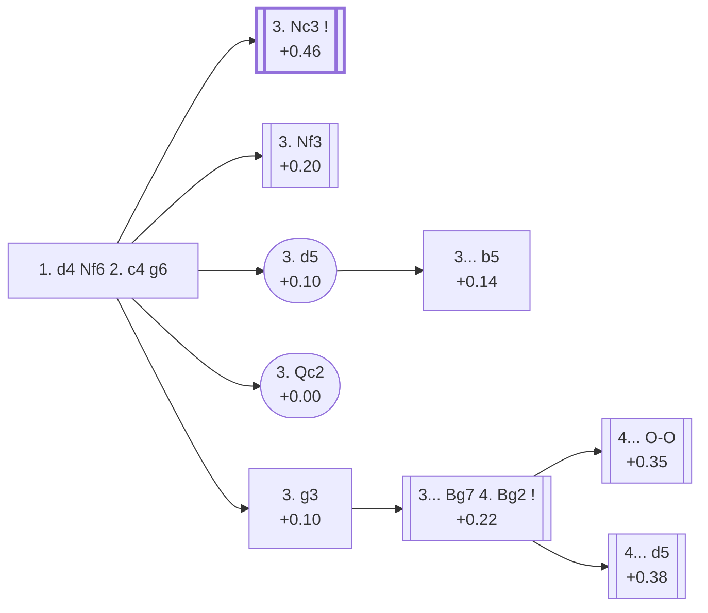

<a name="_TOP_"></a>

# E60 King's Indian Defence <br> 1. d4 Nf6 2. c4 g6 #

The King's Indian/Grünfeld move order tabiya. `eco.md` uses **E60** as a genuine catch-all for this bare position plus every White 3rd-move try that isn't **3. Nc3** — the overwhelming main line, covered from [E61 onward](https://github.com/onclemarcel/chess_flashcards/blob/main/d4_openings/E61_KID_Grunfeld_Fork.md). This card gathers those siblings: **3. Nf3** (a flexible transposition tool), **3. Qc2** (the Mengarini Attack), **3. d5** (the Anti-Grünfeld, itself forking the Danube Gambit), and **3. g3** (the Fianchetto approach without Nc3 first, itself forking the Counterthrust Variation) — genuine minor sidelines that share this one root rather than a deep tree each.

### Overview

*Quick map of every move covered on this card — see the [shape key](https://github.com/onclemarcel/chess_flashcards/blob/main/start.md#content-diagram-optional) in start.md.*

<!-- content-diagram:start -->

<!-- content-diagram:end -->

<a name="_initial_move_"></a>

[](https://lichess.org/analysis/standard/rnbqkb1r/pppppp1p/5np1/8/2PP4/8/PP2PPPP/RNBQKBNR_w_KQkq_-_0_3)

*... 1. d4 Nf6 2. c4 g6*

```
rnbqkb1r/pppppp1p/5np1/8/2PP4/8/PP2PPPP/RNBQKBNR w KQkq - 0 3
```

<!-- lichess-stats:start fen="rnbqkb1r/pppppp1p/5np1/8/2PP4/8/PP2PPPP/RNBQKBNR w KQkq - 0 3" db="lichess,masters" speeds="bullet,blitz" ratings="1800,2000,2200,2500" moves="6" -->
| Move | Online | W/D/B | Masters | W/D/B | |
| :--- | ---: | :--- | ---: | :--- | :-- |
| Nc3 | 20.8 M (80.0%) | ⬜⬜⬜⬜⬜⬛⬛⬛⬛⬛ 48/5/47 | 121 k (80.0%) | ⬜⬜⬜⬜🟫🟫🟫🟫⬛⬛ 35/43/23 |  |
| Nf3 | 2.9 M (11.2%) | ⬜⬜⬜⬜⬜⬛⬛⬛⬛⬛ 48/6/46 | 12 k (7.8%) | ⬜⬜⬜🟫🟫🟫🟫🟫⬛⬛ 33/46/21 |  |
| g3 | 707 k (2.7%) | ⬜⬜⬜⬜⬜🟫⬛⬛⬛⬛ 49/6/44 | 13 k (8.7%) | ⬜⬜⬜🟫🟫🟫🟫🟫⬛⬛ 34/47/19 |  |
| e3 | 629 k (2.4%) | ⬜⬜⬜⬜🟫⬛⬛⬛⬛⬛ 44/5/51 | 0 | — | ⚠ |
| f3 | 380 k (1.5%) | ⬜⬜⬜⬜⬜🟫⬛⬛⬛⬛ 51/5/44 | 4.2 k (2.8%) | ⬜⬜⬜🟫🟫🟫🟫🟫⬛⬛ 33/45/22 |  |
| Bg5 | 149 k (0.6%) | ⬜⬜⬜⬜🟫⬛⬛⬛⬛⬛ 43/5/52 | 0 | — | ⚠ |
| h4 | 0 | — | 577 (0.4%) | ⬜⬜⬜🟫🟫🟫🟫🟫🟫⬛ 29/55/15 |  |
| d5 | 0 | — | 133 (0.1%) | ⬜⬜⬜🟫🟫🟫🟫⬛⬛⬛ 35/37/28 |  |

*Online: bullet/blitz, 1800+ — 26.1 M games. Masters: 151 k games. [Open in the explorer](https://lichess.org/analysis/standard/rnbqkb1r/pppppp1p/5np1/8/2PP4/8/PP2PPPP/RNBQKBNR_w_KQkq_-_0_3#explorer) — updated 2026-09-09*
<!-- lichess-stats:end -->

Live-tagged, curiously, **Indian Defense: West Indian Defense** — a name `eco.md` doesn't carry at all for this bare tabiya. **3. Nc3** is masters' overwhelming choice (80.0%), covered from E61 onward. Every other try shares this one card.

### Candidate moves

* [**3. Nc3**](https://github.com/onclemarcel/chess_flashcards/blob/main/d4_openings/E61_KID_Grunfeld_Fork.md) (+0.46, 80.0% masters): the main line — its own code, E61 onward.
* [**3. Nf3**](#_Nf3_) (+0.20, 7.8% masters): see below.
* [**3. g3**](#_g3_) (+0.10, 8.7% masters): the Immediate Fianchetto — see below.
* [**3. Qc2**](#_Qc2_) (+0.00, a database rarity): the Mengarini Attack — see below.
* [**3. d5**](#_d5_) (+0.10, a database rarity): the Anti-Gruenfeld — see below.

[*Back to TOP*](#_TOP_)

---

<a name="_Nf3_"></a>

## 3. Nf3

[](https://lichess.org/analysis/standard/rnbqkb1r/pppppp1p/5np1/8/2PP4/5N2/PP2PPPP/RNBQKB1R_b_KQkq_-_1_3)

*... 3. Nf3 — King's Indian Defence, 3.Nf3*

```
rnbqkb1r/pppppp1p/5np1/8/2PP4/5N2/PP2PPPP/RNBQKB1R b KQkq - 1 3
```

|  | +0.20 |
| --- | --- |

<!-- lichess-stats:start fen="rnbqkb1r/pppppp1p/5np1/8/2PP4/5N2/PP2PPPP/RNBQKB1R b KQkq - 1 3" db="lichess,masters" speeds="bullet,blitz" ratings="1800,2000,2200,2500" moves="4" -->
| Move | Online | W/D/B | Masters | W/D/B | |
| :--- | ---: | :--- | ---: | :--- | :-- |
| Bg7 | 6.6 M (84.7%) | ⬜⬜⬜⬜⬜⬛⬛⬛⬛⬛ 48/6/46 | 36 k (95.7%) | ⬜⬜⬜⬜🟫🟫🟫🟫⬛⬛ 35/42/23 |  |
| d5 | 598 k (7.6%) | ⬜⬜⬜⬜⬜🟫⬛⬛⬛⬛ 50/6/45 | 169 (0.4%) | ⬜⬜⬜⬜⬜🟫🟫🟫🟫⬛ 45/43/12 |  |
| d6 | 332 k (4.2%) | ⬜⬜⬜⬜⬜⬛⬛⬛⬛⬛ 49/5/46 | 329 (0.9%) | ⬜⬜⬜⬜🟫🟫🟫⬛⬛⬛ 36/35/29 |  |
| c5 | 225 k (2.9%) | ⬜⬜⬜⬜⬜⬛⬛⬛⬛⬛ 47/6/46 | 1.1 k (2.8%) | ⬜⬜⬜⬜🟫🟫🟫🟫⬛⬛ 42/36/22 |  |

*Online: bullet/blitz, 1800+ — 7.8 M games. Masters: 38 k games. [Open in the explorer](https://lichess.org/analysis/standard/rnbqkb1r/pppppp1p/5np1/8/2PP4/5N2/PP2PPPP/RNBQKB1R_b_KQkq_-_1_3#explorer) — updated 2026-09-09*
<!-- lichess-stats:end -->

Live-tagged **King's Indian Defense: Normal Variation, King's Knight Variation** — a real name `eco.md`'s bare "3.Nf3" doesn't carry. Black replies **3... Bg7** almost automatically (95.7% masters), and the game typically transposes back toward the main 3.Nc3 tree once White plays Nc3 next — a plausible-looking transposition this card does not assert without checking each concrete move order; not covered further here.

[*Back to the root*](#_initial_move_)
[*Back to TOP*](#_TOP_)

---

<a name="_g3_"></a>

## 3. g3 — Immediate Fianchetto

[](https://lichess.org/analysis/standard/rnbqkb1r/pppppp1p/5np1/8/2PP4/6P1/PP2PP1P/RNBQKBNR_b_KQkq_-_0_3)

*... 3. g3 — King's Indian Defence, 3.g3*

```
rnbqkb1r/pppppp1p/5np1/8/2PP4/6P1/PP2PP1P/RNBQKBNR b KQkq - 0 3
```

|  | +0.10 |
| --- | --- |

<!-- lichess-stats:start fen="rnbqkb1r/pppppp1p/5np1/8/2PP4/6P1/PP2PP1P/RNBQKBNR b KQkq - 0 3" db="lichess,masters" speeds="bullet,blitz" ratings="1800,2000,2200,2500" moves="4" -->
| Move | Online | W/D/B | Masters | W/D/B | |
| :--- | ---: | :--- | ---: | :--- | :-- |
| Bg7 | 574 k (79.6%) | ⬜⬜⬜⬜⬜🟫⬛⬛⬛⬛ 49/6/45 | 10 k (76.7%) | ⬜⬜⬜⬜🟫🟫🟫🟫⬛⬛ 36/44/20 |  |
| d5 | 85 k (11.7%) | ⬜⬜⬜⬜⬜🟫⬛⬛⬛⬛ 50/6/44 | 278 (2.1%) | ⬜⬜⬜🟫🟫🟫🟫🟫⬛⬛ 35/47/18 |  |
| c6 | 27 k (3.8%) | ⬜⬜⬜⬜⬜🟫⬛⬛⬛⬛ 46/9/45 | 2.1 k (15.9%) | ⬜⬜⬜🟫🟫🟫🟫🟫🟫⬛ 25/62/14 |  |
| d6 | 24 k (3.3%) | ⬜⬜⬜⬜⬜🟫⬛⬛⬛⬛ 50/6/44 | 0 | — | ⚠ |
| c5 | 0 | — | 677 (5.1%) | ⬜⬜⬜🟫🟫🟫🟫⬛⬛⬛ 29/44/27 |  |

*Online: bullet/blitz, 1800+ — 721 k games. Masters: 13 k games. [Open in the explorer](https://lichess.org/analysis/standard/rnbqkb1r/pppppp1p/5np1/8/2PP4/6P1/PP2PP1P/RNBQKBNR_b_KQkq_-_0_3#explorer) — updated 2026-09-09*
<!-- lichess-stats:end -->

Live-tagged **King's Indian Defense: Fianchetto Variation, Immediate Fianchetto** — a genuine, deliberate pairing worth stating plainly rather than flagging as a collision: this whole batch's own main trunk (E62 onward) reaches an almost identical setup two moves later via 3.Nc3 Bg7 4.Nf3 d6 5.g3, and the live explorer tags *that* node **Delayed Fianchetto** (see [E62](https://github.com/onclemarcel/chess_flashcards/blob/main/d4_openings/E62_Kings_Indian_Fianchetto_Variation.md)) — the "Immediate"/"Delayed" qualifiers are a matched pair naming the same strategic idea reached at two different tempos, not a naming error.

<a name="_g3Bg7_"></a>

**3... Bg7** is masters' clear favourite (76.7%) and **4. Bg2** all but automatic next (98.7% of the resulting positions).

[](https://lichess.org/analysis/standard/rnbqk2r/ppppppbp/5np1/8/2PP4/6P1/PP2PPBP/RNBQK1NR_b_KQkq_-_2_4)

*... 3... Bg7 4. Bg2*

```
rnbqk2r/ppppppbp/5np1/8/2PP4/6P1/PP2PPBP/RNBQK1NR b KQkq - 2 4
```

|  | +0.22 |
| --- | --- |

<!-- lichess-stats:start fen="rnbqk2r/ppppppbp/5np1/8/2PP4/6P1/PP2PPBP/RNBQK1NR b KQkq - 2 4" db="lichess,masters" speeds="bullet,blitz" ratings="1800,2000,2200,2500" moves="4" -->
| Move | Online | W/D/B | Masters | W/D/B | |
| :--- | ---: | :--- | ---: | :--- | :-- |
| O-O | 441 k (62.1%) | ⬜⬜⬜⬜⬜🟫⬛⬛⬛⬛ 49/6/45 | 6.9 k (65.9%) | ⬜⬜⬜⬜🟫🟫🟫🟫⬛⬛ 38/42/20 |  |
| d6 | 158 k (22.3%) | ⬜⬜⬜⬜⬜🟫⬛⬛⬛⬛ 50/6/44 | 638 (6.1%) | ⬜⬜⬜⬜🟫🟫🟫🟫⬛⬛ 45/37/18 |  |
| d5 | 48 k (6.8%) | ⬜⬜⬜⬜⬜🟫⬛⬛⬛⬛ 49/6/44 | 2.5 k (23.6%) | ⬜⬜⬜🟫🟫🟫🟫🟫⬛⬛ 31/50/19 |  |
| c6 | 43 k (6.0%) | ⬜⬜⬜⬜⬜🟫⬛⬛⬛⬛ 51/6/43 | 0 | — | ⚠ |
| c5 | 0 | — | 363 (3.5%) | ⬜⬜⬜🟫🟫🟫🟫⬛⬛⬛ 30/44/26 |  |

*Online: bullet/blitz, 1800+ — 710 k games. Masters: 10 k games. [Open in the explorer](https://lichess.org/analysis/standard/rnbqk2r/ppppppbp/5np1/8/2PP4/6P1/PP2PPBP/RNBQK1NR_b_KQkq_-_2_4#explorer) — updated 2026-09-09*
<!-- lichess-stats:end -->

Black's own 4th move is a genuine fork: **4... O-O** is actually masters' *majority* choice (65.9%), ahead of the coded **4... d5** (23.6%) — the same "coded line trails an uncoded rival" pattern seen repeatedly elsewhere in this ECO sweep.

* <a name="_g3OO_"></a> [**4... O-O**](#_g3OO_) (+0.35, 65.9% masters): masters' actual majority — a real, significant secondary with no code of its own in this range; White usually follows up with Nf3/O-O/Nc3, transposing toward similar Fianchetto structures reached elsewhere in this batch, a plausible transposition this card does not assert without checking each concrete move order.
* [**4... d5**](#_ctd_) (+0.38, 23.6% masters): the Counterthrust Variation — see below.

[*Back to the root*](#_initial_move_)
[*Back to TOP*](#_TOP_)

---

> [!NOTE]
> **4... d5**, the Counterthrust Variation, strikes the centre immediately rather than castling first — a real, if secondary, King's Indian/Grünfeld hybrid try.
>
> <a name="_ctd_"></a>
>
> ### 3... Bg7 4. Bg2 d5 — Counterthrust Variation
>
> [](https://lichess.org/analysis/standard/rnbqk2r/ppp1ppbp/5np1/3p4/2PP4/6P1/PP2PPBP/RNBQK1NR_w_KQkq_d6_0_5)
>
> *... 3... Bg7 4. Bg2 d5 — Counterthrust Variation*
>
> ```
> rnbqk2r/ppp1ppbp/5np1/3p4/2PP4/6P1/PP2PPBP/RNBQK1NR w KQkq d6 0 5
> ```
>
> |  | +0.38 |
> | --- | --- |
>
> <!-- lichess-stats:start fen="rnbqk2r/ppp1ppbp/5np1/3p4/2PP4/6P1/PP2PPBP/RNBQK1NR w KQkq d6 0 5" db="lichess,masters" speeds="bullet,blitz" ratings="1800,2000,2200,2500" moves="4" -->
> | Move | Online | W/D/B | Masters | W/D/B | |
> | :--- | ---: | :--- | ---: | :--- | :-- |
> | cxd5 | 36 k (38.6%) | ⬜⬜⬜⬜⬜🟫⬛⬛⬛⬛ 50/6/43 | 2.3 k (89.7%) | ⬜⬜⬜🟫🟫🟫🟫🟫⬛⬛ 31/51/18 |  |
> | Nf3 | 34 k (36.8%) | ⬜⬜⬜⬜⬜🟫⬛⬛⬛⬛ 49/6/45 | 226 (8.9%) | ⬜⬜⬜🟫🟫🟫🟫🟫⬛⬛ 34/45/21 |  |
> | Nc3 | 18 k (19.2%) | ⬜⬜⬜⬜⬜🟫⬛⬛⬛⬛ 50/5/45 | 32 (1.3%) | ⬜⬜⬜🟫🟫🟫⬛⬛⬛⬛ 25/34/41 |  |
> | e3 | 1.4 k (1.5%) | ⬜⬜⬜⬜⬜⬛⬛⬛⬛⬛ 45/5/50 | 2 (0.1%) | — | ⚠ |
> 
> *Online: bullet/blitz, 1800+ — 94 k games. Masters: 2.5 k games. [Open in the explorer](https://lichess.org/analysis/standard/rnbqk2r/ppp1ppbp/5np1/3p4/2PP4/6P1/PP2PPBP/RNBQK1NR_w_KQkq_d6_0_5#explorer) — updated 2026-09-09*
> <!-- lichess-stats:end -->
>
> Live-tagged, tellingly, **Grünfeld Defense: Counterthrust Variation** rather than any King's Indian name — the explorer classifies this exact hybrid structure (fianchetto-vs-fianchetto with an early ...d5) as belonging to the Grünfeld family, even though `eco.md` files it under the King's Indian's own E60. White's main try is **5. cxd5** (89.7% masters), simplifying the centre at once; **5. Nf3** (8.9%) and **5. Nc3** (1.3%) are real, much rarer secondaries. Not covered further here.
>
> [*Back to 3. g3*](#_g3_)
> [*Back to TOP*](#_TOP_)

---

> [!NOTE]
> **3. Qc2**, the Mengarini Attack, develops the queen early to eye the h7-b1 or c-file setups without committing a knight yet — an extreme database rarity at every level.
>
> <a name="_Qc2_"></a>
>
> ### 3. Qc2 — Mengarini Attack
>
> [](https://lichess.org/analysis/standard/rnbqkb1r/pppppp1p/5np1/8/2PP4/8/PPQ1PPPP/RNB1KBNR_b_KQkq_-_1_3)
>
> *... 3. Qc2 — Mengarini Attack*
>
> ```
> rnbqkb1r/pppppp1p/5np1/8/2PP4/8/PPQ1PPPP/RNB1KBNR b KQkq - 1 3
> ```
>
> |  | +0.00 |
> | --- | --- |
>
> <!-- lichess-stats:start fen="rnbqkb1r/pppppp1p/5np1/8/2PP4/8/PPQ1PPPP/RNB1KBNR b KQkq - 1 3" db="lichess,masters" speeds="bullet,blitz" ratings="1800,2000,2200,2500" moves="4" -->
> | Move | Online | W/D/B | Masters | W/D/B | |
> | :--- | ---: | :--- | ---: | :--- | :-- |
> | Bg7 | 3.7 k (76.7%) | ⬜⬜⬜⬜🟫⬛⬛⬛⬛⬛ 43/4/54 | 2 (66.7%) | — | ⚠ |
> | d5 | 746 (15.5%) | ⬜⬜⬜⬜⬛⬛⬛⬛⬛⬛ 42/4/54 | 1 (33.3%) | — | ⚠ |
> | d6 | 241 (5.0%) | ⬜⬜⬜⬜🟫⬛⬛⬛⬛⬛ 41/5/54 | 0 | — | ⚠ |
> | c5 | 90 (1.9%) | ⬜⬜⬜⬜⬜🟫⬛⬛⬛⬛ 52/6/42 | 0 | — |  |
> 
> *Online: bullet/blitz, 1800+ — 4.8 k games. Masters: 3 games. [Open in the explorer](https://lichess.org/analysis/standard/rnbqkb1r/pppppp1p/5np1/8/2PP4/8/PPQ1PPPP/RNB1KBNR_b_KQkq_-_1_3#explorer) — updated 2026-09-09*
> <!-- lichess-stats:end -->
>
> Live-tagged **Queen's Pawn, Mengarini Attack** (matching `eco.md`'s own name closely). This is the thinnest coded line in the whole E60-E69 batch: only 3 masters games have ever reached it, and it accounts for barely 0.02% of online play at the root — an "understudied everywhere" (stadium) shape by a wide margin. Black replies **3... Bg7** most often (76.7% of the still-thin online sample); not covered further here.
>
> [*Back to the root*](#_initial_move_)
> [*Back to TOP*](#_TOP_)

---

> [!NOTE]
> **3. d5**, the Anti-Gruenfeld, stakes out space immediately rather than developing a piece — itself forking the Danube Gambit.
>
> <a name="_d5_"></a>
>
> ### 3. d5 — Anti-Gruenfeld
>
> [](https://lichess.org/analysis/standard/rnbqkb1r/pppppp1p/5np1/3P4/2P5/8/PP2PPPP/RNBQKBNR_b_KQkq_-_0_3)
>
> *... 3. d5 — Anti-Gruenfeld*
>
> ```
> rnbqkb1r/pppppp1p/5np1/3P4/2P5/8/PP2PPPP/RNBQKBNR b KQkq - 0 3
> ```
>
> |  | +0.10 |
> | --- | --- |
>
> <!-- lichess-stats:start fen="rnbqkb1r/pppppp1p/5np1/3P4/2P5/8/PP2PPPP/RNBQKBNR b KQkq - 0 3" db="lichess,masters" speeds="bullet,blitz" ratings="1800,2000,2200,2500" moves="6" -->
> | Move | Online | W/D/B | Masters | W/D/B | |
> | :--- | ---: | :--- | ---: | :--- | :-- |
> | Bg7 | 82 k (75.1%) | ⬜⬜⬜⬜⬜⬛⬛⬛⬛⬛ 44/4/52 | 62 (46.6%) | ⬜⬜⬜⬜🟫🟫🟫⬛⬛⬛ 35/32/32 |  |
> | d6 | 17 k (15.9%) | ⬜⬜⬜⬜⬜⬛⬛⬛⬛⬛ 45/4/51 | 8 (6.0%) | — |  |
> | c6 | 7.0 k (6.4%) | ⬜⬜⬜⬜🟫⬛⬛⬛⬛⬛ 44/4/52 | 46 (34.6%) | ⬜⬜⬜⬜🟫🟫🟫🟫⬛⬛ 37/39/24 |  |
> | c5 | 1.2 k (1.1%) | ⬜⬜⬜⬜⬜⬛⬛⬛⬛⬛ 45/4/52 | 4 (3.0%) | — | ⚠ |
> | e6 | 742 (0.7%) | ⬜⬜⬜⬜⬜⬛⬛⬛⬛⬛ 49/5/46 | 0 | — | ⚠ |
> | b5 | 317 (0.3%) | ⬜⬜⬜⬜⬜⬛⬛⬛⬛⬛ 45/2/53 | 11 (8.3%) | — |  |
> | e5 | 0 | — | 2 (1.5%) | — |  |
> 
> *Online: bullet/blitz, 1800+ — 109 k games. Masters: 133 games. [Open in the explorer](https://lichess.org/analysis/standard/rnbqkb1r/pppppp1p/5np1/3P4/2P5/8/PP2PPPP/RNBQKBNR_b_KQkq_-_0_3#explorer) — updated 2026-09-09*
> <!-- lichess-stats:end -->
>
> Live-tagged **Indian Defense: Anti-Grünfeld, Advance Variation** — the "Advance Variation" qualifier is a real name `eco.md`'s own bare "Anti-Gruenfeld" doesn't carry. Despite `eco.md` coding it prominently, this whole branch is a genuine database rarity at the parent root (0.1% masters, 0.2% online) — both clearing the "understudied everywhere" bar. Black's main replies here are **3... Bg7** (46.6%) and **3... c6** (34.6%), neither with a code of its own in this range; **3... b5**, the Danube Gambit, is masters' third choice (8.3%) — see below.
>
> * **3... Bg7** (46.6% masters): the natural fianchetto — a real, uncoded try with no code of its own in this range.
> * **3... c6** (34.6% masters): challenging the d5-pawn at once — likewise uncoded here.
> * [**3... b5**](#_b5_) (+0.14, 8.3% masters): the Danube Gambit — see below.
>
> [*Back to the root*](#_initial_move_)
> [*Back to TOP*](#_TOP_)

---

> [!NOTE]
> **3... b5**, the Danube Gambit, offers a queenside pawn to open lines for Black's pieces before White can consolidate the extra space.
>
> <a name="_b5_"></a>
>
> ### 3. d5 b5 — Danube Gambit
>
> [](https://lichess.org/analysis/standard/rnbqkb1r/p1pppp1p/5np1/1p1P4/2P5/8/PP2PPPP/RNBQKBNR_w_KQkq_b6_0_4)
>
> *... 3. d5 b5 — Danube Gambit*
>
> ```
> rnbqkb1r/p1pppp1p/5np1/1p1P4/2P5/8/PP2PPPP/RNBQKBNR w KQkq b6 0 4
> ```
>
> |  | +0.14 |
> | --- | --- |
>
> <!-- lichess-stats:start fen="rnbqkb1r/p1pppp1p/5np1/1p1P4/2P5/8/PP2PPPP/RNBQKBNR w KQkq b6 0 4" db="lichess,masters" speeds="bullet,blitz" ratings="1800,2000,2200,2500" moves="6" -->
> | Move | Online | W/D/B | Masters | W/D/B | |
> | :--- | ---: | :--- | ---: | :--- | :-- |
> | Nc3 | 123 (38.7%) | ⬜⬜⬜⬜⬜⬛⬛⬛⬛⬛ 49/3/48 | 0 | — | ⚠ |
> | cxb5 | 87 (27.4%) | ⬜⬜⬜⬜⬜⬛⬛⬛⬛⬛ 53/2/45 | 10 (90.9%) | — |  |
> | c5 | 36 (11.3%) | ⬜⬜⬜⬛⬛⬛⬛⬛⬛⬛ 28/0/72 | 0 | — |  |
> | e3 | 29 (9.1%) | ⬜⬜⬜⬜⬛⬛⬛⬛⬛⬛ 41/0/59 | 0 | — |  |
> | b3 | 27 (8.5%) | ⬜⬜⬜⬜⬛⬛⬛⬛⬛⬛ 37/4/59 | 0 | — |  |
> | Nf3 | 8 (2.5%) | — | 0 | — |  |
> | a4 | 0 | — | 1 (9.1%) | — |  |
> 
> *Online: bullet/blitz, 1800+ — 318 games. Masters: 11 games. [Open in the explorer](https://lichess.org/analysis/standard/rnbqkb1r/p1pppp1p/5np1/1p1P4/2P5/8/PP2PPPP/RNBQKBNR_w_KQkq_b6_0_4#explorer) — updated 2026-09-09*
> <!-- lichess-stats:end -->
>
> Live-tagged, tellingly, **Indian Defense: Anti-Grünfeld, Adorjan Gambit** — a real name divergence from `eco.md`'s own "Danube Gambit" (named instead for Andras Adorjan, a leading practitioner). An extreme rarity (11 masters games total) that shows an unusual *inverted* online/masters ratio for this repository: masters actually accept the pawn (**4. cxb5**, 90.9% of that thin sample) more often, proportionally, than online play does (27.4%) — where 4. Nc3, simply developing and ignoring the offer, is instead the top online try (38.7%). Not covered further here.
>
> [*Back to 3. d5*](#_d5_)
> [*Back to TOP*](#_TOP_)
