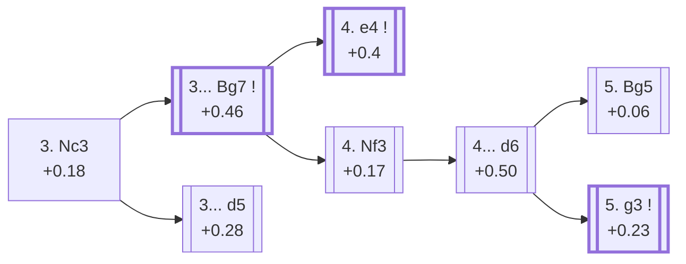

<a name="_TOP_"></a>

# E61 King's Indian Defense <br> 1. d4 Nf6 2. c4 g6 3. Nc3 #

**3. Nc3** is White's overwhelming choice after the King's Indian/Grünfeld move order (80.0% of masters games — see [A40 Queen's Pawn Game](https://github.com/onclemarcel/chess_flashcards/blob/main/d4_openings/A40_QPG.md)), developing naturally and preparing e4. Black now has to choose between two entirely different defences that happen to share the same first two moves.

### Overview

*Quick map of every move covered on this card — see the [shape key](https://github.com/onclemarcel/chess_flashcards/blob/main/start.md#content-diagram-optional) in start.md.*

<!-- content-diagram:start -->

<!-- content-diagram:end -->

<a name="_Nc3_"></a>

[](https://lichess.org/analysis/standard/rnbqkb1r/pppppp1p/5np1/8/2PP4/2N5/PP2PPPP/R1BQKBNR_b_KQkq_-_1_3)

*... 1. d4 Nf6 2. c4 g6 3. Nc3*

```
rnbqkb1r/pppppp1p/5np1/8/2PP4/2N5/PP2PPPP/R1BQKBNR b KQkq - 1 3
```

|  | +0.18 |
| --- | --- |

<!-- lichess-stats:start fen="rnbqkb1r/pppppp1p/5np1/8/2PP4/2N5/PP2PPPP/R1BQKBNR b KQkq - 1 3" db="lichess,masters" speeds="bullet,blitz" ratings="1800,2000,2200,2500" moves="6" -->
| Move | Online | W/D/B | Masters | W/D/B | |
| :--- | ---: | :--- | ---: | :--- | :-- |
| Bg7 | 14.8 M (68.2%) | ⬜⬜⬜⬜⬜⬛⬛⬛⬛⬛ 49/5/46 | 79 k (64.8%) | ⬜⬜⬜⬜🟫🟫🟫🟫⬛⬛ 38/38/24 |  |
| d5 | 5.7 M (26.4%) | ⬜⬜⬜⬜⬜⬛⬛⬛⬛⬛ 46/6/47 | 42 k (34.7%) | ⬜⬜⬜🟫🟫🟫🟫🟫⬛⬛ 29/51/20 |  |
| d6 | 929 k (4.3%) | ⬜⬜⬜⬜⬜⬛⬛⬛⬛⬛ 49/5/46 | 325 (0.3%) | ⬜⬜⬜⬜🟫🟫🟫🟫⬛⬛ 42/39/19 |  |
| c5 | 178 k (0.8%) | ⬜⬜⬜⬜⬜⬛⬛⬛⬛⬛ 47/5/48 | 231 (0.2%) | ⬜⬜⬜⬜🟫🟫🟫⬛⬛⬛ 43/33/24 |  |
| c6 | 47 k (0.2%) | ⬜⬜⬜⬜⬜🟫⬛⬛⬛⬛ 52/4/43 | 2 (0.0%) | — | ⚠ |
| e6 | 18 k (0.1%) | ⬜⬜⬜⬜⬜⬜⬛⬛⬛⬛ 56/4/39 | 0 | — | ⚠ |
| e5 | 0 | — | 2 (0.0%) | — |  |

*Online: bullet/blitz, 1800+ — 21.8 M games. Masters: 122 k games. [Open in the explorer](https://lichess.org/analysis/standard/rnbqkb1r/pppppp1p/5np1/8/2PP4/2N5/PP2PPPP/R1BQKBNR_b_KQkq_-_1_3#explorer) — updated 2026-09-07*
<!-- lichess-stats:end -->

### Candidate moves

* [**3... Bg7**](#_Bg7_) (+0.46): masters' clear favourite (64.8%) — the King's Indian Defense, Black fianchettoes and lets White build a big centre before striking back; forks further one ply later, see below.
* [**3... d5**](https://github.com/onclemarcel/chess_flashcards/blob/main/d4_openings/D80_Grunfeld_Defense.md) (+0.28): a real minority choice, over a third of masters games (34.7%) — the [Grünfeld Defense](https://github.com/onclemarcel/chess_flashcards/blob/main/d4_openings/D80_Grunfeld_Defense.md), Black challenges the centre immediately and accepts a space deficit for active piece play

[*Back to TOP*](#_TOP_)

---

<a name="_Bg7_"></a>

## 3... Bg7

[](https://lichess.org/analysis/standard/rnbqk2r/ppppppbp/5np1/8/2PP4/2N5/PP2PPPP/R1BQKBNR_w_KQkq_-_2_4)

*... 3... Bg7 — King's Indian Defense*

```
rnbqk2r/ppppppbp/5np1/8/2PP4/2N5/PP2PPPP/R1BQKBNR w KQkq - 2 4
```

|  | +0.46 |
| --- | --- |

<!-- lichess-stats:start fen="rnbqk2r/ppppppbp/5np1/8/2PP4/2N5/PP2PPPP/R1BQKBNR w KQkq - 2 4" db="lichess,masters" speeds="bullet,blitz" ratings="1800,2000,2200,2500" moves="6" -->
| Move | Online | W/D/B | Masters | W/D/B | |
| :--- | ---: | :--- | ---: | :--- | :-- |
| e4 | 11.1 M (66.3%) | ⬜⬜⬜⬜⬜⬛⬛⬛⬛⬛ 50/5/45 | 74 k (91.7%) | ⬜⬜⬜⬜🟫🟫🟫🟫⬛⬛ 38/38/24 |  |
| Nf3 | 2.9 M (17.4%) | ⬜⬜⬜⬜⬜⬛⬛⬛⬛⬛ 48/5/47 | 4.3 k (5.3%) | ⬜⬜⬜⬜🟫🟫🟫🟫⬛⬛ 38/37/26 |  |
| Bg5 | 779 k (4.7%) | ⬜⬜⬜⬜⬜⬛⬛⬛⬛⬛ 46/5/49 | 691 (0.9%) | ⬜⬜⬜⬜🟫🟫🟫⬛⬛⬛ 38/36/26 |  |
| e3 | 640 k (3.8%) | ⬜⬜⬜⬜🟫⬛⬛⬛⬛⬛ 45/5/51 | 22 (0.0%) | ⬜⬜⬜🟫🟫🟫⬛⬛⬛⬛ 32/32/36 |  |
| Bf4 | 520 k (3.1%) | ⬜⬜⬜⬜⬜⬛⬛⬛⬛⬛ 47/5/48 | 63 (0.1%) | ⬜⬜⬜⬜🟫🟫🟫⬛⬛⬛ 35/35/30 |  |
| g3 | 352 k (2.1%) | ⬜⬜⬜⬜⬜⬛⬛⬛⬛⬛ 48/5/46 | 1.6 k (2.0%) | ⬜⬜⬜🟫🟫🟫🟫⬛⬛⬛ 35/40/25 |  |

*Online: bullet/blitz, 1800+ — 16.7 M games. Masters: 80 k games. [Open in the explorer](https://lichess.org/analysis/standard/rnbqk2r/ppppppbp/5np1/8/2PP4/2N5/PP2PPPP/R1BQKBNR_w_KQkq_-_2_4#explorer) — updated 2026-09-07*
<!-- lichess-stats:end -->

This exact position is **[E70](https://github.com/onclemarcel/chess_flashcards/blob/main/d4_openings/E70_Kings_Indian.md)'s own title tabiya** — but E70's own candidate list only ever covers **4. e4** (91.7% masters) onward; a genuine, small omission left over from before this batch existed, since **4. Nf3** already sat in E70's own stats table at 5.3% masters without ever being surfaced as a candidate or a link. Completed here rather than there, since 4.Nf3 is this whole E60-E69 batch's own trunk:

* [**4. e4**](https://github.com/onclemarcel/chess_flashcards/blob/main/d4_openings/E70_Kings_Indian.md) (+0.4, 91.7% masters): the classical main line — its own card, [E70](https://github.com/onclemarcel/chess_flashcards/blob/main/d4_openings/E70_Kings_Indian.md).
* [**4. Nf3**](#_Nf3_) (+0.17, 5.3% masters): a real, significant secondary — see below, this batch's own trunk.

[*Back to 3. Nc3*](#_Nc3_)
[*Back to TOP*](#_TOP_)

---

<a name="_Nf3_"></a>

## 3. Nc3 Bg7 4. Nf3

[](https://lichess.org/analysis/standard/rnbqk2r/ppppppbp/5np1/8/2PP4/2N2N2/PP2PPPP/R1BQKB1R_b_KQkq_-_3_4)

*... 4. Nf3*

```
rnbqk2r/ppppppbp/5np1/8/2PP4/2N2N2/PP2PPPP/R1BQKB1R b KQkq - 3 4
```

|  | +0.17 |
| --- | --- |

<!-- lichess-stats:start fen="rnbqk2r/ppppppbp/5np1/8/2PP4/2N2N2/PP2PPPP/R1BQKB1R b KQkq - 3 4" db="lichess,masters" speeds="bullet,blitz" ratings="1800,2000,2200,2500" moves="6" -->
| Move | Online | W/D/B | Masters | W/D/B | |
| :--- | ---: | :--- | ---: | :--- | :-- |
| O-O | 4.3 M (49.6%) | ⬜⬜⬜⬜⬜⬛⬛⬛⬛⬛ 48/5/47 | 16 k (61.2%) | ⬜⬜⬜⬜🟫🟫🟫🟫⬛⬛ 37/38/25 |  |
| d6 | 2.8 M (33.0%) | ⬜⬜⬜⬜⬜⬛⬛⬛⬛⬛ 49/5/46 | 3.5 k (13.7%) | ⬜⬜⬜⬜🟫🟫🟫🟫⬛⬛ 39/36/25 |  |
| d5 | 1.2 M (13.4%) | ⬜⬜⬜⬜🟫⬛⬛⬛⬛⬛ 46/7/47 | 6.2 k (24.2%) | ⬜⬜⬜🟫🟫🟫🟫🟫⬛⬛ 27/50/23 |  |
| c5 | 134 k (1.6%) | ⬜⬜⬜⬜⬜⬛⬛⬛⬛⬛ 48/5/46 | 227 (0.9%) | ⬜⬜⬜⬜🟫🟫🟫⬛⬛⬛ 44/27/29 |  |
| c6 | 91 k (1.1%) | ⬜⬜⬜⬜⬜🟫⬛⬛⬛⬛ 53/5/42 | 7 (0.0%) | — |  |
| e6 | 62 k (0.7%) | ⬜⬜⬜⬜⬜⬜⬛⬛⬛⬛ 56/5/39 | 1 (0.0%) | — | ⚠ |

*Online: bullet/blitz, 1800+ — 8.6 M games. Masters: 26 k games. [Open in the explorer](https://lichess.org/analysis/standard/rnbqk2r/ppppppbp/5np1/8/2PP4/2N2N2/PP2PPPP/R1BQKB1R_b_KQkq_-_3_4#explorer) — updated 2026-09-07*
<!-- lichess-stats:end -->

Black's own 4th move is genuinely split three ways here: **4... O-O** is actually masters' plurality (61.2%, simply castling and keeping every follow-up flexible), ahead of **4... d5** (24.2%, transposing toward Grünfeld-flavoured structures) and the coded **4... d6** (13.7%) this card follows onward — none of these are asserted to transpose into any other specific coded tree without checking each concrete move order.

<a name="_d6_"></a>

**4... d6** reaches this batch's own second fork.

[](https://lichess.org/analysis/standard/rnbqk2r/ppp1ppbp/3p1np1/8/2PP4/2N2N2/PP2PPPP/R1BQKB1R_w_KQkq_-_0_5)

*... 4... d6*

```
rnbqk2r/ppp1ppbp/3p1np1/8/2PP4/2N2N2/PP2PPPP/R1BQKB1R w KQkq - 0 5
```

|  | +0.50 |
| --- | --- |

<!-- lichess-stats:start fen="rnbqk2r/ppp1ppbp/3p1np1/8/2PP4/2N2N2/PP2PPPP/R1BQKB1R w KQkq - 0 5" db="lichess,masters" speeds="bullet,blitz" ratings="1800,2000,2200,2500" moves="6" -->
| Move | Online | W/D/B | Masters | W/D/B | |
| :--- | ---: | :--- | ---: | :--- | :-- |
| e4 | 3.0 M (42.0%) | ⬜⬜⬜⬜⬜⬛⬛⬛⬛⬛ 49/5/46 | 5.4 k (65.8%) | ⬜⬜⬜⬜🟫🟫🟫🟫⬛⬛ 39/37/24 |  |
| Bg5 | 1.7 M (23.9%) | ⬜⬜⬜⬜⬜⬛⬛⬛⬛⬛ 48/5/47 | 1.0 k (12.3%) | ⬜⬜⬜⬜🟫🟫🟫🟫⬛⬛ 40/36/24 |  |
| g3 | 906 k (12.8%) | ⬜⬜⬜⬜⬜🟫⬛⬛⬛⬛ 50/5/44 | 1.3 k (15.3%) | ⬜⬜⬜⬜🟫🟫🟫🟫⬛⬛ 38/37/25 |  |
| e3 | 580 k (8.2%) | ⬜⬜⬜⬜⬜⬛⬛⬛⬛⬛ 46/5/49 | 106 (1.3%) | ⬜⬜⬜🟫🟫🟫🟫⬛⬛⬛ 28/36/36 |  |
| Bf4 | 560 k (7.9%) | ⬜⬜⬜⬜⬜⬛⬛⬛⬛⬛ 49/5/46 | 256 (3.1%) | ⬜⬜⬜⬜🟫🟫🟫🟫⬛⬛ 41/34/24 |  |
| h3 | 185 k (2.6%) | ⬜⬜⬜⬜⬜🟫⬛⬛⬛⬛ 50/5/45 | 174 (2.1%) | ⬜⬜⬜⬜🟫🟫🟫🟫⬛⬛ 42/36/22 |  |

*Online: bullet/blitz, 1800+ — 7.1 M games. Masters: 8.2 k games. [Open in the explorer](https://lichess.org/analysis/standard/rnbqk2r/ppp1ppbp/3p1np1/8/2PP4/2N2N2/PP2PPPP/R1BQKB1R_w_KQkq_-_0_5#explorer) — updated 2026-09-07*
<!-- lichess-stats:end -->

White's own 5th move here forks the whole rest of this batch — plus a genuine, `apply_san.py`-**verified transposition**: masters' actual main try, **5. e4** (65.8%), simply reorders the classical Nc3/e4/Nf3 trio and lands on the exact same tabiya as [E70](https://github.com/onclemarcel/chess_flashcards/blob/main/d4_openings/E70_Kings_Indian.md#_Nf3_)'s own "5. Nf3" node (identical piece placement, side to move, and castling rights — the two positions differ only in the en-passant flag and halfmove clock, which is exactly the harmless drift already logged for several transpositions elsewhere in this ECO sweep, not a real difference).

* **5. e4** (65.8% masters): a verified transposition into [E70's own "5. Nf3" node](https://github.com/onclemarcel/chess_flashcards/blob/main/d4_openings/E70_Kings_Indian.md#_Nf3_) — not covered again here.
* [**5. g3**](https://github.com/onclemarcel/chess_flashcards/blob/main/d4_openings/E62_Kings_Indian_Fianchetto_Variation.md) (+0.23, 15.3% masters): the Fianchetto Variation — its own card, E62 onward.
* [**5. Bg5**](#_Bg5_) (+0.06, 12.3% masters): the Smyslov System — see below.

[*Back to 3... Bg7*](#_Bg7_)
[*Back to TOP*](#_TOP_)

---

<a name="_Bg5_"></a>

## 5. Bg5 — Smyslov System

[](https://lichess.org/analysis/standard/rnbqk2r/ppp1ppbp/3p1np1/6B1/2PP4/2N2N2/PP2PPPP/R2QKB1R_b_KQkq_-_1_5)

*... 5. Bg5 — Smyslov System*

```
rnbqk2r/ppp1ppbp/3p1np1/6B1/2PP4/2N2N2/PP2PPPP/R2QKB1R b KQkq - 1 5
```

|  | +0.06 |
| --- | --- |

<!-- lichess-stats:start fen="rnbqk2r/ppp1ppbp/3p1np1/6B1/2PP4/2N2N2/PP2PPPP/R2QKB1R b KQkq - 1 5" db="lichess,masters" speeds="bullet,blitz" ratings="1800,2000,2200,2500" moves="6" -->
| Move | Online | W/D/B | Masters | W/D/B | |
| :--- | ---: | :--- | ---: | :--- | :-- |
| O-O | 1.5 M (77.2%) | ⬜⬜⬜⬜⬜⬛⬛⬛⬛⬛ 48/5/47 | 398 (37.6%) | ⬜⬜⬜⬜⬜🟫🟫🟫⬛⬛ 48/30/22 |  |
| h6 | 150 k (7.7%) | ⬜⬜⬜⬜⬜⬛⬛⬛⬛⬛ 47/5/48 | 508 (48.0%) | ⬜⬜⬜🟫🟫🟫🟫⬛⬛⬛ 34/38/28 |  |
| Nbd7 | 119 k (6.2%) | ⬜⬜⬜⬜⬜⬛⬛⬛⬛⬛ 50/5/46 | 75 (7.1%) | ⬜⬜⬜⬜🟫🟫🟫🟫⬛⬛ 39/37/24 |  |
| c6 | 47 k (2.4%) | ⬜⬜⬜⬜⬜⬛⬛⬛⬛⬛ 47/5/48 | 50 (4.7%) | ⬜⬜⬜⬜🟫🟫🟫🟫🟫⬛ 42/44/14 |  |
| Bg4 | 44 k (2.2%) | ⬜⬜⬜⬜⬜🟫⬛⬛⬛⬛ 50/5/45 | 0 | — | ⚠ |
| Nc6 | 28 k (1.4%) | ⬜⬜⬜⬜⬜⬛⬛⬛⬛⬛ 50/4/46 | 0 | — | ⚠ |
| Bf5 | 0 | — | 9 (0.8%) | — |  |
| c5 | 0 | — | 7 (0.7%) | — |  |

*Online: bullet/blitz, 1800+ — 1.9 M games. Masters: 1.1 k games. [Open in the explorer](https://lichess.org/analysis/standard/rnbqk2r/ppp1ppbp/3p1np1/6B1/2PP4/2N2N2/PP2PPPP/R2QKB1R_b_KQkq_-_1_5#explorer) — updated 2026-09-07*
<!-- lichess-stats:end -->

Live-tagged **King's Indian Defense: Smyslov Variation**, confirming `eco.md`'s own name. Pins the f6-knight before Black castles — a quieter try than the main Fianchetto/Classical systems. Masters' actual plurality reply is **5... h6** (48.0%), immediately questioning the bishop, narrowly ahead of the simple **5... O-O** (37.6%); Stockfish rates the whole line essentially level (+0.06). Not covered further here.

* **5... h6** (48.0% masters): masters' actual plurality — a real, uncoded try with no code of its own in this range.
* **5... O-O** (37.6% masters): simply castling — likewise uncoded here.

[*Back to 4... d6*](#_d6_)
[*Back to TOP*](#_TOP_)
