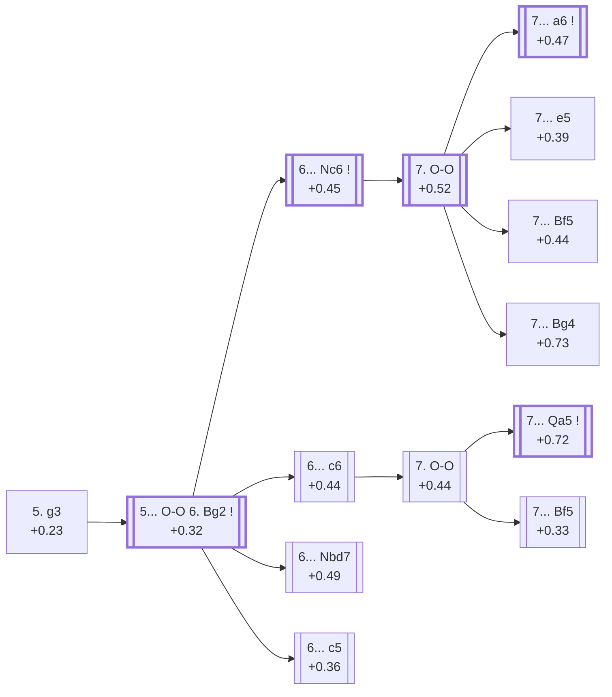

<a name="_TOP_"></a>

# E62 King's Indian Defence: Fianchetto Variation <br> 1. d4 Nf6 2. c4 g6 3. Nc3 Bg7 4. Nf3 d6 5. g3 #

Continues from [E61's own "4... d6" node](https://github.com/onclemarcel/chess_flashcards/blob/main/d4_openings/E61_KID_Grunfeld_Fork.md#_d6_), where White's **5. g3** is this whole batch's own main trunk (15.3% masters there, second only to the transposing 5.e4). Rather than the direct kingside build-up of the Classical Variation ([E70](https://github.com/onclemarcel/chess_flashcards/blob/main/d4_openings/E70_Kings_Indian.md)), White fianchettoes the king's bishop too, aiming for a long, strategic game where the extra tempo on Black's own fianchetto (Bg2 vs Black's Bg7) tends to favour White slightly. Live-tagged **Delayed Fianchetto** — a deliberate pairing with [E60's own "Immediate Fianchetto"](https://github.com/onclemarcel/chess_flashcards/blob/main/d4_openings/E60_Kings_Indian_Sidelines.md#_g3_) (3. g3, reached two tempi earlier), not a naming collision.

### Overview

*Quick map of every move covered on this card — see the [shape key](https://github.com/onclemarcel/chess_flashcards/blob/main/start.md#content-diagram-optional) in start.md.*

<!-- content-diagram:start -->

<!-- content-diagram:end -->

<a name="_initial_move_"></a>

[](https://lichess.org/analysis/standard/rnbqk2r/ppp1ppbp/3p1np1/8/2PP4/2N2NP1/PP2PP1P/R1BQKB1R_b_KQkq_-_0_5)

*... 5. g3 — King's Indian Defence: Fianchetto Variation*

```
rnbqk2r/ppp1ppbp/3p1np1/8/2PP4/2N2NP1/PP2PP1P/R1BQKB1R b KQkq - 0 5
```

|  | +0.23 |
| --- | --- |

<!-- lichess-stats:start fen="rnbqk2r/ppp1ppbp/3p1np1/8/2PP4/2N2NP1/PP2PP1P/R1BQKB1R b KQkq - 0 5" db="lichess,masters" speeds="bullet,blitz" ratings="1800,2000,2200,2500" moves="6" -->
| Move | Online | W/D/B | Masters | W/D/B | |
| :--- | ---: | :--- | ---: | :--- | :-- |
| O-O | 825 k (86.9%) | ⬜⬜⬜⬜⬜🟫⬛⬛⬛⬛ 50/6/45 | 1.4 k (93.1%) | ⬜⬜⬜⬜🟫🟫🟫🟫⬛⬛ 39/36/25 |  |
| Nbd7 | 37 k (3.9%) | ⬜⬜⬜⬜⬜🟫⬛⬛⬛⬛ 53/5/42 | 13 (0.9%) | — |  |
| c6 | 23 k (2.4%) | ⬜⬜⬜⬜⬜🟫⬛⬛⬛⬛ 52/5/43 | 37 (2.5%) | ⬜⬜⬜🟫🟫🟫🟫⬛⬛⬛ 32/43/24 |  |
| Bg4 | 18 k (1.8%) | ⬜⬜⬜⬜⬜🟫⬛⬛⬛⬛ 54/5/41 | 0 | — | ⚠ |
| Nc6 | 16 k (1.7%) | ⬜⬜⬜⬜⬜🟫⬛⬛⬛⬛ 51/5/44 | 4 (0.3%) | — | ⚠ |
| c5 | 7.1 k (0.7%) | ⬜⬜⬜⬜⬜🟫⬛⬛⬛⬛ 55/5/40 | 0 | — | ⚠ |
| Bf5 | 0 | — | 39 (2.7%) | ⬜⬜🟫🟫🟫🟫⬛⬛⬛⬛ 15/41/44 |  |
| Bd7 | 0 | — | 3 (0.2%) | — |  |

*Online: bullet/blitz, 1800+ — 949 k games. Masters: 1.5 k games. [Open in the explorer](https://lichess.org/analysis/standard/rnbqk2r/ppp1ppbp/3p1np1/8/2PP4/2N2NP1/PP2PP1P/R1BQKB1R_b_KQkq_-_0_5#explorer) — updated 2026-09-14*
<!-- lichess-stats:end -->

### Candidate moves

* [**5... O-O**](#_OO_) (+0.00, 93.1% masters): close to automatic — see below, this card's own trunk.
* **5... Bf5/c6/Nbd7** (each under 3% masters): real, minor secondaries with no code of their own in this range.

[*Back to TOP*](#_TOP_)

---

<a name="_OO_"></a>

## 5... O-O 6. Bg2

[](https://lichess.org/analysis/standard/rnbq1rk1/ppp1ppbp/3p1np1/8/2PP4/2N2NP1/PP2PPBP/R1BQK2R_b_KQ_-_2_6)

*... 5... O-O 6. Bg2*

```
rnbq1rk1/ppp1ppbp/3p1np1/8/2PP4/2N2NP1/PP2PPBP/R1BQK2R b KQ - 2 6
```

|  | +0.32 |
| --- | --- |

<!-- lichess-stats:start fen="rnbq1rk1/ppp1ppbp/3p1np1/8/2PP4/2N2NP1/PP2PPBP/R1BQK2R b KQ - 2 6" db="lichess,masters" speeds="bullet,blitz" ratings="1800,2000,2200,2500" moves="6" -->
| Move | Online | W/D/B | Masters | W/D/B | |
| :--- | ---: | :--- | ---: | :--- | :-- |
| Nc6 | 592 k (28.5%) | ⬜⬜⬜⬜⬜⬛⬛⬛⬛⬛ 48/6/46 | 6.3 k (40.9%) | ⬜⬜⬜⬜🟫🟫🟫🟫⬛⬛ 38/41/21 |  |
| Nbd7 | 568 k (27.3%) | ⬜⬜⬜⬜⬜🟫⬛⬛⬛⬛ 49/5/45 | 5.2 k (33.6%) | ⬜⬜⬜⬜🟫🟫🟫🟫⬛⬛ 41/37/23 |  |
| c6 | 364 k (17.5%) | ⬜⬜⬜⬜⬜🟫⬛⬛⬛⬛ 49/6/45 | 2.4 k (15.3%) | ⬜⬜⬜⬜🟫🟫🟫🟫⬛⬛ 38/39/23 |  |
| c5 | 270 k (13.0%) | ⬜⬜⬜⬜⬜🟫⬛⬛⬛⬛ 49/6/45 | 1.1 k (7.1%) | ⬜⬜⬜🟫🟫🟫🟫🟫⬛⬛ 36/46/19 |  |
| Bg4 | 78 k (3.7%) | ⬜⬜⬜⬜⬜🟫⬛⬛⬛⬛ 52/5/43 | 94 (0.6%) | ⬜⬜⬜⬜🟫🟫🟫⬛⬛⬛ 36/35/29 |  |
| Re8 | 55 k (2.7%) | ⬜⬜⬜⬜⬜🟫⬛⬛⬛⬛ 52/5/43 | 0 | — | ⚠ |
| a6 | 0 | — | 177 (1.2%) | ⬜⬜⬜⬜🟫🟫🟫🟫⬛⬛ 42/38/20 |  |

*Online: bullet/blitz, 1800+ — 2.1 M games. Masters: 15 k games. [Open in the explorer](https://lichess.org/analysis/standard/rnbq1rk1/ppp1ppbp/3p1np1/8/2PP4/2N2NP1/PP2PPBP/R1BQK2R_b_KQ_-_2_6#explorer) — updated 2026-09-14*
<!-- lichess-stats:end -->

Black's own 6th move genuinely scatters four ways here, and every one of the four biggest tries carries its own `eco.md` code: **6... Nc6** is actually masters' plurality (40.9%), narrowly ahead of **6... Nbd7** (33.6%, [E67](https://github.com/onclemarcel/chess_flashcards/blob/main/d4_openings/E67_Kings_Indian_Fianchetto_Nd7.md)), with **6... c6** (15.3%, this card's own Larsen/Kavalek branch) and **6... c5** (7.1%, the Yugoslav System, [E64](https://github.com/onclemarcel/chess_flashcards/blob/main/d4_openings/E64_Kings_Indian_Fianchetto_Yugoslav_System.md)) both clearly smaller. A separate, unrelated **6... a6** also exists here (1.2% masters, 1.0% online — an "understudied everywhere" rarity) — a genuinely different, shallower try from the *Panno Variation* below, reached only after 6... Nc6 7. O-O first; not to be confused with it.

* [**6... Nc6**](#_Nc6_) (+0.45, 40.9% masters): masters' actual plurality — see below, its own code.
* [**6... Nbd7**](https://github.com/onclemarcel/chess_flashcards/blob/main/d4_openings/E67_Kings_Indian_Fianchetto_Nd7.md) (+0.49, 33.6% masters): the Fianchetto With ...Nd7 — its own card, E67 onward.
* [**6... c6**](#_c6_) (+0.44, 15.3% masters): see below, its own code.
* [**6... c5**](https://github.com/onclemarcel/chess_flashcards/blob/main/d4_openings/E64_Kings_Indian_Fianchetto_Yugoslav_System.md) (+0.36, 7.1% masters): the Yugoslav System — its own card, E64 onward.
* **6... a6** (1.2% masters, 1.0% online): a genuine database rarity, unrelated to the Panno Variation below — no code of its own in this range.

[*Back to 5. g3*](#_initial_move_)
[*Back to TOP*](#_TOP_)

---

<a name="_c6_"></a>

## 6... c6

[](https://lichess.org/analysis/standard/rnbq1rk1/pp2ppbp/2pp1np1/8/2PP4/2N2NP1/PP2PPBP/R1BQK2R_w_KQ_-_0_7)

*... 6... c6*

```
rnbq1rk1/pp2ppbp/2pp1np1/8/2PP4/2N2NP1/PP2PPBP/R1BQK2R w KQ - 0 7
```

|  | +0.44 |
| --- | --- |

<!-- lichess-stats:start fen="rnbq1rk1/pp2ppbp/2pp1np1/8/2PP4/2N2NP1/PP2PPBP/R1BQK2R w KQ - 0 7" db="lichess,masters" speeds="bullet,blitz" ratings="1800,2000,2200,2500" moves="4" -->
| Move | Online | W/D/B | Masters | W/D/B | |
| :--- | ---: | :--- | ---: | :--- | :-- |
| O-O | 458 k (86.7%) | ⬜⬜⬜⬜⬜🟫⬛⬛⬛⬛ 50/6/45 | 2.5 k (92.4%) | ⬜⬜⬜⬜🟫🟫🟫🟫⬛⬛ 37/39/24 |  |
| e4 | 36 k (6.7%) | ⬜⬜⬜⬜⬜⬛⬛⬛⬛⬛ 49/5/46 | 142 (5.2%) | ⬜⬜⬜⬜🟫🟫🟫🟫⬛⬛ 44/38/18 |  |
| h3 | 8.0 k (1.5%) | ⬜⬜⬜⬜⬜🟫⬛⬛⬛⬛ 51/5/44 | 61 (2.2%) | ⬜⬜⬜🟫🟫🟫🟫🟫⬛⬛ 30/46/25 |  |
| Bg5 | 7.8 k (1.5%) | ⬜⬜⬜⬜⬜⬛⬛⬛⬛⬛ 46/5/49 | 0 | — | ⚠ |
| b3 | 0 | — | 3 (0.1%) | — |  |

*Online: bullet/blitz, 1800+ — 529 k games. Masters: 2.7 k games. [Open in the explorer](https://lichess.org/analysis/standard/rnbq1rk1/pp2ppbp/2pp1np1/8/2PP4/2N2NP1/PP2PPBP/R1BQK2R_w_KQ_-_0_7#explorer) — updated 2026-09-14*
<!-- lichess-stats:end -->

<a name="_c6OO_"></a>

**7. O-O** is masters' clear main try (92.4%).

[](https://lichess.org/analysis/standard/rnbq1rk1/pp2ppbp/2pp1np1/8/2PP4/2N2NP1/PP2PPBP/R1BQ1RK1_b_-_-_1_7)

*... 7. O-O*

```
rnbq1rk1/pp2ppbp/2pp1np1/8/2PP4/2N2NP1/PP2PPBP/R1BQ1RK1 b - - 1 7
```

|  | +0.32 |
| --- | --- |

<!-- lichess-stats:start fen="rnbq1rk1/pp2ppbp/2pp1np1/8/2PP4/2N2NP1/PP2PPBP/R1BQ1RK1 b - - 1 7" db="lichess,masters" speeds="bullet,blitz" ratings="1800,2000,2200,2500" moves="6" -->
| Move | Online | W/D/B | Masters | W/D/B | |
| :--- | ---: | :--- | ---: | :--- | :-- |
| Nbd7 | 573 k (38.7%) | ⬜⬜⬜⬜⬜🟫⬛⬛⬛⬛ 51/5/44 | 759 (11.8%) | ⬜⬜⬜⬜⬜🟫🟫🟫⬛⬛ 46/30/23 |  |
| Bg4 | 208 k (14.1%) | ⬜⬜⬜⬜⬜🟫⬛⬛⬛⬛ 51/6/43 | 109 (1.7%) | ⬜⬜⬜⬜🟫🟫🟫🟫⬛⬛ 37/45/18 |  |
| Qa5 | 186 k (12.6%) | ⬜⬜⬜⬜🟫⬛⬛⬛⬛⬛ 45/6/49 | 2.7 k (42.4%) | ⬜⬜⬜⬜🟫🟫🟫🟫⬛⬛ 38/37/25 |  |
| Bf5 | 118 k (8.0%) | ⬜⬜⬜⬜🟫⬛⬛⬛⬛⬛ 46/7/47 | 1.6 k (25.0%) | ⬜⬜⬜🟫🟫🟫🟫🟫⬛⬛ 31/45/25 |  |
| Qc7 | 112 k (7.5%) | ⬜⬜⬜⬜⬜🟫⬛⬛⬛⬛ 50/6/44 | 0 | — | ⚠ |
| a6 | 53 k (3.6%) | ⬜⬜⬜⬜⬜🟫⬛⬛⬛⬛ 50/6/44 | 373 (5.8%) | ⬜⬜⬜⬜🟫🟫🟫🟫⬛⬛ 35/41/24 |  |
| Qb6 | 0 | — | 663 (10.3%) | ⬜⬜⬜🟫🟫🟫🟫⬛⬛⬛ 35/39/27 |  |

*Online: bullet/blitz, 1800+ — 1.5 M games. Masters: 6.4 k games. [Open in the explorer](https://lichess.org/analysis/standard/rnbq1rk1/pp2ppbp/2pp1np1/8/2PP4/2N2NP1/PP2PPBP/R1BQ1RK1_b_-_-_1_7#explorer) — updated 2026-09-14*
<!-- lichess-stats:end -->

Black's own 7th move here is a genuine surprise against `eco.md`'s own entry order: masters' *actual* plurality is **7... Qa5** (42.4%, the Kavalek/Bronstein Variation), well ahead of **7... Bf5** (25.0%, the Larsen System, listed first in `eco.md`) — the reverse of what the naming order suggests. Online play flips the picture entirely: the top online try here is the uncoded 7... Nbd7 (38.7%), with Qa5 dropping to third (12.6%) behind Bg4 (14.1%, also uncoded).

* [**7... Qa5**](#_Qa5_) (+0.72, 42.4% masters): masters' actual plurality — the Kavalek (Bronstein) Variation, see below.
* [**7... Bf5**](#_Bf5a_) (+0.33, 25.0% masters): the Larsen System, see below.

[*Back to 6... c6*](#_c6_)
[*Back to TOP*](#_TOP_)

---

> [!NOTE]
> **7... Bf5**, the Larsen System, develops the bishop actively to its most natural diagonal before White can play e4.
>
> <a name="_Bf5a_"></a>
>
> ### 6... c6 7. O-O Bf5 — Larsen System
>
> [](https://lichess.org/analysis/standard/rn1q1rk1/pp2ppbp/2pp1np1/5b2/2PP4/2N2NP1/PP2PPBP/R1BQ1RK1_w_-_-_2_8)
>
> *... 6... c6 7. O-O Bf5 — Larsen System*
>
> ```
> rn1q1rk1/pp2ppbp/2pp1np1/5b2/2PP4/2N2NP1/PP2PPBP/R1BQ1RK1 w - - 2 8
> ```
>
> |  | +0.33 |
> | --- | --- |
>
> <!-- lichess-stats:start fen="rn1q1rk1/pp2ppbp/2pp1np1/5b2/2PP4/2N2NP1/PP2PPBP/R1BQ1RK1 w - - 2 8" db="lichess,masters" speeds="bullet,blitz" ratings="1800,2000,2200,2500" moves="4" -->
> | Move | Online | W/D/B | Masters | W/D/B | |
> | :--- | ---: | :--- | ---: | :--- | :-- |
> | Re1 | 34 k (26.7%) | ⬜⬜⬜⬜🟫⬛⬛⬛⬛⬛ 46/7/48 | 199 (11.9%) | ⬜⬜⬜🟫🟫🟫🟫⬛⬛⬛ 30/41/29 |  |
> | Nh4 | 26 k (20.7%) | ⬜⬜⬜⬜🟫⬛⬛⬛⬛⬛ 46/7/48 | 389 (23.2%) | ⬜⬜⬜🟫🟫🟫🟫⬛⬛⬛ 26/42/31 |  |
> | b3 | 10 k (8.2%) | ⬜⬜⬜⬜⬜🟫⬛⬛⬛⬛ 48/10/42 | 369 (22.0%) | ⬜⬜⬜🟫🟫🟫🟫🟫⬛⬛ 29/55/16 |  |
> | h3 | 8.8 k (7.0%) | ⬜⬜⬜⬜🟫⬛⬛⬛⬛⬛ 46/7/47 | 0 | — | ⚠ |
> | Ne1 | 0 | — | 421 (25.1%) | ⬜⬜⬜🟫🟫🟫🟫🟫⬛⬛ 33/44/23 |  |
> 
> *Online: bullet/blitz, 1800+ — 126 k games. Masters: 1.7 k games. [Open in the explorer](https://lichess.org/analysis/standard/rn1q1rk1/pp2ppbp/2pp1np1/5b2/2PP4/2N2NP1/PP2PPBP/R1BQ1RK1_w_-_-_2_8#explorer) — updated 2026-09-14*
> <!-- lichess-stats:end -->
>
> Live-tagged **King's Indian Defense: Fianchetto Variation, Larsen Defense** — `eco.md`'s own "System" becomes "Defense" live, a minor but real suffix divergence. Not covered further here.
>
> [*Back to 7. O-O*](#_c6OO_)
> [*Back to TOP*](#_TOP_)

---

> [!NOTE]
> **7... Qa5**, the Kavalek (Bronstein) Variation, pressures the c3-knight and eyes a4/h5 before White completes development — masters' actual plurality at this fork.
>
> <a name="_Qa5_"></a>
>
> ### 6... c6 7. O-O Qa5 — Kavalek (Bronstein) Variation
>
> [](https://lichess.org/analysis/standard/rnb2rk1/pp2ppbp/2pp1np1/q7/2PP4/2N2NP1/PP2PPBP/R1BQ1RK1_w_-_-_2_8)
>
> *... 6... c6 7. O-O Qa5 — Kavalek (Bronstein) Variation*
>
> ```
> rnb2rk1/pp2ppbp/2pp1np1/q7/2PP4/2N2NP1/PP2PPBP/R1BQ1RK1 w - - 2 8
> ```
>
> |  | +0.72 |
> | --- | --- |
>
> <!-- lichess-stats:start fen="rnb2rk1/pp2ppbp/2pp1np1/q7/2PP4/2N2NP1/PP2PPBP/R1BQ1RK1 w - - 2 8" db="lichess,masters" speeds="bullet,blitz" ratings="1800,2000,2200,2500" moves="4" -->
> | Move | Online | W/D/B | Masters | W/D/B | |
> | :--- | ---: | :--- | ---: | :--- | :-- |
> | e4 | 74 k (39.4%) | ⬜⬜⬜⬜⬜⬛⬛⬛⬛⬛ 47/6/47 | 1.4 k (50.2%) | ⬜⬜⬜⬜🟫🟫🟫🟫⬛⬛ 43/36/21 |  |
> | h3 | 28 k (14.8%) | ⬜⬜⬜⬜⬜🟫⬛⬛⬛⬛ 48/7/45 | 940 (34.4%) | ⬜⬜⬜⬜🟫🟫🟫🟫⬛⬛ 37/38/25 |  |
> | Bd2 | 21 k (11.2%) | ⬜⬜⬜⬜🟫⬛⬛⬛⬛⬛ 40/5/55 | 0 | — | ⚠ |
> | Re1 | 11 k (5.9%) | ⬜⬜⬜⬜🟫⬛⬛⬛⬛⬛ 43/5/53 | 0 | — | ⚠ |
> | d5 | 0 | — | 105 (3.8%) | ⬜⬜🟫🟫🟫⬛⬛⬛⬛⬛ 18/30/51 |  |
> | Qd2 | 0 | — | 90 (3.3%) | ⬜⬜🟫🟫🟫🟫🟫⬛⬛⬛ 20/50/30 |  |
> 
> *Online: bullet/blitz, 1800+ — 188 k games. Masters: 2.7 k games. [Open in the explorer](https://lichess.org/analysis/standard/rnb2rk1/pp2ppbp/2pp1np1/q7/2PP4/2N2NP1/PP2PPBP/R1BQ1RK1_w_-_-_2_8#explorer) — updated 2026-09-14*
> <!-- lichess-stats:end -->
>
> Live-tagged **King's Indian Defense: Fianchetto Variation, Kavalek Defense** — `eco.md`'s own parenthetical "(Bronstein)" alt-name doesn't appear live, and "Variation" again becomes "Defense". Stockfish already prefers White notably more here (+0.72) than after 7... Bf5 (+0.33) despite Qa5 being the more popular try. Not covered further here.
>
> [*Back to 7. O-O*](#_c6OO_)
> [*Back to TOP*](#_TOP_)

---

<a name="_Nc6_"></a>

## 6... Nc6 — Fianchetto With ...Nc6

[](https://lichess.org/analysis/standard/r1bq1rk1/ppp1ppbp/2np1np1/8/2PP4/2N2NP1/PP2PPBP/R1BQK2R_w_KQ_-_3_7)

*... 6... Nc6 — Fianchetto With ...Nc6*

```
r1bq1rk1/ppp1ppbp/2np1np1/8/2PP4/2N2NP1/PP2PPBP/R1BQK2R w KQ - 3 7
```

|  | +0.45 |
| --- | --- |

<!-- lichess-stats:start fen="r1bq1rk1/ppp1ppbp/2np1np1/8/2PP4/2N2NP1/PP2PPBP/R1BQK2R w KQ - 3 7" db="lichess,masters" speeds="bullet,blitz" ratings="1800,2000,2200,2500" moves="4" -->
| Move | Online | W/D/B | Masters | W/D/B | |
| :--- | ---: | :--- | ---: | :--- | :-- |
| O-O | 529 k (83.3%) | ⬜⬜⬜⬜⬜🟫⬛⬛⬛⬛ 48/6/46 | 5.7 k (89.6%) | ⬜⬜⬜⬜🟫🟫🟫🟫⬛⬛ 38/42/20 |  |
| d5 | 49 k (7.7%) | ⬜⬜⬜⬜⬜🟫⬛⬛⬛⬛ 51/6/43 | 556 (8.7%) | ⬜⬜⬜⬜🟫🟫🟫⬛⬛⬛ 41/33/26 |  |
| e4 | 21 k (3.3%) | ⬜⬜⬜⬜🟫⬛⬛⬛⬛⬛ 42/5/53 | 0 | — | ⚠ |
| h3 | 10 k (1.6%) | ⬜⬜⬜⬜⬜⬛⬛⬛⬛⬛ 48/5/47 | 67 (1.1%) | ⬜⬜⬜⬜🟫🟫🟫⬛⬛⬛ 43/27/30 |  |
| Bf4 | 0 | — | 20 (0.3%) | ⬜⬜⬜⬜⬜🟫🟫🟫⬛⬛ 50/25/25 |  |

*Online: bullet/blitz, 1800+ — 635 k games. Masters: 6.4 k games. [Open in the explorer](https://lichess.org/analysis/standard/r1bq1rk1/ppp1ppbp/2np1np1/8/2PP4/2N2NP1/PP2PPBP/R1BQK2R_w_KQ_-_3_7#explorer) — updated 2026-09-14*
<!-- lichess-stats:end -->

Live-tagged **King's Indian Defense: Fianchetto Variation, Carlsbad Variation** — a specific name `eco.md`'s own bare "With ...Nc6" doesn't carry.

<a name="_Nc6OO_"></a>

**7. O-O** is masters' clear main try (89.6%).

[](https://lichess.org/analysis/standard/r1bq1rk1/ppp1ppbp/2np1np1/8/2PP4/2N2NP1/PP2PPBP/R1BQ1RK1_b_-_-_4_7)

*... 7. O-O*

```
r1bq1rk1/ppp1ppbp/2np1np1/8/2PP4/2N2NP1/PP2PPBP/R1BQ1RK1 b - - 4 7
```

|  | +0.52 |
| --- | --- |

<!-- lichess-stats:start fen="r1bq1rk1/ppp1ppbp/2np1np1/8/2PP4/2N2NP1/PP2PPBP/R1BQ1RK1 b - - 4 7" db="lichess,masters" speeds="bullet,blitz" ratings="1800,2000,2200,2500" moves="6" -->
| Move | Online | W/D/B | Masters | W/D/B | |
| :--- | ---: | :--- | ---: | :--- | :-- |
| e5 | 672 k (42.3%) | ⬜⬜⬜⬜⬜🟫⬛⬛⬛⬛ 49/7/45 | 2.0 k (16.3%) | ⬜⬜⬜⬜🟫🟫🟫🟫⬛⬛ 40/40/20 |  |
| a6 | 365 k (23.0%) | ⬜⬜⬜⬜⬜⬛⬛⬛⬛⬛ 47/6/47 | 6.9 k (56.0%) | ⬜⬜⬜⬜🟫🟫🟫🟫⬛⬛ 37/43/20 |  |
| Bg4 | 198 k (12.5%) | ⬜⬜⬜⬜⬜⬛⬛⬛⬛⬛ 48/6/46 | 769 (6.2%) | ⬜⬜⬜⬜🟫🟫🟫🟫⬛⬛ 43/36/21 |  |
| Bf5 | 131 k (8.2%) | ⬜⬜⬜⬜🟫⬛⬛⬛⬛⬛ 44/7/49 | 1.6 k (13.1%) | ⬜⬜⬜⬜🟫🟫🟫⬛⬛⬛ 37/36/27 |  |
| Nd7 | 57 k (3.6%) | ⬜⬜⬜⬜⬜⬛⬛⬛⬛⬛ 48/5/47 | 0 | — | ⚠ |
| Re8 | 48 k (3.0%) | ⬜⬜⬜⬜⬜🟫⬛⬛⬛⬛ 51/5/44 | 0 | — | ⚠ |
| Rb8 | 0 | — | 837 (6.7%) | ⬜⬜⬜🟫🟫🟫🟫⬛⬛⬛ 31/41/29 |  |
| Bd7 | 0 | — | 131 (1.1%) | ⬜⬜⬜🟫🟫🟫🟫🟫⬛⬛ 35/46/19 |  |

*Online: bullet/blitz, 1800+ — 1.6 M games. Masters: 12 k games. [Open in the explorer](https://lichess.org/analysis/standard/r1bq1rk1/ppp1ppbp/2np1np1/8/2PP4/2N2NP1/PP2PPBP/R1BQ1RK1_b_-_-_4_7#explorer) — updated 2026-09-14*
<!-- lichess-stats:end -->

Black's own 7th move genuinely scatters four ways, and the single biggest finding of this whole batch sits here: **7... a6**, the Panno Variation, is by far masters' actual plurality (56.0%) — yet it is the one move `eco.md` splits off into its *own* separate code, [E63](https://github.com/onclemarcel/chess_flashcards/blob/main/d4_openings/E63_Kings_Indian_Fianchetto_Panno.md), while the three much rarer replies that share *this* card's own E62 code are each well behind it: **7... e5** (16.3%, the Uhlmann-Szabo System), **7... Bf5** (13.1%, the lesser Simagin/Spassky Variation), and **7... Bg4** (6.2%, the Simagin Variation). Online play favours 7... e5 far more heavily (42.3%) than masters do (16.3%) — a large gap, though not quite the 8×/2% shape that would make it a formal blitz trap here (masters sits above the 2% floor).

* [**7... a6**](https://github.com/onclemarcel/chess_flashcards/blob/main/d4_openings/E63_Kings_Indian_Fianchetto_Panno.md) (+0.47, 56.0% masters): by far masters' actual plurality — the Panno Variation, its own card, E63.
* [**7... e5**](#_e5u_) (+0.39, 16.3% masters, 42.3% online): the Uhlmann (Szabo) Variation, see below.
* [**7... Bf5**](#_Bf5s_) (+0.44, 13.1% masters): the lesser Simagin (Spassky) Variation, see below.
* [**7... Bg4**](#_Bg4_) (+0.73, 6.2% masters): the Simagin Variation, see below.

[*Back to 5... O-O 6. Bg2*](#_OO_)
[*Back to TOP*](#_TOP_)

---

> [!NOTE]
> **7... e5**, the Uhlmann (Szabo) Variation, strikes in the centre at once rather than preparing further — masters' second choice here, but online play's clear favourite.
>
> <a name="_e5u_"></a>
>
> ### 6... Nc6 7. O-O e5 — Uhlmann (Szabo) Variation
>
> [](https://lichess.org/analysis/standard/r1bq1rk1/ppp2pbp/2np1np1/4p3/2PP4/2N2NP1/PP2PPBP/R1BQ1RK1_w_-_e6_0_8)
>
> *... 6... Nc6 7. O-O e5 — Uhlmann (Szabo) Variation*
>
> ```
> r1bq1rk1/ppp2pbp/2np1np1/4p3/2PP4/2N2NP1/PP2PPBP/R1BQ1RK1 w - e6 0 8
> ```
>
> |  | +0.39 |
> | --- | --- |
>
> <!-- lichess-stats:start fen="r1bq1rk1/ppp2pbp/2np1np1/4p3/2PP4/2N2NP1/PP2PPBP/R1BQ1RK1 w - e6 0 8" db="lichess,masters" speeds="bullet,blitz" ratings="1800,2000,2200,2500" moves="4" -->
> | Move | Online | W/D/B | Masters | W/D/B | |
> | :--- | ---: | :--- | ---: | :--- | :-- |
> | d5 | 300 k (41.5%) | ⬜⬜⬜⬜⬜⬛⬛⬛⬛⬛ 48/5/47 | 1.1 k (52.2%) | ⬜⬜⬜⬜🟫🟫🟫🟫⬛⬛ 41/38/21 |  |
> | dxe5 | 235 k (32.5%) | ⬜⬜⬜⬜⬜🟫⬛⬛⬛⬛ 50/9/41 | 885 (40.8%) | ⬜⬜⬜⬜🟫🟫🟫🟫⬛⬛ 38/44/18 |  |
> | e4 | 62 k (8.5%) | ⬜⬜⬜⬜🟫⬛⬛⬛⬛⬛ 45/6/48 | 0 | — | ⚠ |
> | e3 | 35 k (4.9%) | ⬜⬜⬜⬜⬜🟫⬛⬛⬛⬛ 50/6/45 | 24 (1.1%) | ⬜⬜⬜⬜🟫🟫🟫⬛⬛⬛ 42/25/33 |  |
> | h3 | 0 | — | 108 (5.0%) | ⬜⬜⬜⬜🟫🟫🟫🟫⬛⬛ 39/37/24 |  |
> 
> *Online: bullet/blitz, 1800+ — 723 k games. Masters: 2.2 k games. [Open in the explorer](https://lichess.org/analysis/standard/r1bq1rk1/ppp2pbp/2np1np1/4p3/2PP4/2N2NP1/PP2PPBP/R1BQ1RK1_w_-_e6_0_8#explorer) — updated 2026-09-14*
> <!-- lichess-stats:end -->
>
> Live-tagged **King's Indian Defense: Fianchetto Variation, Uhlmann-Szabo System**, matching `eco.md`'s own parenthetical name closely. Not covered further here.
>
> [*Back to 7. O-O*](#_Nc6OO_)
> [*Back to TOP*](#_TOP_)

---

> [!NOTE]
> **7... Bf5**, the lesser Simagin (Spassky) Variation, develops actively as in the Larsen System above, but with the knight already committed to c6 rather than the pawn to c6.
>
> <a name="_Bf5s_"></a>
>
> ### 6... Nc6 7. O-O Bf5 — lesser Simagin (Spassky) Variation
>
> [](https://lichess.org/analysis/standard/r2q1rk1/ppp1ppbp/2np1np1/5b2/2PP4/2N2NP1/PP2PPBP/R1BQ1RK1_w_-_-_5_8)
>
> *... 6... Nc6 7. O-O Bf5 — lesser Simagin (Spassky) Variation*
>
> ```
> r2q1rk1/ppp1ppbp/2np1np1/5b2/2PP4/2N2NP1/PP2PPBP/R1BQ1RK1 w - - 5 8
> ```
>
> |  | +0.44 |
> | --- | --- |
>
> <!-- lichess-stats:start fen="r2q1rk1/ppp1ppbp/2np1np1/5b2/2PP4/2N2NP1/PP2PPBP/R1BQ1RK1 w - - 5 8" db="lichess,masters" speeds="bullet,blitz" ratings="1800,2000,2200,2500" moves="4" -->
> | Move | Online | W/D/B | Masters | W/D/B | |
> | :--- | ---: | :--- | ---: | :--- | :-- |
> | d5 | 37 k (26.7%) | ⬜⬜⬜⬜⬜🟫⬛⬛⬛⬛ 48/6/46 | 722 (43.7%) | ⬜⬜⬜⬜🟫🟫🟫⬛⬛⬛ 38/34/28 |  |
> | Re1 | 29 k (20.9%) | ⬜⬜⬜⬜🟫⬛⬛⬛⬛⬛ 41/6/53 | 0 | — | ⚠ |
> | Nh4 | 22 k (16.1%) | ⬜⬜⬜⬜🟫⬛⬛⬛⬛⬛ 43/7/50 | 84 (5.1%) | ⬜⬜⬜🟫🟫🟫⬛⬛⬛⬛ 27/35/38 |  |
> | b3 | 11 k (7.9%) | ⬜⬜⬜⬜⬜🟫⬛⬛⬛⬛ 48/10/42 | 348 (21.1%) | ⬜⬜⬜🟫🟫🟫🟫⬛⬛⬛ 33/40/28 |  |
> | Ne1 | 0 | — | 319 (19.3%) | ⬜⬜⬜⬜🟫🟫🟫🟫⬛⬛ 40/36/24 |  |
> 
> *Online: bullet/blitz, 1800+ — 138 k games. Masters: 1.7 k games. [Open in the explorer](https://lichess.org/analysis/standard/r2q1rk1/ppp1ppbp/2np1np1/5b2/2PP4/2N2NP1/PP2PPBP/R1BQ1RK1_w_-_-_5_8#explorer) — updated 2026-09-14*
> <!-- lichess-stats:end -->
>
> Live-tagged **King's Indian Defense: Fianchetto Variation, Lesser Simagin (Spassky)**, matching `eco.md`'s own name closely — the first of a genuine double "Simagin" reuse *within this single ECO code*: this same E62 entry carries both a "lesser Simagin (Spassky) Variation" (here) and a plain "Simagin Variation" (below, at 7... Bg4) at two different, unrelated 7th-move tries. Not covered further here.
>
> [*Back to 7. O-O*](#_Nc6OO_)
> [*Back to TOP*](#_TOP_)

---

> [!NOTE]
> **7... Bg4**, the Simagin Variation, pins the f3-knight instead of retreating the bishop to f5 — the second half of this card's own double "Simagin" name reuse.
>
> <a name="_Bg4_"></a>
>
> ### 6... Nc6 7. O-O Bg4 — Simagin Variation
>
> [](https://lichess.org/analysis/standard/r2q1rk1/ppp1ppbp/2np1np1/8/2PP2b1/2N2NP1/PP2PPBP/R1BQ1RK1_w_-_-_5_8)
>
> *... 6... Nc6 7. O-O Bg4 — Simagin Variation*
>
> ```
> r2q1rk1/ppp1ppbp/2np1np1/8/2PP2b1/2N2NP1/PP2PPBP/R1BQ1RK1 w - - 5 8
> ```
>
> |  | +0.73 |
> | --- | --- |
>
> <!-- lichess-stats:start fen="r2q1rk1/ppp1ppbp/2np1np1/8/2PP2b1/2N2NP1/PP2PPBP/R1BQ1RK1 w - - 5 8" db="lichess,masters" speeds="bullet,blitz" ratings="1800,2000,2200,2500" moves="4" -->
> | Move | Online | W/D/B | Masters | W/D/B | |
> | :--- | ---: | :--- | ---: | :--- | :-- |
> | h3 | 87 k (37.1%) | ⬜⬜⬜⬜⬜🟫⬛⬛⬛⬛ 49/6/45 | 305 (37.7%) | ⬜⬜⬜⬜🟫🟫🟫⬛⬛⬛ 37/34/29 |  |
> | d5 | 52 k (22.5%) | ⬜⬜⬜⬜⬜🟫⬛⬛⬛⬛ 53/5/42 | 398 (49.1%) | ⬜⬜⬜⬜⬜🟫🟫🟫⬛⬛ 50/34/15 |  |
> | e4 | 18 k (7.7%) | ⬜⬜⬜⬜🟫⬛⬛⬛⬛⬛ 44/5/51 | 0 | — | ⚠ |
> | e3 | 13 k (5.7%) | ⬜⬜⬜⬜⬜⬛⬛⬛⬛⬛ 45/5/50 | 0 | — | ⚠ |
> | Be3 | 0 | — | 66 (8.1%) | ⬜⬜⬜⬜🟫🟫🟫🟫🟫⬛ 38/48/14 |  |
> | Ne1 | 0 | — | 16 (2.0%) | — |  |
> 
> *Online: bullet/blitz, 1800+ — 233 k games. Masters: 810 games. [Open in the explorer](https://lichess.org/analysis/standard/r2q1rk1/ppp1ppbp/2np1np1/8/2PP2b1/2N2NP1/PP2PPBP/R1BQ1RK1_w_-_-_5_8#explorer) — updated 2026-09-14*
> <!-- lichess-stats:end -->
>
> Live-tagged **King's Indian Defense: Fianchetto Variation, Simagin Variation**, matching `eco.md`'s own name exactly. The rarest of the three named replies at this fork (6.2% masters) and the one Stockfish likes least for Black (+0.73, the biggest White edge of any sibling here, though still short of this repository's own 0.9-swing hexagon threshold). Not covered further here.
>
> [*Back to 7. O-O*](#_Nc6OO_)
> [*Back to TOP*](#_TOP_)
