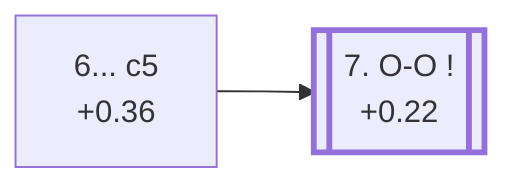

<a name="_TOP_"></a>

# E64 King's Indian Defence: Fianchetto, Yugoslav System <br> 1. d4 Nf6 2. c4 g6 3. Nc3 Bg7 4. Nf3 d6 5. g3 O-O 6. Bg2 c5 #

Continues from [E62's own "5... O-O 6. Bg2" node](https://github.com/onclemarcel/chess_flashcards/blob/main/d4_openings/E62_Kings_Indian_Fianchetto_Variation.md#_OO_), where **6... c5** strikes at White's centre immediately, before completing development — masters' fourth choice at that fork (7.1%), behind Nc6/Nbd7/c6.

### Overview

*Quick map of every move covered on this card — see the [shape key](https://github.com/onclemarcel/chess_flashcards/blob/main/start.md#content-diagram-optional) in start.md.*

<!-- content-diagram:start -->

<!-- content-diagram:end -->

<a name="_initial_move_"></a>

[](https://lichess.org/analysis/standard/rnbq1rk1/pp2ppbp/3p1np1/2p5/2PP4/2N2NP1/PP2PPBP/R1BQK2R_w_KQ_c6_0_7)

*... 6... c5 — King's Indian Defence: Fianchetto, Yugoslav System*

```
rnbq1rk1/pp2ppbp/3p1np1/2p5/2PP4/2N2NP1/PP2PPBP/R1BQK2R w KQ c6 0 7
```

|  | +0.36 |
| --- | --- |

<!-- lichess-stats:start fen="rnbq1rk1/pp2ppbp/3p1np1/2p5/2PP4/2N2NP1/PP2PPBP/R1BQK2R w KQ c6 0 7" db="lichess,masters" speeds="bullet,blitz" ratings="1800,2000,2200,2500" moves="6" -->
| Move | Online | W/D/B | Masters | W/D/B | |
| :--- | ---: | :--- | ---: | :--- | :-- |
| O-O | 195 k (66.0%) | ⬜⬜⬜⬜⬜🟫⬛⬛⬛⬛ 50/6/44 | 806 (61.2%) | ⬜⬜⬜⬜🟫🟫🟫🟫⬛⬛ 37/44/19 |  |
| d5 | 50 k (17.1%) | ⬜⬜⬜⬜⬜⬛⬛⬛⬛⬛ 48/5/47 | 367 (27.8%) | ⬜⬜⬜⬜🟫🟫🟫🟫⬛⬛ 40/41/19 |  |
| dxc5 | 24 k (8.2%) | ⬜⬜⬜⬜⬜🟫⬛⬛⬛⬛ 49/7/44 | 134 (10.2%) | ⬜⬜⬜⬜🟫🟫🟫🟫🟫⬛ 34/51/14 |  |
| e3 | 14 k (4.8%) | ⬜⬜⬜⬜🟫⬛⬛⬛⬛⬛ 44/6/50 | 0 | — | ⚠ |
| e4 | 4.3 k (1.5%) | ⬜⬜⬜⬜🟫⬛⬛⬛⬛⬛ 45/6/49 | 1 (0.1%) | — | ⚠ |
| h3 | 2.3 k (0.8%) | ⬜⬜⬜⬜⬜⬛⬛⬛⬛⬛ 48/6/46 | 9 (0.7%) | — |  |
| b3 | 0 | — | 1 (0.1%) | — |  |

*Online: bullet/blitz, 1800+ — 295 k games. Masters: 1.3 k games. [Open in the explorer](https://lichess.org/analysis/standard/rnbq1rk1/pp2ppbp/3p1np1/2p5/2PP4/2N2NP1/PP2PPBP/R1BQK2R_w_KQ_c6_0_7#explorer) — updated 2026-09-07*
<!-- lichess-stats:end -->

Live-tagged **King's Indian Defense: Fianchetto Variation, Yugoslav Variation, Rare Line** — the "Rare Line" qualifier refers to this specific move order (...c5 played before castling), not to the Yugoslav System itself, which is very much a mainstream try one node later. White's own 7th move here is a genuine, if lopsided, fork: **7. O-O** is masters' clear main try (61.2%), continuing this card's own trunk; **7. d5** (27.8%) is a real, significant secondary closing the centre at once instead, uncoded in this range; **7. dxc5** (10.2%) is a further real minority.

### Candidate moves

* [**7. O-O**](https://github.com/onclemarcel/chess_flashcards/blob/main/d4_openings/E65_Kings_Indian_Fianchetto_Yugoslav_7OO.md) (+0.22, 61.2% masters): masters' clear main try — its own code, [E65](https://github.com/onclemarcel/chess_flashcards/blob/main/d4_openings/E65_Kings_Indian_Fianchetto_Yugoslav_7OO.md).
* **7. d5** (27.8% masters): closing the centre at once — a real, significant secondary with no code of its own in this range.
* **7. dxc5** (10.2% masters): simplifying immediately — a real, minor secondary, likewise uncoded here.

[*Back to E62's own "5... O-O 6. Bg2" node*](https://github.com/onclemarcel/chess_flashcards/blob/main/d4_openings/E62_Kings_Indian_Fianchetto_Variation.md#_OO_)
[*Back to TOP*](#_TOP_)
