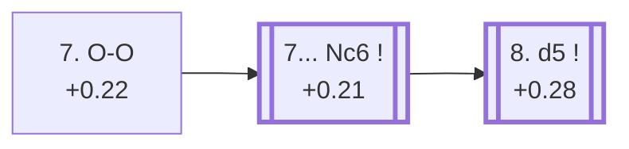

<a name="_TOP_"></a>

# E65 King's Indian Defence: Fianchetto, Yugoslav System, 7.O-O <br> 1. d4 Nf6 2. c4 g6 3. Nc3 Bg7 4. Nf3 d6 5. g3 O-O 6. Bg2 c5 7. O-O #

Continues from [E64's own root](https://github.com/onclemarcel/chess_flashcards/blob/main/d4_openings/E64_Kings_Indian_Fianchetto_Yugoslav_System.md#_initial_move_), where **7. O-O** is masters' clear main try (61.2%).

### Overview

*Quick map of every move covered on this card — see the [shape key](https://github.com/onclemarcel/chess_flashcards/blob/main/start.md#content-diagram-optional) in start.md.*

<!-- content-diagram:start -->

<!-- content-diagram:end -->

<a name="_initial_move_"></a>

[](https://lichess.org/analysis/standard/rnbq1rk1/pp2ppbp/3p1np1/2p5/2PP4/2N2NP1/PP2PPBP/R1BQ1RK1_b_-_-_1_7)

*... 7. O-O — King's Indian Defence: Fianchetto, Yugoslav System, 7.O-O*

```
rnbq1rk1/pp2ppbp/3p1np1/2p5/2PP4/2N2NP1/PP2PPBP/R1BQ1RK1 b - - 1 7
```

|  | +0.22 |
| --- | --- |

<!-- lichess-stats:start fen="rnbq1rk1/pp2ppbp/3p1np1/2p5/2PP4/2N2NP1/PP2PPBP/R1BQ1RK1 b - - 1 7" db="lichess,masters" speeds="bullet,blitz" ratings="1800,2000,2200,2500" moves="6" -->
| Move | Online | W/D/B | Masters | W/D/B | |
| :--- | ---: | :--- | ---: | :--- | :-- |
| cxd4 | 379 k (51.0%) | ⬜⬜⬜⬜⬜🟫⬛⬛⬛⬛ 53/6/41 | 109 (5.8%) | ⬜⬜⬜⬜⬜🟫🟫🟫🟫⬛ 49/40/11 |  |
| Nc6 | 295 k (39.7%) | ⬜⬜⬜⬜⬜🟫⬛⬛⬛⬛ 48/6/45 | 1.7 k (88.6%) | ⬜⬜⬜⬜🟫🟫🟫🟫⬛⬛ 36/42/22 |  |
| Nbd7 | 21 k (2.8%) | ⬜⬜⬜⬜⬜🟫⬛⬛⬛⬛ 52/6/43 | 30 (1.6%) | ⬜⬜⬜⬜⬜🟫🟫🟫⬛⬛ 50/27/23 |  |
| a6 | 14 k (1.9%) | ⬜⬜⬜⬜⬜🟫⬛⬛⬛⬛ 55/6/40 | 11 (0.6%) | — |  |
| Na6 | 12 k (1.6%) | ⬜⬜⬜⬜⬜🟫⬛⬛⬛⬛ 51/5/44 | 53 (2.8%) | ⬜⬜⬜⬜⬜🟫🟫🟫⬛⬛ 51/30/19 |  |
| Bg4 | 8.0 k (1.1%) | ⬜⬜⬜⬜⬜⬜⬛⬛⬛⬛ 57/6/38 | 0 | — | ⚠ |
| Nfd7 | 0 | — | 5 (0.3%) | — |  |

*Online: bullet/blitz, 1800+ — 743 k games. Masters: 1.9 k games. [Open in the explorer](https://lichess.org/analysis/standard/rnbq1rk1/pp2ppbp/3p1np1/2p5/2PP4/2N2NP1/PP2PPBP/R1BQ1RK1_b_-_-_1_7#explorer) — updated 2026-09-09*
<!-- lichess-stats:end -->

Live-tagged **King's Indian Defense: Fianchetto Variation, Yugoslav Variation** (the "Rare Line" qualifier from the prior node has dropped, since the move order no longer matters once White has castled). Black's own 7th move here shows a striking, genuine online/masters inversion: masters overwhelmingly prefer **7... Nc6** (88.6%), while online play is instead close to split, actually favouring the simplifying **7... cxd4** (51.0% online vs only 5.8% masters) — one of the largest online/masters divergences found in this whole batch.

<a name="_Nc6_"></a>

**7... Nc6** reaches this card's own further fork.

[](https://lichess.org/analysis/standard/r1bq1rk1/pp2ppbp/2np1np1/2p5/2PP4/2N2NP1/PP2PPBP/R1BQ1RK1_w_-_-_2_8)

*... 7... Nc6*

```
r1bq1rk1/pp2ppbp/2np1np1/2p5/2PP4/2N2NP1/PP2PPBP/R1BQ1RK1 w - - 2 8
```

|  | +0.21 |
| --- | --- |

<!-- lichess-stats:start fen="r1bq1rk1/pp2ppbp/2np1np1/2p5/2PP4/2N2NP1/PP2PPBP/R1BQ1RK1 w - - 2 8" db="lichess,masters" speeds="bullet,blitz" ratings="1800,2000,2200,2500" moves="6" -->
| Move | Online | W/D/B | Masters | W/D/B | |
| :--- | ---: | :--- | ---: | :--- | :-- |
| d5 | 190 k (47.5%) | ⬜⬜⬜⬜⬜⬛⬛⬛⬛⬛ 48/5/47 | 1.1 k (48.1%) | ⬜⬜⬜⬜🟫🟫🟫🟫⬛⬛ 38/38/23 |  |
| dxc5 | 106 k (26.5%) | ⬜⬜⬜⬜⬜🟫⬛⬛⬛⬛ 52/8/40 | 972 (43.6%) | ⬜⬜⬜🟫🟫🟫🟫🟫⬛⬛ 33/50/17 |  |
| b3 | 35 k (8.7%) | ⬜⬜⬜⬜⬜🟫⬛⬛⬛⬛ 53/8/39 | 28 (1.3%) | ⬜⬜⬜⬜🟫🟫🟫🟫🟫⬛ 36/50/14 |  |
| e3 | 19 k (4.7%) | ⬜⬜⬜⬜⬜🟫⬛⬛⬛⬛ 48/6/46 | 57 (2.6%) | ⬜⬜⬜⬜🟫🟫🟫🟫🟫⬛ 37/49/14 |  |
| h3 | 18 k (4.5%) | ⬜⬜⬜⬜⬜🟫⬛⬛⬛⬛ 48/7/45 | 91 (4.1%) | ⬜⬜🟫🟫🟫🟫⬛⬛⬛⬛ 21/36/43 |  |
| e4 | 13 k (3.3%) | ⬜⬜⬜⬜🟫⬛⬛⬛⬛⬛ 43/6/50 | 2 (0.1%) | — | ⚠ |

*Online: bullet/blitz, 1800+ — 399 k games. Masters: 2.2 k games. [Open in the explorer](https://lichess.org/analysis/standard/r1bq1rk1/pp2ppbp/2np1np1/2p5/2PP4/2N2NP1/PP2PPBP/R1BQ1RK1_w_-_-_2_8#explorer) — updated 2026-09-09*
<!-- lichess-stats:end -->

White's own 8th move is a genuine near coin-flip: **8. d5** (48.1% masters) closes the centre and reaches the Yugoslav Panno tabiya, [E66](https://github.com/onclemarcel/chess_flashcards/blob/main/d4_openings/E66_Kings_Indian_Fianchetto_Yugoslav_Panno.md); **8. dxc5** (43.6%) simplifies instead, and carries no code of its own in this range.

* [**8. d5**](https://github.com/onclemarcel/chess_flashcards/blob/main/d4_openings/E66_Kings_Indian_Fianchetto_Yugoslav_Panno.md) (+0.28, 48.1% masters): the Yugoslav Panno — its own card, E66.
* **8. dxc5** (43.6% masters): a real, nearly-as-popular secondary with no code of its own in this range.

[*Back to E64's own root*](https://github.com/onclemarcel/chess_flashcards/blob/main/d4_openings/E64_Kings_Indian_Fianchetto_Yugoslav_System.md#_initial_move_)
[*Back to TOP*](#_TOP_)
