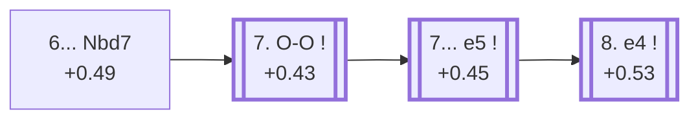

<a name="_TOP_"></a>

# E67 King's Indian Defence: Fianchetto With ...Nd7 <br> 1. d4 Nf6 2. c4 g6 3. Nc3 Bg7 4. Nf3 d6 5. g3 O-O 6. Bg2 Nbd7 #

Continues from [E62's own "5... O-O 6. Bg2" node](https://github.com/onclemarcel/chess_flashcards/blob/main/d4_openings/E62_Kings_Indian_Fianchetto_Variation.md#_OO_), where **6... Nbd7** is masters' close second choice (33.6%, just behind 6...Nc6) — preparing ... e5 without blocking the c-pawn, a flexible alternative to committing the queen's knight to c6.

### Overview

*Quick map of every move covered on this card — see the [shape key](https://github.com/onclemarcel/chess_flashcards/blob/main/start.md#content-diagram-optional) in start.md.*

<!-- content-diagram:start -->

<!-- content-diagram:end -->

<a name="_initial_move_"></a>

[](https://lichess.org/analysis/standard/r1bq1rk1/pppnppbp/3p1np1/8/2PP4/2N2NP1/PP2PPBP/R1BQK2R_w_KQ_-_3_7)

*... 6... Nbd7 — King's Indian Defence: Fianchetto With ...Nd7*

```
r1bq1rk1/pppnppbp/3p1np1/8/2PP4/2N2NP1/PP2PPBP/R1BQK2R w KQ - 3 7
```

|  | +0.49 |
| --- | --- |

<!-- lichess-stats:start fen="r1bq1rk1/pppnppbp/3p1np1/8/2PP4/2N2NP1/PP2PPBP/R1BQK2R w KQ - 3 7" db="lichess,masters" speeds="bullet,blitz" ratings="1800,2000,2200,2500" moves="4" -->
| Move | Online | W/D/B | Masters | W/D/B | |
| :--- | ---: | :--- | ---: | :--- | :-- |
| O-O | 575 k (88.3%) | ⬜⬜⬜⬜⬜🟫⬛⬛⬛⬛ 50/6/45 | 5.3 k (97.9%) | ⬜⬜⬜⬜🟫🟫🟫🟫⬛⬛ 41/37/23 |  |
| e4 | 35 k (5.4%) | ⬜⬜⬜⬜⬜⬛⬛⬛⬛⬛ 46/5/50 | 37 (0.7%) | ⬜⬜⬜🟫🟫🟫🟫⬛⬛⬛ 30/41/30 |  |
| Bg5 | 8.1 k (1.2%) | ⬜⬜⬜⬜🟫⬛⬛⬛⬛⬛ 45/5/50 | 0 | — | ⚠ |
| h3 | 6.4 k (1.0%) | ⬜⬜⬜⬜⬜🟫⬛⬛⬛⬛ 52/5/43 | 20 (0.4%) | ⬜⬜⬜⬜⬜🟫🟫🟫🟫⬛ 45/45/10 |  |
| d5 | 0 | — | 36 (0.7%) | ⬜⬜⬜⬜⬜⬜🟫🟫⬛⬛ 61/22/17 |  |

*Online: bullet/blitz, 1800+ — 651 k games. Masters: 5.4 k games. [Open in the explorer](https://lichess.org/analysis/standard/r1bq1rk1/pppnppbp/3p1np1/8/2PP4/2N2NP1/PP2PPBP/R1BQK2R_w_KQ_-_3_7#explorer) — updated 2026-09-15*
<!-- lichess-stats:end -->

Live-tagged **King's Indian Defense: Fianchetto Variation, Debrecen Defense** — a specific name `eco.md`'s own bare "With ...Nd7" doesn't carry.

<a name="_OO_"></a>

**7. O-O** is close to automatic (97.9% masters).

[](https://lichess.org/analysis/standard/r1bq1rk1/pppnppbp/3p1np1/8/2PP4/2N2NP1/PP2PPBP/R1BQ1RK1_b_-_-_4_7)

*... 7. O-O*

```
r1bq1rk1/pppnppbp/3p1np1/8/2PP4/2N2NP1/PP2PPBP/R1BQ1RK1 b - - 4 7
```

|  | +0.43 |
| --- | --- |

<!-- lichess-stats:start fen="r1bq1rk1/pppnppbp/3p1np1/8/2PP4/2N2NP1/PP2PPBP/R1BQ1RK1 b - - 4 7" db="lichess,masters" speeds="bullet,blitz" ratings="1800,2000,2200,2500" moves="6" -->
| Move | Online | W/D/B | Masters | W/D/B | |
| :--- | ---: | :--- | ---: | :--- | :-- |
| e5 | 890 k (50.6%) | ⬜⬜⬜⬜⬜🟫⬛⬛⬛⬛ 48/6/46 | 10 k (94.0%) | ⬜⬜⬜⬜🟫🟫🟫🟫⬛⬛ 39/37/24 |  |
| c5 | 262 k (14.9%) | ⬜⬜⬜⬜⬜🟫⬛⬛⬛⬛ 51/5/44 | 62 (0.6%) | ⬜⬜⬜⬜🟫🟫🟫⬛⬛⬛ 42/34/24 |  |
| c6 | 233 k (13.3%) | ⬜⬜⬜⬜⬜🟫⬛⬛⬛⬛ 51/5/44 | 415 (3.8%) | ⬜⬜⬜⬜⬜🟫🟫🟫⬛⬛ 49/31/20 |  |
| Re8 | 226 k (12.8%) | ⬜⬜⬜⬜⬜🟫⬛⬛⬛⬛ 52/5/43 | 26 (0.2%) | ⬜⬜⬜⬜⬜⬜🟫⬛⬛⬛ 58/15/27 |  |
| Rb8 | 45 k (2.6%) | ⬜⬜⬜⬜⬜🟫⬛⬛⬛⬛ 52/5/43 | 0 | — | ⚠ |
| a6 | 33 k (1.9%) | ⬜⬜⬜⬜⬜🟫⬛⬛⬛⬛ 51/5/44 | 131 (1.2%) | ⬜⬜⬜⬜⬜🟫🟫🟫⬛⬛ 50/33/18 |  |
| a5 | 0 | — | 3 (0.0%) | — |  |

*Online: bullet/blitz, 1800+ — 1.8 M games. Masters: 11 k games. [Open in the explorer](https://lichess.org/analysis/standard/r1bq1rk1/pppnppbp/3p1np1/8/2PP4/2N2NP1/PP2PPBP/R1BQ1RK1_b_-_-_4_7#explorer) — updated 2026-09-15*
<!-- lichess-stats:end -->

Black's own 7th move is close to automatic too: **7... e5** (94.0% masters) — the defining central break, reaching this card's own second `eco.md` entry.

<a name="_e5_"></a>

**7... e5** — Classical Variation.

[](https://lichess.org/analysis/standard/r1bq1rk1/pppn1pbp/3p1np1/4p3/2PP4/2N2NP1/PP2PPBP/R1BQ1RK1_w_-_e6_0_8)

*... 7... e5 — King's Indian Defence: Fianchetto, Classical Variation*

```
r1bq1rk1/pppn1pbp/3p1np1/4p3/2PP4/2N2NP1/PP2PPBP/R1BQ1RK1 w - e6 0 8
```

|  | +0.45 |
| --- | --- |

<!-- lichess-stats:start fen="r1bq1rk1/pppn1pbp/3p1np1/4p3/2PP4/2N2NP1/PP2PPBP/R1BQ1RK1 w - e6 0 8" db="lichess,masters" speeds="bullet,blitz" ratings="1800,2000,2200,2500" moves="6" -->
| Move | Online | W/D/B | Masters | W/D/B | |
| :--- | ---: | :--- | ---: | :--- | :-- |
| e4 | 358 k (37.4%) | ⬜⬜⬜⬜⬜🟫⬛⬛⬛⬛ 49/6/45 | 7.5 k (65.8%) | ⬜⬜⬜⬜🟫🟫🟫🟫⬛⬛ 40/37/23 |  |
| dxe5 | 231 k (24.1%) | ⬜⬜⬜⬜🟫⬛⬛⬛⬛⬛ 46/7/46 | 332 (2.9%) | ⬜⬜🟫🟫🟫🟫⬛⬛⬛⬛ 20/43/37 |  |
| d5 | 86 k (9.0%) | ⬜⬜⬜⬜🟫⬛⬛⬛⬛⬛ 44/5/51 | 0 | — | ⚠ |
| h3 | 63 k (6.5%) | ⬜⬜⬜⬜⬜🟫⬛⬛⬛⬛ 52/6/42 | 1.9 k (17.0%) | ⬜⬜⬜⬜🟫🟫🟫🟫⬛⬛ 39/38/23 |  |
| e3 | 54 k (5.7%) | ⬜⬜⬜⬜⬜⬛⬛⬛⬛⬛ 49/6/46 | 356 (3.1%) | ⬜⬜⬜🟫🟫🟫🟫⬛⬛⬛ 31/35/34 |  |
| b3 | 49 k (5.1%) | ⬜⬜⬜⬜⬜🟫⬛⬛⬛⬛ 51/6/43 | 480 (4.2%) | ⬜⬜⬜⬜🟫🟫🟫⬛⬛⬛ 37/32/31 |  |
| Qc2 | 0 | — | 638 (5.6%) | ⬜⬜⬜⬜🟫🟫🟫🟫⬛⬛ 40/36/24 |  |

*Online: bullet/blitz, 1800+ — 959 k games. Masters: 11 k games. [Open in the explorer](https://lichess.org/analysis/standard/r1bq1rk1/pppn1pbp/3p1np1/4p3/2PP4/2N2NP1/PP2PPBP/R1BQ1RK1_w_-_e6_0_8#explorer) — updated 2026-09-15*
<!-- lichess-stats:end -->

Live-tagged **King's Indian Defense: Fianchetto Variation, Classical Fianchetto** — the "Fianchetto" qualifier is a real, deliberate distinguisher from the *other* King's Indian "Classical Variation," the e4-based main line covered on [E70](https://github.com/onclemarcel/chess_flashcards/blob/main/d4_openings/E70_Kings_Indian.md) — the same "Classical" name genuinely reused twice within the whole King's Indian complex, at two structurally different trees. White's own 8th move here is masters' clear main try, **8. e4** (65.8%), reaching this card's own further code, [E68](https://github.com/onclemarcel/chess_flashcards/blob/main/d4_openings/E68_Kings_Indian_Fianchetto_Classical_8e4.md).

### Candidate moves

* [**8. e4**](https://github.com/onclemarcel/chess_flashcards/blob/main/d4_openings/E68_Kings_Indian_Fianchetto_Classical_8e4.md) (+0.53, 65.8% masters): masters' clear main try — its own code, [E68](https://github.com/onclemarcel/chess_flashcards/blob/main/d4_openings/E68_Kings_Indian_Fianchetto_Classical_8e4.md).
* **8. h3** (17.0% masters): a real, significant secondary with no code of its own in this range.
* **8. dxe5** (2.9% masters): simplifying at once — a real, minor secondary, likewise uncoded here.

[*Back to E62's own "5... O-O 6. Bg2" node*](https://github.com/onclemarcel/chess_flashcards/blob/main/d4_openings/E62_Kings_Indian_Fianchetto_Variation.md#_OO_)
[*Back to TOP*](#_TOP_)
