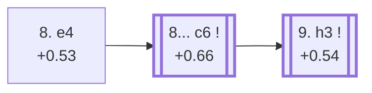

<a name="_TOP_"></a>

# E68 King's Indian Defence: Fianchetto, Classical Variation, 8.e4 <br> 1. d4 Nf6 2. c4 g6 3. Nc3 Bg7 4. Nf3 d6 5. g3 O-O 6. Bg2 Nbd7 7. O-O e5 8. e4 #

Continues from [E67's own "7... e5" node](https://github.com/onclemarcel/chess_flashcards/blob/main/d4_openings/E67_Kings_Indian_Fianchetto_Nd7.md#_e5_), where **8. e4** is masters' clear main try (65.8%), grabbing the full centre now that both sides are developed.

### Overview

*Quick map of every move covered on this card — see the [shape key](https://github.com/onclemarcel/chess_flashcards/blob/main/start.md#content-diagram-optional) in start.md.*

<!-- content-diagram:start -->

<!-- content-diagram:end -->

<a name="_initial_move_"></a>

[](https://lichess.org/analysis/standard/r1bq1rk1/pppn1pbp/3p1np1/4p3/2PPP3/2N2NP1/PP3PBP/R1BQ1RK1_b_-_e3_0_8)

*... 8. e4 — King's Indian Defence: Fianchetto, Classical Variation, 8.e4*

```
r1bq1rk1/pppn1pbp/3p1np1/4p3/2PPP3/2N2NP1/PP3PBP/R1BQ1RK1 b - e3 0 8
```

|  | +0.53 |
| --- | --- |

<!-- lichess-stats:start fen="r1bq1rk1/pppn1pbp/3p1np1/4p3/2PPP3/2N2NP1/PP3PBP/R1BQ1RK1 b - e3 0 8" db="lichess,masters" speeds="bullet,blitz" ratings="1800,2000,2200,2500" moves="6" -->
| Move | Online | W/D/B | Masters | W/D/B | |
| :--- | ---: | :--- | ---: | :--- | :-- |
| exd4 | 165 k (42.8%) | ⬜⬜⬜⬜⬜🟫⬛⬛⬛⬛ 48/6/46 | 2.7 k (35.1%) | ⬜⬜⬜⬜🟫🟫🟫🟫⬛⬛ 39/36/24 |  |
| c6 | 100 k (26.0%) | ⬜⬜⬜⬜⬜🟫⬛⬛⬛⬛ 49/6/45 | 3.3 k (42.6%) | ⬜⬜⬜⬜🟫🟫🟫🟫⬛⬛ 42/38/20 |  |
| Re8 | 56 k (14.5%) | ⬜⬜⬜⬜⬜🟫⬛⬛⬛⬛ 50/6/44 | 539 (7.0%) | ⬜⬜⬜⬜🟫🟫🟫⬛⬛⬛ 39/34/27 |  |
| a5 | 16 k (4.2%) | ⬜⬜⬜⬜⬜🟫⬛⬛⬛⬛ 51/6/43 | 65 (0.8%) | ⬜⬜⬜⬜⬜🟫🟫🟫🟫⬛ 49/35/15 |  |
| a6 | 13 k (3.4%) | ⬜⬜⬜⬜🟫⬛⬛⬛⬛⬛ 46/6/48 | 960 (12.5%) | ⬜⬜⬜⬜🟫🟫🟫🟫⬛⬛ 36/40/25 |  |
| Qe7 | 8.7 k (2.3%) | ⬜⬜⬜⬜⬜🟫⬛⬛⬛⬛ 52/5/43 | 0 | — | ⚠ |
| h6 | 0 | — | 111 (1.4%) | ⬜⬜⬜⬜🟫🟫🟫🟫⬛⬛ 41/36/23 |  |

*Online: bullet/blitz, 1800+ — 386 k games. Masters: 7.7 k games. [Open in the explorer](https://lichess.org/analysis/standard/r1bq1rk1/pppn1pbp/3p1np1/4p3/2PPP3/2N2NP1/PP3PBP/R1BQ1RK1_b_-_e3_0_8#explorer) — updated 2026-09-14*
<!-- lichess-stats:end -->

Live-tagged **King's Indian Defense: Fianchetto Variation, Classical Variation**, matching `eco.md`'s own base name (the "8.e4" qualifier itself isn't reflected live, as expected for a move-number suffix). Black's own 8th move here is one of the few forks in this whole batch where the `eco.md`-coded reply genuinely **is** masters' actual plurality rather than trailing an uncoded rival: **8... c6** (42.6%) narrowly leads **8... exd4** (35.1%, uncoded), with **8... a6** (12.5%) and **8... Re8** (7.0%) both real but clearly smaller.

<a name="_c6_"></a>

**8... c6** reaches this card's own further node.

[](https://lichess.org/analysis/standard/r1bq1rk1/pp1n1pbp/2pp1np1/4p3/2PPP3/2N2NP1/PP3PBP/R1BQ1RK1_w_-_-_0_9)

*... 8... c6*

```
r1bq1rk1/pp1n1pbp/2pp1np1/4p3/2PPP3/2N2NP1/PP3PBP/R1BQ1RK1 w - - 0 9
```

|  | +0.66 |
| --- | --- |

<!-- lichess-stats:start fen="r1bq1rk1/pp1n1pbp/2pp1np1/4p3/2PPP3/2N2NP1/PP3PBP/R1BQ1RK1 w - - 0 9" db="lichess,masters" speeds="bullet,blitz" ratings="1800,2000,2200,2500" moves="6" -->
| Move | Online | W/D/B | Masters | W/D/B | |
| :--- | ---: | :--- | ---: | :--- | :-- |
| h3 | 134 k (36.1%) | ⬜⬜⬜⬜⬜🟫⬛⬛⬛⬛ 53/6/41 | 2.7 k (65.7%) | ⬜⬜⬜⬜🟫🟫🟫🟫⬛⬛ 43/37/21 |  |
| d5 | 81 k (21.7%) | ⬜⬜⬜⬜⬜⬛⬛⬛⬛⬛ 47/5/48 | 0 | — | ⚠ |
| Re1 | 54 k (14.6%) | ⬜⬜⬜⬜⬜🟫⬛⬛⬛⬛ 51/5/44 | 181 (4.4%) | ⬜⬜⬜🟫🟫🟫🟫⬛⬛⬛ 33/34/33 |  |
| dxe5 | 45 k (12.2%) | ⬜⬜⬜⬜🟫⬛⬛⬛⬛⬛ 44/7/49 | 0 | — | ⚠ |
| Be3 | 24 k (6.4%) | ⬜⬜⬜⬜⬜⬛⬛⬛⬛⬛ 50/5/45 | 141 (3.4%) | ⬜⬜⬜⬜⬜🟫🟫🟫🟫⬛ 52/35/13 |  |
| Bg5 | 14 k (3.8%) | ⬜⬜⬜⬜⬜⬛⬛⬛⬛⬛ 45/5/49 | 0 | — | ⚠ |
| b3 | 0 | — | 717 (17.5%) | ⬜⬜⬜⬜⬜🟫🟫🟫⬛⬛ 50/34/16 |  |
| Rb1 | 0 | — | 207 (5.1%) | ⬜⬜⬜⬜🟫🟫🟫🟫⬛⬛ 43/35/21 |  |
| Qc2 | 0 | — | 83 (2.0%) | ⬜⬜⬜⬜🟫🟫🟫🟫🟫⬛ 45/48/7 |  |

*Online: bullet/blitz, 1800+ — 372 k games. Masters: 4.1 k games. [Open in the explorer](https://lichess.org/analysis/standard/r1bq1rk1/pp1n1pbp/2pp1np1/4p3/2PPP3/2N2NP1/PP3PBP/R1BQ1RK1_w_-_-_0_9#explorer) — updated 2026-09-14*
<!-- lichess-stats:end -->

White's own 9th move is masters' clear main try, **9. h3** (65.7%), preventing ...Ng4/...Bg4 before continuing — reaching this batch's deepest node, [E69](https://github.com/onclemarcel/chess_flashcards/blob/main/d4_openings/E69_Kings_Indian_Fianchetto_Classical_Main_Line.md).

### Candidate moves

* [**9. h3**](https://github.com/onclemarcel/chess_flashcards/blob/main/d4_openings/E69_Kings_Indian_Fianchetto_Classical_Main_Line.md) (+0.54, 65.7% masters): masters' clear main try — its own code, [E69](https://github.com/onclemarcel/chess_flashcards/blob/main/d4_openings/E69_Kings_Indian_Fianchetto_Classical_Main_Line.md).
* **9. b3** (17.5% masters): a real, significant secondary with no code of its own in this range.
* **9. Rb1** (5.1%) / **9. Re1** (4.4%) / **9. Be3** (3.4%): further real, minor secondaries, likewise uncoded here.

[*Back to E67's own "7... e5" node*](https://github.com/onclemarcel/chess_flashcards/blob/main/d4_openings/E67_Kings_Indian_Fianchetto_Nd7.md#_e5_)
[*Back to TOP*](#_TOP_)
