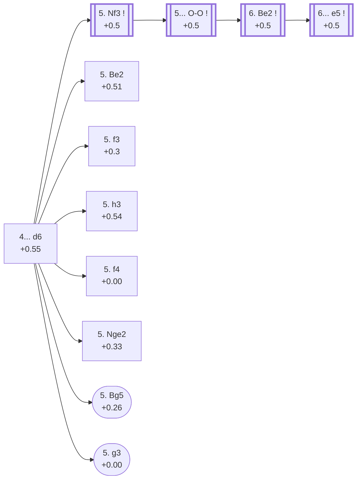

<a name="_TOP_"></a>

# E70 King's Indian Defense: Normal Variation <br> 1. d4 Nf6 2. c4 g6 3. Nc3 Bg7 4. e4 d6 #

The classical King's Indian tabiya: White builds a broad pawn centre with d4/c4/e4 while Black fianchettoes and waits to strike back with ... e5 or ... c5 once fully developed — a hypermodern strategy in the purest sense, letting White overextend before counter-attacking it.

### Overview

*Quick map of every move covered on this card — see the [shape key](https://github.com/onclemarcel/chess_flashcards/blob/main/start.md#content-diagram-optional) in start.md.*

<!-- content-diagram:start -->

<!-- content-diagram:end -->

<a name="_Bg7_"></a>

[](https://lichess.org/analysis/standard/rnbqk2r/ppppppbp/5np1/8/2PP4/2N5/PP2PPPP/R1BQKBNR_w_KQkq_-_2_4)

*... 1. d4 Nf6 2. c4 g6 3. Nc3 Bg7*

```
rnbqk2r/ppppppbp/5np1/8/2PP4/2N5/PP2PPPP/R1BQKBNR w KQkq - 2 4
```

<!-- lichess-stats:start fen="rnbqk2r/ppppppbp/5np1/8/2PP4/2N5/PP2PPPP/R1BQKBNR w KQkq - 2 4" db="lichess,masters" speeds="bullet,blitz" ratings="1800,2000,2200,2500" moves="6" -->
| Move | Online | W/D/B | Masters | W/D/B | |
| :--- | ---: | :--- | ---: | :--- | :-- |
| e4 | 11.1 M (66.3%) | ⬜⬜⬜⬜⬜⬛⬛⬛⬛⬛ 50/5/45 | 74 k (91.7%) | ⬜⬜⬜⬜🟫🟫🟫🟫⬛⬛ 38/38/24 |  |
| Nf3 | 2.9 M (17.4%) | ⬜⬜⬜⬜⬜⬛⬛⬛⬛⬛ 48/5/47 | 4.3 k (5.3%) | ⬜⬜⬜⬜🟫🟫🟫🟫⬛⬛ 38/37/26 |  |
| Bg5 | 779 k (4.7%) | ⬜⬜⬜⬜⬜⬛⬛⬛⬛⬛ 46/5/49 | 691 (0.9%) | ⬜⬜⬜⬜🟫🟫🟫⬛⬛⬛ 38/36/26 |  |
| e3 | 640 k (3.8%) | ⬜⬜⬜⬜🟫⬛⬛⬛⬛⬛ 45/5/51 | 22 (0.0%) | ⬜⬜⬜🟫🟫🟫⬛⬛⬛⬛ 32/32/36 |  |
| Bf4 | 520 k (3.1%) | ⬜⬜⬜⬜⬜⬛⬛⬛⬛⬛ 47/5/48 | 63 (0.1%) | ⬜⬜⬜⬜🟫🟫🟫⬛⬛⬛ 35/35/30 |  |
| g3 | 352 k (2.1%) | ⬜⬜⬜⬜⬜⬛⬛⬛⬛⬛ 48/5/46 | 1.6 k (2.0%) | ⬜⬜⬜🟫🟫🟫🟫⬛⬛⬛ 35/40/25 |  |

*Online: bullet/blitz, 1800+ — 16.7 M games. Masters: 80 k games. [Open in the explorer](https://lichess.org/analysis/standard/rnbqk2r/ppppppbp/5np1/8/2PP4/2N5/PP2PPPP/R1BQKBNR_w_KQkq_-_2_4#explorer) — updated 2026-09-07*
<!-- lichess-stats:end -->

### Candidate moves

*A genuine omission until this note was added: this exact tabiya is shared with [E61's own "3... Bg7" node](https://github.com/onclemarcel/chess_flashcards/blob/main/d4_openings/E61_KID_Grunfeld_Fork.md#_Bg7_), and 4. Nf3 already sat in the stats table above at 5.3% masters without ever being surfaced as a candidate or a link.*

* [**4. e4**](#_e4_) (+0.4, 91.7% masters): by far White's most tested try — this card's own main line, see below.
* [**4. Nf3**](https://github.com/onclemarcel/chess_flashcards/blob/main/d4_openings/E61_KID_Grunfeld_Fork.md#_Nf3_) (5.3% masters): a real, significant secondary — its own trunk, the whole E60-E69 Fianchetto complex, covered from [E61 onward](https://github.com/onclemarcel/chess_flashcards/blob/main/d4_openings/E61_KID_Grunfeld_Fork.md#_Nf3_).
* **4. Bg5** (0.9% masters): a real, minor secondary — not covered further here.

[*Back to TOP*](#_TOP_)

---

<a name="_e4_"></a>

**4. e4** is by far White's most tested try (91.7% of masters games), grabbing the maximum share of the centre before Black can contest it.

[](https://lichess.org/analysis/standard/rnbqk2r/ppppppbp/5np1/8/2PPP3/2N5/PP3PPP/R1BQKBNR_b_KQkq_e3_0_4)

*... 4. e4*

```
rnbqk2r/ppppppbp/5np1/8/2PPP3/2N5/PP3PPP/R1BQKBNR b KQkq e3 0 4
```

|  | +0.4 |
| --- | --- |

Black replies **4... d6** (+0.55) almost automatically (91.4% of masters games), preparing ... e5 while keeping the option of ... Nbd7 or ... c5 next.

<a name="_d6_"></a>

[](https://lichess.org/analysis/standard/rnbqk2r/ppp1ppbp/3p1np1/8/2PPP3/2N5/PP3PPP/R1BQKBNR_w_KQkq_-_0_5)

*... 1. d4 Nf6 2. c4 g6 3. Nc3 Bg7 4. e4 d6 — King's Indian Defense: Normal Variation*

```
rnbqk2r/ppp1ppbp/3p1np1/8/2PPP3/2N5/PP3PPP/R1BQKBNR w KQkq - 0 5
```

|  | +0.55 |
| --- | --- |

<!-- lichess-stats:start fen="rnbqk2r/ppp1ppbp/3p1np1/8/2PPP3/2N5/PP3PPP/R1BQKBNR w KQkq - 0 5" db="lichess,masters" speeds="bullet,blitz" ratings="1800,2000,2200,2500" moves="10" -->
| Move | Online | W/D/B | Masters | W/D/B | |
| :--- | ---: | :--- | ---: | :--- | :-- |
| Nf3 | 3.3 M (24.9%) | ⬜⬜⬜⬜⬜⬛⬛⬛⬛⬛ 49/5/46 | 29 k (38.1%) | ⬜⬜⬜⬜🟫🟫🟫🟫⬛⬛ 36/42/21 |  |
| f3 | 2.6 M (19.7%) | ⬜⬜⬜⬜⬜🟫⬛⬛⬛⬛ 51/5/44 | 14 k (18.9%) | ⬜⬜⬜⬜🟫🟫🟫🟫⬛⬛ 38/37/25 |  |
| f4 | 2.4 M (18.0%) | ⬜⬜⬜⬜⬜⬛⬛⬛⬛⬛ 50/4/46 | 3.9 k (5.2%) | ⬜⬜⬜⬜🟫🟫🟫⬛⬛⬛ 39/34/27 |  |
| Be2 | 1.7 M (12.7%) | ⬜⬜⬜⬜⬜🟫⬛⬛⬛⬛ 52/5/43 | 17 k (22.6%) | ⬜⬜⬜⬜🟫🟫🟫🟫⬛⬛ 38/37/24 |  |
| Bd3 | 1.0 M (7.6%) | ⬜⬜⬜⬜⬜⬛⬛⬛⬛⬛ 48/4/48 | 2.6 k (3.4%) | ⬜⬜⬜⬜🟫🟫🟫⬛⬛⬛ 41/34/25 |  |
| h3 | 830 k (6.2%) | ⬜⬜⬜⬜⬜🟫⬛⬛⬛⬛ 50/5/45 | 6.3 k (8.3%) | ⬜⬜⬜⬜🟫🟫🟫🟫⬛⬛ 42/35/22 |  |
| Be3 | 481 k (3.6%) | ⬜⬜⬜⬜⬜⬛⬛⬛⬛⬛ 47/4/49 | 43 (0.1%) | ⬜⬜🟫🟫🟫🟫🟫🟫⬛⬛ 19/56/26 |  |
| Bg5 | 337 k (2.5%) | ⬜⬜⬜⬜⬜⬛⬛⬛⬛⬛ 50/4/46 | 658 (0.9%) | ⬜⬜⬜⬜🟫🟫🟫⬛⬛⬛ 42/32/26 |  |
| Nge2 | 264 k (2.0%) | ⬜⬜⬜⬜⬜🟫⬛⬛⬛⬛ 53/5/43 | 1.8 k (2.3%) | ⬜⬜⬜⬜🟫🟫🟫⬛⬛⬛ 40/32/28 |  |
| e5 | 172 k (1.3%) | ⬜⬜⬜⬜🟫⬛⬛⬛⬛⬛ 45/6/49 | 0 | — | ⚠ |
| g3 | 0 | — | 125 (0.2%) | ⬜⬜⬜🟫🟫🟫🟫⬛⬛⬛ 27/38/34 |  |

*Online: bullet/blitz, 1800+ — 13.4 M games. Masters: 76 k games. [Open in the explorer](https://lichess.org/analysis/standard/rnbqk2r/ppp1ppbp/3p1np1/8/2PPP3/2N5/PP3PPP/R1BQKBNR_w_KQkq_-_0_5#explorer) — updated 2026-09-07*
<!-- lichess-stats:end -->

### Candidate moves

White's 5th move is a genuine multi-way split — no single try dominates the way 4. e4 did. Three genuine, previously-unrecognized gaps are fixed here: **5. Be2**, **5. h3**, and **5. f4** each carry their own `eco.md` code (E73, E71, and E76 respectively) and are linked out properly below, rather than left as bare percentages or an uncoded aside. Two further real, near-zero-frequency tries — **5. Nge2** and **5. Bg5** — also carry their own E70 sub-entries (the Kramer System and the Accelerated Averbakh System) and are built out on this same page below the main line.

* [**5. Nf3**](#_Nf3_) (38.1% masters): the most flexible developing move, keeping castling options open — leads toward the Classical/Mar del Plata systems after Black's later ... e5, see below
* [**5. Be2**](https://github.com/onclemarcel/chess_flashcards/blob/main/d4_openings/E73_Kings_Indian_Averbakh_System.md) (+0.51, 22.6% masters): a quieter developing setup — its own code, [E73](https://github.com/onclemarcel/chess_flashcards/blob/main/d4_openings/E73_Kings_Indian_Averbakh_System.md), covering the Averbakh complex onward
* [**5. f3**](#_f3_) (18.9% masters): the Sämisch Variation — a slower but very solid setup, preparing Be3/Qd2 and a big kingside pawn storm, see below
* [**5. h3**](https://github.com/onclemarcel/chess_flashcards/blob/main/d4_openings/E71_Kings_Indian_Makagonov_System.md) (+0.54, 8.3% masters): the Makagonov System — restrains ... Ng4/... Bg4 tricks before committing the kingside knight — its own code, [E71](https://github.com/onclemarcel/chess_flashcards/blob/main/d4_openings/E71_Kings_Indian_Makagonov_System.md)
* [**5. f4**](https://github.com/onclemarcel/chess_flashcards/blob/main/d4_openings/E76_Kings_Indian_Four_Pawns_Attack.md) (+0.00, 5.2% masters): the Four Pawns Attack — its own code, [E76](https://github.com/onclemarcel/chess_flashcards/blob/main/d4_openings/E76_Kings_Indian_Four_Pawns_Attack.md), onward
* **5. Bd3** (3.4% masters): a real secondary with no code of its own in this range
* [**5. Nge2**](#_Nge2_) (2.3% masters): the Kramer System — a real, rare try with its own E70 code, see below
* [**5. Bg5**](#_Bg5_) (0.9% masters): the Accelerated Averbakh System — a real, rare try with its own E70 code, see below
* [**5. g3**](https://github.com/onclemarcel/chess_flashcards/blob/main/d4_openings/E72_Kings_Indian_e4_g3_Variation.md) (+0.00, 0.2% masters): the e4 & g3 Variation — its own code, [E72](https://github.com/onclemarcel/chess_flashcards/blob/main/d4_openings/E72_Kings_Indian_e4_g3_Variation.md), despite the tiny sample

[*Back to TOP*](#_TOP_)

---

<a name="_Nf3_"></a>

## 5. Nf3

[](https://lichess.org/analysis/standard/rnbqk2r/ppp1ppbp/3p1np1/8/2PPP3/2N2N2/PP3PPP/R1BQKB1R_b_KQkq_-_1_5)

*... 5. Nf3*

```
rnbqk2r/ppp1ppbp/3p1np1/8/2PPP3/2N2N2/PP3PPP/R1BQKB1R b KQkq - 1 5
```

|  | +0.5 |
| --- | --- |

<a name="_Nf3_OO_"></a>

**5... O-O** is close to automatic (98.7% of masters games) — castling into safety before deciding on a central break.

[](https://lichess.org/analysis/standard/rnbq1rk1/ppp1ppbp/3p1np1/8/2PPP3/2N2N2/PP3PPP/R1BQKB1R_w_KQ_-_2_6)

*... 5... O-O*

```
rnbq1rk1/ppp1ppbp/3p1np1/8/2PPP3/2N2N2/PP3PPP/R1BQKB1R w KQ - 2 6
```

|  | +0.5 |
| --- | --- |

<!-- lichess-stats:start fen="rnbq1rk1/ppp1ppbp/3p1np1/8/2PPP3/2N2N2/PP3PPP/R1BQKB1R w KQ - 2 6" db="lichess,masters" speeds="bullet,blitz" ratings="1800,2000,2200,2500" moves="4" -->
| Move | Online | W/D/B | Masters | W/D/B | |
| :--- | ---: | :--- | ---: | :--- | :-- |
| Be2 | 5.2 M (61.1%) | ⬜⬜⬜⬜⬜🟫⬛⬛⬛⬛ 50/6/44 | 46 k (84.8%) | ⬜⬜⬜⬜🟫🟫🟫🟫⬛⬛ 37/41/23 |  |
| Bd3 | 1.2 M (14.1%) | ⬜⬜⬜⬜🟫⬛⬛⬛⬛⬛ 44/4/52 | 193 (0.4%) | ⬜⬜⬜⬜🟫🟫🟫⬛⬛⬛ 41/31/28 |  |
| h3 | 913 k (10.7%) | ⬜⬜⬜⬜⬜⬛⬛⬛⬛⬛ 50/5/45 | 7.1 k (13.1%) | ⬜⬜⬜⬜🟫🟫🟫🟫⬛⬛ 40/39/21 |  |
| Bg5 | 398 k (4.7%) | ⬜⬜⬜⬜⬜⬛⬛⬛⬛⬛ 47/5/49 | 0 | — | ⚠ |
| Be3 | 0 | — | 758 (1.4%) | ⬜⬜⬜⬜🟫🟫🟫🟫⬛⬛ 35/43/22 |  |

*Online: bullet/blitz, 1800+ — 8.5 M games. Masters: 55 k games. [Open in the explorer](https://lichess.org/analysis/standard/rnbq1rk1/ppp1ppbp/3p1np1/8/2PPP3/2N2N2/PP3PPP/R1BQKB1R_w_KQ_-_2_6#explorer) — updated 2026-09-07*
<!-- lichess-stats:end -->

<a name="_Nf3_Be2_"></a>

**6. Be2** is masters' overwhelming choice (84.8%) — completing development before committing to a specific plan. **This is also a real, verified transposition target**: [E73's own "6. Nf3" node](https://github.com/onclemarcel/chess_flashcards/blob/main/d4_openings/E73_Kings_Indian_Averbakh_System.md#_OO_) (reached via 5. Be2 O-O 6. Nf3 instead) leads to this exact FEN, confirmed via `tools/apply_san.py`.

[](https://lichess.org/analysis/standard/rnbq1rk1/ppp1ppbp/3p1np1/8/2PPP3/2N2N2/PP2BPPP/R1BQK2R_b_KQ_-_3_6)

*... 6. Be2*

```
rnbq1rk1/ppp1ppbp/3p1np1/8/2PPP3/2N2N2/PP2BPPP/R1BQK2R b KQ - 3 6
```

|  | +0.5 |
| --- | --- |

<!-- lichess-stats:start fen="rnbq1rk1/ppp1ppbp/3p1np1/8/2PPP3/2N2N2/PP2BPPP/R1BQK2R b KQ - 3 6" db="lichess,masters" speeds="bullet,blitz" ratings="1800,2000,2200,2500" moves="4" -->
| Move | Online | W/D/B | Masters | W/D/B | |
| :--- | ---: | :--- | ---: | :--- | :-- |
| e5 | 2.2 M (37.4%) | ⬜⬜⬜⬜⬜🟫⬛⬛⬛⬛ 50/6/44 | 42 k (77.8%) | ⬜⬜⬜⬜🟫🟫🟫🟫⬛⬛ 36/42/22 |  |
| Nbd7 | 929 k (16.1%) | ⬜⬜⬜⬜⬜🟫⬛⬛⬛⬛ 50/5/44 | 3.2 k (5.9%) | ⬜⬜⬜⬜🟫🟫🟫⬛⬛⬛ 36/32/32 |  |
| Nc6 | 843 k (14.6%) | ⬜⬜⬜⬜⬜🟫⬛⬛⬛⬛ 52/5/43 | 0 | — | ⚠ |
| c5 | 636 k (11.0%) | ⬜⬜⬜⬜⬜🟫⬛⬛⬛⬛ 50/6/43 | 0 | — | ⚠ |
| Na6 | 0 | — | 3.2 k (5.8%) | ⬜⬜⬜🟫🟫🟫🟫⬛⬛⬛ 35/36/30 |  |
| Bg4 | 0 | — | 2.3 k (4.3%) | ⬜⬜⬜⬜🟫🟫🟫🟫⬛⬛ 39/37/23 |  |

*Online: bullet/blitz, 1800+ — 5.8 M games. Masters: 55 k games. [Open in the explorer](https://lichess.org/analysis/standard/rnbq1rk1/ppp1ppbp/3p1np1/8/2PPP3/2N2N2/PP2BPPP/R1BQK2R_b_KQ_-_3_6#explorer) — updated 2026-09-07*
<!-- lichess-stats:end -->

<a name="_Nf3_e5_"></a>

**6... e5** is masters' clear main try (77.8%) — the defining central break of the whole King's Indian, reaching the **Mar del Plata / Orthodox Variation** tabiya, one of the sharpest and most heavily analysed middlegame structures in chess (opposite-wing attacking races after a later ... f5 for Black and f3/g4 or a queenside expansion for White). Deeper Mar del Plata theory is its own extensive body of work, not covered further here.

[](https://lichess.org/analysis/standard/rnbq1rk1/ppp2pbp/3p1np1/4p3/2PPP3/2N2N2/PP2BPPP/R1BQK2R_w_KQ_e6_0_7)

*... 6... e5 — Mar del Plata / Orthodox Variation*

```
rnbq1rk1/ppp2pbp/3p1np1/4p3/2PPP3/2N2N2/PP2BPPP/R1BQK2R w KQ e6 0 7
```

|  | +0.5 |
| --- | --- |

[*Back to 4... d6*](#_d6_)
[*Back to TOP*](#_TOP_)

---

> [!NOTE]
> **5. f3**, the Sämisch Variation, skips normal development in favour of a direct plan: Be3, Qd2, O-O-O and a kingside pawn storm, at the cost of some time and a slight kingside weakening.
>
> <a name="_f3_"></a>
>
> ### 5. f3 — Sämisch Variation
>
> [](https://lichess.org/analysis/standard/rnbqk2r/ppp1ppbp/3p1np1/8/2PPP3/2N2P2/PP4PP/R1BQKBNR_b_KQkq_-_0_5)
>
> *... 5. f3 — Sämisch Variation*
>
> ```
> rnbqk2r/ppp1ppbp/3p1np1/8/2PPP3/2N2P2/PP4PP/R1BQKBNR b KQkq - 0 5
> ```
>
> |  | +0.3 |
> | --- | --- |
>
> **5... O-O** (90.7% masters) is close to automatic, same as against 5. Nf3. Deeper Sämisch theory (Be3, Qd2, and Black's own ... c5/... e5 counters) is its own extensive body of work, not covered further here.
>
> [*Back to 4... d6*](#_d6_)
> [*Back to TOP*](#_TOP_)

---

> [!NOTE]
> **5. h3**, the Makagonov System, is a prophylactic waiting move — it rules out ... Ng4/... Bg4 ideas against a future Be3 before White commits to any specific central plan. **A genuine, previously-unrecognized gap, now fixed**: this move carries its own `eco.md` code and is built out properly on its own card, [E71](https://github.com/onclemarcel/chess_flashcards/blob/main/d4_openings/E71_Kings_Indian_Makagonov_System.md), rather than staying an uncoded aside here. Live-tagged **Makogonov Variation** — both a spelling and a wording divergence from `eco.md`'s own name, noted in full on E71 itself.
>
> [*Back to 4... d6*](#_d6_)
> [*Back to TOP*](#_TOP_)

---

> [!NOTE]
> **5. Nge2**, the Kramer System, is a real but near-zero-frequency try (2.3% masters) that develops the knight to a flexible square, keeping the option of f3/Be3 or an eventual f4 open — this genuinely-uncommon leaf was missing from this card entirely before this batch.
>
> <a name="_Nge2_"></a>
>
> ### 5. Nge2 — Kramer System
>
> [](https://lichess.org/analysis/standard/rnbqk2r/ppp1ppbp/3p1np1/8/2PPP3/2N5/PP2NPPP/R1BQKB1R_b_KQkq_-_1_5)
>
> *... 5. Nge2 — King's Indian Defence: Kramer System*
>
> ```
> rnbqk2r/ppp1ppbp/3p1np1/8/2PPP3/2N5/PP2NPPP/R1BQKB1R b KQkq - 1 5
> ```
>
> |  | +0.33 |
> | --- | --- |
>
> <!-- lichess-stats:start fen="rnbqk2r/ppp1ppbp/3p1np1/8/2PPP3/2N5/PP2NPPP/R1BQKB1R b KQkq - 1 5" db="lichess,masters" speeds="bullet,blitz" ratings="1800,2000,2200,2500" moves="4" -->
> | Move | Online | W/D/B | Masters | W/D/B | |
> | :--- | ---: | :--- | ---: | :--- | :-- |
> | O-O | 235 k (87.0%) | ⬜⬜⬜⬜⬜🟫⬛⬛⬛⬛ 52/5/43 | 1.4 k (80.4%) | ⬜⬜⬜⬜🟫🟫🟫⬛⬛⬛ 40/32/28 |  |
> | Nbd7 | 9.9 k (3.7%) | ⬜⬜⬜⬜⬜⬜⬛⬛⬛⬛ 55/4/40 | 82 (4.6%) | ⬜⬜⬜🟫🟫🟫🟫⬛⬛⬛ 32/34/34 |  |
> | Nc6 | 5.4 k (2.0%) | ⬜⬜⬜⬜⬜🟫⬛⬛⬛⬛ 54/5/42 | 0 | — | ⚠ |
> | c5 | 4.4 k (1.6%) | ⬜⬜⬜⬜⬜🟫⬛⬛⬛⬛ 52/5/43 | 0 | — | ⚠ |
> | a6 | 0 | — | 87 (4.9%) | ⬜⬜⬜⬜🟫🟫🟫⬛⬛⬛ 44/29/28 |  |
> | c6 | 0 | — | 69 (3.9%) | ⬜⬜⬜🟫🟫🟫🟫⬛⬛⬛ 33/41/26 |  |
> 
> *Online: bullet/blitz, 1800+ — 270 k games. Masters: 1.8 k games. [Open in the explorer](https://lichess.org/analysis/standard/rnbqk2r/ppp1ppbp/3p1np1/8/2PPP3/2N5/PP2NPPP/R1BQKB1R_b_KQkq_-_1_5#explorer) — updated 2026-09-07*
> <!-- lichess-stats:end -->
>
> Live-tagged **King's Indian Defense: Kramer Variation** — `eco.md`'s own "System" becomes "Variation" live, the same minor suffix divergence seen elsewhere in this batch. **5... O-O** is masters' overwhelming reply (80.4%). Not built further here.
>
> [*Back to 4... d6*](#_d6_)
> [*Back to TOP*](#_TOP_)

---

> [!NOTE]
> **5. Bg5**, the Accelerated Averbakh System, pins the f6-knight immediately — a real but near-zero-frequency try (0.9% masters) that was also missing from this card entirely before this batch. Not to be confused with [E73's own "6. Bg5"](https://github.com/onclemarcel/chess_flashcards/blob/main/d4_openings/E73_Kings_Indian_Averbakh_System.md#_Bg5_) (the actual Averbakh System, reached one tempo later via 5. Be2 O-O 6. Bg5 instead) — the "Accelerated" qualifier marks exactly this one-tempo difference.
>
> <a name="_Bg5_"></a>
>
> ### 5. Bg5 — Accelerated Averbakh System
>
> [](https://lichess.org/analysis/standard/rnbqk2r/ppp1ppbp/3p1np1/6B1/2PPP3/2N5/PP3PPP/R2QKBNR_b_KQkq_-_1_5)
>
> *... 5. Bg5 — King's Indian Defence: Accelerated Averbakh System*
>
> ```
> rnbqk2r/ppp1ppbp/3p1np1/6B1/2PPP3/2N5/PP3PPP/R2QKBNR b KQkq - 1 5
> ```
>
> |  | +0.26 |
> | --- | --- |
>
> <!-- lichess-stats:start fen="rnbqk2r/ppp1ppbp/3p1np1/6B1/2PPP3/2N5/PP3PPP/R2QKBNR b KQkq - 1 5" db="lichess,masters" speeds="bullet,blitz" ratings="1800,2000,2200,2500" moves="4" -->
> | Move | Online | W/D/B | Masters | W/D/B | |
> | :--- | ---: | :--- | ---: | :--- | :-- |
> | O-O | 339 k (68.8%) | ⬜⬜⬜⬜⬜⬛⬛⬛⬛⬛ 49/4/47 | 382 (56.2%) | ⬜⬜⬜⬜🟫🟫🟫🟫⬛⬛ 43/34/23 |  |
> | h6 | 70 k (14.2%) | ⬜⬜⬜⬜⬜⬛⬛⬛⬛⬛ 47/4/48 | 225 (33.1%) | ⬜⬜⬜⬜🟫🟫🟫⬛⬛⬛ 39/32/28 |  |
> | Nbd7 | 38 k (7.6%) | ⬜⬜⬜⬜⬜⬛⬛⬛⬛⬛ 50/4/46 | 23 (3.4%) | ⬜⬜⬜⬜🟫🟫⬛⬛⬛⬛ 39/22/39 |  |
> | c6 | 15 k (3.0%) | ⬜⬜⬜⬜⬜⬛⬛⬛⬛⬛ 46/4/50 | 0 | — | ⚠ |
> | c5 | 0 | — | 36 (5.3%) | ⬜⬜⬜⬜🟫🟫⬛⬛⬛⬛ 39/25/36 |  |
> 
> *Online: bullet/blitz, 1800+ — 494 k games. Masters: 680 games. [Open in the explorer](https://lichess.org/analysis/standard/rnbqk2r/ppp1ppbp/3p1np1/6B1/2PPP3/2N5/PP3PPP/R2QKBNR_b_KQkq_-_1_5#explorer) — updated 2026-09-07*
> <!-- lichess-stats:end -->
>
> Live-tagged **King's Indian Defense: Accelerated Averbakh Variation**, the same "System" → "Variation" divergence as the Kramer System above. Black's reply is a genuine two-way split: **5... O-O** (56.2% masters) and **5... h6** (33.1% masters), challenging the bishop at once. Neither built further here.
>
> [*Back to 4... d6*](#_d6_)
> [*Back to TOP*](#_TOP_)
