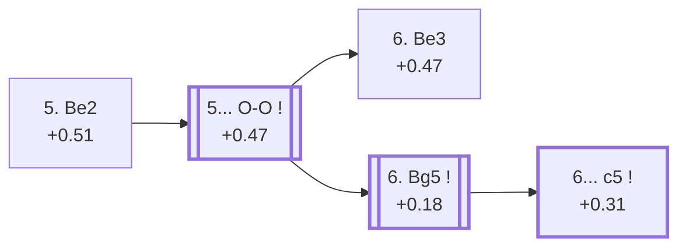

<a name="_TOP_"></a>

# E73 King's Indian Defence: 5. Be2 <br> 1. d4 Nf6 2. c4 g6 3. Nc3 Bg7 4. e4 d6 5. Be2 #

Continues from [E70's own "4... d6" node](https://github.com/onclemarcel/chess_flashcards/blob/main/d4_openings/E70_Kings_Indian.md#_d6_), where **5. Be2** is actually the *second*-most common try there (22.6% masters, just behind 5. Nf3) — a quiet developing move that keeps every plan open. `eco.md` packs three separate named entries into this single code, at three different depths: the bare root (live-tagged **King's Indian Defense: Normal Variation, Standard Development**), the **Semi-Averbakh System** (6. Be3), and the **Averbakh System** (6. Bg5) — the actual trunk of this whole sub-area, continuing into [E74](https://github.com/onclemarcel/chess_flashcards/blob/main/d4_openings/E74_Kings_Indian_Averbakh_c5.md) and [E75](https://github.com/onclemarcel/chess_flashcards/blob/main/d4_openings/E75_Kings_Indian_Averbakh_Main_Line.md).

### Overview

*Quick map of every move covered on this card — see the [shape key](https://github.com/onclemarcel/chess_flashcards/blob/main/start.md#content-diagram-optional) in start.md.*

<!-- content-diagram:start -->

<!-- content-diagram:end -->

<a name="_initial_move_"></a>

[](https://lichess.org/analysis/standard/rnbqk2r/ppp1ppbp/3p1np1/8/2PPP3/2N5/PP2BPPP/R1BQK1NR_b_KQkq_-_1_5)

*... 5. Be2 — King's Indian Defence: 5. Be2*

```
rnbqk2r/ppp1ppbp/3p1np1/8/2PPP3/2N5/PP2BPPP/R1BQK1NR b KQkq - 1 5
```

|  | +0.51 |
| --- | --- |

<!-- lichess-stats:start fen="rnbqk2r/ppp1ppbp/3p1np1/8/2PPP3/2N5/PP2BPPP/R1BQK1NR b KQkq - 1 5" db="lichess,masters" speeds="bullet,blitz" ratings="1800,2000,2200,2500" moves="6" -->
| Move | Online | W/D/B | Masters | W/D/B | |
| :--- | ---: | :--- | ---: | :--- | :-- |
| O-O | 1.5 M (88.4%) | ⬜⬜⬜⬜⬜🟫⬛⬛⬛⬛ 52/5/43 | 17 k (97.4%) | ⬜⬜⬜⬜🟫🟫🟫🟫⬛⬛ 38/37/24 |  |
| Nbd7 | 63 k (3.7%) | ⬜⬜⬜⬜⬜🟫⬛⬛⬛⬛ 54/4/42 | 153 (0.9%) | ⬜⬜⬜⬜🟫🟫🟫⬛⬛⬛ 42/31/27 |  |
| Nc6 | 35 k (2.1%) | ⬜⬜⬜⬜⬜🟫⬛⬛⬛⬛ 53/4/43 | 0 | — | ⚠ |
| c6 | 26 k (1.5%) | ⬜⬜⬜⬜⬜🟫⬛⬛⬛⬛ 52/4/43 | 58 (0.3%) | ⬜⬜⬜⬜⬜🟫🟫🟫⬛⬛ 52/26/22 |  |
| c5 | 22 k (1.3%) | ⬜⬜⬜⬜⬜🟫⬛⬛⬛⬛ 53/5/43 | 64 (0.4%) | ⬜⬜⬜⬜⬜🟫🟫🟫⬛⬛ 47/27/27 |  |
| e5 | 19 k (1.1%) | ⬜⬜⬜⬜⬜🟫⬛⬛⬛⬛ 54/5/41 | 83 (0.5%) | ⬜⬜⬜⬜🟫🟫🟫🟫⬛⬛ 36/41/23 |  |
| Na6 | 0 | — | 55 (0.3%) | ⬜⬜⬜🟫🟫🟫🟫⬛⬛⬛ 31/38/31 |  |

*Online: bullet/blitz, 1800+ — 1.7 M games. Masters: 17 k games. [Open in the explorer](https://lichess.org/analysis/standard/rnbqk2r/ppp1ppbp/3p1np1/8/2PPP3/2N5/PP2BPPP/R1BQK1NR_b_KQkq_-_1_5#explorer) — updated 2026-09-07*
<!-- lichess-stats:end -->

### Candidate moves

* [**5... O-O**](#_OO_) (+0.47, 97.4% masters): close to automatic — see below, this card's own trunk.
* **5... Nbd7** (0.9% masters) / **5... e5** (0.5% masters): real, minor secondaries with no code of their own in this range.

[*Back to TOP*](#_TOP_)

---

<a name="_OO_"></a>

## 5... O-O

[](https://lichess.org/analysis/standard/rnbq1rk1/ppp1ppbp/3p1np1/8/2PPP3/2N5/PP2BPPP/R1BQK1NR_w_KQ_-_2_6)

*... 5... O-O*

```
rnbq1rk1/ppp1ppbp/3p1np1/8/2PPP3/2N5/PP2BPPP/R1BQK1NR w KQ - 2 6
```

|  | +0.47 |
| --- | --- |

<!-- lichess-stats:start fen="rnbq1rk1/ppp1ppbp/3p1np1/8/2PPP3/2N5/PP2BPPP/R1BQK1NR w KQ - 2 6" db="lichess,masters" speeds="bullet,blitz" ratings="1800,2000,2200,2500" moves="6" -->
| Move | Online | W/D/B | Masters | W/D/B | |
| :--- | ---: | :--- | ---: | :--- | :-- |
| Nf3 | 592 k (32.9%) | ⬜⬜⬜⬜⬜🟫⬛⬛⬛⬛ 51/5/44 | 8.2 k (46.7%) | ⬜⬜⬜⬜🟫🟫🟫🟫⬛⬛ 37/38/25 |  |
| Bg5 | 452 k (25.1%) | ⬜⬜⬜⬜⬜🟫⬛⬛⬛⬛ 53/5/42 | 6.2 k (35.3%) | ⬜⬜⬜⬜🟫🟫🟫🟫⬛⬛ 40/36/24 |  |
| Be3 | 408 k (22.6%) | ⬜⬜⬜⬜⬜🟫⬛⬛⬛⬛ 51/5/44 | 2.6 k (14.8%) | ⬜⬜⬜⬜🟫🟫🟫🟫⬛⬛ 41/35/24 |  |
| h4 | 137 k (7.6%) | ⬜⬜⬜⬜⬜⬛⬛⬛⬛⬛ 50/4/46 | 258 (1.5%) | ⬜⬜⬜⬜🟫🟫🟫🟫⬛⬛ 39/36/25 |  |
| g4 | 129 k (7.2%) | ⬜⬜⬜⬜⬜🟫⬛⬛⬛⬛ 53/4/43 | 119 (0.7%) | ⬜⬜⬜⬜🟫🟫🟫⬛⬛⬛ 39/26/35 |  |
| f4 | 53 k (2.9%) | ⬜⬜⬜⬜⬜🟫⬛⬛⬛⬛ 54/5/42 | 113 (0.6%) | ⬜⬜🟫🟫🟫🟫🟫⬛⬛⬛ 25/45/30 |  |

*Online: bullet/blitz, 1800+ — 1.8 M games. Masters: 18 k games. [Open in the explorer](https://lichess.org/analysis/standard/rnbq1rk1/ppp1ppbp/3p1np1/8/2PPP3/2N5/PP2BPPP/R1BQK1NR_w_KQ_-_2_6#explorer) — updated 2026-09-07*
<!-- lichess-stats:end -->

**A genuine finding, worth stating plainly**: White's own 6th move here is a real three-way split, and masters' *actual* plurality reply is **6. Nf3** (46.7%) — an uncoded try, more common than *either* of the two named E73 sub-lines that follow it: **6. Bg5** (35.3%, the Averbakh System, this card's own trunk) and **6. Be3** (14.8%, the Semi-Averbakh System). **6. Nf3 is a verified transposition**, not an assumption: `tools/apply_san.py` confirms the resulting FEN (`rnbq1rk1/ppp1ppbp/3p1np1/8/2PPP3/2N2N2/PP2BPPP/R1BQK2R b KQ - 3 6`) is *exactly* [E70's own "6. Be2" node](https://github.com/onclemarcel/chess_flashcards/blob/main/d4_openings/E70_Kings_Indian.md#_Nf3_Be2_) reached via 5. Nf3 O-O 6. Be2 instead — the same tabiya, two different move orders, continuing toward the Mar del Plata / Orthodox Variation.

### Candidate moves

* [**6. Nf3**](https://github.com/onclemarcel/chess_flashcards/blob/main/d4_openings/E70_Kings_Indian.md#_Nf3_Be2_) (+0.45, 46.7% masters): masters' actual plurality — a verified transposition into E70's own Mar del Plata trunk, no code of its own here.
* [**6. Bg5**](#_Bg5_) (+0.18, 35.3% masters): the Averbakh System, this card's own trunk — see below.
* [**6. Be3**](#_Be3_) (+0.47, 14.8% masters): the Semi-Averbakh System — see below.

[*Back to 5. Be2*](#_initial_move_)
[*Back to TOP*](#_TOP_)

---

> [!NOTE]
> **6. Be3**, the Semi-Averbakh System, develops the bishop to a solid square without committing to the pin on f6 that defines the Averbakh proper.
>
> <a name="_Be3_"></a>
>
> ### 6. Be3 — Semi-Averbakh System
>
> [](https://lichess.org/analysis/standard/rnbq1rk1/ppp1ppbp/3p1np1/8/2PPP3/2N1B3/PP2BPPP/R2QK1NR_b_KQ_-_3_6)
>
> *... 6. Be3 — King's Indian Defence: Semi-Averbakh System*
>
> ```
> rnbq1rk1/ppp1ppbp/3p1np1/8/2PPP3/2N1B3/PP2BPPP/R2QK1NR b KQ - 3 6
> ```
>
> |  | +0.47 |
> | --- | --- |
>
> <!-- lichess-stats:start fen="rnbq1rk1/ppp1ppbp/3p1np1/8/2PPP3/2N1B3/PP2BPPP/R2QK1NR b KQ - 3 6" db="lichess,masters" speeds="bullet,blitz" ratings="1800,2000,2200,2500" moves="6" -->
> | Move | Online | W/D/B | Masters | W/D/B | |
> | :--- | ---: | :--- | ---: | :--- | :-- |
> | e5 | 172 k (37.0%) | ⬜⬜⬜⬜⬜🟫⬛⬛⬛⬛ 52/5/43 | 976 (37.2%) | ⬜⬜⬜⬜⬜🟫🟫🟫⬛⬛ 47/31/23 |  |
> | Nc6 | 78 k (16.9%) | ⬜⬜⬜⬜⬜⬛⬛⬛⬛⬛ 50/4/45 | 327 (12.5%) | ⬜⬜⬜🟫🟫🟫🟫⬛⬛⬛ 35/40/25 |  |
> | Nbd7 | 76 k (16.4%) | ⬜⬜⬜⬜⬜🟫⬛⬛⬛⬛ 52/4/44 | 131 (5.0%) | ⬜⬜⬜⬜🟫🟫🟫⬛⬛⬛ 44/28/28 |  |
> | c5 | 53 k (11.4%) | ⬜⬜⬜⬜⬜⬛⬛⬛⬛⬛ 47/6/47 | 514 (19.6%) | ⬜⬜⬜⬜🟫🟫🟫🟫⬛⬛ 42/39/19 |  |
> | c6 | 27 k (5.8%) | ⬜⬜⬜⬜⬜🟫⬛⬛⬛⬛ 53/4/43 | 147 (5.6%) | ⬜⬜⬜🟫🟫🟫🟫⬛⬛⬛ 33/37/30 |  |
> | Na6 | 21 k (4.5%) | ⬜⬜⬜⬜⬜⬛⬛⬛⬛⬛ 48/5/47 | 410 (15.6%) | ⬜⬜⬜🟫🟫🟫🟫⬛⬛⬛ 35/37/29 |  |
> 
> *Online: bullet/blitz, 1800+ — 464 k games. Masters: 2.6 k games. [Open in the explorer](https://lichess.org/analysis/standard/rnbq1rk1/ppp1ppbp/3p1np1/8/2PPP3/2N1B3/PP2BPPP/R2QK1NR_b_KQ_-_3_6#explorer) — updated 2026-09-07*
> <!-- lichess-stats:end -->
>
> Live-tagged **King's Indian Defense: Semi-Averbakh System**, matching `eco.md`'s own name exactly. Black's reply scatters widely: **6... e5** is masters' plurality (37.2%), ahead of **6... c5** (19.6%) and **6... Na6** (15.6%) — none built further here.
>
> [*Back to 5... O-O*](#_OO_)
> [*Back to TOP*](#_TOP_)

---

<a name="_Bg5_"></a>

## 6. Bg5 — Averbakh System

**6. Bg5** pins the f6-knight, the move that defines the whole Averbakh System — masters' second choice at this fork (35.3%) but this card's own followed trunk.

[](https://lichess.org/analysis/standard/rnbq1rk1/ppp1ppbp/3p1np1/6B1/2PPP3/2N5/PP2BPPP/R2QK1NR_b_KQ_-_3_6)

*... 6. Bg5 — King's Indian Defence: Averbakh System*

```
rnbq1rk1/ppp1ppbp/3p1np1/6B1/2PPP3/2N5/PP2BPPP/R2QK1NR b KQ - 3 6
```

|  | +0.18 |
| --- | --- |

<!-- lichess-stats:start fen="rnbq1rk1/ppp1ppbp/3p1np1/6B1/2PPP3/2N5/PP2BPPP/R2QK1NR b KQ - 3 6" db="lichess,masters" speeds="bullet,blitz" ratings="1800,2000,2200,2500" moves="6" -->
| Move | Online | W/D/B | Masters | W/D/B | |
| :--- | ---: | :--- | ---: | :--- | :-- |
| h6 | 121 k (25.3%) | ⬜⬜⬜⬜⬜🟫⬛⬛⬛⬛ 53/5/42 | 1.0 k (16.5%) | ⬜⬜⬜⬜⬜🟫🟫🟫⬛⬛ 44/32/24 |  |
| c5 | 117 k (24.5%) | ⬜⬜⬜⬜⬜🟫⬛⬛⬛⬛ 50/6/44 | 2.1 k (33.1%) | ⬜⬜⬜⬜🟫🟫🟫🟫⬛⬛ 40/39/21 |  |
| Nbd7 | 80 k (16.8%) | ⬜⬜⬜⬜⬜🟫⬛⬛⬛⬛ 53/5/42 | 667 (10.7%) | ⬜⬜⬜⬜🟫🟫🟫🟫⬛⬛ 39/36/26 |  |
| Nc6 | 48 k (10.1%) | ⬜⬜⬜⬜⬜🟫⬛⬛⬛⬛ 52/4/44 | 0 | — | ⚠ |
| e5 | 33 k (6.9%) | ⬜⬜⬜⬜⬜⬜🟫⬛⬛⬛ 62/5/33 | 0 | — | ⚠ |
| c6 | 28 k (5.9%) | ⬜⬜⬜⬜⬜🟫⬛⬛⬛⬛ 51/5/44 | 274 (4.4%) | ⬜⬜⬜⬜🟫🟫🟫⬛⬛⬛ 43/32/24 |  |
| Na6 | 0 | — | 1.9 k (30.8%) | ⬜⬜⬜🟫🟫🟫🟫⬛⬛⬛ 36/38/27 |  |
| a6 | 0 | — | 162 (2.6%) | ⬜⬜⬜⬜🟫🟫🟫⬛⬛⬛ 36/33/31 |  |

*Online: bullet/blitz, 1800+ — 476 k games. Masters: 6.2 k games. [Open in the explorer](https://lichess.org/analysis/standard/rnbq1rk1/ppp1ppbp/3p1np1/6B1/2PPP3/2N5/PP2BPPP/R2QK1NR_b_KQ_-_3_6#explorer) — updated 2026-09-07*
<!-- lichess-stats:end -->

Live-tagged **King's Indian Defense: Averbakh Variation**, matching `eco.md`'s own name closely. Black's own reply here is a genuine multi-way split: **6... c5** is masters' actual plurality (33.1%) — the move that reaches this batch's own [E74](https://github.com/onclemarcel/chess_flashcards/blob/main/d4_openings/E74_Kings_Indian_Averbakh_c5.md) — narrowly ahead of the uncoded **6... Na6** (30.8%), with **6... h6** (16.5%) and **6... Nbd7** (10.7%) further behind.

### Candidate moves

* [**6... c5**](https://github.com/onclemarcel/chess_flashcards/blob/main/d4_openings/E74_Kings_Indian_Averbakh_c5.md) (+0.31, 33.1% masters): masters' actual plurality — its own card, E74 onward.
* **6... Na6** (30.8% masters): a real, significant secondary with no code of its own in this range.
* **6... h6** (16.5% masters) / **6... Nbd7** (10.7% masters): further real, uncoded tries.

[*Back to 5... O-O*](#_OO_)
[*Back to TOP*](#_TOP_)
