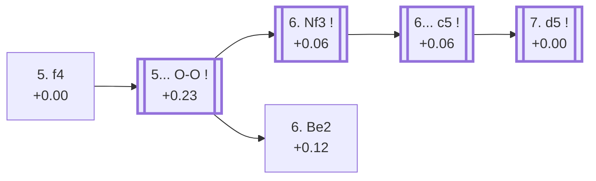

<a name="_TOP_"></a>

# E76 King's Indian Defence: Four Pawns Attack <br> 1. d4 Nf6 2. c4 g6 3. Nc3 Bg7 4. e4 d6 5. f4 #

Continues from [E70's own "4... d6" node](https://github.com/onclemarcel/chess_flashcards/blob/main/d4_openings/E70_Kings_Indian.md#_d6_), where **5. f4** (5.2% masters) is White's most ambitious try against the King's Indian — grabbing the maximum possible pawn centre at once, at the cost of some structural looseness Black aims to exploit later with ... c5 and piece pressure. `eco.md` packs the "Four Pawns Attack" name into no fewer than *three* separate entries across E76-E77 alone — a genuine, deliberate name reuse this whole batch has to track carefully, starting here with the bare root.

### Overview

*Quick map of every move covered on this card — see the [shape key](https://github.com/onclemarcel/chess_flashcards/blob/main/start.md#content-diagram-optional) in start.md.*

<!-- content-diagram:start -->

<!-- content-diagram:end -->

<a name="_initial_move_"></a>

[](https://lichess.org/analysis/standard/rnbqk2r/ppp1ppbp/3p1np1/8/2PPPP2/2N5/PP4PP/R1BQKBNR_b_KQkq_f3_0_5)

*... 5. f4 — King's Indian Defence: Four Pawns Attack*

```
rnbqk2r/ppp1ppbp/3p1np1/8/2PPPP2/2N5/PP4PP/R1BQKBNR b KQkq f3 0 5
```

|  | +0.00 |
| --- | --- |

<!-- lichess-stats:start fen="rnbqk2r/ppp1ppbp/3p1np1/8/2PPPP2/2N5/PP4PP/R1BQKBNR b KQkq f3 0 5" db="lichess,masters" speeds="bullet,blitz" ratings="1800,2000,2200,2500" moves="6" -->
| Move | Online | W/D/B | Masters | W/D/B | |
| :--- | ---: | :--- | ---: | :--- | :-- |
| O-O | 2.0 M (78.4%) | ⬜⬜⬜⬜⬜⬛⬛⬛⬛⬛ 49/4/46 | 3.3 k (83.7%) | ⬜⬜⬜⬜🟫🟫🟫⬛⬛⬛ 39/34/26 |  |
| c5 | 162 k (6.5%) | ⬜⬜⬜⬜⬜⬛⬛⬛⬛⬛ 50/5/46 | 600 (15.3%) | ⬜⬜⬜⬜🟫🟫🟫⬛⬛⬛ 36/34/30 |  |
| Nbd7 | 108 k (4.3%) | ⬜⬜⬜⬜⬜⬜⬛⬛⬛⬛ 55/4/41 | 0 | — | ⚠ |
| Bg4 | 74 k (2.9%) | ⬜⬜⬜⬜⬜🟫⬛⬛⬛⬛ 54/4/42 | 22 (0.6%) | ⬜⬜⬜🟫🟫🟫🟫⬛⬛⬛ 27/36/36 |  |
| Nc6 | 57 k (2.3%) | ⬜⬜⬜⬜⬜⬛⬛⬛⬛⬛ 51/4/45 | 0 | — | ⚠ |
| c6 | 42 k (1.7%) | ⬜⬜⬜⬜⬜🟫⬛⬛⬛⬛ 53/4/43 | 0 | — | ⚠ |
| Na6 | 0 | — | 12 (0.3%) | — |  |
| e5 | 0 | — | 3 (0.1%) | — |  |
| Kd7 | 0 | — | 1 (0.0%) | — |  |

*Online: bullet/blitz, 1800+ — 2.5 M games. Masters: 3.9 k games. [Open in the explorer](https://lichess.org/analysis/standard/rnbqk2r/ppp1ppbp/3p1np1/8/2PPPP2/2N5/PP4PP/R1BQKBNR_b_KQkq_f3_0_5#explorer) — updated 2026-09-15*
<!-- lichess-stats:end -->

### Candidate moves

* [**5... O-O**](#_OO_) (+0.23, 83.7% masters): by far Black's most tested try — see below, this card's own trunk.
* **5... c5** (15.3% masters): a real, significant secondary with no code of its own in this range.

[*Back to TOP*](#_TOP_)

---

<a name="_OO_"></a>

## 5... O-O

[](https://lichess.org/analysis/standard/rnbq1rk1/ppp1ppbp/3p1np1/8/2PPPP2/2N5/PP4PP/R1BQKBNR_w_KQ_-_1_6)

*... 5... O-O*

```
rnbq1rk1/ppp1ppbp/3p1np1/8/2PPPP2/2N5/PP4PP/R1BQKBNR w KQ - 1 6
```

|  | +0.23 |
| --- | --- |

<!-- lichess-stats:start fen="rnbq1rk1/ppp1ppbp/3p1np1/8/2PPPP2/2N5/PP4PP/R1BQKBNR w KQ - 1 6" db="lichess,masters" speeds="bullet,blitz" ratings="1800,2000,2200,2500" moves="6" -->
| Move | Online | W/D/B | Masters | W/D/B | |
| :--- | ---: | :--- | ---: | :--- | :-- |
| Nf3 | 1.7 M (76.4%) | ⬜⬜⬜⬜⬜⬛⬛⬛⬛⬛ 50/5/46 | 3.5 k (97.6%) | ⬜⬜⬜⬜🟫🟫🟫⬛⬛⬛ 40/34/26 |  |
| e5 | 319 k (14.3%) | ⬜⬜⬜⬜⬜⬛⬛⬛⬛⬛ 47/4/49 | 1 (0.0%) | — | ⚠ |
| Be2 | 67 k (3.0%) | ⬜⬜⬜⬜⬜⬛⬛⬛⬛⬛ 50/4/45 | 58 (1.6%) | ⬜⬜⬜🟫🟫🟫🟫⬛⬛⬛ 33/40/28 |  |
| Bd3 | 64 k (2.9%) | ⬜⬜⬜⬜⬜⬛⬛⬛⬛⬛ 48/4/48 | 22 (0.6%) | ⬜⬜⬜🟫🟫🟫🟫🟫⬛⬛ 27/50/23 |  |
| h3 | 53 k (2.4%) | ⬜⬜⬜⬜⬜⬛⬛⬛⬛⬛ 46/4/50 | 0 | — | ⚠ |
| Be3 | 12 k (0.5%) | ⬜⬜⬜⬜🟫⬛⬛⬛⬛⬛ 43/4/53 | 2 (0.1%) | — | ⚠ |
| b4 | 0 | — | 1 (0.0%) | — |  |

*Online: bullet/blitz, 1800+ — 2.2 M games. Masters: 3.5 k games. [Open in the explorer](https://lichess.org/analysis/standard/rnbq1rk1/ppp1ppbp/3p1np1/8/2PPPP2/2N5/PP4PP/R1BQKBNR_w_KQ_-_1_6#explorer) — updated 2026-09-15*
<!-- lichess-stats:end -->

**A real, striking online/masters gap, worth flagging as a genuine finding**: **6. e5**, an immediate (and premature) further central push, is essentially unplayed by masters (0.03%, 1 game out of 3,541) yet appears in 14.3% of online games — a ratio far beyond this repository's own 8× rhombus threshold. Stockfish confirms it is objectively bad for White (-0.48): the King's Indian's central break is normally delayed, not rushed, and this over-eager version simply hands Black a favourable opening of the position. **6. Nf3** is masters' overwhelming main try instead (97.6%), reaching this card's own dynamic-line trunk.

### Candidate moves

* [**6. Nf3**](#_Nf3_) (+0.06, 97.6% masters): masters' overwhelming main try — see below, this card's own trunk.
* [**6. Be2**](https://github.com/onclemarcel/chess_flashcards/blob/main/d4_openings/E77_Kings_Indian_Four_Pawns_Be2.md) (+0.12, 1.6% masters, 3.0% online): its own code — E77 onward.
* **6. e5** (0.03% masters, 14.3% online, -0.48): a real blitz trap — objectively bad for White despite its online popularity, no code of its own in this range.

[*Back to 5... O-O*](#_initial_move_)
[*Back to TOP*](#_TOP_)

---

<a name="_Nf3_"></a>

## 6. Nf3

[](https://lichess.org/analysis/standard/rnbq1rk1/ppp1ppbp/3p1np1/8/2PPPP2/2N2N2/PP4PP/R1BQKB1R_b_KQ_-_2_6)

*... 6. Nf3*

```
rnbq1rk1/ppp1ppbp/3p1np1/8/2PPPP2/2N2N2/PP4PP/R1BQKB1R b KQ - 2 6
```

|  | +0.06 |
| --- | --- |

<!-- lichess-stats:start fen="rnbq1rk1/ppp1ppbp/3p1np1/8/2PPPP2/2N2N2/PP4PP/R1BQKB1R b KQ - 2 6" db="lichess,masters" speeds="bullet,blitz" ratings="1800,2000,2200,2500" moves="6" -->
| Move | Online | W/D/B | Masters | W/D/B | |
| :--- | ---: | :--- | ---: | :--- | :-- |
| c5 | 802 k (46.1%) | ⬜⬜⬜⬜⬜⬛⬛⬛⬛⬛ 49/5/46 | 2.4 k (69.1%) | ⬜⬜⬜⬜🟫🟫🟫⬛⬛⬛ 40/35/25 |  |
| Bg4 | 220 k (12.6%) | ⬜⬜⬜⬜⬜⬛⬛⬛⬛⬛ 51/5/45 | 130 (3.8%) | ⬜⬜⬜⬜🟫🟫🟫⬛⬛⬛ 43/28/28 |  |
| Nbd7 | 213 k (12.2%) | ⬜⬜⬜⬜⬜🟫⬛⬛⬛⬛ 52/4/44 | 0 | — | ⚠ |
| Nc6 | 171 k (9.8%) | ⬜⬜⬜⬜⬜⬛⬛⬛⬛⬛ 49/4/48 | 0 | — | ⚠ |
| e5 | 74 k (4.3%) | ⬜⬜⬜⬜⬜⬛⬛⬛⬛⬛ 48/5/47 | 60 (1.7%) | ⬜⬜⬜⬜🟫🟫🟫🟫⬛⬛ 37/40/23 |  |
| Na6 | 72 k (4.1%) | ⬜⬜⬜⬜⬜⬛⬛⬛⬛⬛ 46/5/50 | 761 (22.0%) | ⬜⬜⬜⬜🟫🟫🟫⬛⬛⬛ 38/33/30 |  |
| a6 | 0 | — | 41 (1.2%) | ⬜⬜⬜⬜🟫🟫⬛⬛⬛⬛ 37/24/39 |  |
| c6 | 0 | — | 31 (0.9%) | ⬜⬜⬜⬜⬜🟫🟫🟫⬛⬛ 55/29/16 |  |

*Online: bullet/blitz, 1800+ — 1.7 M games. Masters: 3.5 k games. [Open in the explorer](https://lichess.org/analysis/standard/rnbq1rk1/ppp1ppbp/3p1np1/8/2PPPP2/2N2N2/PP4PP/R1BQKB1R_b_KQ_-_2_6#explorer) — updated 2026-09-15*
<!-- lichess-stats:end -->

**6... c5** is masters' clear main try (69.1%), striking at the centre at once.

<a name="_c5_"></a>

[](https://lichess.org/analysis/standard/rnbq1rk1/pp2ppbp/3p1np1/2p5/2PPPP2/2N2N2/PP4PP/R1BQKB1R_w_KQ_c6_0_7)

*... 6... c5*

```
rnbq1rk1/pp2ppbp/3p1np1/2p5/2PPPP2/2N2N2/PP4PP/R1BQKB1R w KQ c6 0 7
```

|  | +0.06 |
| --- | --- |

<!-- lichess-stats:start fen="rnbq1rk1/pp2ppbp/3p1np1/2p5/2PPPP2/2N2N2/PP4PP/R1BQKB1R w KQ c6 0 7" db="lichess,masters" speeds="bullet,blitz" ratings="1800,2000,2200,2500" moves="6" -->
| Move | Online | W/D/B | Masters | W/D/B | |
| :--- | ---: | :--- | ---: | :--- | :-- |
| d5 | 670 k (83.2%) | ⬜⬜⬜⬜⬜⬛⬛⬛⬛⬛ 50/5/45 | 1.9 k (77.7%) | ⬜⬜⬜⬜🟫🟫🟫⬛⬛⬛ 40/34/26 |  |
| e5 | 49 k (6.1%) | ⬜⬜⬜⬜🟫⬛⬛⬛⬛⬛ 43/5/53 | 1 (0.0%) | — | ⚠ |
| dxc5 | 45 k (5.6%) | ⬜⬜⬜⬜⬜🟫⬛⬛⬛⬛ 48/7/45 | 456 (19.0%) | ⬜⬜⬜⬜🟫🟫🟫🟫⬛⬛ 41/38/21 |  |
| Be2 | 17 k (2.1%) | ⬜⬜⬜⬜⬜🟫⬛⬛⬛⬛ 52/5/43 | 75 (3.1%) | ⬜⬜⬜⬜⬜🟫🟫🟫⬛⬛ 45/32/23 |  |
| Be3 | 13 k (1.7%) | ⬜⬜⬜⬜⬛⬛⬛⬛⬛⬛ 40/5/55 | 1 (0.0%) | — | ⚠ |
| Bd3 | 9.1 k (1.1%) | ⬜⬜⬜⬜🟫⬛⬛⬛⬛⬛ 43/4/53 | 0 | — | ⚠ |

*Online: bullet/blitz, 1800+ — 805 k games. Masters: 2.4 k games. [Open in the explorer](https://lichess.org/analysis/standard/rnbq1rk1/pp2ppbp/3p1np1/2p5/2PPPP2/2N2N2/PP4PP/R1BQKB1R_w_KQ_c6_0_7#explorer) — updated 2026-09-15*
<!-- lichess-stats:end -->

**7. d5** is masters' clear main try (77.7%), gaining space and inviting the sharp lines this whole system is named for.

<a name="_d5_"></a>

[](https://lichess.org/analysis/standard/rnbq1rk1/pp2ppbp/3p1np1/2pP4/2P1PP2/2N2N2/PP4PP/R1BQKB1R_b_KQ_-_0_7)

*... 7. d5 — King's Indian Defence: Four Pawns Attack, dynamic line*

```
rnbq1rk1/pp2ppbp/3p1np1/2pP4/2P1PP2/2N2N2/PP4PP/R1BQKB1R b KQ - 0 7
```

|  | +0.00 |
| --- | --- |

<!-- lichess-stats:start fen="rnbq1rk1/pp2ppbp/3p1np1/2pP4/2P1PP2/2N2N2/PP4PP/R1BQKB1R b KQ - 0 7" db="lichess,masters" speeds="bullet,blitz" ratings="1800,2000,2200,2500" moves="6" -->
| Move | Online | W/D/B | Masters | W/D/B | |
| :--- | ---: | :--- | ---: | :--- | :-- |
| e6 | 594 k (56.2%) | ⬜⬜⬜⬜⬜⬛⬛⬛⬛⬛ 49/5/46 | 2.1 k (81.4%) | ⬜⬜⬜⬜🟫🟫🟫⬛⬛⬛ 37/35/28 |  |
| Bg4 | 131 k (12.4%) | ⬜⬜⬜⬜⬜⬛⬛⬛⬛⬛ 50/5/45 | 44 (1.7%) | ⬜⬜⬜⬜🟫🟫🟫⬛⬛⬛ 43/30/27 |  |
| a6 | 87 k (8.2%) | ⬜⬜⬜⬜⬜⬛⬛⬛⬛⬛ 49/4/47 | 124 (4.7%) | ⬜⬜⬜⬜🟫🟫🟫⬛⬛⬛ 40/31/28 |  |
| b5 | 78 k (7.4%) | ⬜⬜⬜⬜🟫⬛⬛⬛⬛⬛ 43/5/52 | 289 (11.1%) | ⬜⬜⬜⬜⬜🟫🟫🟫⬛⬛ 48/27/25 |  |
| Nbd7 | 51 k (4.8%) | ⬜⬜⬜⬜⬜🟫⬛⬛⬛⬛ 53/4/43 | 0 | — | ⚠ |
| Na6 | 38 k (3.6%) | ⬜⬜⬜⬜⬜⬛⬛⬛⬛⬛ 47/4/49 | 14 (0.5%) | — |  |
| e5 | 0 | — | 11 (0.4%) | — |  |

*Online: bullet/blitz, 1800+ — 1.1 M games. Masters: 2.6 k games. [Open in the explorer](https://lichess.org/analysis/standard/rnbq1rk1/pp2ppbp/3p1np1/2pP4/2P1PP2/2N2N2/PP4PP/R1BQKB1R_b_KQ_-_0_7#explorer) — updated 2026-09-15*
<!-- lichess-stats:end -->

Live-tagged **King's Indian Defense: Four Pawns Attack, Dynamic Attack** — a real name divergence from `eco.md`'s own "dynamic line." Black's own reply here is masters' clear main try, **7... e6** (81.4%), striking straight at the d5-pawn. Not built further here.

### Candidate moves

* **7... e6** (81.4% masters): masters' clear main try — not built further here.
* **7... b5** (11.1% masters) / **7... a6** (4.7% masters): real, uncoded secondaries.

[*Back to 6. Nf3*](#_Nf3_)
[*Back to TOP*](#_TOP_)
