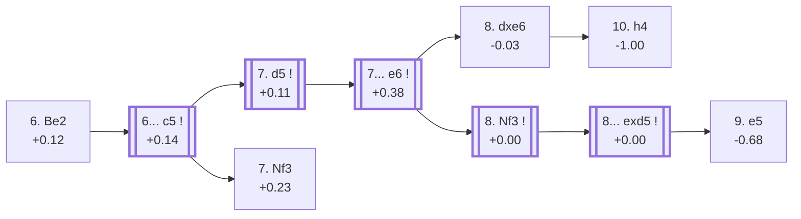

<a name="_TOP_"></a>

# E77 King's Indian Defence: Four Pawns Attack, 6. Be2 <br> 1. d4 Nf6 2. c4 g6 3. Nc3 Bg7 4. e4 d6 5. f4 O-O 6. Be2 #

Continues from [E76's own "5... O-O" node](https://github.com/onclemarcel/chess_flashcards/blob/main/d4_openings/E76_Kings_Indian_Four_Pawns_Attack.md#_OO_), where **6. Be2** is a real secondary at that fork (1.6% masters, 3.0% online — nowhere near the dominance of E76's own 6. Nf3) that nonetheless carries its own code. `eco.md` packs no fewer than four separate entries into this single card: the bare root (live-tagged **King's Indian Defense: Four Pawns Attack**, the *second* of three "Four Pawns Attack" reuses in this batch), the **Six Pawns Attack**, a second bare **Four Pawns Attack** repeat one further ply in (live-tagged **Normal Attack**, the *third* reuse), and the **Florentine Gambit** nested inside that. A fifth entry, **With Be2 and Nf3**, spins off into its own card, [E78](https://github.com/onclemarcel/chess_flashcards/blob/main/d4_openings/E78_Kings_Indian_Four_Pawns_Be2_Nf3.md), reached by a *different* move order than anything built here — verified, not assumed, see E78's own intro.

### Overview

*Quick map of every move covered on this card — see the [shape key](https://github.com/onclemarcel/chess_flashcards/blob/main/start.md#content-diagram-optional) in start.md.*

<!-- content-diagram:start -->

<!-- content-diagram:end -->

<a name="_initial_move_"></a>

[](https://lichess.org/analysis/standard/rnbq1rk1/ppp1ppbp/3p1np1/8/2PPPP2/2N5/PP2B1PP/R1BQK1NR_b_KQ_-_2_6)

*... 6. Be2 — King's Indian Defence: Four Pawns Attack*

```
rnbq1rk1/ppp1ppbp/3p1np1/8/2PPPP2/2N5/PP2B1PP/R1BQK1NR b KQ - 2 6
```

|  | +0.12 |
| --- | --- |

<!-- lichess-stats:start fen="rnbq1rk1/ppp1ppbp/3p1np1/8/2PPPP2/2N5/PP2B1PP/R1BQK1NR b KQ - 2 6" db="lichess,masters" speeds="bullet,blitz" ratings="1800,2000,2200,2500" moves="6" -->
| Move | Online | W/D/B | Masters | W/D/B | |
| :--- | ---: | :--- | ---: | :--- | :-- |
| c5 | 58 k (48.8%) | ⬜⬜⬜⬜⬜🟫⬛⬛⬛⬛ 51/5/44 | 140 (81.9%) | ⬜⬜⬜🟫🟫🟫🟫⬛⬛⬛ 27/44/29 |  |
| Nbd7 | 16 k (13.6%) | ⬜⬜⬜⬜⬜⬜⬛⬛⬛⬛ 55/4/41 | 1 (0.6%) | — | ⚠ |
| Nc6 | 14 k (11.9%) | ⬜⬜⬜⬜⬜🟫⬛⬛⬛⬛ 51/4/44 | 2 (1.2%) | — | ⚠ |
| e5 | 11 k (8.9%) | ⬜⬜⬜⬜⬜⬛⬛⬛⬛⬛ 48/5/48 | 9 (5.3%) | — |  |
| c6 | 5.1 k (4.3%) | ⬜⬜⬜⬜⬜🟫⬛⬛⬛⬛ 53/4/43 | 0 | — | ⚠ |
| Na6 | 4.9 k (4.1%) | ⬜⬜⬜⬜⬜⬛⬛⬛⬛⬛ 46/5/49 | 16 (9.4%) | — |  |
| a6 | 0 | — | 1 (0.6%) | — |  |

*Online: bullet/blitz, 1800+ — 120 k games. Masters: 171 games. [Open in the explorer](https://lichess.org/analysis/standard/rnbq1rk1/ppp1ppbp/3p1np1/8/2PPPP2/2N5/PP2B1PP/R1BQK1NR_b_KQ_-_2_6#explorer) — updated 2026-09-09*
<!-- lichess-stats:end -->

### Candidate moves

* [**6... c5**](#_c5_) (+0.14, 81.9% masters): masters' overwhelming main try — see below, this card's own trunk.
* **6... Na6** (9.4% masters) / **6... e5** (5.3% masters): real, minor secondaries with no code of their own in this range.

[*Back to TOP*](#_TOP_)

---

<a name="_c5_"></a>

## 6... c5

[](https://lichess.org/analysis/standard/rnbq1rk1/pp2ppbp/3p1np1/2p5/2PPPP2/2N5/PP2B1PP/R1BQK1NR_w_KQ_c6_0_7)

*... 6... c5*

```
rnbq1rk1/pp2ppbp/3p1np1/2p5/2PPPP2/2N5/PP2B1PP/R1BQK1NR w KQ c6 0 7
```

|  | +0.14 |
| --- | --- |

<!-- lichess-stats:start fen="rnbq1rk1/pp2ppbp/3p1np1/2p5/2PPPP2/2N5/PP2B1PP/R1BQK1NR w KQ c6 0 7" db="lichess,masters" speeds="bullet,blitz" ratings="1800,2000,2200,2500" moves="4" -->
| Move | Online | W/D/B | Masters | W/D/B | |
| :--- | ---: | :--- | ---: | :--- | :-- |
| d5 | 42 k (71.2%) | ⬜⬜⬜⬜⬜🟫⬛⬛⬛⬛ 51/5/44 | 63 (45.0%) | ⬜⬜⬜🟫🟫🟫🟫⬛⬛⬛ 32/35/33 |  |
| Nf3 | 9.7 k (16.6%) | ⬜⬜⬜⬜⬜🟫⬛⬛⬛⬛ 53/6/41 | 76 (54.3%) | ⬜⬜🟫🟫🟫🟫🟫⬛⬛⬛ 24/50/26 |  |
| e5 | 4.5 k (7.7%) | ⬜⬜⬜⬜⬜⬛⬛⬛⬛⬛ 50/4/46 | 0 | — | ⚠ |
| dxc5 | 2.0 k (3.4%) | ⬜⬜⬜⬜⬜🟫⬛⬛⬛⬛ 51/6/44 | 1 (0.7%) | — | ⚠ |

*Online: bullet/blitz, 1800+ — 58 k games. Masters: 140 games. [Open in the explorer](https://lichess.org/analysis/standard/rnbq1rk1/pp2ppbp/3p1np1/2p5/2PPPP2/2N5/PP2B1PP/R1BQK1NR_w_KQ_c6_0_7#explorer) — updated 2026-09-09*
<!-- lichess-stats:end -->

**A genuine near-even split, worth stating plainly**: White's 7th move here splits almost evenly between **7. Nf3** (54.3% masters) — which is actually the *bigger* half, spinning off into [E78](https://github.com/onclemarcel/chess_flashcards/blob/main/d4_openings/E78_Kings_Indian_Four_Pawns_Be2_Nf3.md) — and **7. d5** (45.0% masters), the move that keeps this card's own trunk going.

### Candidate moves

* [**7. d5**](#_d5_) (+0.11, 45.0% masters): this card's own trunk — see below.
* [**7. Nf3**](https://github.com/onclemarcel/chess_flashcards/blob/main/d4_openings/E78_Kings_Indian_Four_Pawns_Be2_Nf3.md) (+0.23, 54.3% masters): masters' actual majority — its own card, E78, reached via a different move order than anything below.

[*Back to 6. Be2*](#_initial_move_)
[*Back to TOP*](#_TOP_)

---

<a name="_d5_"></a>

## 7. d5 e6

**7. d5** closes the centre. **7... e6** follows as masters' clear main reply (74.2%), striking at the newly advanced pawn.

[](https://lichess.org/analysis/standard/rnbq1rk1/pp3pbp/3ppnp1/2pP4/2P1PP2/2N5/PP2B1PP/R1BQK1NR_w_KQ_-_0_8)

*... 7. d5 e6*

```
rnbq1rk1/pp3pbp/3ppnp1/2pP4/2P1PP2/2N5/PP2B1PP/R1BQK1NR w KQ - 0 8
```

|  | +0.38 |
| --- | --- |

<!-- lichess-stats:start fen="rnbq1rk1/pp3pbp/3ppnp1/2pP4/2P1PP2/2N5/PP2B1PP/R1BQK1NR w KQ - 0 8" db="lichess,masters" speeds="bullet,blitz" ratings="1800,2000,2200,2500" moves="4" -->
| Move | Online | W/D/B | Masters | W/D/B | |
| :--- | ---: | :--- | ---: | :--- | :-- |
| Nf3 | 31 k (81.9%) | ⬜⬜⬜⬜⬜🟫⬛⬛⬛⬛ 53/5/43 | 70 (93.3%) | ⬜⬜⬜🟫🟫🟫⬛⬛⬛⬛ 29/31/40 |  |
| dxe6 | 2.8 k (7.3%) | ⬜⬜⬜⬜⬜⬛⬛⬛⬛⬛ 47/5/48 | 5 (6.7%) | — |  |
| e5 | 1.2 k (3.1%) | ⬜⬜⬜⬜🟫⬛⬛⬛⬛⬛ 43/4/53 | 0 | — | ⚠ |
| g4 | 1.0 k (2.7%) | ⬜⬜⬜⬜⬛⬛⬛⬛⬛⬛ 36/3/62 | 0 | — | ⚠ |

*Online: bullet/blitz, 1800+ — 38 k games. Masters: 75 games. [Open in the explorer](https://lichess.org/analysis/standard/rnbq1rk1/pp3pbp/3ppnp1/2pP4/2P1PP2/2N5/PP2B1PP/R1BQK1NR_w_KQ_-_0_8#explorer) — updated 2026-09-09*
<!-- lichess-stats:end -->

<a name="_e6_"></a>

**A genuine surprise, worth stating plainly**: masters overwhelmingly meet 7... e6 with **8. Nf3** (93.3%) rather than **8. dxe6** (only 6.7%) — meaning the Six Pawns Attack below, despite carrying its own `eco.md` entry, is actually the *rare* try here, while the far more common 8. Nf3 leads to a second, distinct "Four Pawns Attack" entry one ply deeper.

### Candidate moves

* [**8. Nf3**](#_Nf3b_) (+0.00, 93.3% masters): masters' overwhelming main try — see below.
* [**8. dxe6**](#_dxe6_) (-0.03, 6.7% masters): the rare try — the Six Pawns Attack, see below.

[*Back to 6... c5*](#_c5_)
[*Back to TOP*](#_TOP_)

---

> [!NOTE]
> **8. dxe6**, though it carries its own `eco.md` entry (the Six Pawns Attack), is masters' rare choice here (6.7%) — trading the d5-pawn for a sharp, committal continuation.
>
> <a name="_dxe6_"></a>
>
> ### 8. dxe6 fxe6 9. g4 Nc6 10. h4 — Six Pawns Attack
>
> This whole sequence carries an extremely small live sample (single-digit masters games at every step past move 8) — reported honestly as a real but rarely-tested line, matching `eco.md`'s own characterisation of it as a sharp, committal try rather than mainstream theory.
>
> <a name="_h4_"></a>
>
> [](https://lichess.org/analysis/standard/r1bq1rk1/pp4bp/2nppnp1/2p5/2P1PPPP/2N5/PP2B3/R1BQK1NR_b_KQ_h3_0_10)
>
> *... 8. dxe6 fxe6 9. g4 Nc6 10. h4 — King's Indian Defence: Six Pawns Attack*
>
> ```
> r1bq1rk1/pp4bp/2nppnp1/2p5/2P1PPPP/2N5/PP2B3/R1BQK1NR b KQ h3 0 10
> ```
>
> |  | -1.00 |
> | --- | --- |
>
> <!-- lichess-stats:start fen="r1bq1rk1/pp4bp/2nppnp1/2p5/2P1PPPP/2N5/PP2B3/R1BQK1NR b KQ h3 0 10" db="lichess,masters" speeds="bullet,blitz" ratings="1800,2000,2200,2500" moves="4" -->
> | Move | Online | W/D/B | Masters | W/D/B | |
> | :--- | ---: | :--- | ---: | :--- | :-- |
> | Nd4 | 145 (75.5%) | ⬜⬜⬜⬜⬜⬜⬜⬛⬛⬛ 64/3/32 | 1 (100.0%) | — | ⚠ |
> | d5 | 20 (10.4%) | ⬜⬜⬜⬜⬜⬜⬜⬛⬛⬛ 65/5/30 | 0 | — |  |
> | e5 | 13 (6.8%) | — | 0 | — |  |
> | Qa5 | 6 (3.1%) | — | 0 | — |  |
> 
> *Online: bullet/blitz, 1800+ — 192 games. Masters: 1 games. [Open in the explorer](https://lichess.org/analysis/standard/r1bq1rk1/pp4bp/2nppnp1/2p5/2P1PPPP/2N5/PP2B3/R1BQK1NR_b_KQ_h3_0_10#explorer) — updated 2026-09-09*
> <!-- lichess-stats:end -->
>
> Live-tagged **King's Indian Defense: Six Pawns Attack**, matching `eco.md`'s own name exactly — confirming the name at the deepest node in this whole E70-E79 batch (move 10). Despite the aggressive pawn storm the name suggests, the live cloud-eval swings sharply *against* White at every step past 9. g4 (-0.92, -0.87, -1.00) — a genuinely dubious try for White in practice, not merely a slower one. Not built further here.
>
> [*Back to 7... e6*](#_e6_)
> [*Back to TOP*](#_TOP_)

---

<a name="_Nf3b_"></a>

## 8. Nf3 — Four Pawns Attack, Normal Attack

**8. Nf3** is masters' overwhelming main try after 7... e6 (93.3%).

[](https://lichess.org/analysis/standard/rnbq1rk1/pp3pbp/3ppnp1/2pP4/2P1PP2/2N2N2/PP2B1PP/R1BQK2R_b_KQ_-_1_8)

*... 8. Nf3 — King's Indian Defence: Four Pawns Attack (Normal Attack)*

```
rnbq1rk1/pp3pbp/3ppnp1/2pP4/2P1PP2/2N2N2/PP2B1PP/R1BQK2R b KQ - 1 8
```

|  | +0.00 |
| --- | --- |

<!-- lichess-stats:start fen="rnbq1rk1/pp3pbp/3ppnp1/2pP4/2P1PP2/2N2N2/PP2B1PP/R1BQK2R b KQ - 1 8" db="lichess,masters" speeds="bullet,blitz" ratings="1800,2000,2200,2500" moves="4" -->
| Move | Online | W/D/B | Masters | W/D/B | |
| :--- | ---: | :--- | ---: | :--- | :-- |
| exd5 | 291 k (95.6%) | ⬜⬜⬜⬜⬜🟫⬛⬛⬛⬛ 52/5/43 | 1.7 k (98.5%) | ⬜⬜⬜⬜🟫🟫🟫⬛⬛⬛ 37/35/28 |  |
| Re8 | 4.4 k (1.4%) | ⬜⬜⬜⬜⬜⬛⬛⬛⬛⬛ 50/5/45 | 18 (1.0%) | — |  |
| a6 | 3.7 k (1.2%) | ⬜⬜⬜⬜⬜🟫⬛⬛⬛⬛ 53/5/43 | 0 | — | ⚠ |
| Na6 | 1.2 k (0.4%) | ⬜⬜⬜⬜⬜🟫⬛⬛⬛⬛ 52/5/43 | 2 (0.1%) | — | ⚠ |
| b5 | 0 | — | 6 (0.3%) | — |  |

*Online: bullet/blitz, 1800+ — 305 k games. Masters: 1.7 k games. [Open in the explorer](https://lichess.org/analysis/standard/rnbq1rk1/pp3pbp/3ppnp1/2pP4/2P1PP2/2N2N2/PP2B1PP/R1BQK2R_b_KQ_-_1_8#explorer) — updated 2026-09-09*
<!-- lichess-stats:end -->

Live-tagged **King's Indian Defense: Four Pawns Attack, Normal Attack** — the *third* distinct use of the bare "Four Pawns Attack" name within this one E76-E77 pair, a genuine, deliberate reuse rather than an error. **8... exd5** is close to forced (98.5% masters).

<a name="_exd5_"></a>

[](https://lichess.org/analysis/standard/rnbq1rk1/pp3pbp/3p1np1/2pp4/2P1PP2/2N2N2/PP2B1PP/R1BQK2R_w_KQ_-_0_9)

*... 8... exd5*

```
rnbq1rk1/pp3pbp/3p1np1/2pp4/2P1PP2/2N2N2/PP2B1PP/R1BQK2R w KQ - 0 9
```

|  | +0.00 |
| --- | --- |

<!-- lichess-stats:start fen="rnbq1rk1/pp3pbp/3p1np1/2pp4/2P1PP2/2N2N2/PP2B1PP/R1BQK2R w KQ - 0 9" db="lichess,masters" speeds="bullet,blitz" ratings="1800,2000,2200,2500" moves="4" -->
| Move | Online | W/D/B | Masters | W/D/B | |
| :--- | ---: | :--- | ---: | :--- | :-- |
| cxd5 | 193 k (66.3%) | ⬜⬜⬜⬜⬜🟫⬛⬛⬛⬛ 54/4/41 | 1.5 k (86.6%) | ⬜⬜⬜⬜🟫🟫🟫⬛⬛⬛ 38/34/28 |  |
| exd5 | 87 k (29.8%) | ⬜⬜⬜⬜⬜🟫⬛⬛⬛⬛ 47/7/46 | 142 (8.3%) | ⬜⬜⬜🟫🟫🟫🟫⬛⬛⬛ 30/42/28 |  |
| e5 | 10 k (3.5%) | ⬜⬜⬜⬜⬜⬜⬛⬛⬛⬛ 59/5/37 | 89 (5.2%) | ⬜⬜⬜🟫🟫🟫⬛⬛⬛⬛ 29/27/44 |  |
| Nxd5 | 918 (0.3%) | ⬜⬜⬜⬜⬛⬛⬛⬛⬛⬛ 36/6/58 | 0 | — | ⚠ |

*Online: bullet/blitz, 1800+ — 291 k games. Masters: 1.7 k games. [Open in the explorer](https://lichess.org/analysis/standard/rnbq1rk1/pp3pbp/3p1np1/2pp4/2P1PP2/2N2N2/PP2B1PP/R1BQK2R_w_KQ_-_0_9#explorer) — updated 2026-09-09*
<!-- lichess-stats:end -->

White's normal recapture here (86.6% masters **9. cxd5**, 8.3% **9. exd5**) isn't independently named and isn't built further. Instead, White's real sideline — the one `eco.md` names — is skipping the recapture entirely:

### Candidate moves

* **9. cxd5** (86.6% masters): the normal recapture, transposing into standard Four Pawns theory — not built further here.
* [**9. e5**](#_e5_) (5.2% masters): the Florentine Gambit, see below.

[*Back to 7... e6*](#_e6_)
[*Back to TOP*](#_TOP_)

---

> [!NOTE]
> **9. e5**, the Florentine Gambit, pushes past instead of recapturing on d5 — a genuine pawn sacrifice for attacking chances, and Stockfish is not impressed.
>
> <a name="_e5_"></a>
>
> ### 9. e5 — Florentine Gambit
>
> [](https://lichess.org/analysis/standard/rnbq1rk1/pp3pbp/3p1np1/2ppP3/2P2P2/2N2N2/PP2B1PP/R1BQK2R_b_KQ_-_0_9)
>
> *... 9. e5 — King's Indian Defence: Four Pawns Attack, Florentine Gambit*
>
> ```
> rnbq1rk1/pp3pbp/3p1np1/2ppP3/2P2P2/2N2N2/PP2B1PP/R1BQK2R b KQ - 0 9
> ```
>
> |  | -0.68 |
> | --- | --- |
>
> <!-- lichess-stats:start fen="rnbq1rk1/pp3pbp/3p1np1/2ppP3/2P2P2/2N2N2/PP2B1PP/R1BQK2R b KQ - 0 9" db="lichess,masters" speeds="bullet,blitz" ratings="1800,2000,2200,2500" moves="4" -->
> | Move | Online | W/D/B | Masters | W/D/B | |
> | :--- | ---: | :--- | ---: | :--- | :-- |
> | dxe5 | 8.0 k (79.4%) | ⬜⬜⬜⬜⬜⬜⬛⬛⬛⬛ 59/4/36 | 34 (38.2%) | ⬜⬜🟫🟫🟫🟫⬛⬛⬛⬛ 24/38/38 |  |
> | Ne4 | 828 (8.2%) | ⬜⬜⬜⬜🟫⬛⬛⬛⬛⬛ 44/7/48 | 21 (23.6%) | ⬜⬜🟫🟫⬛⬛⬛⬛⬛⬛ 19/19/62 |  |
> | Re8 | 681 (6.7%) | ⬜⬜⬜⬜⬜⬜⬜⬛⬛⬛ 70/2/28 | 0 | — | ⚠ |
> | Ng4 | 180 (1.8%) | ⬜⬜⬜⬜⬜⬛⬛⬛⬛⬛ 48/6/46 | 13 (14.6%) | — |  |
> | Nfd7 | 0 | — | 16 (18.0%) | — |  |
> 
> *Online: bullet/blitz, 1800+ — 10 k games. Masters: 89 games. [Open in the explorer](https://lichess.org/analysis/standard/rnbq1rk1/pp3pbp/3p1np1/2ppP3/2P2P2/2N2N2/PP2B1PP/R1BQK2R_b_KQ_-_0_9#explorer) — updated 2026-09-09*
> <!-- lichess-stats:end -->
>
> Live-tagged **King's Indian Defense: Four Pawns Attack, Florentine Gambit**, matching `eco.md`'s own name exactly. Stockfish rates it objectively bad for White (-0.68) despite the attacking intent, similar in spirit to the Six Pawns Attack above — a real gambit, not just a name. Not built further here.
>
> [*Back to 8. Nf3*](#_Nf3b_)
> [*Back to TOP*](#_TOP_)
