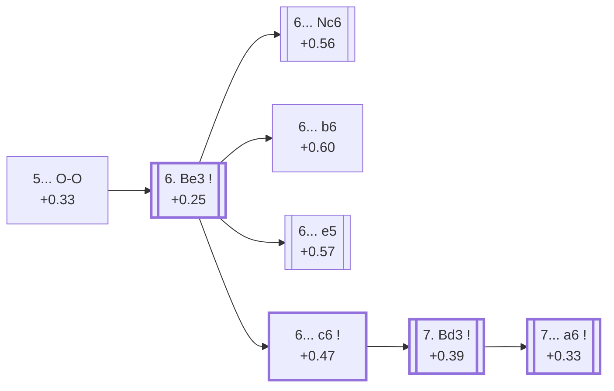

<a name="_TOP_"></a>

# E81 King's Indian Defence: Sämisch, 5... O-O <br> 1. d4 Nf6 2. c4 g6 3. Nc3 Bg7 4. e4 d6 5. f3 O-O #

Continues from [E80's own root](https://github.com/onclemarcel/chess_flashcards/blob/main/d4_openings/E80_Kings_Indian_Saemisch_Variation.md#_initial_move_), where **5... O-O** (90.7% masters) is close to automatic — `eco.md`'s own second entry in this range, the **Byrne Variation** (6. Be3 c6 7. Bd3 a6), is deep enough to stay on this same card, and is built out in full below.

### Overview

*Quick map of every move covered on this card — see the [shape key](https://github.com/onclemarcel/chess_flashcards/blob/main/start.md#content-diagram-optional) in start.md.*

<!-- content-diagram:start -->

<!-- content-diagram:end -->

<a name="_initial_move_"></a>

[](https://lichess.org/analysis/standard/rnbq1rk1/ppp1ppbp/3p1np1/8/2PPP3/2N2P2/PP4PP/R1BQKBNR_w_KQ_-_1_6)

*... 5... O-O — King's Indian Defence: Sämisch, 5...O-O*

```
rnbq1rk1/ppp1ppbp/3p1np1/8/2PPP3/2N2P2/PP4PP/R1BQKBNR w KQ - 1 6
```

|  | +0.33 |
| --- | --- |

<!-- lichess-stats:start fen="rnbq1rk1/ppp1ppbp/3p1np1/8/2PPP3/2N2P2/PP4PP/R1BQKBNR w KQ - 1 6" db="lichess,masters" speeds="bullet,blitz" ratings="1800,2000,2200,2500" moves="6" -->
| Move | Online | W/D/B | Masters | W/D/B | |
| :--- | ---: | :--- | ---: | :--- | :-- |
| Be3 | 2.3 M (76.8%) | ⬜⬜⬜⬜⬜🟫⬛⬛⬛⬛ 51/5/44 | 9.8 k (67.7%) | ⬜⬜⬜⬜🟫🟫🟫🟫⬛⬛ 36/38/25 |  |
| Bg5 | 280 k (9.2%) | ⬜⬜⬜⬜⬜🟫⬛⬛⬛⬛ 53/5/43 | 2.5 k (17.4%) | ⬜⬜⬜⬜🟫🟫🟫⬛⬛⬛ 40/34/26 |  |
| Nge2 | 216 k (7.1%) | ⬜⬜⬜⬜⬜🟫⬛⬛⬛⬛ 52/5/43 | 2.1 k (14.7%) | ⬜⬜⬜⬜🟫🟫🟫🟫⬛⬛ 41/37/22 |  |
| Bd3 | 164 k (5.4%) | ⬜⬜⬜⬜⬜⬛⬛⬛⬛⬛ 45/4/51 | 14 (0.1%) | — |  |
| g4 | 7.9 k (0.3%) | ⬜⬜⬜⬜⬜⬛⬛⬛⬛⬛ 47/3/49 | 0 | — | ⚠ |
| d5 | 7.7 k (0.3%) | ⬜⬜⬜⬜⬜⬛⬛⬛⬛⬛ 45/4/51 | 0 | — | ⚠ |
| Kf2 | 0 | — | 1 (0.0%) | — |  |
| Be2 | 0 | — | 1 (0.0%) | — |  |

*Online: bullet/blitz, 1800+ — 3.0 M games. Masters: 14 k games. [Open in the explorer](https://lichess.org/analysis/standard/rnbq1rk1/ppp1ppbp/3p1np1/8/2PPP3/2N2P2/PP4PP/R1BQKBNR_w_KQ_-_1_6#explorer) — updated 2026-09-07*
<!-- lichess-stats:end -->

### Candidate moves

* [**6. Be3**](#_Be3_) (+0.25, 67.7% masters): masters' clear main try — this whole batch's own trunk, see below.
* **6. Bg5** (+0.12, 17.4% masters) / **6. Nge2** (+0.22, 14.7% masters): real, significant secondaries with no code of their own in this range.

[*Back to TOP*](#_TOP_)

---

<a name="_Be3_"></a>

## 6. Be3

**6. Be3** develops the bishop to its most natural post before committing further, keeping Qd2/O-O-O plans flexible — masters' clear main try (67.7%) and the trunk for almost the whole rest of this batch, which forks four separate ways on Black's own 6th move.

[](https://lichess.org/analysis/standard/rnbq1rk1/ppp1ppbp/3p1np1/8/2PPP3/2N1BP2/PP4PP/R2QKBNR_b_KQ_-_2_6)

*... 6. Be3*

```
rnbq1rk1/ppp1ppbp/3p1np1/8/2PPP3/2N1BP2/PP4PP/R2QKBNR b KQ - 2 6
```

|  | +0.25 |
| --- | --- |

<!-- lichess-stats:start fen="rnbq1rk1/ppp1ppbp/3p1np1/8/2PPP3/2N1BP2/PP4PP/R2QKBNR b KQ - 2 6" db="lichess,masters" speeds="bullet,blitz" ratings="1800,2000,2200,2500" moves="7" -->
| Move | Online | W/D/B | Masters | W/D/B | |
| :--- | ---: | :--- | ---: | :--- | :-- |
| e5 | 599 k (23.1%) | ⬜⬜⬜⬜⬜🟫⬛⬛⬛⬛ 51/5/44 | 2.2 k (21.0%) | ⬜⬜⬜⬜🟫🟫🟫⬛⬛⬛ 43/32/25 |  |
| Nc6 | 500 k (19.3%) | ⬜⬜⬜⬜⬜⬛⬛⬛⬛⬛ 50/5/46 | 2.3 k (21.9%) | ⬜⬜⬜⬜🟫🟫🟫🟫⬛⬛ 39/35/25 |  |
| c5 | 488 k (18.8%) | ⬜⬜⬜⬜⬜⬛⬛⬛⬛⬛ 47/6/47 | 3.0 k (29.0%) | ⬜⬜⬜🟫🟫🟫🟫🟫⬛⬛ 28/48/24 |  |
| Nbd7 | 466 k (18.0%) | ⬜⬜⬜⬜⬜🟫⬛⬛⬛⬛ 52/4/44 | 812 (7.9%) | ⬜⬜⬜⬜🟫🟫🟫⬛⬛⬛ 39/34/27 |  |
| c6 | 212 k (8.2%) | ⬜⬜⬜⬜⬜🟫⬛⬛⬛⬛ 52/4/43 | 386 (3.7%) | ⬜⬜⬜⬜🟫🟫🟫⬛⬛⬛ 41/34/25 |  |
| a6 | 82 k (3.1%) | ⬜⬜⬜⬜⬜⬛⬛⬛⬛⬛ 49/5/46 | 1.1 k (10.6%) | ⬜⬜⬜🟫🟫🟫🟫⬛⬛⬛ 33/37/30 |  |
| b6 | 74 k (2.9%) | ⬜⬜⬜⬜⬜🟫⬛⬛⬛⬛ 53/5/43 | 507 (4.9%) | ⬜⬜⬜⬜🟫🟫🟫🟫⬛⬛ 41/35/24 |  |

*Online: bullet/blitz, 1800+ — 2.6 M games. Masters: 10 k games. [Open in the explorer](https://lichess.org/analysis/standard/rnbq1rk1/ppp1ppbp/3p1np1/8/2PPP3/2N1BP2/PP4PP/R2QKBNR_b_KQ_-_2_6#explorer) — updated 2026-09-07*
<!-- lichess-stats:end -->

**A genuine finding, worth stating plainly**: masters' *actual* plurality reply here is **6... c5** (29.0%) — an uncoded try, ahead of every one of the four moves that carry their own code in this range: **6... Nc6** (21.9%, → [E83](https://github.com/onclemarcel/chess_flashcards/blob/main/d4_openings/E83_Kings_Indian_Saemisch_Nc6.md)), **6... e5** (21.0%, → [E85](https://github.com/onclemarcel/chess_flashcards/blob/main/d4_openings/E85_Kings_Indian_Saemisch_Orthodox.md)), **6... b6** (4.9%, → [E82](https://github.com/onclemarcel/chess_flashcards/blob/main/d4_openings/E82_Kings_Indian_Saemisch_Double_Fianchetto.md)), and **6... c6** (only 3.7%, the Byrne Variation's own first move, built out below). A confirmed cross-check of the whole rest of `eco.md`: this exact "6... c5" reply carries no ECO code of its own anywhere in the Sämisch family — a real, significant secondary with no code of its own in this range, not a gap in this batch's own coverage.

### Candidate moves

* **6... c5** (+0.29, 29.0% masters): masters' actual plurality — a real, uncoded try with no code of its own in this range.
* [**6... Nc6**](https://github.com/onclemarcel/chess_flashcards/blob/main/d4_openings/E83_Kings_Indian_Saemisch_Nc6.md) (+0.56, 21.9% masters): its own code — [E83](https://github.com/onclemarcel/chess_flashcards/blob/main/d4_openings/E83_Kings_Indian_Saemisch_Nc6.md) onward.
* [**6... e5**](https://github.com/onclemarcel/chess_flashcards/blob/main/d4_openings/E85_Kings_Indian_Saemisch_Orthodox.md) (+0.57, 21.0% masters): its own code, the Orthodox Variation — [E85](https://github.com/onclemarcel/chess_flashcards/blob/main/d4_openings/E85_Kings_Indian_Saemisch_Orthodox.md) onward.
* [**6... c6**](#_c6_) (+0.47, 3.7% masters): the Byrne Variation — its own code, this card's own trunk, see below.
* [**6... b6**](https://github.com/onclemarcel/chess_flashcards/blob/main/d4_openings/E82_Kings_Indian_Saemisch_Double_Fianchetto.md) (+0.60, 4.9% masters): the double Fianchetto Variation — its own code, [E82](https://github.com/onclemarcel/chess_flashcards/blob/main/d4_openings/E82_Kings_Indian_Saemisch_Double_Fianchetto.md).

[*Back to 5... O-O*](#_initial_move_)
[*Back to TOP*](#_TOP_)

---

<a name="_c6_"></a>

## 6... c6 — towards the Byrne Variation

[](https://lichess.org/analysis/standard/rnbq1rk1/pp2ppbp/2pp1np1/8/2PPP3/2N1BP2/PP4PP/R2QKBNR_w_KQ_-_0_7)

*... 6... c6*

```
rnbq1rk1/pp2ppbp/2pp1np1/8/2PPP3/2N1BP2/PP4PP/R2QKBNR w KQ - 0 7
```

|  | +0.47 |
| --- | --- |

<!-- lichess-stats:start fen="rnbq1rk1/pp2ppbp/2pp1np1/8/2PPP3/2N1BP2/PP4PP/R2QKBNR w KQ - 0 7" db="lichess,masters" speeds="bullet,blitz" ratings="1800,2000,2200,2500" moves="6" -->
| Move | Online | W/D/B | Masters | W/D/B | |
| :--- | ---: | :--- | ---: | :--- | :-- |
| Qd2 | 189 k (58.9%) | ⬜⬜⬜⬜⬜🟫⬛⬛⬛⬛ 53/4/43 | 223 (48.0%) | ⬜⬜⬜⬜🟫🟫🟫⬛⬛⬛ 42/33/25 |  |
| Bd3 | 85 k (26.4%) | ⬜⬜⬜⬜⬜🟫⬛⬛⬛⬛ 52/5/43 | 178 (38.3%) | ⬜⬜⬜⬜🟫🟫🟫🟫⬛⬛ 42/37/21 |  |
| Nge2 | 39 k (12.2%) | ⬜⬜⬜⬜⬜🟫⬛⬛⬛⬛ 53/4/43 | 62 (13.3%) | ⬜⬜⬜🟫🟫🟫⬛⬛⬛⬛ 31/29/40 |  |
| g4 | 1.6 k (0.5%) | ⬜⬜⬜⬜⬜⬛⬛⬛⬛⬛ 49/4/47 | 0 | — | ⚠ |
| Be2 | 1.3 k (0.4%) | ⬜⬜⬜⬜⬜⬛⬛⬛⬛⬛ 48/4/48 | 0 | — | ⚠ |
| h4 | 1.2 k (0.4%) | ⬜⬜⬜⬜⬜⬛⬛⬛⬛⬛ 49/5/47 | 0 | — | ⚠ |
| Qc2 | 0 | — | 1 (0.2%) | — |  |
| d5 | 0 | — | 1 (0.2%) | — |  |

*Online: bullet/blitz, 1800+ — 321 k games. Masters: 465 games. [Open in the explorer](https://lichess.org/analysis/standard/rnbq1rk1/pp2ppbp/2pp1np1/8/2PPP3/2N1BP2/PP4PP/R2QKBNR_w_KQ_-_0_7#explorer) — updated 2026-09-07*
<!-- lichess-stats:end -->

**Another real, uncoded-preference finding**: at this fork, masters' own actual plurality is **7. Qd2** (48.0%), edging out **7. Bd3** (38.3%) — the move that defines the Byrne Variation itself — with **7. Nge2** (13.3%) further behind. Bd3 remains a real, significant secondary and this card's own named trunk.

### Candidate moves

* **7. Qd2** (48.0% masters): masters' actual plurality — a real, uncoded try with no code of its own in this range.
* [**7. Bd3**](#_Bd3_) (+0.39, 38.3% masters): the Byrne Variation's own defining move — see below.
* **7. Nge2** (13.3% masters): a real, minor secondary, uncoded here.

[*Back to 6. Be3*](#_Be3_)
[*Back to TOP*](#_TOP_)

---

<a name="_Bd3_"></a>

## 7. Bd3

[](https://lichess.org/analysis/standard/rnbq1rk1/pp2ppbp/2pp1np1/8/2PPP3/2NBBP2/PP4PP/R2QK1NR_b_KQ_-_1_7)

*... 7. Bd3*

```
rnbq1rk1/pp2ppbp/2pp1np1/8/2PPP3/2NBBP2/PP4PP/R2QK1NR b KQ - 1 7
```

|  | +0.39 |
| --- | --- |

<!-- lichess-stats:start fen="rnbq1rk1/pp2ppbp/2pp1np1/8/2PPP3/2NBBP2/PP4PP/R2QK1NR b KQ - 1 7" db="lichess,masters" speeds="bullet,blitz" ratings="1800,2000,2200,2500" moves="6" -->
| Move | Online | W/D/B | Masters | W/D/B | |
| :--- | ---: | :--- | ---: | :--- | :-- |
| Nbd7 | 33 k (31.9%) | ⬜⬜⬜⬜⬜🟫⬛⬛⬛⬛ 52/4/44 | 13 (7.3%) | — |  |
| a6 | 25 k (24.0%) | ⬜⬜⬜⬜⬜⬛⬛⬛⬛⬛ 49/5/46 | 93 (52.2%) | ⬜⬜⬜⬜🟫🟫🟫⬛⬛⬛ 39/35/26 |  |
| e5 | 19 k (18.1%) | ⬜⬜⬜⬜⬜🟫⬛⬛⬛⬛ 52/5/43 | 70 (39.3%) | ⬜⬜⬜⬜⬜🟫🟫🟫🟫⬛ 47/37/16 |  |
| Qc7 | 5.8 k (5.6%) | ⬜⬜⬜⬜⬜🟫⬛⬛⬛⬛ 54/4/42 | 0 | — | ⚠ |
| Re8 | 4.4 k (4.2%) | ⬜⬜⬜⬜⬜⬜⬛⬛⬛⬛ 55/3/42 | 0 | — | ⚠ |
| Qa5 | 3.1 k (3.0%) | ⬜⬜⬜⬜⬜⬛⬛⬛⬛⬛ 51/4/45 | 0 | — | ⚠ |
| Na6 | 0 | — | 1 (0.6%) | — |  |
| Nfd7 | 0 | — | 1 (0.6%) | — |  |

*Online: bullet/blitz, 1800+ — 103 k games. Masters: 178 games. [Open in the explorer](https://lichess.org/analysis/standard/rnbq1rk1/pp2ppbp/2pp1np1/8/2PPP3/2NBBP2/PP4PP/R2QK1NR_b_KQ_-_1_7#explorer) — updated 2026-09-07*
<!-- lichess-stats:end -->

**7... a6** is masters' clear main try here (52.2%), the move that gives the Byrne Variation its name; **7... e5** stays a real, significant secondary (39.3% masters).

### Candidate moves

* [**7... a6**](#_Byrne_) (52.2% masters): the Byrne Variation itself — see below.
* **7... e5** (39.3% masters): a real, significant secondary, uncoded here.

[*Back to 6... c6*](#_c6_)
[*Back to TOP*](#_TOP_)

---

<a name="_Byrne_"></a>

## 7... a6 — Byrne Variation

[](https://lichess.org/analysis/standard/rnbq1rk1/1p2ppbp/p1pp1np1/8/2PPP3/2NBBP2/PP4PP/R2QK1NR_w_KQ_-_0_8)

*... 7... a6 — King's Indian Defence: Sämisch, Byrne Variation*

```
rnbq1rk1/1p2ppbp/p1pp1np1/8/2PPP3/2NBBP2/PP4PP/R2QK1NR w KQ - 0 8
```

|  | +0.33 |
| --- | --- |

Live-tagged **King's Indian Defense: Sämisch Variation, Byrne Variation**, matching `eco.md`'s own name exactly — Black prepares ... b5 counterplay on the queenside while White's own plan (Qd2, O-O-O, g4/h4) is already well underway. This is the deepest node built on this card; not explored further here.

[*Back to 7. Bd3*](#_Bd3_)
[*Back to TOP*](#_TOP_)
