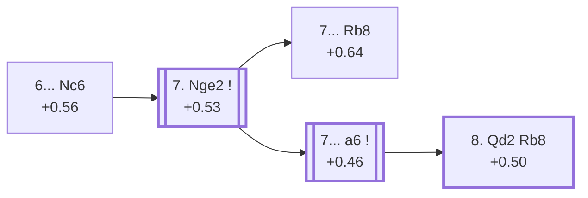

<a name="_TOP_"></a>

# E83 King's Indian Defence: Sämisch, 6... Nc6 <br> 1. d4 Nf6 2. c4 g6 3. Nc3 Bg7 4. e4 d6 5. f3 O-O 6. Be3 Nc6 #

Continues from [E81's own "6. Be3" node](https://github.com/onclemarcel/chess_flashcards/blob/main/d4_openings/E81_Kings_Indian_Saemisch_OO.md#_Be3_), where **6... Nc6** (21.9% masters) develops a piece toward e5/d4 rather than committing a pawn there yet — live-tagged **King's Indian Defense: Sämisch Variation, Yates Defense**, a name `eco.md`'s own bare "6...Nc6" label doesn't carry. `eco.md` packs three separate entries into this one code, all built out below: the bare root, the **Ruban Variation** (7. Nge2 Rb8), and the **Panno formation** (7. Nge2 a6), the last of which continues one code further into [E84](https://github.com/onclemarcel/chess_flashcards/blob/main/d4_openings/E84_Kings_Indian_Saemisch_Panno_Main_Line.md).

### Overview

*Quick map of every move covered on this card — see the [shape key](https://github.com/onclemarcel/chess_flashcards/blob/main/start.md#content-diagram-optional) in start.md.*

<!-- content-diagram:start -->

<!-- content-diagram:end -->

<a name="_initial_move_"></a>

[](https://lichess.org/analysis/standard/r1bq1rk1/ppp1ppbp/2np1np1/8/2PPP3/2N1BP2/PP4PP/R2QKBNR_w_KQ_-_3_7)

*... 6... Nc6 — King's Indian Defence: Sämisch, Yates Defense*

```
r1bq1rk1/ppp1ppbp/2np1np1/8/2PPP3/2N1BP2/PP4PP/R2QKBNR w KQ - 3 7
```

|  | +0.56 |
| --- | --- |

<!-- lichess-stats:start fen="r1bq1rk1/ppp1ppbp/2np1np1/8/2PPP3/2N1BP2/PP4PP/R2QKBNR w KQ - 3 7" db="lichess,masters" speeds="bullet,blitz" ratings="1800,2000,2200,2500" moves="6" -->
| Move | Online | W/D/B | Masters | W/D/B | |
| :--- | ---: | :--- | ---: | :--- | :-- |
| Qd2 | 262 k (47.4%) | ⬜⬜⬜⬜⬜⬛⬛⬛⬛⬛ 50/4/46 | 474 (20.6%) | ⬜⬜⬜⬜🟫🟫🟫⬛⬛⬛ 37/35/28 |  |
| Nge2 | 152 k (27.5%) | ⬜⬜⬜⬜⬜🟫⬛⬛⬛⬛ 52/5/43 | 1.8 k (77.7%) | ⬜⬜⬜⬜🟫🟫🟫🟫⬛⬛ 40/36/24 |  |
| Bd3 | 103 k (18.6%) | ⬜⬜⬜⬜⬜⬛⬛⬛⬛⬛ 49/4/46 | 28 (1.2%) | ⬜⬜🟫🟫🟫🟫⬛⬛⬛⬛ 25/36/39 |  |
| d5 | 16 k (2.9%) | ⬜⬜⬜⬜⬜⬛⬛⬛⬛⬛ 48/4/47 | 5 (0.2%) | — |  |
| a3 | 11 k (1.9%) | ⬜⬜⬜⬜🟫⬛⬛⬛⬛⬛ 44/4/53 | 0 | — | ⚠ |
| Be2 | 2.4 k (0.4%) | ⬜⬜⬜⬜⬜⬛⬛⬛⬛⬛ 43/3/53 | 0 | — | ⚠ |
| Qc2 | 0 | — | 2 (0.1%) | — |  |
| Rc1 | 0 | — | 2 (0.1%) | — |  |

*Online: bullet/blitz, 1800+ — 553 k games. Masters: 2.3 k games. [Open in the explorer](https://lichess.org/analysis/standard/r1bq1rk1/ppp1ppbp/2np1np1/8/2PPP3/2N1BP2/PP4PP/R2QKBNR_w_KQ_-_3_7#explorer) — updated 2026-09-14*
<!-- lichess-stats:end -->

### Candidate moves

* [**7. Nge2**](#_Nge2_) (+0.53, 77.7% masters): masters' overwhelming main try — see below, this card's own trunk.
* **7. Qd2** (47.4% online, 20.6% masters): a real, significant secondary with no code of its own in this range — despite carrying a larger online share than Nge2, it stays well behind at masters level.

[*Back to 6. Be3*](https://github.com/onclemarcel/chess_flashcards/blob/main/d4_openings/E81_Kings_Indian_Saemisch_OO.md#_Be3_)
[*Back to TOP*](#_TOP_)

---

<a name="_Nge2_"></a>

## 7. Nge2

[](https://lichess.org/analysis/standard/r1bq1rk1/ppp1ppbp/2np1np1/8/2PPP3/2N1BP2/PP2N1PP/R2QKB1R_b_KQ_-_4_7)

*... 7. Nge2*

```
r1bq1rk1/ppp1ppbp/2np1np1/8/2PPP3/2N1BP2/PP2N1PP/R2QKB1R b KQ - 4 7
```

|  | +0.53 |
| --- | --- |

<!-- lichess-stats:start fen="r1bq1rk1/ppp1ppbp/2np1np1/8/2PPP3/2N1BP2/PP2N1PP/R2QKB1R b KQ - 4 7" db="lichess,masters" speeds="bullet,blitz" ratings="1800,2000,2200,2500" moves="6" -->
| Move | Online | W/D/B | Masters | W/D/B | |
| :--- | ---: | :--- | ---: | :--- | :-- |
| e5 | 107 k (53.2%) | ⬜⬜⬜⬜⬜⬜⬛⬛⬛⬛ 55/4/41 | 67 (3.3%) | ⬜⬜⬜⬜⬜🟫🟫🟫⬛⬛ 49/30/21 |  |
| a6 | 72 k (35.9%) | ⬜⬜⬜⬜⬜⬛⬛⬛⬛⬛ 47/5/47 | 1.7 k (85.2%) | ⬜⬜⬜⬜🟫🟫🟫🟫⬛⬛ 41/36/23 |  |
| Re8 | 6.4 k (3.2%) | ⬜⬜⬜⬜⬜⬜⬛⬛⬛⬛ 56/4/41 | 25 (1.2%) | ⬜⬜⬜⬜⬜🟫🟫⬛⬛⬛ 48/24/28 |  |
| Nd7 | 4.9 k (2.4%) | ⬜⬜⬜⬜⬜⬜⬛⬛⬛⬛ 55/4/41 | 0 | — | ⚠ |
| Rb8 | 3.0 k (1.5%) | ⬜⬜⬜⬜⬜⬛⬛⬛⬛⬛ 47/6/47 | 183 (8.9%) | ⬜⬜⬜⬜🟫🟫🟫⬛⬛⬛ 44/31/26 |  |
| Bd7 | 2.2 k (1.1%) | ⬜⬜⬜⬜⬜🟫⬛⬛⬛⬛ 54/4/42 | 9 (0.4%) | — |  |
| a5 | 0 | — | 10 (0.5%) | — |  |

*Online: bullet/blitz, 1800+ — 201 k games. Masters: 2.0 k games. [Open in the explorer](https://lichess.org/analysis/standard/r1bq1rk1/ppp1ppbp/2np1np1/8/2PPP3/2N1BP2/PP2N1PP/R2QKB1R_b_KQ_-_4_7#explorer) — updated 2026-09-14*
<!-- lichess-stats:end -->

**A genuine, striking online/masters gap**: masters' clear main try is **7... a6** (85.2%, the Panno formation), yet **7... e5** — a completely uncoded try here — is actually *more* common online (53.2%) than a6 itself (35.9%). Stockfish sees no red flag in either try, so this is a repertoire-familiarity gap rather than a trap: online players reach for the thematic central break, while masters overwhelmingly prefer the flexible queenside plan first. **7... Rb8** (8.9% masters), the Ruban Variation, is a real, distinct secondary carrying its own code.

### Candidate moves

* [**7... a6**](#_Panno_) (+0.46, 85.2% masters): the Panno formation — masters' overwhelming main try, see below.
* **7... e5** (3.3% masters, 53.2% online): a real, uncoded try — actually more common online than the named main line.
* [**7... Rb8**](#_Ruban_) (+0.64, 8.9% masters): the Ruban Variation — see below.

[*Back to 6... Nc6*](#_initial_move_)
[*Back to TOP*](#_TOP_)

---

<a name="_Ruban_"></a>

## 7... Rb8 — Ruban Variation

[](https://lichess.org/analysis/standard/1rbq1rk1/ppp1ppbp/2np1np1/8/2PPP3/2N1BP2/PP2N1PP/R2QKB1R_w_KQ_-_5_8)

*... 7... Rb8 — King's Indian Defence: Sämisch, Ruban Variation*

```
1rbq1rk1/ppp1ppbp/2np1np1/8/2PPP3/2N1BP2/PP2N1PP/R2QKB1R w KQ - 5 8
```

|  | +0.64 |
| --- | --- |

Live-tagged **King's Indian Defense: Sämisch Variation, Ruban Variation**, matching `eco.md`'s own name exactly — Black prepares an immediate ... b5 pawn break without the waiting move ... a6 first. A real, distinct secondary (8.9% masters at the fork above); not built further here.

[*Back to 7. Nge2*](#_Nge2_)
[*Back to TOP*](#_TOP_)

---

<a name="_Panno_"></a>

## 7... a6 — Panno formation

[](https://lichess.org/analysis/standard/r1bq1rk1/1pp1ppbp/p1np1np1/8/2PPP3/2N1BP2/PP2N1PP/R2QKB1R_w_KQ_-_0_8)

*... 7... a6 — King's Indian Defence: Sämisch, Panno formation*

```
r1bq1rk1/1pp1ppbp/p1np1np1/8/2PPP3/2N1BP2/PP2N1PP/R2QKB1R w KQ - 0 8
```

|  | +0.46 |
| --- | --- |

<!-- lichess-stats:start fen="r1bq1rk1/1pp1ppbp/p1np1np1/8/2PPP3/2N1BP2/PP2N1PP/R2QKB1R w KQ - 0 8" db="lichess,masters" speeds="bullet,blitz" ratings="1800,2000,2200,2500" moves="6" -->
| Move | Online | W/D/B | Masters | W/D/B | |
| :--- | ---: | :--- | ---: | :--- | :-- |
| Qd2 | 62 k (78.9%) | ⬜⬜⬜⬜⬜⬛⬛⬛⬛⬛ 48/5/47 | 1.7 k (88.2%) | ⬜⬜⬜⬜🟫🟫🟫🟫⬛⬛ 41/36/24 |  |
| d5 | 2.8 k (3.5%) | ⬜⬜⬜⬜⬜⬛⬛⬛⬛⬛ 46/6/49 | 0 | — | ⚠ |
| Rc1 | 2.7 k (3.5%) | ⬜⬜⬜⬜⬜🟫⬛⬛⬛⬛ 50/6/44 | 23 (1.2%) | ⬜⬜⬜⬜⬜⬜🟫🟫⬛⬛ 57/22/22 |  |
| g4 | 2.2 k (2.9%) | ⬜⬜⬜⬜⬜⬛⬛⬛⬛⬛ 44/4/52 | 0 | — | ⚠ |
| Nc1 | 2.1 k (2.7%) | ⬜⬜⬜⬜⬜⬛⬛⬛⬛⬛ 48/5/46 | 64 (3.3%) | ⬜⬜⬜⬜🟫🟫🟫🟫⬛⬛ 42/39/19 |  |
| a3 | 1.5 k (1.9%) | ⬜⬜⬜⬜⬜🟫⬛⬛⬛⬛ 50/5/44 | 47 (2.4%) | ⬜⬜⬜⬜🟫🟫🟫⬛⬛⬛ 34/34/32 |  |
| h4 | 0 | — | 28 (1.4%) | ⬜⬜⬜⬜⬜🟫🟫🟫⬛⬛ 46/36/18 |  |
| Rb1 | 0 | — | 25 (1.3%) | ⬜⬜⬜⬜⬜🟫🟫⬛⬛⬛ 48/20/32 |  |

*Online: bullet/blitz, 1800+ — 79 k games. Masters: 2.0 k games. [Open in the explorer](https://lichess.org/analysis/standard/r1bq1rk1/1pp1ppbp/p1np1np1/8/2PPP3/2N1BP2/PP2N1PP/R2QKB1R_w_KQ_-_0_8#explorer) — updated 2026-09-14*
<!-- lichess-stats:end -->

Live-tagged **King's Indian Defense: Sämisch Variation, Panno Formation**, matching `eco.md`'s own name closely — named after Argentine grandmaster Oscar Panno, a name reused elsewhere in this repo's own [E63 Fianchetto Variation card](https://github.com/onclemarcel/chess_flashcards/blob/main/d4_openings/E63_Kings_Indian_Fianchetto_Panno.md) for an entirely unrelated node of the King's Indian tree. **8. Qd2** is overwhelming here (88.2% masters), and Black's own reply, **8... Rb8** (78.8% masters), completes the position `eco.md` names the **Panno Main line** — its own code, [E84](https://github.com/onclemarcel/chess_flashcards/blob/main/d4_openings/E84_Kings_Indian_Saemisch_Panno_Main_Line.md).

### Candidate moves

* [**8. Qd2 Rb8**](https://github.com/onclemarcel/chess_flashcards/blob/main/d4_openings/E84_Kings_Indian_Saemisch_Panno_Main_Line.md) (+0.50, 88.2% masters into 78.8% masters): the Panno Main line — its own code, [E84](https://github.com/onclemarcel/chess_flashcards/blob/main/d4_openings/E84_Kings_Indian_Saemisch_Panno_Main_Line.md) onward.

[*Back to 7. Nge2*](#_Nge2_)
[*Back to TOP*](#_TOP_)
