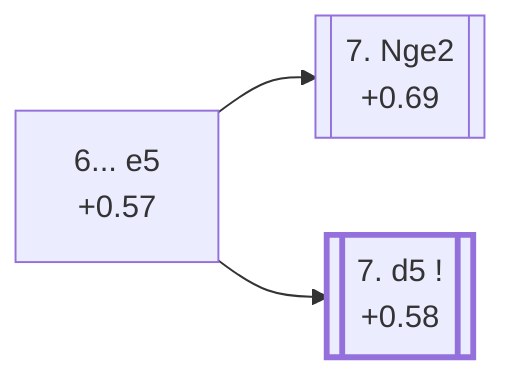

<a name="_TOP_"></a>

# E85 King's Indian Defence: Sämisch, Orthodox Variation <br> 1. d4 Nf6 2. c4 g6 3. Nc3 Bg7 4. e4 d6 5. f3 O-O 6. Be3 e5 #

Continues from [E81's own "6. Be3" node](https://github.com/onclemarcel/chess_flashcards/blob/main/d4_openings/E81_Kings_Indian_Saemisch_OO.md#_Be3_), where **6... e5** (21.0% masters) is the deepest and most important branch of the whole Sämisch tree — striking straight at White's centre in the spirit of the King's Indian's own classical plans. Live-tagged **King's Indian Defense: Sämisch Variation, Orthodox Variation**, matching `eco.md`'s own name exactly. White's own 7th move genuinely forks two ways here, both real siblings hanging directly off this node (confirmed via `apply_san.py`, not a nested continuation of one another): [E86](https://github.com/onclemarcel/chess_flashcards/blob/main/d4_openings/E86_Kings_Indian_Saemisch_Orthodox_Nge2.md) (7. Nge2) and [E87](https://github.com/onclemarcel/chess_flashcards/blob/main/d4_openings/E87_Kings_Indian_Saemisch_Orthodox_d5.md) (7. d5), the latter this whole batch's own deepest and sharpest sub-tree.

### Overview

*Quick map of every move covered on this card — see the [shape key](https://github.com/onclemarcel/chess_flashcards/blob/main/start.md#content-diagram-optional) in start.md.*

<!-- content-diagram:start -->

<!-- content-diagram:end -->

<a name="_initial_move_"></a>

[](https://lichess.org/analysis/standard/rnbq1rk1/ppp2pbp/3p1np1/4p3/2PPP3/2N1BP2/PP4PP/R2QKBNR_w_KQ_e6_0_7)

*... 6... e5 — King's Indian Defence: Sämisch, Orthodox Variation*

```
rnbq1rk1/ppp2pbp/3p1np1/4p3/2PPP3/2N1BP2/PP4PP/R2QKBNR w KQ e6 0 7
```

|  | +0.57 |
| --- | --- |

<!-- lichess-stats:start fen="rnbq1rk1/ppp2pbp/3p1np1/4p3/2PPP3/2N1BP2/PP4PP/R2QKBNR w KQ e6 0 7" db="lichess,masters" speeds="bullet,blitz" ratings="1800,2000,2200,2500" moves="6" -->
| Move | Online | W/D/B | Masters | W/D/B | |
| :--- | ---: | :--- | ---: | :--- | :-- |
| d5 | 331 k (54.9%) | ⬜⬜⬜⬜⬜⬛⬛⬛⬛⬛ 51/5/45 | 1.3 k (59.7%) | ⬜⬜⬜⬜🟫🟫🟫⬛⬛⬛ 44/32/24 |  |
| Nge2 | 181 k (30.0%) | ⬜⬜⬜⬜⬜🟫⬛⬛⬛⬛ 54/5/41 | 848 (39.1%) | ⬜⬜⬜⬜🟫🟫🟫⬛⬛⬛ 43/31/25 |  |
| Qd2 | 45 k (7.4%) | ⬜⬜⬜⬜⬜⬛⬛⬛⬛⬛ 49/4/46 | 2 (0.1%) | — | ⚠ |
| Bd3 | 25 k (4.2%) | ⬜⬜⬜⬜⬜⬛⬛⬛⬛⬛ 50/5/45 | 0 | — | ⚠ |
| dxe5 | 19 k (3.1%) | ⬜⬜⬜⬜⬜🟫⬛⬛⬛⬛ 49/9/42 | 24 (1.1%) | ⬜🟫🟫🟫🟫🟫⬛⬛⬛⬛ 4/54/42 |  |
| Be2 | 861 (0.1%) | ⬜⬜⬜⬜🟫⬛⬛⬛⬛⬛ 44/4/51 | 0 | — | ⚠ |

*Online: bullet/blitz, 1800+ — 603 k games. Masters: 2.2 k games. [Open in the explorer](https://lichess.org/analysis/standard/rnbq1rk1/ppp2pbp/3p1np1/4p3/2PPP3/2N1BP2/PP4PP/R2QKBNR_w_KQ_e6_0_7#explorer) — updated 2026-09-07*
<!-- lichess-stats:end -->

Both real tries are true siblings directly off this node, not one nested under the other: **7. d5** is masters' clear main try (59.7%, closing the centre at once and gaining space), narrowly ahead of **7. Nge2** (39.1%, developing first and keeping the tension). Neither is a rare curiosity — both carry their own ECO code.

### Candidate moves

* [**7. d5**](https://github.com/onclemarcel/chess_flashcards/blob/main/d4_openings/E87_Kings_Indian_Saemisch_Orthodox_d5.md) (+0.58, 59.7% masters): masters' main try — its own code, [E87](https://github.com/onclemarcel/chess_flashcards/blob/main/d4_openings/E87_Kings_Indian_Saemisch_Orthodox_d5.md) onward, this whole batch's own deepest sub-tree.
* [**7. Nge2**](https://github.com/onclemarcel/chess_flashcards/blob/main/d4_openings/E86_Kings_Indian_Saemisch_Orthodox_Nge2.md) (+0.69, 39.1% masters): a real, significant secondary — its own code, [E86](https://github.com/onclemarcel/chess_flashcards/blob/main/d4_openings/E86_Kings_Indian_Saemisch_Orthodox_Nge2.md).

[*Back to 6. Be3*](https://github.com/onclemarcel/chess_flashcards/blob/main/d4_openings/E81_Kings_Indian_Saemisch_OO.md#_Be3_)
[*Back to TOP*](#_TOP_)
