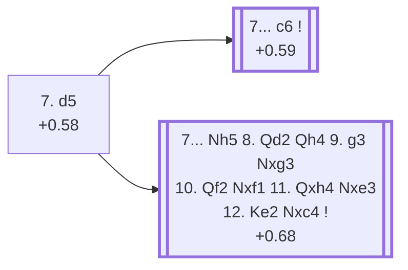

<a name="_TOP_"></a>

# E87 King's Indian Defence: Sämisch, Orthodox, 7. d5 <br> 1. d4 Nf6 2. c4 g6 3. Nc3 Bg7 4. e4 d6 5. f3 O-O 6. Be3 e5 7. d5 #

Continues from [E85's own root](https://github.com/onclemarcel/chess_flashcards/blob/main/d4_openings/E85_Kings_Indian_Saemisch_Orthodox.md#_initial_move_), where **7. d5** (59.7% masters) closes the centre at once, gaining space and inviting the sharpest lines in this whole batch. `eco.md` packs two entries into this code: the bare root (live-tagged **King's Indian Defense: Sämisch Variation, Closed Variation**) and the **Bronstein Variation** — a genuinely different kind of "named line" than almost anything else built across this whole sweep: not a branch point, but one long, forced, tactical sequence (7... Nh5 8. Qd2 Qh4 9. g3 Nxg3 10. Qf2 Nxf1 11. Qxh4 Nxe3 12. Ke2 Nxc4), given full, careful treatment below rather than flattened into a single bullet.

### Overview

*Quick map of every move covered on this card — see the [shape key](https://github.com/onclemarcel/chess_flashcards/blob/main/start.md#content-diagram-optional) in start.md.*

<!-- content-diagram:start -->

<!-- content-diagram:end -->

<a name="_initial_move_"></a>

[](https://lichess.org/analysis/standard/rnbq1rk1/ppp2pbp/3p1np1/3Pp3/2P1P3/2N1BP2/PP4PP/R2QKBNR_b_KQ_-_0_7)

*... 7. d5 — King's Indian Defence: Sämisch, Orthodox, Closed Variation*

```
rnbq1rk1/ppp2pbp/3p1np1/3Pp3/2P1P3/2N1BP2/PP4PP/R2QKBNR b KQ - 0 7
```

|  | +0.58 |
| --- | --- |

<!-- lichess-stats:start fen="rnbq1rk1/ppp2pbp/3p1np1/3Pp3/2P1P3/2N1BP2/PP4PP/R2QKBNR b KQ - 0 7" db="lichess,masters" speeds="bullet,blitz" ratings="1800,2000,2200,2500" moves="6" -->
| Move | Online | W/D/B | Masters | W/D/B | |
| :--- | ---: | :--- | ---: | :--- | :-- |
| c6 | 104 k (30.2%) | ⬜⬜⬜⬜⬜🟫⬛⬛⬛⬛ 51/5/44 | 678 (51.8%) | ⬜⬜⬜⬜🟫🟫🟫🟫⬛⬛ 43/34/23 |  |
| Nbd7 | 63 k (18.4%) | ⬜⬜⬜⬜⬜🟫⬛⬛⬛⬛ 52/4/44 | 15 (1.1%) | — |  |
| Nh5 | 54 k (15.8%) | ⬜⬜⬜⬜⬜⬛⬛⬛⬛⬛ 47/6/47 | 514 (39.3%) | ⬜⬜⬜⬜🟫🟫🟫⬛⬛⬛ 42/31/27 |  |
| a5 | 47 k (13.6%) | ⬜⬜⬜⬜⬜⬛⬛⬛⬛⬛ 49/5/46 | 16 (1.2%) | — |  |
| c5 | 24 k (7.0%) | ⬜⬜⬜⬜⬜🟫⬛⬛⬛⬛ 53/4/43 | 42 (3.2%) | ⬜⬜⬜⬜⬜⬜🟫🟫🟫⬛ 57/29/14 |  |
| Ne8 | 20 k (5.7%) | ⬜⬜⬜⬜⬜🟫⬛⬛⬛⬛ 51/5/44 | 23 (1.8%) | ⬜⬜⬜⬜⬜🟫🟫🟫⬛⬛ 52/30/17 |  |

*Online: bullet/blitz, 1800+ — 344 k games. Masters: 1.3 k games. [Open in the explorer](https://lichess.org/analysis/standard/rnbq1rk1/ppp2pbp/3p1np1/3Pp3/2P1P3/2N1BP2/PP4PP/R2QKBNR_b_KQ_-_0_7#explorer) — updated 2026-09-14*
<!-- lichess-stats:end -->

Both real replies here carry their own code: **7... c6** is masters' clear main try (51.8%), continuing this whole batch's own deepest positional line into [E88](https://github.com/onclemarcel/chess_flashcards/blob/main/d4_openings/E88_Kings_Indian_Saemisch_Orthodox_c6.md), while **7... Nh5** (39.3% masters) is the Bronstein Variation, built out in full below.

### Candidate moves

* [**7... c6**](https://github.com/onclemarcel/chess_flashcards/blob/main/d4_openings/E88_Kings_Indian_Saemisch_Orthodox_c6.md) (+0.59, 51.8% masters): masters' main try — its own code, [E88](https://github.com/onclemarcel/chess_flashcards/blob/main/d4_openings/E88_Kings_Indian_Saemisch_Orthodox_c6.md) onward.
* [**7... Nh5**](#_Bronstein_) (39.3% masters): the Bronstein Variation — a forced tactical sequence, see below.

[*Back to 6... e5*](https://github.com/onclemarcel/chess_flashcards/blob/main/d4_openings/E85_Kings_Indian_Saemisch_Orthodox.md#_initial_move_)
[*Back to TOP*](#_TOP_)

---

<a name="_Bronstein_"></a>

## 7... Nh5 8. Qd2 Qh4 9. g3 Nxg3 10. Qf2 Nxf1 11. Qxh4 Nxe3 12. Ke2 Nxc4 — Bronstein Variation (+0.68)

Unlike every other named line in this batch, the Bronstein Variation isn't a branch point at all — it's one long, essentially forced tactical sequence ending at +0.68, worth walking through move by move rather than flattening into a single bullet:

* **7... Nh5** offers the knight a route to g3 rather than retreating it; **8. Qd2** develops naturally, guarding e3 and preparing O-O-O.
* **8... Qh4** (check-adjacent, pinning nothing but eyeing g3/f2) and **9. g3** attacks the queen — but instead of retreating it, Black plays **9... Nxg3**, removing the attacker while forking White's rook on f1 (and h1) with the knight now on g3. Stockfish's eval actually *rises* for White here, to +0.89 — the piece-grabbing spree does not favour Black.
* **10. Qf2** attacks the knight on g3 directly; Black plays **10... Nxf1**, cashing in the fork for the exchange rather than retreating.
* **11. Qxh4** — the point of White's 10th move: with the g3-knight gone, Black's queen on h4 was undefended all along, and White simply wins it. **11... Nxe3** continues the rampage, the wandering knight now grabbing the bishop as well (eval peaks at +1.06 for White here, the sequence's high point).
* **12. Ke2** attacks the knight on e3 with the king itself; **12... Nxc4** escapes with one more pawn.

[](https://lichess.org/analysis/standard/rnb2rk1/ppp2pbp/3p2p1/3Pp3/2n1P2Q/2N2P2/PP2K2P/R5NR_w_-_-_0_13)

*... 12... Nxc4 — King's Indian Defence: Sämisch, Orthodox, Bronstein Variation*

```
rnb2rk1/ppp2pbp/3p2p1/3Pp3/2n1P2Q/2N2P2/PP2K2P/R5NR w - - 0 13
```

|  | +0.68 |
| --- | --- |

By the final position, Black has traded the queen for a rook, bishop, and two pawns — on paper a small material edge for Black (about 10 points of material against 9), but Stockfish never once favours Black across the whole sequence: the eval stays at or above White's own starting +0.58 at every single step, peaking at +1.06 right after 11... Nxe3 before settling to +0.68 once the dust clears. White's queen and remaining pieces stay active, the black king's own defenders are scattered, and the wandering c4-knight is itself a target rather than a trophy — the Bronstein Variation is a real, sound try for Black (masters play it 39.3% of the time at the fork above) but not objectively better, despite superficially winning "more" material. Not explored further past this position.

[*Back to 7. d5*](#_initial_move_)
[*Back to TOP*](#_TOP_)
