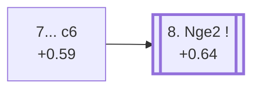

<a name="_TOP_"></a>

# E88 King's Indian Defence: Sämisch, Orthodox, 7. d5 c6 <br> 1. d4 Nf6 2. c4 g6 3. Nc3 Bg7 4. e4 d6 5. f3 O-O 6. Be3 e5 7. d5 c6 #

Continues from [E87's own root](https://github.com/onclemarcel/chess_flashcards/blob/main/d4_openings/E87_Kings_Indian_Saemisch_Orthodox_d5.md#_initial_move_), where **7... c6** (51.8% masters) strikes at White's own d5-pawn at once, the positional heart of this whole batch's deepest sub-tree.

### Overview

*Quick map of every move covered on this card — see the [shape key](https://github.com/onclemarcel/chess_flashcards/blob/main/start.md#content-diagram-optional) in start.md.*

<!-- content-diagram:start -->

<!-- content-diagram:end -->

<a name="_initial_move_"></a>

[](https://lichess.org/analysis/standard/rnbq1rk1/pp3pbp/2pp1np1/3Pp3/2P1P3/2N1BP2/PP4PP/R2QKBNR_w_KQ_-_0_8)

*... 7... c6 — King's Indian Defence: Sämisch, Orthodox, Closed Variation*

```
rnbq1rk1/pp3pbp/2pp1np1/3Pp3/2P1P3/2N1BP2/PP4PP/R2QKBNR w KQ - 0 8
```

|  | +0.59 |
| --- | --- |

<!-- lichess-stats:start fen="rnbq1rk1/pp3pbp/2pp1np1/3Pp3/2P1P3/2N1BP2/PP4PP/R2QKBNR w KQ - 0 8" db="lichess,masters" speeds="bullet,blitz" ratings="1800,2000,2200,2500" moves="6" -->
| Move | Online | W/D/B | Masters | W/D/B | |
| :--- | ---: | :--- | ---: | :--- | :-- |
| Qd2 | 58 k (55.1%) | ⬜⬜⬜⬜⬜🟫⬛⬛⬛⬛ 51/4/44 | 288 (42.1%) | ⬜⬜⬜⬜⬜🟫🟫🟫⬛⬛ 44/34/22 |  |
| Bd3 | 31 k (29.7%) | ⬜⬜⬜⬜⬜🟫⬛⬛⬛⬛ 52/5/43 | 367 (53.7%) | ⬜⬜⬜⬜🟫🟫🟫🟫⬛⬛ 42/34/24 |  |
| Nge2 | 7.5 k (7.1%) | ⬜⬜⬜⬜⬜🟫⬛⬛⬛⬛ 53/4/43 | 23 (3.4%) | ⬜⬜⬜⬜🟫🟫🟫⬛⬛⬛ 39/30/30 |  |
| dxc6 | 4.3 k (4.1%) | ⬜⬜⬜⬜⬜🟫⬛⬛⬛⬛ 51/5/44 | 2 (0.3%) | — | ⚠ |
| g4 | 1.6 k (1.5%) | ⬜⬜⬜⬜⬜🟫⬛⬛⬛⬛ 51/6/43 | 3 (0.4%) | — | ⚠ |
| b4 | 558 (0.5%) | ⬜⬜⬜⬜⬜⬛⬛⬛⬛⬛ 48/3/48 | 0 | — | ⚠ |
| h4 | 0 | — | 1 (0.1%) | — |  |

*Online: bullet/blitz, 1800+ — 106 k games. Masters: 684 games. [Open in the explorer](https://lichess.org/analysis/standard/rnbq1rk1/pp3pbp/2pp1np1/3Pp3/2P1P3/2N1BP2/PP4PP/R2QKBNR_w_KQ_-_0_8#explorer) — updated 2026-09-15*
<!-- lichess-stats:end -->

**A genuine, striking finding**: `eco.md`'s own named continuation from this exact position — **8. Nge2**, the move that leads into [E89](https://github.com/onclemarcel/chess_flashcards/blob/main/d4_openings/E89_Kings_Indian_Saemisch_Orthodox_Main_Line.md)'s own **Orthodox Main line** — is actually masters' *least* popular of the three real tries here, a mere **3.4%**. **8. Bd3** (53.7%) and **8. Qd2** (42.1%) are both far more common in practice, and neither carries a code of its own in this range. This is the same "coded line trails uncoded/less-popular rivals" pattern this project has flagged repeatedly elsewhere: the historically-named main line is not the same thing as the practically-most-played one.

### Candidate moves

* **8. Bd3** (53.7% masters): masters' actual most common try — a real, significant secondary with no code of its own in this range.
* **8. Qd2** (42.1% masters): a close second, likewise uncoded here.
* [**8. Nge2**](#_Nge2_) (+0.64, 3.4% masters): `eco.md`'s own named continuation, despite being the rarest of the three tries — see below, leading to [E89](https://github.com/onclemarcel/chess_flashcards/blob/main/d4_openings/E89_Kings_Indian_Saemisch_Orthodox_Main_Line.md).

[*Back to 7. d5*](https://github.com/onclemarcel/chess_flashcards/blob/main/d4_openings/E87_Kings_Indian_Saemisch_Orthodox_d5.md#_initial_move_)
[*Back to TOP*](#_TOP_)

---

<a name="_Nge2_"></a>

## 8. Nge2

[](https://lichess.org/analysis/standard/rnbq1rk1/pp3pbp/2pp1np1/3Pp3/2P1P3/2N1BP2/PP2N1PP/R2QKB1R_b_KQ_-_1_8)

*... 8. Nge2*

```
rnbq1rk1/pp3pbp/2pp1np1/3Pp3/2P1P3/2N1BP2/PP2N1PP/R2QKB1R b KQ - 1 8
```

|  | +0.64 |
| --- | --- |

<!-- lichess-stats:start fen="rnbq1rk1/pp3pbp/2pp1np1/3Pp3/2P1P3/2N1BP2/PP2N1PP/R2QKB1R b KQ - 1 8" db="lichess,masters" speeds="bullet,blitz" ratings="1800,2000,2200,2500" moves="6" -->
| Move | Online | W/D/B | Masters | W/D/B | |
| :--- | ---: | :--- | ---: | :--- | :-- |
| cxd5 | 12 k (68.3%) | ⬜⬜⬜⬜⬜🟫⬛⬛⬛⬛ 52/5/43 | 88 (84.6%) | ⬜⬜⬜🟫🟫🟫🟫⬛⬛⬛ 33/35/32 |  |
| c5 | 1.5 k (8.8%) | ⬜⬜⬜⬜⬜⬜⬛⬛⬛⬛ 57/3/40 | 2 (1.9%) | — | ⚠ |
| a6 | 1.1 k (6.6%) | ⬜⬜⬜⬜⬜⬛⬛⬛⬛⬛ 49/4/47 | 8 (7.7%) | — |  |
| Nbd7 | 580 (3.4%) | ⬜⬜⬜⬜⬜⬜⬛⬛⬛⬛ 55/4/41 | 0 | — | ⚠ |
| b5 | 338 (2.0%) | ⬜⬜⬜⬜⬜⬜⬛⬛⬛⬛ 58/5/37 | 0 | — | ⚠ |
| a5 | 309 (1.8%) | ⬜⬜⬜⬜⬜⬜⬛⬛⬛⬛ 58/3/39 | 2 (1.9%) | — | ⚠ |
| Na6 | 0 | — | 3 (2.9%) | — |  |
| Ne8 | 0 | — | 1 (1.0%) | — |  |

*Online: bullet/blitz, 1800+ — 17 k games. Masters: 104 games. [Open in the explorer](https://lichess.org/analysis/standard/rnbq1rk1/pp3pbp/2pp1np1/3Pp3/2P1P3/2N1BP2/PP2N1PP/R2QKB1R_b_KQ_-_1_8#explorer) — updated 2026-09-15*
<!-- lichess-stats:end -->

Once **8. Nge2** is actually played, **8... cxd5** is close to forced (84.6% masters) — the move that reaches [E89](https://github.com/onclemarcel/chess_flashcards/blob/main/d4_openings/E89_Kings_Indian_Saemisch_Orthodox_Main_Line.md)'s own **Orthodox Main line**, the deepest node in this whole batch.

### Candidate moves

* [**8... cxd5**](https://github.com/onclemarcel/chess_flashcards/blob/main/d4_openings/E89_Kings_Indian_Saemisch_Orthodox_Main_Line.md) (+0.62, 84.6% masters): close to forced — its own code, [E89](https://github.com/onclemarcel/chess_flashcards/blob/main/d4_openings/E89_Kings_Indian_Saemisch_Orthodox_Main_Line.md) onward.

[*Back to 7... c6*](#_initial_move_)
[*Back to TOP*](#_TOP_)
