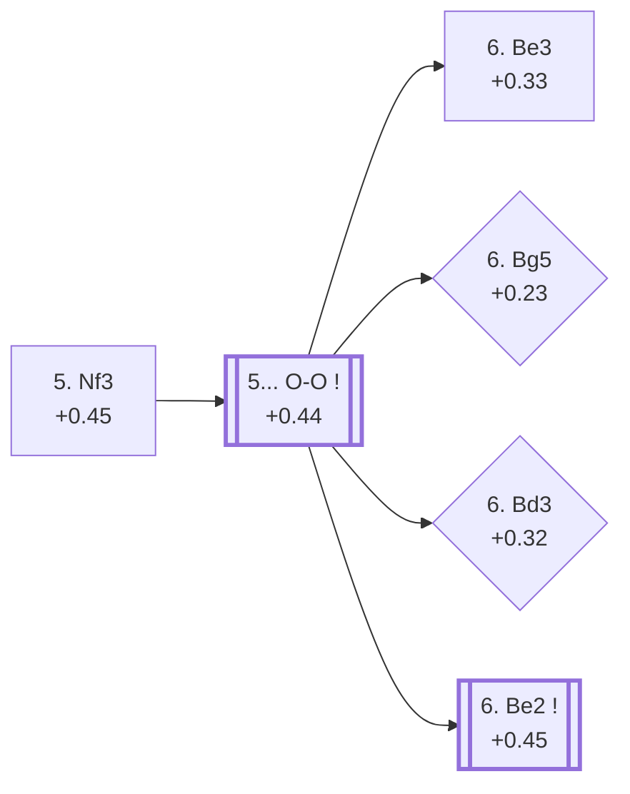

<a name="_TOP_"></a>

# E90 King's Indian Defence: 5. Nf3 <br> 1. d4 Nf6 2. c4 g6 3. Nc3 Bg7 4. e4 d6 5. Nf3 #

Continues from [E70's own "4... d6" node](https://github.com/onclemarcel/chess_flashcards/blob/main/d4_openings/E70_Kings_Indian.md#_d6_), and completes [E70's own "5. Nf3" bullet](https://github.com/onclemarcel/chess_flashcards/blob/main/d4_openings/E70_Kings_Indian.md#_d6_) — which correctly identified this move as leading "toward the Classical/Mar del Plata systems" but only ever linked to its own on-page anchor, never out to a real code. **5. Nf3** (+0.45, 38.1% masters at E70's own fork) is White's most flexible developing move, keeping the option of Be2, Be3, Bg5, or even a delayed Sämisch open. This is that backlog, built out in full: E90 opens the single largest ECO-code chain in this whole repository — ten unbroken codes (E90-E99) covering 22 named entries, running through the entire `5. Nf3 O-O 6. Be2` main trunk to the Petrosian/Keres tactical sequence and, at its deepest, the Aronin-Taimanov/Mar del Plata Variation, arguably the single most famous structure in the whole King's Indian.

Live-tagged **King's Indian Defense: Normal Variation, Rare Defenses** at this exact pre-castling node — Lichess doesn't give the bare `5. Nf3` position its own name (almost every game continues 5... O-O immediately), so it borrows E70's own "Normal Variation" label with a "Rare Defenses" qualifier for the sliver of games that don't. `eco.md`'s own plain "King's Indian Defence, 5.Nf3" is used as this card's title instead, matching the source-of-truth convention used throughout this repo.

### Overview

*Quick map of every move covered on this card — see the [shape key](https://github.com/onclemarcel/chess_flashcards/blob/main/start.md#content-diagram-optional) in start.md.*

<!-- content-diagram:start -->

<!-- content-diagram:end -->

<a name="_initial_move_"></a>

[](https://lichess.org/analysis/standard/rnbqk2r/ppp1ppbp/3p1np1/8/2PPP3/2N2N2/PP3PPP/R1BQKB1R_b_KQkq_-_1_5)

*... 5. Nf3 — King's Indian Defence, 5.Nf3*

```
rnbqk2r/ppp1ppbp/3p1np1/8/2PPP3/2N2N2/PP3PPP/R1BQKB1R b KQkq - 1 5
```

<!-- lichess-stats:start fen="rnbqk2r/ppp1ppbp/3p1np1/8/2PPP3/2N2N2/PP3PPP/R1BQKB1R b KQkq - 1 5" db="lichess,masters" speeds="bullet,blitz" ratings="1800,2000,2200,2500" moves="6" -->
| Move | Online | W/D/B | Masters | W/D/B | |
| :--- | ---: | :--- | ---: | :--- | :-- |
| O-O | 6.1 M (85.5%) | ⬜⬜⬜⬜⬜⬛⬛⬛⬛⬛ 49/5/46 | 42 k (98.7%) | ⬜⬜⬜⬜🟫🟫🟫🟫⬛⬛ 37/41/22 |  |
| Nbd7 | 303 k (4.2%) | ⬜⬜⬜⬜⬜🟫⬛⬛⬛⬛ 51/5/44 | 48 (0.1%) | ⬜⬜⬜⬜⬜🟫🟫⬛⬛⬛ 46/23/31 |  |
| Bg4 | 237 k (3.3%) | ⬜⬜⬜⬜⬜🟫⬛⬛⬛⬛ 51/5/44 | 398 (0.9%) | ⬜⬜⬜🟫🟫🟫🟫⬛⬛⬛ 35/38/27 |  |
| Nc6 | 138 k (1.9%) | ⬜⬜⬜⬜⬜⬛⬛⬛⬛⬛ 50/4/45 | 0 | — | ⚠ |
| c6 | 120 k (1.7%) | ⬜⬜⬜⬜⬜🟫⬛⬛⬛⬛ 51/5/45 | 19 (0.0%) | — |  |
| c5 | 79 k (1.1%) | ⬜⬜⬜⬜⬜🟫⬛⬛⬛⬛ 51/5/44 | 47 (0.1%) | ⬜⬜⬜⬜⬜🟫🟫🟫🟫⬛ 49/36/15 |  |
| e5 | 0 | — | 18 (0.0%) | — |  |

*Online: bullet/blitz, 1800+ — 7.1 M games. Masters: 43 k games. [Open in the explorer](https://lichess.org/analysis/standard/rnbqk2r/ppp1ppbp/3p1np1/8/2PPP3/2N2N2/PP3PPP/R1BQKB1R_b_KQkq_-_1_5#explorer) — updated 2026-09-08*
<!-- lichess-stats:end -->

### Candidate moves

* [**5... O-O**](#_OO_) (+0.44, 98.7% masters): close to automatic — see below, this card's own trunk.
* **5... Bg4** (0.9% masters) / **5... Nbd7** (0.1% masters): real, minor secondaries with no code of their own in this range — neither delays castling for long in practice.

[*Back to TOP*](#_TOP_)

---

<a name="_OO_"></a>

## 5... O-O

[](https://lichess.org/analysis/standard/rnbq1rk1/ppp1ppbp/3p1np1/8/2PPP3/2N2N2/PP3PPP/R1BQKB1R_w_KQ_-_2_6)

*... 5... O-O*

```
rnbq1rk1/ppp1ppbp/3p1np1/8/2PPP3/2N2N2/PP3PPP/R1BQKB1R w KQ - 2 6
```

<!-- lichess-stats:start fen="rnbq1rk1/ppp1ppbp/3p1np1/8/2PPP3/2N2N2/PP3PPP/R1BQKB1R w KQ - 2 6" db="lichess,masters" speeds="bullet,blitz" ratings="1800,2000,2200,2500" moves="6" -->
| Move | Online | W/D/B | Masters | W/D/B | |
| :--- | ---: | :--- | ---: | :--- | :-- |
| Be2 | 5.2 M (61.1%) | ⬜⬜⬜⬜⬜🟫⬛⬛⬛⬛ 50/6/44 | 46 k (84.8%) | ⬜⬜⬜⬜🟫🟫🟫🟫⬛⬛ 37/41/23 |  |
| Bd3 | 1.2 M (14.1%) | ⬜⬜⬜⬜🟫⬛⬛⬛⬛⬛ 44/4/52 | 193 (0.4%) | ⬜⬜⬜⬜🟫🟫🟫⬛⬛⬛ 41/31/28 |  |
| h3 | 913 k (10.7%) | ⬜⬜⬜⬜⬜⬛⬛⬛⬛⬛ 50/5/45 | 7.1 k (13.1%) | ⬜⬜⬜⬜🟫🟫🟫🟫⬛⬛ 40/39/21 |  |
| Bg5 | 398 k (4.7%) | ⬜⬜⬜⬜⬜⬛⬛⬛⬛⬛ 47/5/49 | 101 (0.2%) | ⬜⬜⬜⬜🟫🟫🟫⬛⬛⬛ 40/31/30 |  |
| Be3 | 361 k (4.3%) | ⬜⬜⬜⬜⬜⬛⬛⬛⬛⬛ 46/5/50 | 758 (1.4%) | ⬜⬜⬜⬜🟫🟫🟫🟫⬛⬛ 35/43/22 |  |
| e5 | 192 k (2.3%) | ⬜⬜⬜⬜🟫⬛⬛⬛⬛⬛ 44/5/51 | 0 | — | ⚠ |
| g3 | 0 | — | 56 (0.1%) | ⬜⬜🟫🟫🟫⬛⬛⬛⬛⬛ 23/32/45 |  |

*Online: bullet/blitz, 1800+ — 8.5 M games. Masters: 55 k games. [Open in the explorer](https://lichess.org/analysis/standard/rnbq1rk1/ppp1ppbp/3p1np1/8/2PPP3/2N2N2/PP3PPP/R1BQKB1R_w_KQ_-_2_6#explorer) — updated 2026-09-08*
<!-- lichess-stats:end -->

White's own 6th move is dominated by **6. Be2** (84.8% masters, this card's own main trunk into E91), but two genuine, previously-unrecognized codes hide in the rest of the table: **6. Be3** (1.4% masters) is the **Larsen Variation** and **6. Bg5** (0.2% masters) is the **Zinnowitz Variation**, both named entries of this very code (E90) rather than E91. A third row is worth flagging even though it carries no name at all: **6. Bd3** is a genuine ⚠ blitz-favourite — a mere 0.4% at masters level against 14.1% online, a ratio comfortably past this repo's own 8× rhombus threshold — yet Stockfish sees nothing wrong with it for White (+0.32), so it reads as an under-explored try rather than a trap. **6. h3** (13.1% masters) is a real, significant secondary here too, and a genuine verified transposition: `apply_san.py` confirms it reaches the *exact same FEN* as [E71's own "5. h3 O-O 6. Nf3" node](https://github.com/onclemarcel/chess_flashcards/blob/main/d4_openings/E71_Kings_Indian_Makagonov_System.md#_OO_) — the two move orders meet at one tabiya (E71's own page has been corrected to note this, see the wiring note below).

### Candidate moves

* [**6. Be2**](https://github.com/onclemarcel/chess_flashcards/blob/main/d4_openings/E91_Kings_Indian_6Be2.md) (+0.45, 84.8% masters): masters' overwhelming choice — its own code, [E91](https://github.com/onclemarcel/chess_flashcards/blob/main/d4_openings/E91_Kings_Indian_6Be2.md) onward, this whole batch's own trunk.
* [**6. h3**](https://github.com/onclemarcel/chess_flashcards/blob/main/d4_openings/E71_Kings_Indian_Makagonov_System.md#_OO_) (13.1% masters): a real, significant secondary — a verified transposition into E71's own "6. Nf3" node, not covered again here.
* **6. Bd3** (0.4% masters, 14.1% online): ⚠ a genuine online-favourite with no code of its own — see above.
* [**6. Be3**](#_Be3_) (1.4% masters): the Larsen Variation — its own E90 entry, see below.
* [**6. Bg5**](#_Bg5_) (0.2% masters, 4.7% online): ⚠ the Zinnowitz Variation — its own E90 entry and a genuine blitz favourite, see below.

[*Back to 5. Nf3*](#_initial_move_)
[*Back to TOP*](#_TOP_)

---

<a name="_Be3_"></a>

## 6. Be3 — Larsen Variation

[](https://lichess.org/analysis/standard/rnbq1rk1/ppp1ppbp/3p1np1/8/2PPP3/2N1BN2/PP3PPP/R2QKB1R_b_KQ_-_3_6)

*... 6. Be3 — King's Indian Defence: Larsen Variation*

```
rnbq1rk1/ppp1ppbp/3p1np1/8/2PPP3/2N1BN2/PP3PPP/R2QKB1R b KQ - 3 6
```

|  | +0.33 |
| --- | --- |

<!-- lichess-stats:start fen="rnbq1rk1/ppp1ppbp/3p1np1/8/2PPP3/2N1BN2/PP3PPP/R2QKB1R b KQ - 3 6" db="lichess,masters" speeds="bullet,blitz" ratings="1800,2000,2200,2500" moves="6" -->
| Move | Online | W/D/B | Masters | W/D/B | |
| :--- | ---: | :--- | ---: | :--- | :-- |
| Nbd7 | 79 k (20.3%) | ⬜⬜⬜⬜⬜⬛⬛⬛⬛⬛ 46/4/50 | 131 (17.1%) | ⬜⬜⬜⬜🟫🟫🟫🟫⬛⬛ 36/39/25 |  |
| e5 | 70 k (18.0%) | ⬜⬜⬜⬜🟫⬛⬛⬛⬛⬛ 45/6/49 | 288 (37.6%) | ⬜⬜⬜🟫🟫🟫🟫🟫⬛⬛ 29/53/18 |  |
| Nc6 | 67 k (17.4%) | ⬜⬜⬜⬜⬜⬛⬛⬛⬛⬛ 45/4/51 | 0 | — | ⚠ |
| Bg4 | 44 k (11.5%) | ⬜⬜⬜⬜⬜⬛⬛⬛⬛⬛ 45/5/50 | 52 (6.8%) | ⬜⬜⬜⬜🟫🟫🟫🟫⬛⬛ 44/37/19 |  |
| Ng4 | 33 k (8.5%) | ⬜⬜⬜⬜🟫⬛⬛⬛⬛⬛ 43/5/52 | 65 (8.5%) | ⬜⬜⬜⬜🟫🟫🟫⬛⬛⬛ 37/35/28 |  |
| c5 | 26 k (6.8%) | ⬜⬜⬜⬜🟫⬛⬛⬛⬛⬛ 45/5/50 | 0 | — | ⚠ |
| Na6 | 0 | — | 102 (13.3%) | ⬜⬜⬜⬜🟫🟫🟫⬛⬛⬛ 36/35/28 |  |
| c6 | 0 | — | 65 (8.5%) | ⬜⬜⬜⬜🟫🟫🟫🟫⬛⬛ 40/35/25 |  |

*Online: bullet/blitz, 1800+ — 386 k games. Masters: 766 games. [Open in the explorer](https://lichess.org/analysis/standard/rnbq1rk1/ppp1ppbp/3p1np1/8/2PPP3/2N1BN2/PP3PPP/R2QKB1R_b_KQ_-_3_6#explorer) — updated 2026-09-08*
<!-- lichess-stats:end -->

Live-tagged **King's Indian Defense: Larsen Variation**, matching `eco.md` exactly — an early bishop deployment to e3, sidestepping the main Be2 trunk to prepare Qd2/O-O-O ideas in Sämisch style, but a whole tempo behind the real Sämisch since Nf3 has already committed the knight. Black's own reply is a genuine online/masters inversion: masters clearly prefer the immediate central strike **6... e5** (37.6%), while online play spreads far more evenly across Nbd7 (20.3%), e5 (18.0%), and Nc6 (17.4%) — a familiarity gap rather than a trap, since Stockfish doesn't punish any of the online favourites. Not built further here.

[*Back to 5... O-O*](#_OO_)
[*Back to TOP*](#_TOP_)

---

<a name="_Bg5_"></a>

## 6. Bg5 — Zinnowitz Variation

[](https://lichess.org/analysis/standard/rnbq1rk1/ppp1ppbp/3p1np1/6B1/2PPP3/2N2N2/PP3PPP/R2QKB1R_b_KQ_-_3_6)

*... 6. Bg5 — King's Indian Defence: Zinnowitz Variation*

```
rnbq1rk1/ppp1ppbp/3p1np1/6B1/2PPP3/2N2N2/PP3PPP/R2QKB1R b KQ - 3 6
```

|  | +0.23 |
| --- | --- |

<!-- lichess-stats:start fen="rnbq1rk1/ppp1ppbp/3p1np1/6B1/2PPP3/2N2N2/PP3PPP/R2QKB1R b KQ - 3 6" db="lichess,masters" speeds="bullet,blitz" ratings="1800,2000,2200,2500" moves="6" -->
| Move | Online | W/D/B | Masters | W/D/B | |
| :--- | ---: | :--- | ---: | :--- | :-- |
| Nbd7 | 193 k (23.7%) | ⬜⬜⬜⬜⬜⬛⬛⬛⬛⬛ 47/4/49 | 15 (12.9%) | — |  |
| h6 | 166 k (20.4%) | ⬜⬜⬜⬜⬜⬛⬛⬛⬛⬛ 45/5/50 | 53 (45.7%) | ⬜⬜⬜⬜⬜🟫🟫🟫⬛⬛ 47/28/25 |  |
| c5 | 114 k (14.0%) | ⬜⬜⬜⬜⬜⬛⬛⬛⬛⬛ 45/5/50 | 23 (19.8%) | ⬜⬜⬜🟫🟫🟫🟫⬛⬛⬛ 30/35/35 |  |
| Nc6 | 105 k (12.9%) | ⬜⬜⬜⬜⬜⬛⬛⬛⬛⬛ 45/4/50 | 0 | — | ⚠ |
| Bg4 | 88 k (10.8%) | ⬜⬜⬜⬜⬜⬛⬛⬛⬛⬛ 47/4/49 | 10 (8.6%) | — |  |
| c6 | 49 k (6.1%) | ⬜⬜⬜⬜⬜⬛⬛⬛⬛⬛ 45/4/51 | 4 (3.4%) | — | ⚠ |
| Na6 | 0 | — | 9 (7.8%) | — |  |

*Online: bullet/blitz, 1800+ — 813 k games. Masters: 116 games. [Open in the explorer](https://lichess.org/analysis/standard/rnbq1rk1/ppp1ppbp/3p1np1/6B1/2PPP3/2N2N2/PP3PPP/R2QKB1R_b_KQ_-_3_6#explorer) — updated 2026-09-08*
<!-- lichess-stats:end -->

Live-tagged **King's Indian Defense: Zinnowitz Variation**, matching `eco.md` exactly — pinning the f6-knight immediately, one tempo ahead of the "true" Averbakh System (reached instead via 5. Be2, see [E73](https://github.com/onclemarcel/chess_flashcards/blob/main/d4_openings/E73_Kings_Indian_Averbakh_System.md)), since here Nf3 is already committed. A genuine database rarity: only 116 masters games in total, and the shape check above confirms the whole node is itself an online-favoured ⚠ rhombus relative to E90's own root fork (0.2% masters vs 4.7% online, a 23× gap). Once reached, masters challenge the pinning bishop at once with **6... h6** (45.7%), well ahead of the online-favoured **6... Nbd7** (23.7% online, only 12.9% masters). Not built further here.

[*Back to 5... O-O*](#_OO_)
[*Back to TOP*](#_TOP_)

---

> [!NOTE]
> **6. Bd3**, a real but entirely uncoded try at this same fork, is a genuine online/masters gap worth a closer look even without a name of its own.
>
> <a name="_Bd3_"></a>
>
> ### 6. Bd3
>
> [](https://lichess.org/analysis/standard/rnbq1rk1/ppp1ppbp/3p1np1/8/2PPP3/2NB1N2/PP3PPP/R1BQK2R_b_KQ_-_3_6)
>
> *... 6. Bd3*
>
> ```
> rnbq1rk1/ppp1ppbp/3p1np1/8/2PPP3/2NB1N2/PP3PPP/R1BQK2R b KQ - 3 6
> ```
>
> |  | +0.32 |
> | --- | --- |
>
> <!-- lichess-stats:start fen="rnbq1rk1/ppp1ppbp/3p1np1/8/2PPP3/2NB1N2/PP3PPP/R1BQK2R b KQ - 3 6" db="lichess,masters" speeds="bullet,blitz" ratings="1800,2000,2200,2500" moves="6" -->
> | Move | Online | W/D/B | Masters | W/D/B | |
> | :--- | ---: | :--- | ---: | :--- | :-- |
> | Nc6 | 272 k (20.3%) | ⬜⬜⬜⬜🟫⬛⬛⬛⬛⬛ 42/4/54 | 31 (15.5%) | ⬜⬜⬜🟫🟫🟫⬛⬛⬛⬛ 32/32/35 |  |
> | Nbd7 | 269 k (20.1%) | ⬜⬜⬜⬜⬜⬛⬛⬛⬛⬛ 45/4/51 | 9 (4.5%) | — |  |
> | e5 | 225 k (16.8%) | ⬜⬜⬜⬜⬛⬛⬛⬛⬛⬛ 41/4/54 | 43 (21.5%) | ⬜⬜⬜⬜🟫🟫🟫⬛⬛⬛ 44/26/30 |  |
> | Bg4 | 186 k (13.9%) | ⬜⬜⬜⬜🟫⬛⬛⬛⬛⬛ 42/5/53 | 86 (43.0%) | ⬜⬜⬜⬜🟫🟫🟫🟫⬛⬛ 43/35/22 |  |
> | c5 | 175 k (13.1%) | ⬜⬜⬜⬜⬜⬛⬛⬛⬛⬛ 45/5/50 | 22 (11.0%) | ⬜⬜⬜⬜⬜🟫🟫🟫⬛⬛ 45/32/23 |  |
> | c6 | 66 k (4.9%) | ⬜⬜⬜⬜⬜⬛⬛⬛⬛⬛ 46/4/50 | 0 | — | ⚠ |
> | Na6 | 0 | — | 5 (2.5%) | — |  |
> 
> *Online: bullet/blitz, 1800+ — 1.3 M games. Masters: 200 games. [Open in the explorer](https://lichess.org/analysis/standard/rnbq1rk1/ppp1ppbp/3p1np1/8/2PPP3/2NB1N2/PP3PPP/R1BQK2R_b_KQ_-_3_6#explorer) — updated 2026-09-08*
> <!-- lichess-stats:end -->
>
> A modest, natural developing move that simply never caught on in top play (0.4% masters) despite being online's third-most-popular try at this fork (14.1%) — Stockfish's +0.32 confirms there's nothing wrong with it, just an under-explored corner rather than a trap to spring. Black's most testing reply, **6... Bg4** (43.0% masters), pins the newly-developed knight at once. No code of its own in this range; not built further here.
>
> [*Back to 5... O-O*](#_OO_)
> [*Back to TOP*](#_TOP_)
