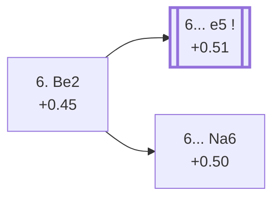

<a name="_TOP_"></a>

# E91 King's Indian Defence: 6. Be2 <br> 1. d4 Nf6 2. c4 g6 3. Nc3 Bg7 4. e4 d6 5. Nf3 O-O 6. Be2 #

Continues from [E90's own "5... O-O" node](https://github.com/onclemarcel/chess_flashcards/blob/main/d4_openings/E90_Kings_Indian_5Nf3.md#_OO_), where **6. Be2** (84.8% masters) is by far White's most tested try — quiet, flexible development that keeps every central plan (d5, dxe5, Be3) open. Live-tagged **King's Indian Defense: Orthodox Variation** even at this bare pre-fork position — the first sign of a pattern that runs through the entire rest of this batch: Lichess's live opening book uses the umbrella name "Orthodox Variation" all the way from this node down through E92, E94, E95, E96, E97, E98, and E99, regardless of which distinct name `eco.md` gives each individual code along the way. Rather than repeat that observation at every card, it's stated once here and assumed from this point on.

### Overview

*Quick map of every move covered on this card — see the [shape key](https://github.com/onclemarcel/chess_flashcards/blob/main/start.md#content-diagram-optional) in start.md.*

<!-- content-diagram:start -->

<!-- content-diagram:end -->

<a name="_initial_move_"></a>

[](https://lichess.org/analysis/standard/rnbq1rk1/ppp1ppbp/3p1np1/8/2PPP3/2N2N2/PP2BPPP/R1BQK2R_b_KQ_-_3_6)

*... 6. Be2 — King's Indian Defence, 6.Be2*

```
rnbq1rk1/ppp1ppbp/3p1np1/8/2PPP3/2N2N2/PP2BPPP/R1BQK2R b KQ - 3 6
```

|  | +0.45 |
| --- | --- |

<!-- lichess-stats:start fen="rnbq1rk1/ppp1ppbp/3p1np1/8/2PPP3/2N2N2/PP2BPPP/R1BQK2R b KQ - 3 6" db="lichess,masters" speeds="bullet,blitz" ratings="1800,2000,2200,2500" moves="7" -->
| Move | Online | W/D/B | Masters | W/D/B | |
| :--- | ---: | :--- | ---: | :--- | :-- |
| e5 | 2.2 M (37.4%) | ⬜⬜⬜⬜⬜🟫⬛⬛⬛⬛ 50/6/44 | 42 k (77.8%) | ⬜⬜⬜⬜🟫🟫🟫🟫⬛⬛ 36/42/22 |  |
| Nbd7 | 929 k (16.1%) | ⬜⬜⬜⬜⬜🟫⬛⬛⬛⬛ 50/5/44 | 3.2 k (5.9%) | ⬜⬜⬜⬜🟫🟫🟫⬛⬛⬛ 36/32/32 |  |
| Nc6 | 843 k (14.6%) | ⬜⬜⬜⬜⬜🟫⬛⬛⬛⬛ 52/5/43 | 301 (0.6%) | ⬜⬜⬜⬜⬜🟫🟫🟫⬛⬛ 49/29/23 |  |
| c5 | 636 k (11.0%) | ⬜⬜⬜⬜⬜🟫⬛⬛⬛⬛ 50/6/43 | 2.2 k (4.1%) | ⬜⬜⬜⬜🟫🟫🟫🟫⬛⬛ 40/39/22 |  |
| Bg4 | 443 k (7.6%) | ⬜⬜⬜⬜⬜🟫⬛⬛⬛⬛ 49/6/45 | 2.3 k (4.3%) | ⬜⬜⬜⬜🟫🟫🟫🟫⬛⬛ 39/37/23 |  |
| Na6 | 239 k (4.1%) | ⬜⬜⬜⬜⬜⬛⬛⬛⬛⬛ 47/6/47 | 3.2 k (5.8%) | ⬜⬜⬜🟫🟫🟫🟫⬛⬛⬛ 35/36/30 |  |
| c6 | 226 k (3.9%) | ⬜⬜⬜⬜⬜🟫⬛⬛⬛⬛ 51/5/44 | 597 (1.1%) | ⬜⬜⬜⬜🟫🟫🟫⬛⬛⬛ 41/34/26 |  |

*Online: bullet/blitz, 1800+ — 5.8 M games. Masters: 55 k games. [Open in the explorer](https://lichess.org/analysis/standard/rnbq1rk1/ppp1ppbp/3p1np1/8/2PPP3/2N2N2/PP2BPPP/R1BQK2R_b_KQ_-_3_6#explorer) — updated 2026-09-08*
<!-- lichess-stats:end -->

### Candidate moves

* [**6... e5**](https://github.com/onclemarcel/chess_flashcards/blob/main/d4_openings/E92_Kings_Indian_Classical_Variation.md) (+0.51, 77.8% masters): the defining central strike of the whole King's Indian — its own code, [E92](https://github.com/onclemarcel/chess_flashcards/blob/main/d4_openings/E92_Kings_Indian_Classical_Variation.md) onward.
* **6... Nbd7** (5.9% masters) / **6... c5** (4.1% masters) / **6... Bg4** (4.3% masters): real, minor secondaries with no code of their own in this range.
* [**6... Na6**](#_Na6_) (5.8% masters): the Kazakh Variation — its own E91 entry, see below.

[*Back to TOP*](#_TOP_)

---

<a name="_Na6_"></a>

## 6... Na6 — Kazakh Variation

[](https://lichess.org/analysis/standard/r1bq1rk1/ppp1ppbp/n2p1np1/8/2PPP3/2N2N2/PP2BPPP/R1BQK2R_w_KQ_-_4_7)

*... 6... Na6 — King's Indian Defence: Kazakh Variation*

```
r1bq1rk1/ppp1ppbp/n2p1np1/8/2PPP3/2N2N2/PP2BPPP/R1BQK2R w KQ - 4 7
```

|  | +0.50 |
| --- | --- |

<!-- lichess-stats:start fen="r1bq1rk1/ppp1ppbp/n2p1np1/8/2PPP3/2N2N2/PP2BPPP/R1BQK2R w KQ - 4 7" db="lichess,masters" speeds="bullet,blitz" ratings="1800,2000,2200,2500" moves="6" -->
| Move | Online | W/D/B | Masters | W/D/B | |
| :--- | ---: | :--- | ---: | :--- | :-- |
| O-O | 187 k (76.3%) | ⬜⬜⬜⬜⬜⬛⬛⬛⬛⬛ 46/6/47 | 2.8 k (86.2%) | ⬜⬜⬜🟫🟫🟫🟫⬛⬛⬛ 35/36/29 |  |
| Be3 | 25 k (10.3%) | ⬜⬜⬜⬜⬜🟫⬛⬛⬛⬛ 50/5/45 | 144 (4.5%) | ⬜⬜⬜⬜🟫🟫🟫⬛⬛⬛ 38/30/32 |  |
| Bg5 | 9.5 k (3.9%) | ⬜⬜⬜⬜⬜⬛⬛⬛⬛⬛ 48/6/47 | 129 (4.0%) | ⬜⬜⬜⬜🟫🟫🟫⬛⬛⬛ 36/29/35 |  |
| h3 | 8.4 k (3.5%) | ⬜⬜⬜⬜🟫⬛⬛⬛⬛⬛ 44/6/50 | 31 (1.0%) | ⬜⬜⬜⬜🟫🟫🟫⬛⬛⬛ 39/29/32 |  |
| a3 | 7.8 k (3.2%) | ⬜⬜⬜⬜🟫⬛⬛⬛⬛⬛ 40/5/55 | 0 | — | ⚠ |
| Bf4 | 1.6 k (0.6%) | ⬜⬜⬜⬜⬜🟫⬛⬛⬛⬛ 54/8/38 | 103 (3.2%) | ⬜⬜⬜⬜🟫🟫🟫🟫⬛⬛ 39/36/25 |  |
| Qc2 | 0 | — | 16 (0.5%) | — |  |

*Online: bullet/blitz, 1800+ — 245 k games. Masters: 3.2 k games. [Open in the explorer](https://lichess.org/analysis/standard/r1bq1rk1/ppp1ppbp/n2p1np1/8/2PPP3/2N2N2/PP2BPPP/R1BQK2R_w_KQ_-_4_7#explorer) — updated 2026-09-08*
<!-- lichess-stats:end -->

Live-tagged **King's Indian Defense: Kazakh Variation**, matching `eco.md` exactly. Black routes the queen's knight to a6 before committing the centre — a flexible waiting move, often preparing ... c5 with the knight already clear of the c-file. **7. O-O** (86.2% masters) is by far White's overwhelming reply, simply castling into safety while Black's plan is still unclear. Not built further here.

[*Back to 6. Be2*](#_initial_move_)
[*Back to TOP*](#_TOP_)
