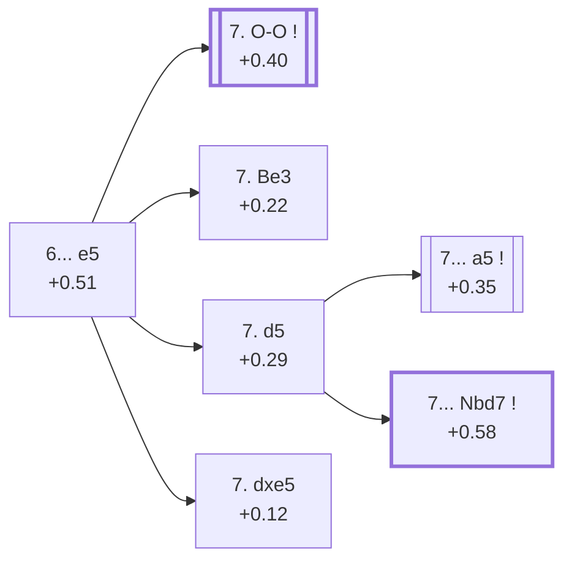

<a name="_TOP_"></a>

# E92 King's Indian Defence: Classical Variation <br> 1. d4 Nf6 2. c4 g6 3. Nc3 Bg7 4. e4 d6 5. Nf3 O-O 6. Be2 e5 #

Continues from [E91's own root](https://github.com/onclemarcel/chess_flashcards/blob/main/d4_openings/E91_Kings_Indian_6Be2.md#_initial_move_), where **6... e5** (77.8% masters) is the defining central break of the whole King's Indian — this is the single busiest fork in the entire E90-E99 batch, packing five of `eco.md`'s own named entries into one node. Live-tagged **King's Indian Defense: Orthodox Variation**, a genuine name divergence from `eco.md`'s own "Classical Variation" — and, per the note on E91's own page, the same live label that continues down through nearly every code in the rest of this batch.

### Overview

*Quick map of every move covered on this card — see the [shape key](https://github.com/onclemarcel/chess_flashcards/blob/main/start.md#content-diagram-optional) in start.md.*

<!-- content-diagram:start -->

<!-- content-diagram:end -->

<a name="_initial_move_"></a>

[](https://lichess.org/analysis/standard/rnbq1rk1/ppp2pbp/3p1np1/4p3/2PPP3/2N2N2/PP2BPPP/R1BQK2R_w_KQ_e6_0_7)

*... 6... e5 — King's Indian Defence: Classical Variation*

```
rnbq1rk1/ppp2pbp/3p1np1/4p3/2PPP3/2N2N2/PP2BPPP/R1BQK2R w KQ e6 0 7
```

|  | +0.51 |
| --- | --- |

<!-- lichess-stats:start fen="rnbq1rk1/ppp2pbp/3p1np1/4p3/2PPP3/2N2N2/PP2BPPP/R1BQK2R w KQ e6 0 7" db="lichess,masters" speeds="bullet,blitz" ratings="1800,2000,2200,2500" moves="6" -->
| Move | Online | W/D/B | Masters | W/D/B | |
| :--- | ---: | :--- | ---: | :--- | :-- |
| O-O | 1.2 M (53.3%) | ⬜⬜⬜⬜⬜🟫⬛⬛⬛⬛ 50/6/44 | 29 k (68.4%) | ⬜⬜⬜⬜🟫🟫🟫🟫⬛⬛ 36/42/21 |  |
| d5 | 478 k (22.1%) | ⬜⬜⬜⬜⬜⬛⬛⬛⬛⬛ 48/5/47 | 4.8 k (11.3%) | ⬜⬜⬜⬜🟫🟫🟫🟫⬛⬛ 38/37/25 |  |
| dxe5 | 256 k (11.8%) | ⬜⬜⬜⬜⬜🟫⬛⬛⬛⬛ 50/9/40 | 2.4 k (5.6%) | ⬜⬜🟫🟫🟫🟫🟫🟫⬛⬛ 21/57/22 |  |
| Be3 | 243 k (11.2%) | ⬜⬜⬜⬜⬜🟫⬛⬛⬛⬛ 52/6/42 | 6.2 k (14.5%) | ⬜⬜⬜⬜🟫🟫🟫🟫⬛⬛ 40/39/21 |  |
| Bg5 | 16 k (0.7%) | ⬜⬜⬜⬜⬜⬛⬛⬛⬛⬛ 48/6/46 | 69 (0.2%) | ⬜⬜⬜⬜🟫🟫🟫⬛⬛⬛ 35/35/30 |  |
| h3 | 15 k (0.7%) | ⬜⬜⬜⬜🟫⬛⬛⬛⬛⬛ 44/5/50 | 6 (0.0%) | — |  |

*Online: bullet/blitz, 1800+ — 2.2 M games. Masters: 42 k games. [Open in the explorer](https://lichess.org/analysis/standard/rnbq1rk1/ppp2pbp/3p1np1/4p3/2PPP3/2N2N2/PP2BPPP/R1BQK2R_w_KQ_e6_0_7#explorer) — updated 2026-09-15*
<!-- lichess-stats:end -->

The four coded tries genuinely rank in a different order than their names might suggest: masters' actual plurality is **7. O-O** (68.4%), which carries no name of its own here at all — it advances straight to E94 ("orthodox Variation"), and from there mostly onward again to the Aronin-Taimanov/Mar del Plata complex (E97-E99). The three tries that *do* have their own named E92 entries — **Gligoric-Taimanov** (Be3, 14.5%), **Petrosian System** (d5, 11.3%), and **Andersson Variation** (dxe5, 5.6%) — are all comparatively minor by comparison, a real "coded lines trail an uncoded main road" pattern running through this whole card.

### Candidate moves

* [**7. O-O**](https://github.com/onclemarcel/chess_flashcards/blob/main/d4_openings/E94_Kings_Indian_Orthodox_Variation.md) (+0.40, 68.4% masters): masters' clear main try — its own code, [E94](https://github.com/onclemarcel/chess_flashcards/blob/main/d4_openings/E94_Kings_Indian_Orthodox_Variation.md) onward.
* [**7. Be3**](#_Be3_) (14.5% masters): the Gligoric-Taimanov System — see below.
* [**7. d5**](#_d5_) (11.3% masters): the Petrosian System — see below, forking further into the Stein Variation and E93.
* [**7. dxe5**](#_dxe5_) (5.6% masters): the Andersson Variation — see below.

[*Back to TOP*](#_TOP_)

---

<a name="_dxe5_"></a>

## 7. dxe5 — Andersson Variation

[](https://lichess.org/analysis/standard/rnbq1rk1/ppp2pbp/3p1np1/4P3/2P1P3/2N2N2/PP2BPPP/R1BQK2R_b_KQ_-_0_7)

*... 7. dxe5 — King's Indian Defence: Andersson Variation*

```
rnbq1rk1/ppp2pbp/3p1np1/4P3/2P1P3/2N2N2/PP2BPPP/R1BQK2R b KQ - 0 7
```

|  | +0.12 |
| --- | --- |

<!-- lichess-stats:start fen="rnbq1rk1/ppp2pbp/3p1np1/4P3/2P1P3/2N2N2/PP2BPPP/R1BQK2R b KQ - 0 7" db="lichess,masters" speeds="bullet,blitz" ratings="1800,2000,2200,2500" moves="4" -->
| Move | Online | W/D/B | Masters | W/D/B | |
| :--- | ---: | :--- | ---: | :--- | :-- |
| dxe5 | 255 k (99.5%) | ⬜⬜⬜⬜⬜🟫⬛⬛⬛⬛ 50/9/40 | 2.4 k (100.0%) | ⬜⬜🟫🟫🟫🟫🟫🟫⬛⬛ 21/57/22 |  |
| Ng4 | 486 (0.2%) | ⬜⬜⬜⬜⬜⬜⬛⬛⬛⬛ 59/4/37 | 0 | — | ⚠ |
| Nc6 | 396 (0.2%) | ⬜⬜⬜⬜⬜⬜⬜🟫⬛⬛ 74/4/22 | 0 | — | ⚠ |
| d5 | 151 (0.1%) | ⬜⬜⬜⬜⬜⬜⬜⬜⬜⬛ 84/3/13 | 0 | — | ⚠ |

*Online: bullet/blitz, 1800+ — 256 k games. Masters: 2.4 k games. [Open in the explorer](https://lichess.org/analysis/standard/rnbq1rk1/ppp2pbp/3p1np1/4P3/2P1P3/2N2N2/PP2BPPP/R1BQK2R_b_KQ_-_0_7#explorer) — updated 2026-09-15*
<!-- lichess-stats:end -->

Live-tagged **King's Indian Defense: Exchange Variation**, a genuine name divergence from `eco.md`'s own "Andersson Variation" — the trade on e5 immediately simplifies the centre and heads for a symmetrical, often drawish structure, exactly the plan Ulf Andersson's own name suggests. **7... dxe5** is essentially forced (100.0% masters), reaching a position Stockfish rates as barely better than equal (+0.12 after the recapture, down from +0.12 before it too) — the flattest evaluation found anywhere on this whole card. Not built further here.

[*Back to 6... e5*](#_initial_move_)
[*Back to TOP*](#_TOP_)

---

<a name="_Be3_"></a>

## 7. Be3 — Gligoric-Taimanov System

[](https://lichess.org/analysis/standard/rnbq1rk1/ppp2pbp/3p1np1/4p3/2PPP3/2N1BN2/PP2BPPP/R2QK2R_b_KQ_-_1_7)

*... 7. Be3 — King's Indian Defence: Gligoric-Taimanov System*

```
rnbq1rk1/ppp2pbp/3p1np1/4p3/2PPP3/2N1BN2/PP2BPPP/R2QK2R b KQ - 1 7
```

|  | +0.22 |
| --- | --- |

<!-- lichess-stats:start fen="rnbq1rk1/ppp2pbp/3p1np1/4p3/2PPP3/2N1BN2/PP2BPPP/R2QK2R b KQ - 1 7" db="lichess,masters" speeds="bullet,blitz" ratings="1800,2000,2200,2500" moves="7" -->
| Move | Online | W/D/B | Masters | W/D/B | |
| :--- | ---: | :--- | ---: | :--- | :-- |
| Nc6 | 105 k (39.5%) | ⬜⬜⬜⬜⬜⬜⬛⬛⬛⬛ 56/5/40 | 351 (5.6%) | ⬜⬜⬜⬜⬜⬜🟫🟫⬛⬛ 56/23/21 |  |
| Ng4 | 70 k (26.3%) | ⬜⬜⬜⬜⬜🟫⬛⬛⬛⬛ 50/6/44 | 2.5 k (40.1%) | ⬜⬜⬜⬜🟫🟫🟫🟫⬛⬛ 40/38/21 |  |
| exd4 | 53 k (20.0%) | ⬜⬜⬜⬜⬜🟫⬛⬛⬛⬛ 48/7/45 | 1.2 k (18.4%) | ⬜⬜⬜🟫🟫🟫🟫🟫⬛⬛ 34/48/18 |  |
| Nbd7 | 11 k (4.0%) | ⬜⬜⬜⬜⬜🟫⬛⬛⬛⬛ 51/6/43 | 457 (7.3%) | ⬜⬜⬜⬜🟫🟫🟫🟫⬛⬛ 37/37/26 |  |
| Na6 | 6.9 k (2.6%) | ⬜⬜⬜⬜⬜🟫⬛⬛⬛⬛ 47/6/46 | 666 (10.6%) | ⬜⬜⬜⬜🟫🟫🟫🟫⬛⬛ 44/38/18 |  |
| c6 | 4.7 k (1.8%) | ⬜⬜⬜⬜⬜🟫⬛⬛⬛⬛ 48/7/46 | 538 (8.6%) | ⬜⬜⬜⬜🟫🟫🟫🟫⬛⬛ 39/39/22 |  |
| h6 | 3.5 k (1.3%) | ⬜⬜⬜⬜🟫⬛⬛⬛⬛⬛ 44/7/49 | 384 (6.1%) | ⬜⬜⬜⬜🟫🟫🟫🟫⬛⬛ 43/35/21 |  |

*Online: bullet/blitz, 1800+ — 267 k games. Masters: 6.3 k games. [Open in the explorer](https://lichess.org/analysis/standard/rnbq1rk1/ppp2pbp/3p1np1/4p3/2PPP3/2N1BN2/PP2BPPP/R2QK2R_b_KQ_-_1_7#explorer) — updated 2026-09-15*
<!-- lichess-stats:end -->

Live-tagged **King's Indian Defense: Orthodox Variation, Gligoric-Taimanov System**, matching `eco.md` closely. Named for Svetozar Gligorić and Mark Taimanov, this quiet developing move eyes d4 and prepares Qd2. Masters' own actual plurality reply, **7... Ng4** (40.1%), harasses the newly-posted bishop at once — a real online/masters inversion sits right alongside it: online play instead favours **7... Nc6** (39.5% online, a mere 5.6% at masters level, and a genuine ⚠ gap past this repo's own rhombus-style threshold in spirit, though the move itself isn't rare enough in absolute terms to qualify formally). Not built further here.

[*Back to 6... e5*](#_initial_move_)
[*Back to TOP*](#_TOP_)

---

<a name="_d5_"></a>

## 7. d5 — Petrosian System

[](https://lichess.org/analysis/standard/rnbq1rk1/ppp2pbp/3p1np1/3Pp3/2P1P3/2N2N2/PP2BPPP/R1BQK2R_b_KQ_-_0_7)

*... 7. d5 — King's Indian Defence: Petrosian System*

```
rnbq1rk1/ppp2pbp/3p1np1/3Pp3/2P1P3/2N2N2/PP2BPPP/R1BQK2R b KQ - 0 7
```

|  | +0.29 |
| --- | --- |

<!-- lichess-stats:start fen="rnbq1rk1/ppp2pbp/3p1np1/3Pp3/2P1P3/2N2N2/PP2BPPP/R1BQK2R b KQ - 0 7" db="lichess,masters" speeds="bullet,blitz" ratings="1800,2000,2200,2500" moves="6" -->
| Move | Online | W/D/B | Masters | W/D/B | |
| :--- | ---: | :--- | ---: | :--- | :-- |
| a5 | 252 k (51.6%) | ⬜⬜⬜⬜⬜⬛⬛⬛⬛⬛ 47/5/48 | 3.7 k (75.9%) | ⬜⬜⬜⬜🟫🟫🟫🟫⬛⬛ 36/38/26 |  |
| Nbd7 | 102 k (21.0%) | ⬜⬜⬜⬜⬜⬛⬛⬛⬛⬛ 47/5/48 | 455 (9.4%) | ⬜⬜⬜⬜⬜🟫🟫🟫⬛⬛ 45/33/22 |  |
| Na6 | 43 k (8.8%) | ⬜⬜⬜⬜⬜⬛⬛⬛⬛⬛ 47/6/47 | 501 (10.4%) | ⬜⬜⬜⬜🟫🟫🟫⬛⬛⬛ 41/34/25 |  |
| c6 | 25 k (5.1%) | ⬜⬜⬜⬜⬜🟫⬛⬛⬛⬛ 52/5/43 | 0 | — | ⚠ |
| Ne8 | 17 k (3.5%) | ⬜⬜⬜⬜⬜⬛⬛⬛⬛⬛ 48/5/47 | 0 | — | ⚠ |
| Nh5 | 15 k (3.1%) | ⬜⬜⬜⬜🟫⬛⬛⬛⬛⬛ 45/5/50 | 74 (1.5%) | ⬜⬜⬜⬜🟫🟫🟫⬛⬛⬛ 39/31/30 |  |
| c5 | 0 | — | 41 (0.9%) | ⬜⬜⬜⬜⬜🟫🟫🟫⬛⬛ 46/32/22 |  |
| h6 | 0 | — | 27 (0.6%) | ⬜⬜⬜⬜⬜⬜🟫⬛⬛⬛ 59/15/26 |  |

*Online: bullet/blitz, 1800+ — 488 k games. Masters: 4.8 k games. [Open in the explorer](https://lichess.org/analysis/standard/rnbq1rk1/ppp2pbp/3p1np1/3Pp3/2P1P3/2N2N2/PP2BPPP/R1BQK2R_b_KQ_-_0_7#explorer) — updated 2026-09-15*
<!-- lichess-stats:end -->

Live-tagged **King's Indian Defense: Petrosian Variation** — a minor divergence from `eco.md`'s own "System", the same System/Variation drift seen elsewhere across this project (Kramer, Averbakh). Named for Tigran Petrosian, White locks the centre at once, gaining space and steering toward a more manoeuvring middlegame than the sharper 7. O-O lines. A genuinely striking naming irony shows up right here: `eco.md`'s own **"Main line"** name belongs to **7... Nbd7** (only 9.4% masters), while the actually overwhelming masters choice is **7... a5** (75.9%) — the **Stein Variation**, built out below — meaning the "Main line" isn't the main line by any practical measure. This card still follows Nbd7 onward into [E93](https://github.com/onclemarcel/chess_flashcards/blob/main/d4_openings/E93_Kings_Indian_Petrosian_Main_Line.md), since that's where `eco.md`'s own chain of named codes continues, but the frequency gap is worth keeping in mind.

### Candidate moves

* [**7... a5**](#_a5_) (+0.35, 75.9% masters): the Stein Variation, masters' overwhelming choice — see below.
* [**7... Nbd7**](https://github.com/onclemarcel/chess_flashcards/blob/main/d4_openings/E93_Kings_Indian_Petrosian_Main_Line.md) (+0.58, 9.4% masters): `eco.md`'s own "Main line" name, despite trailing a5 by a wide margin — its own code, [E93](https://github.com/onclemarcel/chess_flashcards/blob/main/d4_openings/E93_Kings_Indian_Petrosian_Main_Line.md) onward, this batch's own Keres tactical sequence.
* **7... Na6** (10.4% masters): a real, significant secondary with no code of its own in this range.

[*Back to 6... e5*](#_initial_move_)
[*Back to TOP*](#_TOP_)

---

<a name="_a5_"></a>

## 7... a5 — Petrosian System, Stein Variation

[](https://lichess.org/analysis/standard/rnbq1rk1/1pp2pbp/3p1np1/p2Pp3/2P1P3/2N2N2/PP2BPPP/R1BQK2R_w_KQ_a6_0_8)

*... 7... a5 — King's Indian Defence: Petrosian System, Stein Variation*

```
rnbq1rk1/1pp2pbp/3p1np1/p2Pp3/2P1P3/2N2N2/PP2BPPP/R1BQK2R w KQ a6 0 8
```

|  | +0.35 |
| --- | --- |

<!-- lichess-stats:start fen="rnbq1rk1/1pp2pbp/3p1np1/p2Pp3/2P1P3/2N2N2/PP2BPPP/R1BQK2R w KQ a6 0 8" db="lichess,masters" speeds="bullet,blitz" ratings="1800,2000,2200,2500" moves="5" -->
| Move | Online | W/D/B | Masters | W/D/B | |
| :--- | ---: | :--- | ---: | :--- | :-- |
| Bg5 | 106 k (41.9%) | ⬜⬜⬜⬜⬜🟫⬛⬛⬛⬛ 52/6/43 | 2.3 k (63.8%) | ⬜⬜⬜⬜🟫🟫🟫⬛⬛⬛ 37/36/27 |  |
| O-O | 81 k (32.0%) | ⬜⬜⬜⬜🟫⬛⬛⬛⬛⬛ 43/5/52 | 347 (9.5%) | ⬜⬜🟫🟫🟫🟫🟫⬛⬛⬛ 26/48/27 |  |
| Be3 | 28 k (10.9%) | ⬜⬜⬜⬜⬜🟫⬛⬛⬛⬛ 51/5/44 | 341 (9.3%) | ⬜⬜⬜🟫🟫🟫🟫⬛⬛⬛ 34/42/24 |  |
| h3 | 19 k (7.4%) | ⬜⬜⬜⬜🟫⬛⬛⬛⬛⬛ 43/5/52 | 498 (13.6%) | ⬜⬜⬜⬜🟫🟫🟫🟫⬛⬛ 40/40/21 |  |
| a4 | 5.8 k (2.3%) | ⬜⬜⬜🟫⬛⬛⬛⬛⬛⬛ 33/4/63 | 0 | — | ⚠ |
| Nd2 | 0 | — | 90 (2.5%) | ⬜⬜⬜⬜🟫🟫🟫⬛⬛⬛ 44/28/28 |  |

*Online: bullet/blitz, 1800+ — 252 k games. Masters: 3.7 k games. [Open in the explorer](https://lichess.org/analysis/standard/rnbq1rk1/1pp2pbp/3p1np1/p2Pp3/2P1P3/2N2N2/PP2BPPP/R1BQK2R_w_KQ_a6_0_8#explorer) — updated 2026-09-15*
<!-- lichess-stats:end -->

Live-tagged **King's Indian Defense: Petrosian Variation, Stein Defense** — a double naming divergence from `eco.md`'s own "Stein Variation" (Petrosian's System/Variation drift, plus a Variation/Defense drift on Stein's own name too). Named for Leonid Stein, Black grabs queenside space at once, gaining ... a4 ideas before White can play a3/b4. **8. Bg5** is masters' clear main try (63.8%). Not built further here.

[*Back to 7. d5*](#_d5_)
[*Back to TOP*](#_TOP_)
