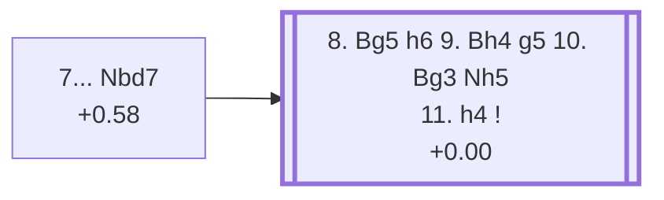

<a name="_TOP_"></a>

# E93 King's Indian Defence: Petrosian System, Main Line <br> 1. d4 Nf6 2. c4 g6 3. Nc3 Bg7 4. e4 d6 5. Nf3 O-O 6. Be2 e5 7. d5 Nbd7 #

Continues from [E92's own "7. d5" node](https://github.com/onclemarcel/chess_flashcards/blob/main/d4_openings/E92_Kings_Indian_Classical_Variation.md#_d5_), where **7... Nbd7** (9.4% masters at that fork) is the move `eco.md` labels the Petrosian System's own "Main line" — despite trailing the far more popular Stein Variation (7... a5, 75.9%) by a wide margin, as already flagged on E92's own page. Live-tagged **King's Indian Defense: Petrosian Variation, Normal Defense** — a name `eco.md` doesn't carry at all, on top of the usual System/Variation drift.

### Overview

*Quick map of every move covered on this card — see the [shape key](https://github.com/onclemarcel/chess_flashcards/blob/main/start.md#content-diagram-optional) in start.md.*

<!-- content-diagram:start -->

<!-- content-diagram:end -->

<a name="_initial_move_"></a>

[](https://lichess.org/analysis/standard/r1bq1rk1/pppn1pbp/3p1np1/3Pp3/2P1P3/2N2N2/PP2BPPP/R1BQK2R_w_KQ_-_1_8)

*... 7... Nbd7 — King's Indian Defence: Petrosian System, Main Line*

```
r1bq1rk1/pppn1pbp/3p1np1/3Pp3/2P1P3/2N2N2/PP2BPPP/R1BQK2R w KQ - 1 8
```

|  | +0.58 |
| --- | --- |

<!-- lichess-stats:start fen="r1bq1rk1/pppn1pbp/3p1np1/3Pp3/2P1P3/2N2N2/PP2BPPP/R1BQK2R w KQ - 1 8" db="lichess,masters" speeds="bullet,blitz" ratings="1800,2000,2200,2500" moves="5" -->
| Move | Online | W/D/B | Masters | W/D/B | |
| :--- | ---: | :--- | ---: | :--- | :-- |
| O-O | 55 k (44.3%) | ⬜⬜⬜⬜🟫⬛⬛⬛⬛⬛ 44/5/51 | 91 (17.7%) | ⬜⬜⬜⬜🟫🟫🟫⬛⬛⬛ 41/32/27 |  |
| Bg5 | 32 k (25.8%) | ⬜⬜⬜⬜⬜🟫⬛⬛⬛⬛ 53/6/42 | 262 (51.1%) | ⬜⬜⬜⬜🟫🟫🟫⬛⬛⬛ 41/32/27 |  |
| Be3 | 18 k (14.5%) | ⬜⬜⬜⬜⬜🟫⬛⬛⬛⬛ 52/5/44 | 114 (22.2%) | ⬜⬜⬜⬜⬜🟫🟫🟫🟫⬛ 48/36/16 |  |
| h3 | 8.6 k (7.0%) | ⬜⬜⬜⬜⬜⬛⬛⬛⬛⬛ 45/5/51 | 0 | — | ⚠ |
| b4 | 4.8 k (3.9%) | ⬜⬜⬜⬜⬛⬛⬛⬛⬛⬛ 36/4/60 | 0 | — | ⚠ |
| Qc2 | 0 | — | 18 (3.5%) | — |  |
| Nd2 | 0 | — | 12 (2.3%) | — |  |

*Online: bullet/blitz, 1800+ — 123 k games. Masters: 513 games. [Open in the explorer](https://lichess.org/analysis/standard/r1bq1rk1/pppn1pbp/3p1np1/3Pp3/2P1P3/2N2N2/PP2BPPP/R1BQK2R_w_KQ_-_1_8#explorer) — updated 2026-09-15*
<!-- lichess-stats:end -->

### Candidate moves

* [**8. Bg5**](#_Keres_) (+0.21, 51.1% masters): masters' actual plurality — opens the Keres Variation's own forced-looking sequence, see below.
* **8. O-O** (17.7% masters) / **8. Be3** (22.2% masters): real, significant secondaries with no code of their own in this range.

[*Back to 7. d5*](https://github.com/onclemarcel/chess_flashcards/blob/main/d4_openings/E92_Kings_Indian_Classical_Variation.md#_d5_)
[*Back to TOP*](#_TOP_)

---

<a name="_Keres_"></a>

## 8. Bg5 h6 9. Bh4 g5 10. Bg3 Nh5 11. h4 — Keres Variation (+0.00)

Like the Sämisch Bronstein Variation covered earlier in this project, the Keres Variation isn't really a branch point — it's a long, mostly forced sequence of provocations and replies, worth walking through move by move with an eval check at every stage rather than jumping straight to the end:

* **8. Bg5** pins nothing yet but eyes a future exchange on f6; Black answers **8... h6** almost automatically (92.5% masters), challenging the bishop at once. Eval: +0.21.
* **9. Bh4** keeps the pin alive rather than retreating or trading — masters play it 95.2% of the time. Black's own 9th move is a genuine fork rather than forced: **9... g5** (47.8% masters) pushes the bishop again, narrowly ahead of the real, uncoded alternative **9... a5** (32.6% masters), continuing the queenside expansion race instead. Eval after 9. Bh4: +0.00 — the position is already dead level.
* **9... g5** attacks the bishop a second time; **10. Bg3** is White's only real retreat (100.0% masters — completely forced, the bishop has nowhere else to go that keeps it active). Eval: +0.00.
* **10... Nh5** (94.7% masters) attacks the bishop yet again, offering a trade of minor pieces. **11. h4** meets it with a further pawn push rather than retreating a third time (77.6% masters, though 13.3% instead play 11. Nd2). Eval stays at +0.00 throughout both of these moves.

[](https://lichess.org/analysis/standard/r1bq1rk1/pppn1pb1/3p3p/3Pp1pn/2P1P2P/2N2NB1/PP2BPP1/R2QK2R_b_KQ_h3_0_11)

*... 11. h4 — King's Indian Defence: Petrosian System, Keres Variation*

```
r1bq1rk1/pppn1pb1/3p3p/3Pp1pn/2P1P2P/2N2NB1/PP2BPP1/R2QK2R b KQ h3 0 11
```

<!-- lichess-stats:start fen="r1bq1rk1/pppn1pb1/3p3p/3Pp1pn/2P1P2P/2N2NB1/PP2BPP1/R2QK2R b KQ h3 0 11" db="lichess,masters" speeds="bullet,blitz" ratings="1800,2000,2200,2500" moves="4" -->
| Move | Online | W/D/B | Masters | W/D/B | |
| :--- | ---: | :--- | ---: | :--- | :-- |
| Nxg3 | 1.7 k (53.0%) | ⬜⬜⬜⬜⬜🟫⬛⬛⬛⬛ 55/6/39 | 17 (15.3%) | — |  |
| g4 | 1.0 k (31.4%) | ⬜⬜⬜⬜⬜🟫⬛⬛⬛⬛ 52/6/42 | 82 (73.9%) | ⬜⬜⬜⬜🟫🟫🟫⬛⬛⬛ 37/30/33 |  |
| Nf4 | 508 (15.4%) | ⬜⬜⬜⬜⬜⬛⬛⬛⬛⬛ 49/4/47 | 12 (10.8%) | — |  |
| f6 | 3 (0.1%) | — | 0 | — |  |

*Online: bullet/blitz, 1800+ — 3.3 k games. Masters: 111 games. [Open in the explorer](https://lichess.org/analysis/standard/r1bq1rk1/pppn1pb1/3p3p/3Pp1pn/2P1P2P/2N2NB1/PP2BPP1/R2QK2R_b_KQ_h3_0_11#explorer) — updated 2026-09-15*
<!-- lichess-stats:end -->

Live-tagged **King's Indian Defense: Petrosian Variation, Keres Defense** — another Variation/Defense drift on top of Petrosian's own recurring System/Variation one, matching `eco.md`'s own "Keres Variation" only loosely. `eco.md`'s own named sequence stops exactly here, at White's 11th move, without picking a specific reply for Black — the database itself confirms it's still a genuine fork at this final tabiya too, with masters actually preferring **11... g4** (73.9%) over the knight-grabbing **11... Nxg3** (only 15.3%, though it's online's own favourite at 53.0%, a real familiarity gap rather than a trap since Stockfish doesn't punish it either way).

The eval trajectory across the whole sequence tells a clean story, and a very different one from the Sämisch Bronstein Variation covered earlier in this project: instead of Black grabbing material and White keeping a persistent edge throughout, here the position simply **equalizes** — starting from White's healthy +0.58 at the fork above, dropping to +0.21 after 8. Bg5, briefly ticking up to +0.31 after 9. Bh4, then settling at a flat **+0.00** for every single position from 9... g5 onward. Black's repeated harassment of the bishop doesn't win material the way Bronstein's knight rampage does, but it does succeed in fully neutralising White's opening advantage — a real, sound equalising try, not a tactical trick. Not explored further past this position.

[*Back to 7... Nbd7*](#_initial_move_)
[*Back to TOP*](#_TOP_)
