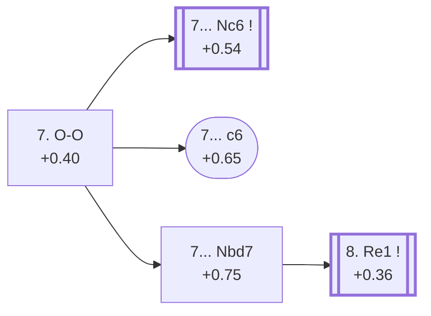

<a name="_TOP_"></a>

# E94 King's Indian Defence: Orthodox Variation <br> 1. d4 Nf6 2. c4 g6 3. Nc3 Bg7 4. e4 d6 5. Nf3 O-O 6. Be2 e5 7. O-O #

Continues from [E92's own root](https://github.com/onclemarcel/chess_flashcards/blob/main/d4_openings/E92_Kings_Indian_Classical_Variation.md#_initial_move_), where **7. O-O** (68.4% masters) is by far the most tested reply to 6... e5 — simple, sound development, castling into safety before choosing a plan. Live-tagged **King's Indian Defense: Orthodox Variation**, matching `eco.md`'s own name closely.

### Overview

*Quick map of every move covered on this card — see the [shape key](https://github.com/onclemarcel/chess_flashcards/blob/main/start.md#content-diagram-optional) in start.md.*

<!-- content-diagram:start -->

<!-- content-diagram:end -->

<a name="_initial_move_"></a>

[](https://lichess.org/analysis/standard/rnbq1rk1/ppp2pbp/3p1np1/4p3/2PPP3/2N2N2/PP2BPPP/R1BQ1RK1_b_-_-_1_7)

*... 7. O-O — King's Indian Defence: Orthodox Variation*

```
rnbq1rk1/ppp2pbp/3p1np1/4p3/2PPP3/2N2N2/PP2BPPP/R1BQ1RK1 b - - 1 7
```

|  | +0.40 |
| --- | --- |

<!-- lichess-stats:start fen="rnbq1rk1/ppp2pbp/3p1np1/4p3/2PPP3/2N2N2/PP2BPPP/R1BQ1RK1 b - - 1 7" db="lichess,masters" speeds="bullet,blitz" ratings="1800,2000,2200,2500" moves="7" -->
| Move | Online | W/D/B | Masters | W/D/B | |
| :--- | ---: | :--- | ---: | :--- | :-- |
| Nc6 | 806 k (69.5%) | ⬜⬜⬜⬜⬜🟫⬛⬛⬛⬛ 52/5/43 | 20 k (68.9%) | ⬜⬜⬜⬜🟫🟫🟫🟫⬛⬛ 36/43/21 |  |
| exd4 | 205 k (17.7%) | ⬜⬜⬜⬜🟫⬛⬛⬛⬛⬛ 46/7/47 | 2.6 k (9.0%) | ⬜⬜⬜🟫🟫🟫🟫🟫⬛⬛ 36/47/17 |  |
| Nbd7 | 52 k (4.4%) | ⬜⬜⬜⬜⬜⬛⬛⬛⬛⬛ 48/6/46 | 2.0 k (7.0%) | ⬜⬜⬜⬜🟫🟫🟫🟫⬛⬛ 41/37/22 |  |
| Na6 | 35 k (3.0%) | ⬜⬜⬜⬜🟫⬛⬛⬛⬛⬛ 46/7/48 | 2.9 k (10.0%) | ⬜⬜⬜⬜🟫🟫🟫🟫⬛⬛ 38/40/22 |  |
| Bg4 | 23 k (2.0%) | ⬜⬜⬜⬜🟫⬛⬛⬛⬛⬛ 45/8/47 | 256 (0.9%) | ⬜⬜⬜🟫🟫🟫🟫⬛⬛⬛ 34/39/27 |  |
| a5 | 8.4 k (0.7%) | ⬜⬜⬜⬜⬜🟫⬛⬛⬛⬛ 50/6/44 | 0 | — | ⚠ |
| c6 | 6.8 k (0.6%) | ⬜⬜⬜⬜⬜⬛⬛⬛⬛⬛ 47/7/47 | 466 (1.6%) | ⬜⬜⬜🟫🟫🟫🟫🟫⬛⬛ 32/45/23 |  |
| Nh5 | 0 | — | 250 (0.9%) | ⬜⬜⬜⬜🟫🟫🟫🟫⬛⬛ 38/40/22 |  |

*Online: bullet/blitz, 1800+ — 1.2 M games. Masters: 29 k games. [Open in the explorer](https://lichess.org/analysis/standard/rnbq1rk1/ppp2pbp/3p1np1/4p3/2PPP3/2N2N2/PP2BPPP/R1BQ1RK1_b_-_-_1_7#explorer) — updated 2026-09-09*
<!-- lichess-stats:end -->

**7... Nc6** overwhelmingly dominates this fork (68.9% masters), and it's an uncoded try here — it heads straight for [E97](https://github.com/onclemarcel/chess_flashcards/blob/main/d4_openings/E97_Kings_Indian_Mar_Del_Plata.md), the Aronin-Taimanov/Mar del Plata Variation, easily this batch's single most famous line. E94's own *further* named entries — the **Donner Variation** (7... c6, a mere 1.6% masters) and the bare **7... Nbd7** (7.0% masters) — are both real minority tries by comparison, a striking instance of a card's own coded content trailing a dominant uncoded road out.

### Candidate moves

* [**7... Nc6**](https://github.com/onclemarcel/chess_flashcards/blob/main/d4_openings/E97_Kings_Indian_Mar_Del_Plata.md) (+0.54, 68.9% masters): masters' overwhelming main try, heading straight for the Aronin-Taimanov/Mar del Plata complex — its own code, [E97](https://github.com/onclemarcel/chess_flashcards/blob/main/d4_openings/E97_Kings_Indian_Mar_Del_Plata.md) onward.
* [**7... c6**](#_c6_) (1.6% masters): the Donner Variation — a genuine database rarity, see below.
* [**7... Nbd7**](#_Nbd7_) (7.0% masters): this card's own third entry, forking further to E95, see below.
* **7... Na6** (10.0% masters) / **7... exd4** (9.0% masters): real, significant secondaries with no code of their own in this range.

[*Back to TOP*](#_TOP_)

---

<a name="_c6_"></a>

## 7... c6 — Donner Variation

[](https://lichess.org/analysis/standard/rnbq1rk1/pp3pbp/2pp1np1/4p3/2PPP3/2N2N2/PP2BPPP/R1BQ1RK1_w_-_-_0_8)

*... 7... c6 — King's Indian Defence: Orthodox Variation, Donner Variation*

```
rnbq1rk1/pp3pbp/2pp1np1/4p3/2PPP3/2N2N2/PP2BPPP/R1BQ1RK1 w - - 0 8
```

|  | +0.65 |
| --- | --- |

<!-- lichess-stats:start fen="rnbq1rk1/pp3pbp/2pp1np1/4p3/2PPP3/2N2N2/PP2BPPP/R1BQ1RK1 w - - 0 8" db="lichess,masters" speeds="bullet,blitz" ratings="1800,2000,2200,2500" moves="5" -->
| Move | Online | W/D/B | Masters | W/D/B | |
| :--- | ---: | :--- | ---: | :--- | :-- |
| d5 | 6.6 k (30.2%) | ⬜⬜⬜⬜⬜🟫⬛⬛⬛⬛ 51/5/44 | 255 (36.1%) | ⬜⬜⬜⬜🟫🟫🟫🟫⬛⬛ 37/39/24 |  |
| Be3 | 4.1 k (19.1%) | ⬜⬜⬜⬜⬜⬛⬛⬛⬛⬛ 47/6/46 | 104 (14.7%) | ⬜⬜⬜🟫🟫🟫🟫⬛⬛⬛ 32/38/31 |  |
| dxe5 | 3.9 k (17.7%) | ⬜⬜⬜⬜🟫⬛⬛⬛⬛⬛ 46/8/46 | 61 (8.6%) | ⬜⬜⬜🟫🟫🟫🟫⬛⬛⬛ 26/39/34 |  |
| h3 | 2.3 k (10.5%) | ⬜⬜⬜⬜⬜⬛⬛⬛⬛⬛ 48/6/47 | 0 | — | ⚠ |
| Re1 | 2.3 k (10.4%) | ⬜⬜⬜⬜⬜🟫⬛⬛⬛⬛ 51/6/43 | 203 (28.8%) | ⬜⬜⬜🟫🟫🟫🟫⬛⬛⬛ 31/44/26 |  |
| Qc2 | 0 | — | 65 (9.2%) | ⬜⬜⬜⬜🟫🟫🟫🟫⬛⬛ 37/38/25 |  |

*Online: bullet/blitz, 1800+ — 22 k games. Masters: 706 games. [Open in the explorer](https://lichess.org/analysis/standard/rnbq1rk1/pp3pbp/2pp1np1/4p3/2PPP3/2N2N2/PP2BPPP/R1BQ1RK1_w_-_-_0_8#explorer) — updated 2026-09-09*
<!-- lichess-stats:end -->

Live-tagged **King's Indian Defense: Orthodox Variation, Donner Defense** — a Variation/Defense drift from `eco.md`'s own "Donner Variation", named for Dutch GM Jan Hein Donner. Preparing ... d5 or a queenside break while keeping the centre flexible, this stays a genuine database rarity in both pools (1.6% masters, 0.6% online) — a stadium-shaped, understudied-everywhere node by this repo's own thresholds, even though it carries a real name. White's own 8th move scatters four ways with no dominant try (d5 36.1%, Re1 28.8%, Be3 14.7%, dxe5 8.6%). Not built further here.

[*Back to 7. O-O*](#_initial_move_)
[*Back to TOP*](#_TOP_)

---

<a name="_Nbd7_"></a>

## 7... Nbd7

[](https://lichess.org/analysis/standard/r1bq1rk1/pppn1pbp/3p1np1/4p3/2PPP3/2N2N2/PP2BPPP/R1BQ1RK1_w_-_-_2_8)

*... 7... Nbd7 — King's Indian Defence: Orthodox Variation, Positional Defense*

```
r1bq1rk1/pppn1pbp/3p1np1/4p3/2PPP3/2N2N2/PP2BPPP/R1BQ1RK1 w - - 2 8
```

|  | +0.75 |
| --- | --- |

<!-- lichess-stats:start fen="r1bq1rk1/pppn1pbp/3p1np1/4p3/2PPP3/2N2N2/PP2BPPP/R1BQ1RK1 w - - 2 8" db="lichess,masters" speeds="bullet,blitz" ratings="1800,2000,2200,2500" moves="5" -->
| Move | Online | W/D/B | Masters | W/D/B | |
| :--- | ---: | :--- | ---: | :--- | :-- |
| d5 | 257 k (38.7%) | ⬜⬜⬜⬜⬜⬛⬛⬛⬛⬛ 46/5/49 | 494 (7.3%) | ⬜⬜⬜🟫🟫🟫⬛⬛⬛⬛ 30/32/38 |  |
| Be3 | 154 k (23.1%) | ⬜⬜⬜⬜⬜🟫⬛⬛⬛⬛ 52/6/42 | 2.8 k (40.9%) | ⬜⬜⬜⬜🟫🟫🟫⬛⬛⬛ 39/35/26 |  |
| Re1 | 81 k (12.2%) | ⬜⬜⬜⬜⬜🟫⬛⬛⬛⬛ 52/5/43 | 1.9 k (27.9%) | ⬜⬜⬜🟫🟫🟫🟫⬛⬛⬛ 35/37/27 |  |
| dxe5 | 62 k (9.4%) | ⬜⬜⬜⬜⬜🟫⬛⬛⬛⬛ 47/7/46 | 119 (1.8%) | ⬜⬜🟫🟫🟫⬛⬛⬛⬛⬛ 22/34/45 |  |
| h3 | 41 k (6.1%) | ⬜⬜⬜⬜⬜⬛⬛⬛⬛⬛ 48/5/47 | 0 | — | ⚠ |
| Qc2 | 0 | — | 1.4 k (20.5%) | ⬜⬜⬜⬜🟫🟫🟫⬛⬛⬛ 43/32/24 |  |

*Online: bullet/blitz, 1800+ — 666 k games. Masters: 6.8 k games. [Open in the explorer](https://lichess.org/analysis/standard/r1bq1rk1/pppn1pbp/3p1np1/4p3/2PPP3/2N2N2/PP2BPPP/R1BQ1RK1_w_-_-_2_8#explorer) — updated 2026-09-09*
<!-- lichess-stats:end -->

Live-tagged **King's Indian Defense: Orthodox Variation, Positional Defense** — a name `eco.md` doesn't carry at all (its own entry is simply "orthodox, 7...Nbd7"). White's own reply here scatters widely, with **8. Be3** actually the most common (40.9% masters), narrowly ahead of the coded **8. Re1** (27.9%). This card still follows Re1 onward into [E95](https://github.com/onclemarcel/chess_flashcards/blob/main/d4_openings/E95_Kings_Indian_Orthodox_Nbd7_Re1.md), matching `eco.md`'s own chain of named codes, even though it isn't the statistical favourite here.

### Candidate moves

* [**8. Re1**](https://github.com/onclemarcel/chess_flashcards/blob/main/d4_openings/E95_Kings_Indian_Orthodox_Nbd7_Re1.md) (+0.36, 27.9% masters): its own code, [E95](https://github.com/onclemarcel/chess_flashcards/blob/main/d4_openings/E95_Kings_Indian_Orthodox_Nbd7_Re1.md) onward.
* **8. Be3** (40.9% masters): masters' actual plurality here — a real, significant secondary with no code of its own in this range.
* **8. Qc2** (20.5% masters): another real, significant secondary, likewise uncoded here.

[*Back to 7. O-O*](#_initial_move_)
[*Back to TOP*](#_TOP_)
