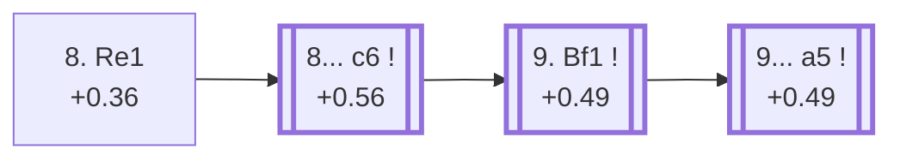

<a name="_TOP_"></a>

# E95 King's Indian Defence: Orthodox, 7...Nbd7, 8. Re1 <br> 1. d4 Nf6 2. c4 g6 3. Nc3 Bg7 4. e4 d6 5. Nf3 O-O 6. Be2 e5 7. O-O Nbd7 8. Re1 #

Continues from [E94's own "7... Nbd7" node](https://github.com/onclemarcel/chess_flashcards/blob/main/d4_openings/E94_Kings_Indian_Orthodox_Variation.md#_Nbd7_), where **8. Re1** (27.9% masters at that fork) prepares Bf1 and a timely d5 or dxe5 without committing the bishop early. Live-tagged plain **King's Indian Defense: Orthodox Variation** with no further qualifier — the one node in this whole batch where Lichess's own umbrella name carries no extra suffix at all, matching `eco.md`'s own equally bare entry.

### Overview

*Quick map of every move covered on this card — see the [shape key](https://github.com/onclemarcel/chess_flashcards/blob/main/start.md#content-diagram-optional) in start.md.*

<!-- content-diagram:start -->

<!-- content-diagram:end -->

<a name="_initial_move_"></a>

[](https://lichess.org/analysis/standard/r1bq1rk1/pppn1pbp/3p1np1/4p3/2PPP3/2N2N2/PP2BPPP/R1BQR1K1_b_-_-_3_8)

*... 8. Re1 — King's Indian Defence: Orthodox Variation*

```
r1bq1rk1/pppn1pbp/3p1np1/4p3/2PPP3/2N2N2/PP2BPPP/R1BQR1K1 b - - 3 8
```

|  | +0.36 |
| --- | --- |

<!-- lichess-stats:start fen="r1bq1rk1/pppn1pbp/3p1np1/4p3/2PPP3/2N2N2/PP2BPPP/R1BQR1K1 b - - 3 8" db="lichess,masters" speeds="bullet,blitz" ratings="1800,2000,2200,2500" moves="6" -->
| Move | Online | W/D/B | Masters | W/D/B | |
| :--- | ---: | :--- | ---: | :--- | :-- |
| exd4 | 22 k (26.6%) | ⬜⬜⬜⬜⬜⬜⬛⬛⬛⬛ 55/5/40 | 148 (7.9%) | ⬜⬜⬜⬜🟫🟫🟫🟫⬛⬛ 39/36/24 |  |
| c6 | 19 k (23.8%) | ⬜⬜⬜⬜⬜🟫⬛⬛⬛⬛ 50/5/44 | 1.2 k (63.7%) | ⬜⬜⬜🟫🟫🟫🟫⬛⬛⬛ 35/39/27 |  |
| Re8 | 19 k (22.9%) | ⬜⬜⬜⬜⬜🟫⬛⬛⬛⬛ 51/6/44 | 324 (17.2%) | ⬜⬜⬜🟫🟫🟫🟫⬛⬛⬛ 33/36/31 |  |
| a5 | 6.9 k (8.5%) | ⬜⬜⬜⬜⬜🟫⬛⬛⬛⬛ 50/5/45 | 43 (2.3%) | ⬜⬜⬜🟫🟫🟫🟫⬛⬛⬛ 30/40/30 |  |
| h6 | 3.7 k (4.6%) | ⬜⬜⬜⬜⬜🟫⬛⬛⬛⬛ 50/5/45 | 116 (6.2%) | ⬜⬜⬜⬜🟫🟫🟫⬛⬛⬛ 38/35/27 |  |
| Qe7 | 3.2 k (3.9%) | ⬜⬜⬜⬜⬜🟫⬛⬛⬛⬛ 50/5/44 | 18 (1.0%) | — |  |

*Online: bullet/blitz, 1800+ — 81 k games. Masters: 1.9 k games. [Open in the explorer](https://lichess.org/analysis/standard/r1bq1rk1/pppn1pbp/3p1np1/4p3/2PPP3/2N2N2/PP2BPPP/R1BQR1K1_b_-_-_3_8#explorer) — updated 2026-09-14*
<!-- lichess-stats:end -->

### Candidate moves

* [**8... c6**](#_c6_) (+0.56, 63.7% masters): masters' clear main try — this card's own trunk, see below.
* **8... exd4** (7.9% masters) / **8... Re8** (17.2% masters) / **8... h6** (6.2% masters): real secondaries with no code of their own in this range.

[*Back to 7... Nbd7*](https://github.com/onclemarcel/chess_flashcards/blob/main/d4_openings/E94_Kings_Indian_Orthodox_Variation.md#_Nbd7_)
[*Back to TOP*](#_TOP_)

---

<a name="_c6_"></a>

## 8... c6

[](https://lichess.org/analysis/standard/r1bq1rk1/pp1n1pbp/2pp1np1/4p3/2PPP3/2N2N2/PP2BPPP/R1BQR1K1_w_-_-_0_9)

*... 8... c6*

```
r1bq1rk1/pp1n1pbp/2pp1np1/4p3/2PPP3/2N2N2/PP2BPPP/R1BQR1K1 w - - 0 9
```

|  | +0.56 |
| --- | --- |

<!-- lichess-stats:start fen="r1bq1rk1/pp1n1pbp/2pp1np1/4p3/2PPP3/2N2N2/PP2BPPP/R1BQR1K1 w - - 0 9" db="lichess,masters" speeds="bullet,blitz" ratings="1800,2000,2200,2500" moves="6" -->
| Move | Online | W/D/B | Masters | W/D/B | |
| :--- | ---: | :--- | ---: | :--- | :-- |
| Bf1 | 21 k (60.2%) | ⬜⬜⬜⬜⬜🟫⬛⬛⬛⬛ 52/5/43 | 1.1 k (84.4%) | ⬜⬜⬜🟫🟫🟫🟫⬛⬛⬛ 35/40/25 |  |
| d5 | 4.1 k (11.5%) | ⬜⬜⬜⬜⬜⬛⬛⬛⬛⬛ 50/4/46 | 39 (2.9%) | ⬜⬜⬜⬜⬜⬜🟫🟫🟫⬛ 56/33/10 |  |
| h3 | 3.0 k (8.5%) | ⬜⬜⬜⬜⬜🟫⬛⬛⬛⬛ 51/5/44 | 22 (1.6%) | ⬜⬜⬜⬜🟫🟫⬛⬛⬛⬛ 36/23/41 |  |
| Be3 | 1.8 k (4.9%) | ⬜⬜⬜⬜⬜🟫⬛⬛⬛⬛ 52/5/43 | 14 (1.0%) | — |  |
| Rb1 | 1.5 k (4.3%) | ⬜⬜⬜⬜⬜🟫⬛⬛⬛⬛ 49/5/45 | 116 (8.6%) | ⬜⬜⬜🟫🟫🟫🟫⬛⬛⬛ 33/35/32 |  |
| Bg5 | 1.5 k (4.2%) | ⬜⬜⬜⬜⬜⬛⬛⬛⬛⬛ 46/4/50 | 0 | — | ⚠ |
| b3 | 0 | — | 6 (0.4%) | — |  |

*Online: bullet/blitz, 1800+ — 36 k games. Masters: 1.4 k games. [Open in the explorer](https://lichess.org/analysis/standard/r1bq1rk1/pp1n1pbp/2pp1np1/4p3/2PPP3/2N2N2/PP2BPPP/R1BQR1K1_w_-_-_0_9#explorer) — updated 2026-09-14*
<!-- lichess-stats:end -->

**9. Bf1** is masters' overwhelming reply (84.4%) — retreating the bishop to its most flexible square before deciding between b4, d5, or a kingside build-up. This still stays E95's own code; `eco.md`'s next named entry doesn't begin until Black's own reply to it.

<a name="_Bf1_"></a>

## 9. Bf1

[](https://lichess.org/analysis/standard/r1bq1rk1/pp1n1pbp/2pp1np1/4p3/2PPP3/2N2N2/PP3PPP/R1BQRBK1_b_-_-_1_9)

*... 9. Bf1*

```
r1bq1rk1/pp1n1pbp/2pp1np1/4p3/2PPP3/2N2N2/PP3PPP/R1BQRBK1 b - - 1 9
```

|  | +0.49 |
| --- | --- |

<!-- lichess-stats:start fen="r1bq1rk1/pp1n1pbp/2pp1np1/4p3/2PPP3/2N2N2/PP3PPP/R1BQRBK1 b - - 1 9" db="lichess,masters" speeds="bullet,blitz" ratings="1800,2000,2200,2500" moves="4" -->
| Move | Online | W/D/B | Masters | W/D/B | |
| :--- | ---: | :--- | ---: | :--- | :-- |
| Qc7 | 4.6 k (21.4%) | ⬜⬜⬜⬜⬜🟫⬛⬛⬛⬛ 53/5/41 | 0 | — | ⚠ |
| Re8 | 4.5 k (20.9%) | ⬜⬜⬜⬜⬜🟫⬛⬛⬛⬛ 52/5/44 | 130 (11.4%) | ⬜⬜⬜⬜🟫🟫🟫🟫⬛⬛ 38/38/24 |  |
| Qe7 | 3.7 k (17.1%) | ⬜⬜⬜⬜⬜🟫⬛⬛⬛⬛ 53/4/43 | 0 | — | ⚠ |
| exd4 | 2.8 k (12.9%) | ⬜⬜⬜⬜⬜🟫⬛⬛⬛⬛ 51/6/43 | 334 (29.2%) | ⬜⬜⬜🟫🟫🟫🟫⬛⬛⬛ 34/39/27 |  |
| a5 | 0 | — | 342 (29.9%) | ⬜⬜⬜🟫🟫🟫🟫🟫⬛⬛ 35/45/20 |  |
| a6 | 0 | — | 86 (7.5%) | ⬜⬜⬜🟫🟫🟫🟫⬛⬛⬛ 34/37/29 |  |

*Online: bullet/blitz, 1800+ — 21 k games. Masters: 1.1 k games. [Open in the explorer](https://lichess.org/analysis/standard/r1bq1rk1/pp1n1pbp/2pp1np1/4p3/2PPP3/2N2N2/PP3PPP/R1BQRBK1_b_-_-_1_9#explorer) — updated 2026-09-14*
<!-- lichess-stats:end -->

Black's own reply here is close to a coin flip between two real tries: **9... a5** (29.9% masters) — `eco.md`'s own compressed "9.Bf1 a5" bullet, which becomes [E96](https://github.com/onclemarcel/chess_flashcards/blob/main/d4_openings/E96_Kings_Indian_Orthodox_Nbd7_Main_Line.md)'s own "Main Line" root — and the simplifying **9... exd4** (29.2%), essentially tied for first and carrying no code of its own here.

### Candidate moves

* [**9... a5**](https://github.com/onclemarcel/chess_flashcards/blob/main/d4_openings/E96_Kings_Indian_Orthodox_Nbd7_Main_Line.md) (+0.49, 29.9% masters): `eco.md`'s own "Main line" — its own code, [E96](https://github.com/onclemarcel/chess_flashcards/blob/main/d4_openings/E96_Kings_Indian_Orthodox_Nbd7_Main_Line.md).
* **9... exd4** (29.2% masters): essentially tied with a5 — a real, major secondary with no code of its own in this range.
* **9... Re8** (11.4% masters): a real, minor secondary, likewise uncoded here.

[*Back to 8. Re1*](#_initial_move_)
[*Back to TOP*](#_TOP_)
