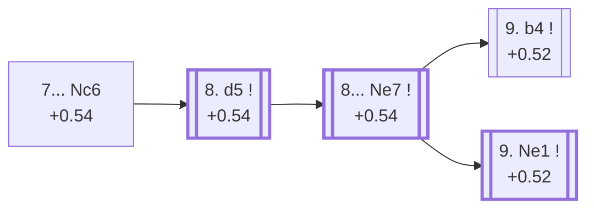

<a name="_TOP_"></a>

# E97 King's Indian Defence: Orthodox, Aronin-Taimanov Variation (Mar del Plata) <br> 1. d4 Nf6 2. c4 g6 3. Nc3 Bg7 4. e4 d6 5. Nf3 O-O 6. Be2 e5 7. O-O Nc6 #

Continues from [E94's own root](https://github.com/onclemarcel/chess_flashcards/blob/main/d4_openings/E94_Kings_Indian_Orthodox_Variation.md#_initial_move_), where **7... Nc6** (68.9% masters) is by a wide margin White's most-faced reply to 7. O-O — as noted there, it dwarfs E94's own further-named entries. This is arguably the single most famous structure in the entire King's Indian Defence: the **Aronin-Taimanov Variation**, universally known by its two informal names, the **Mar del Plata Variation** (after the 1953 Argentine tournament where Herman Pilnik's handling of it against Miguel Najdorf helped popularise the plan) and the **Yugoslav Attack**. It defines the archetypal King's Indian middlegame: White expands on the queenside with b4/c5, Black storms the kingside with ... f5/... f4/... g5, and the two attacks race each other with the kings themselves usually staying put on opposite sides, watching their own pawns do the fighting. Live-tagged **King's Indian Defense: Orthodox Variation, Aronin-Taimanov Defense** — a Variation/Defense drift from `eco.md`'s own naming, and Lichess's own opening book doesn't carry the Mar del Plata/Yugoslav Attack aliases at all, even though they're the names used almost universally in chess literature.

### Overview

*Quick map of every move covered on this card — see the [shape key](https://github.com/onclemarcel/chess_flashcards/blob/main/start.md#content-diagram-optional) in start.md.*

<!-- content-diagram:start -->

<!-- content-diagram:end -->

<a name="_initial_move_"></a>

[](https://lichess.org/analysis/standard/r1bq1rk1/ppp2pbp/2np1np1/4p3/2PPP3/2N2N2/PP2BPPP/R1BQ1RK1_w_-_-_2_8)

*... 7... Nc6 — King's Indian Defence: Orthodox, Aronin-Taimanov Variation (Mar del Plata)*

```
r1bq1rk1/ppp2pbp/2np1np1/4p3/2PPP3/2N2N2/PP2BPPP/R1BQ1RK1 w - - 2 8
```

|  | +0.54 |
| --- | --- |

<!-- lichess-stats:start fen="r1bq1rk1/ppp2pbp/2np1np1/4p3/2PPP3/2N2N2/PP2BPPP/R1BQ1RK1 w - - 2 8" db="lichess,masters" speeds="bullet,blitz" ratings="1800,2000,2200,2500" moves="6" -->
| Move | Online | W/D/B | Masters | W/D/B | |
| :--- | ---: | :--- | ---: | :--- | :-- |
| d5 | 1.1 M (87.0%) | ⬜⬜⬜⬜⬜🟫⬛⬛⬛⬛ 52/5/44 | 19 k (93.2%) | ⬜⬜⬜⬜🟫🟫🟫🟫⬛⬛ 36/42/21 |  |
| dxe5 | 69 k (5.6%) | ⬜⬜⬜⬜⬜🟫⬛⬛⬛⬛ 53/9/38 | 326 (1.6%) | ⬜⬜⬜🟫🟫🟫🟫🟫⬛⬛ 26/54/20 |  |
| Be3 | 65 k (5.3%) | ⬜⬜⬜⬜⬜🟫⬛⬛⬛⬛ 52/6/42 | 1.0 k (5.1%) | ⬜⬜⬜⬜🟫🟫🟫🟫⬛⬛ 37/42/21 |  |
| h3 | 12 k (1.0%) | ⬜⬜⬜⬜🟫⬛⬛⬛⬛⬛ 44/6/50 | 0 | — | ⚠ |
| Bg5 | 7.8 k (0.6%) | ⬜⬜⬜⬜⬜⬛⬛⬛⬛⬛ 46/5/49 | 3 (0.0%) | — | ⚠ |
| Re1 | 2.8 k (0.2%) | ⬜⬜⬜⬜🟫⬛⬛⬛⬛⬛ 43/6/51 | 4 (0.0%) | — | ⚠ |
| Ne1 | 0 | — | 2 (0.0%) | — |  |

*Online: bullet/blitz, 1800+ — 1.2 M games. Masters: 20 k games. [Open in the explorer](https://lichess.org/analysis/standard/r1bq1rk1/ppp2pbp/2np1np1/4p3/2PPP3/2N2N2/PP2BPPP/R1BQ1RK1_w_-_-_2_8#explorer) — updated 2026-09-14*
<!-- lichess-stats:end -->

**8. d5** is essentially automatic (93.2% masters) — closing the centre is the whole point of allowing ... Nc6 in the first place, gaining space and forcing the knight to move again. This is the move that gives the Mar del Plata its whole character: with the centre locked, neither side can easily break through in the middle, so both sides commit to attacking on the flank where they already have more space.

### Candidate moves

* [**8. d5**](#_d5_) (+0.54, 93.2% masters): essentially automatic — this card's own trunk, see below.
* **8. dxe5** (1.6% masters) / **8. Be3** (5.1% masters): real, minor secondaries that release the tension instead — neither carries a code of its own in this range.

[*Back to TOP*](#_TOP_)

---

<a name="_d5_"></a>

## 8. d5

[](https://lichess.org/analysis/standard/r1bq1rk1/ppp2pbp/2np1np1/3Pp3/2P1P3/2N2N2/PP2BPPP/R1BQ1RK1_b_-_-_0_8)

*... 8. d5*

```
r1bq1rk1/ppp2pbp/2np1np1/3Pp3/2P1P3/2N2N2/PP2BPPP/R1BQ1RK1 b - - 0 8
```

|  | +0.54 |
| --- | --- |

<!-- lichess-stats:start fen="r1bq1rk1/ppp2pbp/2np1np1/3Pp3/2P1P3/2N2N2/PP2BPPP/R1BQ1RK1 b - - 0 8" db="lichess,masters" speeds="bullet,blitz" ratings="1800,2000,2200,2500" moves="4" -->
| Move | Online | W/D/B | Masters | W/D/B | |
| :--- | ---: | :--- | ---: | :--- | :-- |
| Ne7 | 1.0 M (96.6%) | ⬜⬜⬜⬜⬜🟫⬛⬛⬛⬛ 52/5/43 | 19 k (99.9%) | ⬜⬜⬜⬜🟫🟫🟫🟫⬛⬛ 36/42/21 |  |
| Nd4 | 19 k (1.8%) | ⬜⬜⬜⬜⬜⬛⬛⬛⬛⬛ 47/6/47 | 4 (0.0%) | — | ⚠ |
| Nb8 | 14 k (1.3%) | ⬜⬜⬜⬜⬜⬛⬛⬛⬛⬛ 48/5/46 | 14 (0.1%) | — |  |
| Nb4 | 2.5 k (0.2%) | ⬜⬜⬜⬜⬜⬛⬛⬛⬛⬛ 50/4/46 | 3 (0.0%) | — | ⚠ |

*Online: bullet/blitz, 1800+ — 1.1 M games. Masters: 19 k games. [Open in the explorer](https://lichess.org/analysis/standard/r1bq1rk1/ppp2pbp/2np1np1/3Pp3/2P1P3/2N2N2/PP2BPPP/R1BQ1RK1_b_-_-_0_8#explorer) — updated 2026-09-14*
<!-- lichess-stats:end -->

**8... Ne7** is played in essentially every masters game (99.9%) — the knight relocates toward f5, g6, or eventually g8-covering duty, freeing the c8-bishop's diagonal and keeping the c6-pawn lever available. This is the single most forced moment anywhere on this whole card.

<a name="_Ne7_"></a>

## 8... Ne7

[](https://lichess.org/analysis/standard/r1bq1rk1/ppp1npbp/3p1np1/3Pp3/2P1P3/2N2N2/PP2BPPP/R1BQ1RK1_w_-_-_1_9)

*... 8... Ne7 — King's Indian Defence: Orthodox, Aronin-Taimanov Variation (Mar del Plata)*

```
r1bq1rk1/ppp1npbp/3p1np1/3Pp3/2P1P3/2N2N2/PP2BPPP/R1BQ1RK1 w - - 1 9
```

|  | +0.54 |
| --- | --- |

<!-- lichess-stats:start fen="r1bq1rk1/ppp1npbp/3p1np1/3Pp3/2P1P3/2N2N2/PP2BPPP/R1BQ1RK1 w - - 1 9" db="lichess,masters" speeds="bullet,blitz" ratings="1800,2000,2200,2500" moves="4" -->
| Move | Online | W/D/B | Masters | W/D/B | |
| :--- | ---: | :--- | ---: | :--- | :-- |
| Ne1 | 477 k (45.9%) | ⬜⬜⬜⬜⬜🟫⬛⬛⬛⬛ 54/5/42 | 7.1 k (37.8%) | ⬜⬜⬜⬜🟫🟫🟫🟫⬛⬛ 36/41/23 |  |
| b4 | 330 k (31.7%) | ⬜⬜⬜⬜⬜🟫⬛⬛⬛⬛ 52/5/43 | 7.8 k (41.8%) | ⬜⬜⬜🟫🟫🟫🟫🟫⬛⬛ 35/47/18 |  |
| Nd2 | 56 k (5.3%) | ⬜⬜⬜⬜⬜🟫⬛⬛⬛⬛ 52/5/43 | 2.4 k (12.9%) | ⬜⬜⬜⬜🟫🟫🟫⬛⬛⬛ 40/34/26 |  |
| Bg5 | 54 k (5.2%) | ⬜⬜⬜⬜⬜⬛⬛⬛⬛⬛ 46/4/49 | 443 (2.4%) | ⬜⬜⬜⬜🟫🟫🟫⬛⬛⬛ 42/30/28 |  |

*Online: bullet/blitz, 1800+ — 1.0 M games. Masters: 19 k games. [Open in the explorer](https://lichess.org/analysis/standard/r1bq1rk1/ppp1npbp/3p1np1/3Pp3/2P1P3/2N2N2/PP2BPPP/R1BQ1RK1_w_-_-_1_9#explorer) — updated 2026-09-14*
<!-- lichess-stats:end -->

This is the Mar del Plata's own defining crossroads, and it's a genuine near-even split between the two moves that give the whole structure its opposite-wing-race reputation: **9. b4** (41.8% masters, narrowly ahead) is the **bayonet Attack**, throwing the queenside pawns forward at once, while **9. Ne1** (37.8%) rerouts the knight toward d3 or f3 first, preparing f3/g4 more slowly and carrying its own further chain of codes ([E98](https://github.com/onclemarcel/chess_flashcards/blob/main/d4_openings/E98_Kings_Indian_Mar_Del_Plata_Ne1.md) onward). Unlike almost every other fork in this whole batch, both real tries here carry their own name and code — there's no uncoded majority lurking behind either of them.

### Candidate moves

* [**9. b4**](#_b4_) (+0.52, 41.8% masters): the bayonet Attack — the more direct queenside plan, see below.
* [**9. Ne1**](https://github.com/onclemarcel/chess_flashcards/blob/main/d4_openings/E98_Kings_Indian_Mar_Del_Plata_Ne1.md) (+0.52, 37.8% masters): rerouting the knight first — its own code, [E98](https://github.com/onclemarcel/chess_flashcards/blob/main/d4_openings/E98_Kings_Indian_Mar_Del_Plata_Ne1.md) onward, this batch's own deepest continuous spine.
* **9. Nd2** (12.9% masters): a real, significant secondary with no code of its own in this range.

[*Back to 8. d5*](#_d5_)
[*Back to TOP*](#_TOP_)

---

<a name="_b4_"></a>

## 9. b4 — bayonet Attack

[](https://lichess.org/analysis/standard/r1bq1rk1/ppp1npbp/3p1np1/3Pp3/1PP1P3/2N2N2/P3BPPP/R1BQ1RK1_b_-_b3_0_9)

*... 9. b4 — King's Indian Defence: Orthodox, Aronin-Taimanov, bayonet Attack*

```
r1bq1rk1/ppp1npbp/3p1np1/3Pp3/1PP1P3/2N2N2/P3BPPP/R1BQ1RK1 b - b3 0 9
```

|  | +0.52 |
| --- | --- |

<!-- lichess-stats:start fen="r1bq1rk1/ppp1npbp/3p1np1/3Pp3/1PP1P3/2N2N2/P3BPPP/R1BQ1RK1 b - b3 0 9" db="lichess,masters" speeds="bullet,blitz" ratings="1800,2000,2200,2500" moves="5" -->
| Move | Online | W/D/B | Masters | W/D/B | |
| :--- | ---: | :--- | ---: | :--- | :-- |
| a5 | 98 k (29.8%) | ⬜⬜⬜⬜⬜🟫⬛⬛⬛⬛ 53/6/42 | 2.0 k (25.5%) | ⬜⬜⬜⬜🟫🟫🟫🟫⬛⬛ 37/43/20 |  |
| Ne8 | 78 k (23.5%) | ⬜⬜⬜⬜⬜⬛⬛⬛⬛⬛ 51/4/45 | 743 (9.5%) | ⬜⬜⬜⬜🟫🟫🟫⬛⬛⬛ 37/36/26 |  |
| Nh5 | 74 k (22.4%) | ⬜⬜⬜⬜⬜🟫⬛⬛⬛⬛ 51/5/44 | 4.7 k (59.9%) | ⬜⬜⬜🟫🟫🟫🟫🟫⬛⬛ 33/52/15 |  |
| Nd7 | 50 k (15.1%) | ⬜⬜⬜⬜⬜🟫⬛⬛⬛⬛ 54/4/42 | 114 (1.5%) | ⬜⬜⬜⬜🟫🟫🟫🟫⬛⬛ 40/36/24 |  |
| h6 | 8.7 k (2.6%) | ⬜⬜⬜⬜⬜⬛⬛⬛⬛⬛ 50/4/47 | 0 | — | ⚠ |
| c6 | 0 | — | 187 (2.4%) | ⬜⬜⬜⬜🟫🟫🟫⬛⬛⬛ 45/27/27 |  |

*Online: bullet/blitz, 1800+ — 330 k games. Masters: 7.8 k games. [Open in the explorer](https://lichess.org/analysis/standard/r1bq1rk1/ppp1npbp/3p1np1/3Pp3/1PP1P3/2N2N2/P3BPPP/R1BQ1RK1_b_-_b3_0_9#explorer) — updated 2026-09-14*
<!-- lichess-stats:end -->

Live-tagged **King's Indian Defense: Orthodox Variation, Bayonet Attack**, matching `eco.md`'s own name almost exactly. Named for the direct, thrusting pawn advance rather than a piece manoeuvre, White races to c5 before Black's own kingside pawns can arrive — the sharpest, most concretely forcing of the Mar del Plata's own main plans. Masters overwhelmingly answer with **9... Nh5** (59.9%), preparing ... f5 while eyeing the standard ... Nh5-f4 or ... f5-f4-g4 storm; the online-favoured **9... a5** (29.8% online, only 25.5% masters) strikes back on the queenside instead, undermining b4 before it can be supported by a3/Bb2. Not built further here.

[*Back to 8... Ne7*](#_Ne7_)
[*Back to TOP*](#_TOP_)
