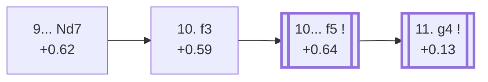

<a name="_TOP_"></a>

# E99 King's Indian Defence: Orthodox, Aronin-Taimanov, Main Line <br> 1. d4 Nf6 2. c4 g6 3. Nc3 Bg7 4. e4 d6 5. Nf3 O-O 6. Be2 e5 7. O-O Nc6 8. d5 Ne7 9. Ne1 Nd7 10. f3 f5 #

Continues from [E98's own "9. Ne1" node](https://github.com/onclemarcel/chess_flashcards/blob/main/d4_openings/E98_Kings_Indian_Mar_Del_Plata_Ne1.md#_TOP_), where **9... Nd7** (86.3% masters) rerouted the kingside knight. `eco.md` compresses White's 10th move and Black's reply into a single bullet, **10. f3 f5**, reaching this batch's own final root and the deepest and last node of the entire E90-E99 sweep — the point where both sides' plans are finally fully committed: White's queenside minority attack against Black's kingside pawn storm.

### Overview

*Quick map of every move covered on this card — see the [shape key](https://github.com/onclemarcel/chess_flashcards/blob/main/start.md#content-diagram-optional) in start.md.*

<!-- content-diagram:start -->

<!-- content-diagram:end -->

<a name="_initial_move_"></a>

[](https://lichess.org/analysis/standard/r1bq1rk1/pppnnpbp/3p2p1/3Pp3/2P1P3/2N5/PP2BPPP/R1BQNRK1_w_-_-_3_10)

*... 9... Nd7*

```
r1bq1rk1/pppnnpbp/3p2p1/3Pp3/2P1P3/2N5/PP2BPPP/R1BQNRK1 w - - 3 10
```

|  | +0.62 |
| --- | --- |

<!-- lichess-stats:start fen="r1bq1rk1/pppnnpbp/3p2p1/3Pp3/2P1P3/2N5/PP2BPPP/R1BQNRK1 w - - 3 10" db="lichess,masters" speeds="bullet,blitz" ratings="1800,2000,2200,2500" moves="4" -->
| Move | Online | W/D/B | Masters | W/D/B | |
| :--- | ---: | :--- | ---: | :--- | :-- |
| Be3 | 118 k (47.6%) | ⬜⬜⬜⬜⬜⬜⬛⬛⬛⬛ 55/4/41 | 2.7 k (44.3%) | ⬜⬜⬜⬜🟫🟫🟫🟫⬛⬛ 35/41/24 |  |
| Nd3 | 82 k (33.2%) | ⬜⬜⬜⬜⬜🟫⬛⬛⬛⬛ 53/5/42 | 2.1 k (35.1%) | ⬜⬜⬜⬜🟫🟫🟫🟫⬛⬛ 36/39/25 |  |
| f3 | 40 k (16.1%) | ⬜⬜⬜⬜⬜🟫⬛⬛⬛⬛ 54/5/41 | 1.2 k (19.4%) | ⬜⬜⬜🟫🟫🟫🟫🟫⬛⬛ 31/52/17 |  |
| f4 | 1.9 k (0.8%) | ⬜⬜⬜⬜🟫⬛⬛⬛⬛⬛ 41/5/53 | 0 | — | ⚠ |
| Bd2 | 0 | — | 34 (0.6%) | ⬜⬜⬜⬜🟫🟫🟫⬛⬛⬛ 44/26/29 |  |

*Online: bullet/blitz, 1800+ — 247 k games. Masters: 6.1 k games. [Open in the explorer](https://lichess.org/analysis/standard/r1bq1rk1/pppnnpbp/3p2p1/3Pp3/2P1P3/2N5/PP2BPPP/R1BQNRK1_w_-_-_3_10#explorer) — updated 2026-09-08*
<!-- lichess-stats:end -->

Another genuine "coded trails uncoded rivals" finding to close out this batch: `eco.md`'s own "Main line" begins with **10. f3** — but that's actually masters' *third* choice at this fork (19.4%), well behind both **10. Be3** (44.3%) and **10. Nd3** (35.1%), neither of which carries a code of its own here. This card still follows f3 onward, matching `eco.md`'s own chain, but the frequency gap is worth stating plainly.

### Candidate moves

* [**10. f3**](#_f3_) (+0.59, 19.4% masters): `eco.md`'s own "Main line", despite trailing both rivals — this card's own trunk, see below.
* **10. Be3** (44.3% masters) / **10. Nd3** (35.1% masters): masters' two actual favourites, both real, significant secondaries with no code of their own in this range — Be3 develops toward Qd2, Nd3 heads for the classical outpost supporting c5.

[*Back to 9. Ne1*](https://github.com/onclemarcel/chess_flashcards/blob/main/d4_openings/E98_Kings_Indian_Mar_Del_Plata_Ne1.md#_TOP_)
[*Back to TOP*](#_TOP_)

---

<a name="_f3_"></a>

## 10. f3

[](https://lichess.org/analysis/standard/r1bq1rk1/pppnnpbp/3p2p1/3Pp3/2P1P3/2N2P2/PP2B1PP/R1BQNRK1_b_-_-_0_10)

*... 10. f3*

```
r1bq1rk1/pppnnpbp/3p2p1/3Pp3/2P1P3/2N2P2/PP2B1PP/R1BQNRK1 b - - 0 10
```

|  | +0.59 |
| --- | --- |

<!-- lichess-stats:start fen="r1bq1rk1/pppnnpbp/3p2p1/3Pp3/2P1P3/2N2P2/PP2B1PP/R1BQNRK1 b - - 0 10" db="lichess,masters" speeds="bullet,blitz" ratings="1800,2000,2200,2500" moves="3" -->
| Move | Online | W/D/B | Masters | W/D/B | |
| :--- | ---: | :--- | ---: | :--- | :-- |
| f5 | 38 k (94.8%) | ⬜⬜⬜⬜⬜🟫⬛⬛⬛⬛ 54/5/41 | 1.2 k (99.6%) | ⬜⬜⬜🟫🟫🟫🟫🟫⬛⬛ 31/52/17 |  |
| a5 | 1.4 k (3.4%) | ⬜⬜⬜⬜⬜🟫⬛⬛⬛⬛ 54/6/40 | 2 (0.2%) | — | ⚠ |
| Nc5 | 156 (0.4%) | ⬜⬜⬜⬜⬜⬜🟫⬛⬛⬛ 62/5/33 | 0 | — | ⚠ |
| Kh8 | 0 | — | 3 (0.3%) | — |  |

*Online: bullet/blitz, 1800+ — 40 k games. Masters: 1.2 k games. [Open in the explorer](https://lichess.org/analysis/standard/r1bq1rk1/pppnnpbp/3p2p1/3Pp3/2P1P3/2N2P2/PP2B1PP/R1BQNRK1_b_-_-_0_10#explorer) — updated 2026-09-08*
<!-- lichess-stats:end -->

**10... f5** is essentially forced once White has actually played f3 (99.6% masters) — the whole point of the move order, striking at the kingside before White's own knight can settle on d3 or f3 for good. This reaches `eco.md`'s own true named tabiya.

<a name="_f5_"></a>

## 10... f5 — Main Line

[](https://lichess.org/analysis/standard/r1bq1rk1/pppnn1bp/3p2p1/3Ppp2/2P1P3/2N2P2/PP2B1PP/R1BQNRK1_w_-_f6_0_11)

*... 10... f5 — King's Indian Defence: Orthodox, Aronin-Taimanov, Main Line*

```
r1bq1rk1/pppnn1bp/3p2p1/3Ppp2/2P1P3/2N2P2/PP2B1PP/R1BQNRK1 w - f6 0 11
```

|  | +0.64 |
| --- | --- |

<!-- lichess-stats:start fen="r1bq1rk1/pppnn1bp/3p2p1/3Ppp2/2P1P3/2N2P2/PP2B1PP/R1BQNRK1 w - f6 0 11" db="lichess,masters" speeds="bullet,blitz" ratings="1800,2000,2200,2500" moves="5" -->
| Move | Online | W/D/B | Masters | W/D/B | |
| :--- | ---: | :--- | ---: | :--- | :-- |
| g4 | 21 k (54.5%) | ⬜⬜⬜⬜⬜🟫⬛⬛⬛⬛ 56/6/38 | 534 (45.3%) | ⬜⬜⬜⬜🟫🟫🟫🟫⬛⬛ 36/43/21 |  |
| Be3 | 15 k (39.2%) | ⬜⬜⬜⬜⬜⬛⬛⬛⬛⬛ 51/4/45 | 403 (34.2%) | ⬜⬜⬜🟫🟫🟫🟫🟫⬛⬛ 27/56/17 |  |
| Nd3 | 1.8 k (4.7%) | ⬜⬜⬜⬜⬜⬛⬛⬛⬛⬛ 49/4/46 | 217 (18.4%) | ⬜⬜🟫🟫🟫🟫🟫🟫🟫⬛ 25/68/7 |  |
| Bd2 | 175 (0.5%) | ⬜⬜⬜⬜⬜🟫⬛⬛⬛⬛ 49/7/45 | 3 (0.3%) | — | ⚠ |
| b4 | 140 (0.4%) | ⬜⬜⬜⬜⬜⬛⬛⬛⬛⬛ 45/4/51 | 0 | — | ⚠ |
| Bg5 | 0 | — | 21 (1.8%) | ⬜⬜⬜⬜🟫🟫🟫🟫⬛⬛ 43/38/19 |  |

*Online: bullet/blitz, 1800+ — 38 k games. Masters: 1.2 k games. [Open in the explorer](https://lichess.org/analysis/standard/r1bq1rk1/pppnn1bp/3p2p1/3Ppp2/2P1P3/2N2P2/PP2B1PP/R1BQNRK1_w_-_f6_0_11#explorer) — updated 2026-09-08*
<!-- lichess-stats:end -->

Live-tagged **King's Indian Defense: Orthodox Variation, Classical System, Traditional Line** — a full name divergence from `eco.md`'s own "Main line", the biggest single naming gap found anywhere in this whole batch. White's own three real tries here rank closely: **11. g4** (45.3% masters, the plurality) meets the kingside pawn storm head-on with a counter-thrust of its own, **11. Be3** (34.2%) develops calmly first, and **11. Nd3** (18.4%) finally completes the knight's rerouting from move 9.

### Candidate moves

* [**11. g4**](#_g4_) (+0.13, 45.3% masters): the Benko Attack — masters' actual plurality, see below.
* **11. Be3** (34.2% masters): a real, major secondary with no code of its own in this range.
* **11. Nd3** (18.4% masters): completing the knight's own long journey from move 9, likewise uncoded here.

[*Back to 10. f3*](#_f3_)
[*Back to TOP*](#_TOP_)

---

<a name="_g4_"></a>

## 11. g4 — Benko Attack

[](https://lichess.org/analysis/standard/r1bq1rk1/pppnn1bp/3p2p1/3Ppp2/2P1P1P1/2N2P2/PP2B2P/R1BQNRK1_b_-_g3_0_11)

*... 11. g4 — King's Indian Defence: Orthodox, Aronin-Taimanov, Benko Attack*

```
r1bq1rk1/pppnn1bp/3p2p1/3Ppp2/2P1P1P1/2N2P2/PP2B2P/R1BQNRK1 b - g3 0 11
```

|  | +0.13 |
| --- | --- |

<!-- lichess-stats:start fen="r1bq1rk1/pppnn1bp/3p2p1/3Ppp2/2P1P1P1/2N2P2/PP2B2P/R1BQNRK1 b - g3 0 11" db="lichess,masters" speeds="bullet,blitz" ratings="1800,2000,2200,2500" moves="4" -->
| Move | Online | W/D/B | Masters | W/D/B | |
| :--- | ---: | :--- | ---: | :--- | :-- |
| Nf6 | 5.2 k (24.0%) | ⬜⬜⬜⬜⬜⬜⬛⬛⬛⬛ 56/6/38 | 159 (29.1%) | ⬜⬜⬜⬜🟫🟫🟫🟫⬛⬛ 38/37/25 |  |
| f4 | 5.2 k (24.0%) | ⬜⬜⬜⬜⬜🟫⬛⬛⬛⬛ 55/5/40 | 56 (10.3%) | ⬜⬜⬜⬜🟫🟫🟫🟫🟫⬛ 39/50/11 |  |
| fxg4 | 4.5 k (20.8%) | ⬜⬜⬜⬜⬜⬜🟫⬛⬛⬛ 59/7/34 | 0 | — | ⚠ |
| Kh8 | 3.4 k (15.8%) | ⬜⬜⬜⬜⬜🟫⬛⬛⬛⬛ 52/7/41 | 294 (53.8%) | ⬜⬜⬜⬜🟫🟫🟫🟫⬛⬛ 34/44/23 |  |
| h5 | 0 | — | 10 (1.8%) | — |  |

*Online: bullet/blitz, 1800+ — 22 k games. Masters: 546 games. [Open in the explorer](https://lichess.org/analysis/standard/r1bq1rk1/pppnn1bp/3p2p1/3Ppp2/2P1P1P1/2N2P2/PP2B2P/R1BQNRK1_b_-_g3_0_11#explorer) — updated 2026-09-08*
<!-- lichess-stats:end -->

Live-tagged **King's Indian Defense: Orthodox Variation, Classical System, Benko Attack** — matching `eco.md`'s own name well, and named for Pal Benko, whose own name is attached to at least three genuinely unrelated entries across this whole repository (the Benko Gambit at A57-A59, "Benko's Opening" as an alias for the Hungarian Opening at A00, and now this Benko Attack). Rather than capturing at once, masters overwhelmingly tuck the king away first with **11... Kh8** (53.8%), getting off the long diagonal and the coming g-file before committing to a plan — well ahead of the immediate **11... Nf6** (29.1%, retreating the rerouted knight to challenge g4 directly) or **11... f4** (10.3%, closing the kingside immediately instead of trading on g4). Stockfish's eval here (+0.13) is the flattest of any node reached anywhere in this whole batch — after eleven moves of mutual, fully committed flank play, the position is close to balanced chances on both sides, exactly the sharp, roughly-even race the Mar del Plata is famous for. This is the deepest node built anywhere in the E90-E99 batch; not explored further.

[*Back to 10... f5*](#_f5_)
[*Back to TOP*](#_TOP_)
