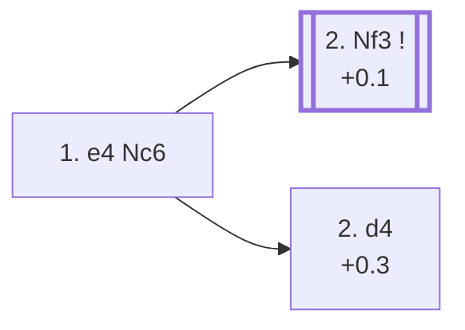

<a name="_TOP_"></a>

# B00 Nimzowitsch Defense <br> 1. e4 Nc6 #

Named after Aron Nimzowitsch, one of the founders of the hypermodern school of chess thought — the idea of controlling the centre with pieces rather than occupying it with pawns straight away. Black develops a piece immediately and keeps the pawn structure entirely flexible, deciding only later whether to strike the centre with ... d5, ... e5, or ... d6/... e5. It's a real, playable try, just a rare one: only 1.5% of masters games after 1. e4.

### Overview

*Quick map of every move covered on this card — see the [shape key](https://github.com/onclemarcel/chess_flashcards/blob/main/start.md#content-diagram-optional) in start.md.*

<!-- content-diagram:start -->

<!-- content-diagram:end -->

<a name="_initial_move_"></a>

[](https://lichess.org/analysis/standard/r1bqkbnr/pppppppp/2n5/8/4P3/8/PPPP1PPP/RNBQKBNR_w_KQkq_-_1_2)

*... 1. e4 Nc6 — Nimzowitsch Defense*

```
r1bqkbnr/pppppppp/2n5/8/4P3/8/PPPP1PPP/RNBQKBNR w KQkq - 1 2
```

|  | +0.4 |
| --- | --- |

<!-- lichess-stats:start fen="r1bqkbnr/pppppppp/2n5/8/4P3/8/PPPP1PPP/RNBQKBNR w KQkq - 1 2" db="lichess,masters" speeds="bullet,blitz" ratings="1800,2000,2200,2500" moves="6" -->
| Move | Online | W/D/B | Masters | W/D/B | |
| :--- | ---: | :--- | ---: | :--- | :-- |
| d4 | 7.1 M (37.8%) | ⬜⬜⬜⬜⬜⬛⬛⬛⬛⬛ 47/4/49 | 1.8 k (28.4%) | ⬜⬜⬜⬜🟫🟫🟫⬛⬛⬛ 37/32/31 |  |
| Nf3 | 6.8 M (36.3%) | ⬜⬜⬜⬜⬜⬛⬛⬛⬛⬛ 48/4/48 | 3.8 k (59.9%) | ⬜⬜⬜⬜🟫🟫🟫⬛⬛⬛ 39/34/27 |  |
| Nc3 | 2.1 M (11.4%) | ⬜⬜⬜⬜⬜⬛⬛⬛⬛⬛ 51/4/45 | 626 (9.9%) | ⬜⬜⬜⬜🟫🟫🟫⬛⬛⬛ 39/31/29 |  |
| f4 | 789 k (4.2%) | ⬜⬜⬜⬜⬜⬛⬛⬛⬛⬛ 47/3/50 | 18 (0.3%) | — |  |
| Bc4 | 741 k (3.9%) | ⬜⬜⬜⬜⬜⬛⬛⬛⬛⬛ 47/4/49 | 0 | — | ⚠ |
| d3 | 453 k (2.4%) | ⬜⬜⬜⬜⬜⬛⬛⬛⬛⬛ 46/4/49 | 23 (0.4%) | ⬜⬜⬜🟫🟫🟫🟫⬛⬛⬛ 26/39/35 |  |
| Bb5 | 0 | — | 50 (0.8%) | ⬜⬜⬜⬜⬜🟫🟫🟫⬛⬛ 46/32/22 |  |

*Online: bullet/blitz, 1800+ — 18.8 M games. Masters: 6.3 k games. [Open in the explorer](https://lichess.org/analysis/standard/r1bqkbnr/pppppppp/2n5/8/4P3/8/PPPP1PPP/RNBQKBNR_w_KQkq_-_1_2#explorer) — updated 2026-09-02*
<!-- lichess-stats:end -->

### Candidate moves

* [**2. Nf3**](#_Nf3_) (+0.1): the simplest, most natural developing move, and masters' clear main try (59.9%), keeping every central pawn break available.
* [**2. d4**](#_d4_) (+0.3): the *Scandinavian Variation* — stakes out the centre at once. Masters' second choice (28.4%); Black usually replies **2... d5**, striking back immediately.
* **2. Nc3** (masters 9.9%): also fine, mirroring Black's own flexible development.

[*Back to TOP*](#_TOP_)

---

<a name="_Nf3_"></a>

### 2. Nf3

[](https://lichess.org/analysis/standard/r1bqkbnr/pppppppp/2n5/8/4P3/5N2/PPPP1PPP/RNBQKB1R_b_KQkq_-_2_2)

*... 2. Nf3*

```
r1bqkbnr/pppppppp/2n5/8/4P3/5N2/PPPP1PPP/RNBQKB1R b KQkq - 2 2
```

|  | +0.1 |
| --- | --- |

<!-- lichess-stats:start fen="r1bqkbnr/pppppppp/2n5/8/4P3/5N2/PPPP1PPP/RNBQKB1R b KQkq - 2 2" db="lichess,masters" speeds="bullet,blitz" ratings="1800,2000,2200,2500" moves="6" -->
| Move | Online | W/D/B | Masters | W/D/B | |
| :--- | ---: | :--- | ---: | :--- | :-- |
| e5 | 2.9 M (40.0%) | ⬜⬜⬜⬜⬜⬛⬛⬛⬛⬛ 50/4/46 | 960 (23.9%) | ⬜⬜⬜🟫🟫🟫🟫⬛⬛⬛ 33/41/26 |  |
| d5 | 1.4 M (19.3%) | ⬜⬜⬜⬜🟫⬛⬛⬛⬛⬛ 44/5/51 | 345 (8.6%) | ⬜⬜⬜⬜🟫🟫🟫⬛⬛⬛ 43/30/28 |  |
| d6 | 927 k (13.0%) | ⬜⬜⬜⬜⬜⬛⬛⬛⬛⬛ 48/5/47 | 2.2 k (53.8%) | ⬜⬜⬜⬜🟫🟫🟫⬛⬛⬛ 39/33/28 |  |
| f5 | 820 k (11.5%) | ⬜⬜⬜⬜⬜⬛⬛⬛⬛⬛ 46/4/50 | 150 (3.7%) | ⬜⬜⬜⬜🟫🟫🟫⬛⬛⬛ 43/28/29 |  |
| Nf6 | 381 k (5.3%) | ⬜⬜⬜⬜⬜⬛⬛⬛⬛⬛ 49/5/47 | 162 (4.0%) | ⬜⬜⬜⬜⬜🟫🟫⬛⬛⬛ 47/25/28 |  |
| e6 | 376 k (5.3%) | ⬜⬜⬜⬜⬜⬛⬛⬛⬛⬛ 50/4/46 | 144 (3.6%) | ⬜⬜⬜⬜⬜🟫🟫🟫⬛⬛ 51/30/19 |  |

*Online: bullet/blitz, 1800+ — 7.1 M games. Masters: 4.0 k games. [Open in the explorer](https://lichess.org/analysis/standard/r1bqkbnr/pppppppp/2n5/8/4P3/5N2/PPPP1PPP/RNBQKB1R_b_KQkq_-_2_2#explorer) — updated 2026-09-02*
<!-- lichess-stats:end -->

* **2... d6** (53.8% masters): the main try, keeping the position flexible and preparing ... Nf6/... e5 or ... g6, often transposing toward Pirc- or Philidor-like structures with the knight already developed.
* **2... e5** (23.9% masters): transposes directly into King's Pawn Game / King's Knight Opening territory.
* **2... d5** (8.6% masters): strikes the centre immediately, similar in spirit to the Scandinavian.

> [!NOTE]
> **2... f5!?**, the *Colorado Countergambit* (+0.9, mention-only), offers a pawn immediately in Bird's-Opening style — a real but distinctly minor try (3.7% masters). **3. exf5** is masters' overwhelming reply (90.7%), simply accepting.

[*Back to 1... Nc6*](#_initial_move_)
[*Back to TOP*](#_TOP_)

---

> [!NOTE]
> **2. b4!?**, the *Wheeler Gambit*, offers the b-pawn immediately to gain a tempo on the newly-developed knight — a genuine database curiosity with zero masters games recorded, and per Stockfish a real error (−0.6). Masters' own short-PGN line runs **2... Nxb4 3. c3 Nc6 4. d4**, simply banking the extra pawn and reaching a favourable centre for Black.
>
> [*Back to 1... Nc6*](#_initial_move_)
> [*Back to TOP*](#_TOP_)

---

<a name="_d4_"></a>

### 2. d4 — Scandinavian Variation

[](https://lichess.org/analysis/standard/r1bqkbnr/pppppppp/2n5/8/3PP3/8/PPP2PPP/RNBQKBNR_b_KQkq_d3_0_2)

*... 2. d4 — Scandinavian Variation*

```
r1bqkbnr/pppppppp/2n5/8/3PP3/8/PPP2PPP/RNBQKBNR b KQkq d3 0 2
```

|  | +0.3 |
| --- | --- |

<!-- lichess-stats:start fen="r1bqkbnr/pppppppp/2n5/8/3PP3/8/PPP2PPP/RNBQKBNR b KQkq d3 0 2" db="lichess,masters" speeds="bullet,blitz" ratings="1800,2000,2200,2500" moves="6" -->
| Move | Online | W/D/B | Masters | W/D/B | |
| :--- | ---: | :--- | ---: | :--- | :-- |
| e5 | 3.7 M (50.7%) | ⬜⬜⬜⬜⬜⬛⬛⬛⬛⬛ 44/4/52 | 621 (31.6%) | ⬜⬜⬜⬜🟫🟫🟫⬛⬛⬛ 38/31/31 |  |
| d5 | 2.4 M (33.3%) | ⬜⬜⬜⬜⬜⬛⬛⬛⬛⬛ 47/4/49 | 1.1 k (54.9%) | ⬜⬜⬜⬜🟫🟫🟫⬛⬛⬛ 38/33/29 |  |
| e6 | 425 k (5.8%) | ⬜⬜⬜⬜⬜🟫⬛⬛⬛⬛ 53/4/43 | 13 (0.7%) | — |  |
| d6 | 340 k (4.7%) | ⬜⬜⬜⬜⬜⬛⬛⬛⬛⬛ 51/4/45 | 250 (12.7%) | ⬜⬜⬜⬜🟫🟫⬛⬛⬛⬛ 40/22/39 |  |
| Nf6 | 146 k (2.0%) | ⬜⬜⬜⬜⬜⬛⬛⬛⬛⬛ 53/3/44 | 1 (0.1%) | — | ⚠ |
| b6 | 78 k (1.1%) | ⬜⬜⬜⬜⬜⬜⬛⬛⬛⬛ 57/3/40 | 0 | — | ⚠ |
| g6 | 0 | — | 1 (0.1%) | — |  |

*Online: bullet/blitz, 1800+ — 7.3 M games. Masters: 2.0 k games. [Open in the explorer](https://lichess.org/analysis/standard/r1bqkbnr/pppppppp/2n5/8/3PP3/8/PPP2PPP/RNBQKBNR_b_KQkq_d3_0_2#explorer) — updated 2026-09-02*
<!-- lichess-stats:end -->

* [**2... d5**](#_d5_Scandi_) (54.9% masters): the main try — White's own 3rd move is a genuine three-way spread — covered below.
* **2... e5** (31.6% masters): strikes back in the centre a different way, transposing toward Vienna/Center-Game-like structures with colours and move order slightly altered.

> [!NOTE]
> **2... f6!?**, the *Neo-Mongoloid Defense* (+1.3, mention-only), delays everything else to prepare ... e5 without allowing a future Ng5 — a genuine database curiosity (zero masters games) and, per Stockfish, a real structural concession.

[*Back to 1... Nc6*](#_initial_move_)
[*Back to TOP*](#_TOP_)

---

<a name="_d5_Scandi_"></a>

### 2... d5

[](https://lichess.org/analysis/standard/r1bqkbnr/ppp1pppp/2n5/3p4/3PP3/8/PPP2PPP/RNBQKBNR_w_KQkq_d6_0_3)

*... 2... d5*

```
r1bqkbnr/ppp1pppp/2n5/3p4/3PP3/8/PPP2PPP/RNBQKBNR w KQkq d6 0 3
```

|  | +0.4 |
| --- | --- |

<!-- lichess-stats:start fen="r1bqkbnr/ppp1pppp/2n5/3p4/3PP3/8/PPP2PPP/RNBQKBNR w KQkq d6 0 3" db="lichess,masters" speeds="bullet,blitz" ratings="1800,2000,2200,2500" moves="3" -->
| Move | Online | W/D/B | Masters | W/D/B | |
| :--- | ---: | :--- | ---: | :--- | :-- |
| e5 | 1.4 M (53.9%) | ⬜⬜⬜⬜⬜⬛⬛⬛⬛⬛ 47/4/49 | 493 (45.6%) | ⬜⬜⬜⬜🟫🟫🟫⬛⬛⬛ 38/35/28 |  |
| exd5 | 826 k (31.6%) | ⬜⬜⬜⬜⬜⬛⬛⬛⬛⬛ 46/5/49 | 133 (12.3%) | ⬜⬜⬜⬜🟫🟫🟫⬛⬛⬛ 38/31/31 |  |
| Nc3 | 265 k (10.2%) | ⬜⬜⬜⬜⬜⬛⬛⬛⬛⬛ 50/4/46 | 451 (41.7%) | ⬜⬜⬜⬜🟫🟫🟫⬛⬛⬛ 39/32/29 |  |

*Online: bullet/blitz, 1800+ — 2.6 M games. Masters: 1.1 k games. [Open in the explorer](https://lichess.org/analysis/standard/r1bqkbnr/ppp1pppp/2n5/3p4/3PP3/8/PPP2PPP/RNBQKBNR_w_KQkq_d6_0_3#explorer) — updated 2026-09-02*
<!-- lichess-stats:end -->

* **3. e5** (45.6% masters): masters' clear favourite — Black's knight has already committed to c6 rather than the more flexible d7 square a real Scandinavian Defense would allow, so White gains a comfortable space advantage while Black looks to undermine e5 with ... f6 or ... Bf5/... e6 plans. Not built out further here (backlog).
* [**3. Nc3**](#_Bogolyubov_) (41.7% masters): the *Bogolyubov Variation* — covered below.
* [**3. exd5**](#_Exchange_) (12.3% masters, mention-only): trades immediately — covered below.

[*Back to 2. d4*](#_d4_)
[*Back to TOP*](#_TOP_)

---

<a name="_Bogolyubov_"></a>

### 3. Nc3 — Bogolyubov Variation

[](https://lichess.org/analysis/standard/r1bqkbnr/ppp1pppp/2n5/3p4/3PP3/2N5/PPP2PPP/R1BQKBNR_b_KQkq_-_1_3)

*... 3. Nc3 — Bogolyubov Variation*

```
r1bqkbnr/ppp1pppp/2n5/3p4/3PP3/2N5/PPP2PPP/R1BQKBNR b KQkq - 1 3
```

|  | +0.2 |
| --- | --- |

`eco.md` spells this the *Bogolyubov Variation*; Lichess's own live tag reads *Bogoljubow* — a minor spelling divergence. Keeps the central tension rather than resolving it immediately. Masters split between **3... dxe4** (40.3%) and **3... Nf6** (24.1%). Not built out further here (backlog).

[*Back to 2... d5*](#_d5_Scandi_)
[*Back to TOP*](#_TOP_)

---

> [!NOTE]
> **3. exd5 Qxd5!?**, an Exchange-like structure (+0.4, mention-only), recaptures with the queen at once — losing a tempo to White's coming knight development, the same structural cost the real [B01 Scandinavian Defense](https://github.com/onclemarcel/chess_flashcards/blob/main/e4_openings/B01_Scandinavian.md) pays, except here Black's own knight is already committed to c6 rather than staying flexible. **4. Nc3** hits the queen immediately; deeper still, **4... Qxd4!?**, the *Marshall Gambit* (−0.6, mention-only), grabs a second pawn — a genuine database curiosity (a single recorded masters game) and, per Stockfish, a real error, since White's development lead is worth more than the pawn.
>
> <a name="_Exchange_"></a>
>
> [*Back to 2... d5*](#_d5_Scandi_)
> [*Back to TOP*](#_TOP_)
