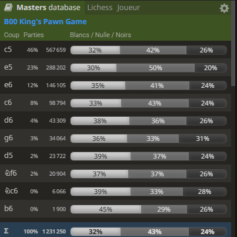

# 1. e4 : The King's Pawn Game (KPG) (B00) #
 

**1. e4**, the King's Pawn Opening, is the most popular first move at all levels of the game. **1. e4** opens lines to develop the queen and the king's bishop. It also fights for control of the centre and White moves closer to the kingside castling. 
 

 

     
    ... Start Position  
    <table align="center"><tr> 
    <td valign="center"></td><td>+0.2</td></tr></table>
 
 
 

 

- Black has several ways to respond. The main idea is to find a way to prevent White from achieving or maintaining a two-pawn centre with both e4 and d4. They may try to:
    - Control the d4 square.
    - Attack White's e4 pawn directly.
    - Prepare to establish their own pawn on d5.
    - Let White build a centre but prepare to undermine it later.
    - Control d4
  
  - [**... e5**](./e4_openings/C20_e4_e5_KPG.md)  (+0.2) : **... e5** lets Black take space in the centre. It is a classical reply, while representing 23% of masters games
  
  

 [*Back to previous move*](#_initial_move_)  
 [*Back to TOP*](#_TOP_)

