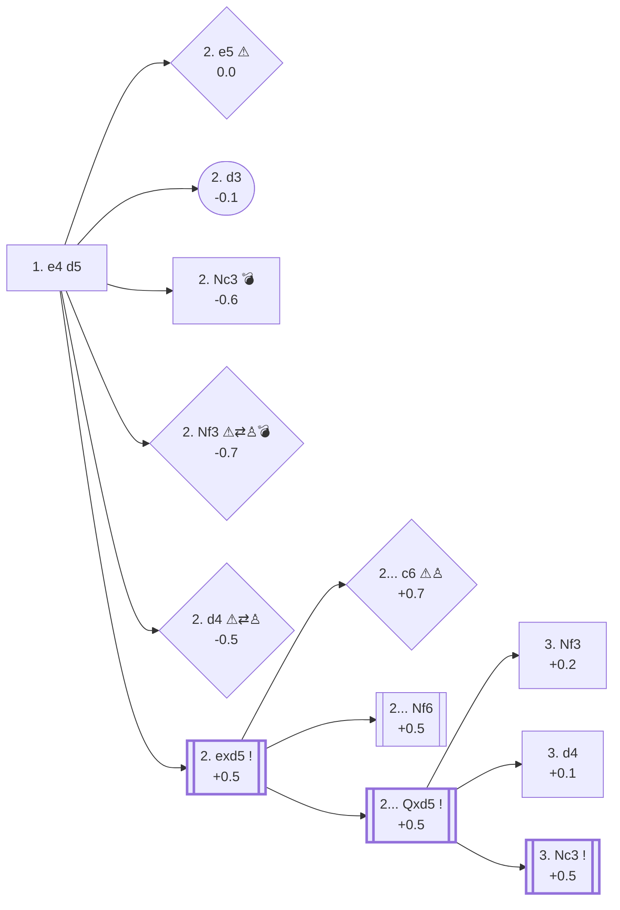

<a name="_TOP_"></a>

# B01 Scandinavian Defense <br> 1. e4 d5 #

Black move directly brings White on a quick decision: take or leave the d5 pawn:

### Overview

*Quick map of every move covered on this card — text and evals match the candidate-move lists below exactly. Node shape is a data-driven category (master-safe / blitz trap / understudied / blunder); see the [shape key](https://github.com/onclemarcel/chess_flashcards/blob/main/start.md#content-diagram-optional) in start.md. Hover a node for its ECO code and variation name; click to jump to its section (GitHub's own rendering strips click-navigation, so use the links in the text below there — the hover tooltip may or may not survive GitHub's rendering too, unconfirmed; both work in an interactive Mermaid preview like VS Code's or mermaid.live).*

<!-- content-diagram:start -->

<!-- content-diagram:end -->

<a name="_d5_"></a>

[](https://lichess.org/analysis/standard/rnbqkbnr/ppp1pppp/8/3p4/4P3/8/PPPP1PPP/RNBQKBNR_w_KQkq_d6_0_2)

*... 1. e4 d5*

```
rnbqkbnr/ppp1pppp/8/3p4/4P3/8/PPPP1PPP/RNBQKBNR w KQkq d6 0 2
```

<!-- lichess-stats:start fen="rnbqkbnr/ppp1pppp/8/3p4/4P3/8/PPPP1PPP/RNBQKBNR w KQkq d6 0 2" db="lichess,masters" speeds="bullet,blitz" ratings="1800,2000,2200,2500" moves="8" -->
| Move | Online | W/D/B | Masters | W/D/B | |
| :--- | ---: | :--- | ---: | :--- | :-- |
| exd5 | 96.9 M (71.1%) | ⬜⬜⬜⬜⬜⬛⬛⬛⬛⬛ 48/5/47 | 24 k (96.9%) | ⬜⬜⬜⬜🟫🟫🟫🟫⬛⬛ 39/37/24 |  |
| Nc3 | 10.9 M (8.0%) | ⬜⬜⬜⬜⬜⬛⬛⬛⬛⬛ 51/4/45 | 521 (2.1%) | ⬜⬜⬜🟫🟫🟫⬛⬛⬛⬛ 33/33/34 |  |
| Nf3 | 10.1 M (7.4%) | ⬜⬜⬜⬜⬜⬛⬛⬛⬛⬛ 47/4/49 | 16 (0.1%) | — |  |
| e5 | 8.7 M (6.4%) | ⬜⬜⬜⬜⬜⬛⬛⬛⬛⬛ 50/4/47 | 89 (0.4%) | ⬜⬜🟫🟫🟫⬛⬛⬛⬛⬛ 17/35/48 |  |
| d4 | 4.6 M (3.4%) | ⬜⬜⬜⬜⬜⬛⬛⬛⬛⬛ 50/4/46 | 80 (0.3%) | ⬜⬜⬜🟫🟫🟫⬛⬛⬛⬛ 24/34/42 |  |
| d3 | 2.4 M (1.7%) | ⬜⬜⬜⬜⬜🟫⬛⬛⬛⬛ 50/6/45 | 50 (0.2%) | ⬜🟫🟫🟫🟫🟫⬛⬛⬛⬛ 12/50/38 |  |
| f4 | 873 k (0.6%) | ⬜⬜⬜⬜⬜⬛⬛⬛⬛⬛ 46/3/50 | 0 | — | ⚠ |
| f3 | 463 k (0.3%) | ⬜⬜⬜⬜⬜⬛⬛⬛⬛⬛ 49/3/48 | 0 | — | ⚠ |
| a3 | 0 | — | 1 (0.0%) | — |  |
| c4 | 0 | — | 1 (0.0%) | — |  |

*Online: bullet/blitz, 1800+ — 136.3 M games. Masters: 24 k games. [Open in the explorer](https://lichess.org/analysis/standard/rnbqkbnr/ppp1pppp/8/3p4/4P3/8/PPPP1PPP/RNBQKBNR_w_KQkq_d6_0_2#explorer) — updated 2026-08-25*
<!-- lichess-stats:end -->

- Cases where White avoids taking the d5 pawn:

  * [**2. e5**](#_e5_) (0.0 ⚠) : Black already equals by attacking e5 pawn and d4 square — popular in blitz/bullet (6.4%) but almost never seen in masters (0.4%)
  * [**2. d3**](#_d3_) (-0.1) : no compensation for White following the Queens exchange
  * [**2. Nc3**](#_Nc3_) (-0.6) : less space for White than Black in the opening
  * [**2. Nf3**](#_Nf3_) (-0.7 ⚠) : [Tennison Gambit](https://github.com/onclemarcel/chess_flashcards/blob/main/gambits/Tennison/Tennison.md) — a real online/masters gap (7.4% vs 0.1%), the mark of a blitz trap
  * [**2. d4**](#_d4_) (-0.5 ⚠) : [Blackmar-Diemer Gambit](https://github.com/onclemarcel/chess_flashcards/blob/main/gambits/Blackmar-Diemer/Blackmar-Diemer.md) — rare in masters (0.3%) but over 11x more common online (3.4%), and likely under-represented even here since this gambit is best known below the 1800+ rating floor these tables use

- The pawn ***capture is the best option for White*** with [**2. exd5**](#_exd5_) (97% of masters games with score estimated at +0.5)

---

> [!NOTE]
> If **2. e5**, then **... c5** to prevent 3. d4 to defend e5, then Black can pin Nf3 that may come to defend e5 or play Nc6 to attack e5.
>
> <a name="_e5_"></a>
>
> ### 2. e5
>
> [](https://lichess.org/analysis/standard/rnbqkbnr/ppp1pppp/8/4P3/3p4/8/PPPP1PPP/RNBQKBNR_b_KQkq_-_0_2)
>
> *... 2. e5*
>
> ```
> rnbqkbnr/ppp1pppp/8/4P3/3p4/8/PPPP1PPP/RNBQKBNR b KQkq - 0 2
> ```
>
> |  | Very Rare |  | 0.0 |
> | --- | --- | --- | --- |
>
> <!-- lichess-stats:start fen="rnbqkbnr/ppp1pppp/8/4P3/3p4/8/PPPP1PPP/RNBQKBNR b KQkq - 0 2" db="lichess,masters" speeds="bullet,blitz" ratings="1800,2000,2200,2500" moves="5" -->
> | Move | Online | W/D/B | Masters | W/D/B | |
> | :--- | ---: | :--- | ---: | :--- | :-- |
> | c5 | 226 (48.0%) | ⬜⬜⬜⬜⬜⬛⬛⬛⬛⬛ 48/1/51 | 0 | — | ⚠ |
> | Nc6 | 106 (22.5%) | ⬜⬜⬜⬜⬛⬛⬛⬛⬛⬛ 36/5/59 | 0 | — | ⚠ |
> | e6 | 52 (11.0%) | ⬜⬜⬜⬜⬛⬛⬛⬛⬛⬛ 42/2/56 | 0 | — |  |
> | Bf5 | 28 (5.9%) | ⬜⬜⬜⬜⬜⬛⬛⬛⬛⬛ 50/0/50 | 0 | — |  |
> | d3 | 18 (3.8%) | — | 0 | — |  |
> 
> *Online: bullet/blitz, 1800+ — 471 games. Masters: 0 games. [Open in the explorer](https://lichess.org/analysis/standard/rnbqkbnr/ppp1pppp/8/4P3/3p4/8/PPPP1PPP/RNBQKBNR_b_KQkq_-_0_2#explorer) — updated 2026-08-25*
> <!-- lichess-stats:end -->
>
> [*Back to 1... d5*](#_d5_)
> [*Back to TOP*](#_TOP_)

---

> [!NOTE]
> If **2. d3**, then **... dxe4 3. dxe4** leaves the d-column open, Black may now exchange the Queens with White King exposed on d1.
>
> <a name="_d3_"></a>
>
> ### 2. d3
>
> [](https://lichess.org/analysis/standard/rnbqkbnr/ppp1pppp/8/3p4/4P3/3P4/PPP2PPP/RNBQKBNR_b_KQkq_-_0_2)
>
> *... 2. d3*
>
> ```
> rnbqkbnr/ppp1pppp/8/3p4/4P3/3P4/PPP2PPP/RNBQKBNR b KQkq - 0 2
> ```
>
> |  | Very Rare |  | -0.1 |
> | --- | --- | --- | --- |
>
> <!-- lichess-stats:start fen="rnbqkbnr/ppp1pppp/8/3p4/4P3/3P4/PPP2PPP/RNBQKBNR b KQkq - 0 2" db="lichess,masters" speeds="bullet,blitz" ratings="1800,2000,2200,2500" moves="5" -->
> | Move | Online | W/D/B | Masters | W/D/B | |
> | :--- | ---: | :--- | ---: | :--- | :-- |
> | dxe4 | 2.8 M (73.6%) | ⬜⬜⬜⬜⬜🟫⬛⬛⬛⬛ 50/6/44 | 39 (52.7%) | ⬜🟫🟫🟫🟫🟫⬛⬛⬛⬛ 15/46/38 |  |
> | Nf6 | 246 k (6.4%) | ⬜⬜⬜⬜⬜⬛⬛⬛⬛⬛ 47/4/49 | 8 (10.8%) | — |  |
> | c6 | 204 k (5.3%) | ⬜⬜⬜⬜⬜⬛⬛⬛⬛⬛ 46/4/50 | 6 (8.1%) | — |  |
> | d4 | 169 k (4.4%) | ⬜⬜⬜⬜⬜⬛⬛⬛⬛⬛ 50/3/46 | 0 | — | ⚠ |
> | e6 | 155 k (4.0%) | ⬜⬜⬜⬜⬜⬛⬛⬛⬛⬛ 48/4/48 | 6 (8.1%) | — |  |
> | Nc6 | 0 | — | 6 (8.1%) | — |  |
> 
> *Online: bullet/blitz, 1800+ — 3.8 M games. Masters: 74 games. [Open in the explorer](https://lichess.org/analysis/standard/rnbqkbnr/ppp1pppp/8/3p4/4P3/3P4/PPP2PPP/RNBQKBNR_b_KQkq_-_0_2#explorer) — updated 2026-08-25*
> <!-- lichess-stats:end -->
>
> [*Back to 1... d5*](#_d5_)
> [*Back to TOP*](#_TOP_)

---

> [!TIP]
> If **2. Nc3**, then **... d4** gives more space to Black while attacking the knight.
>
> <a name="_Nc3_"></a>
>
> ### 2. Nc3 d4 — the knight has nowhere good to go
>
> **3. Nd5** is met by **... e5**, which blocks the escape squares of the knight on d5, then **... c6** picks up the White Knight.
>
> [](https://lichess.org/analysis/standard/rnbqkbnr/ppp1pppp/8/3N4/3pP3/8/PPPP1PPP/R1BQKBNR_b_KQkq_-_1_3)
>
> *... 2. Nc3 d4 3. Nd5 — green: ... e5 shuts the escape squares; red: ... c6 collects the knight*
>
> ```
> rnbqkbnr/ppp1pppp/8/3N4/3pP3/8/PPPP1PPP/R1BQKBNR b KQkq - 1 3
> ```
>
> |  | Very Rare |  | -0.8 |
> | --- | --- | --- | --- |
>
> <!-- lichess-stats:start fen="rnbqkbnr/ppp1pppp/8/3N4/3pP3/8/PPPP1PPP/R1BQKBNR b KQkq - 1 3" db="lichess,masters" speeds="bullet,blitz" ratings="1800,2000,2200,2500" moves="5" -->
> | Move | Online | W/D/B | Masters | W/D/B | |
> | :--- | ---: | :--- | ---: | :--- | :-- |
> | e5 | 63 k (36.0%) | ⬜⬜⬜⬜⬛⬛⬛⬛⬛⬛ 43/3/54 | 0 | — | ⚠ |
> | c6 | 43 k (24.4%) | ⬜⬜⬜⬜⬜⬛⬛⬛⬛⬛ 49/3/48 | 0 | — | ⚠ |
> | e6 | 29 k (16.5%) | ⬜⬜⬜⬜⬜⬛⬛⬛⬛⬛ 48/3/49 | 0 | — | ⚠ |
> | c5 | 22 k (12.5%) | ⬜⬜⬜⬜⬜⬛⬛⬛⬛⬛ 46/3/51 | 0 | — | ⚠ |
> | Nc6 | 8.6 k (4.9%) | ⬜⬜⬜⬜⬜⬛⬛⬛⬛⬛ 46/3/51 | 0 | — | ⚠ |
> 
> *Online: bullet/blitz, 1800+ — 175 k games. Masters: 0 games. [Open in the explorer](https://lichess.org/analysis/standard/rnbqkbnr/ppp1pppp/8/3N4/3pP3/8/PPPP1PPP/R1BQKBNR_b_KQkq_-_1_3#explorer) — updated 2026-08-25*
> <!-- lichess-stats:end -->
>
> **3. Nce2** is also met by **... e5**, giving more space to Black and open the dark squares diagonal while White is stuck.
>
> [](https://lichess.org/analysis/standard/rnbqkbnr/ppp2ppp/8/4p3/3pP3/8/PPPPNPPP/R1BQKBNR_w_KQkq_e6_0_4)
>
> *... 2. Nc3 d4 3. Nce2 e5*
>
> ```
> rnbqkbnr/ppp2ppp/8/4p3/3pP3/8/PPPPNPPP/R1BQKBNR w KQkq e6 0 4
> ```
>
> |  | Very Rare |  | -0.6 |
> | --- | --- | --- | --- |
>
> <!-- lichess-stats:start fen="rnbqkbnr/ppp2ppp/8/4p3/3pP3/8/PPPPNPPP/R1BQKBNR w KQkq e6 0 4" db="lichess,masters" speeds="bullet,blitz" ratings="1800,2000,2200,2500" moves="5" -->
> | Move | Online | W/D/B | Masters | W/D/B | |
> | :--- | ---: | :--- | ---: | :--- | :-- |
> | d3 | 1.4 M (46.1%) | ⬜⬜⬜⬜⬜🟫⬛⬛⬛⬛ 53/4/43 | 43 (9.7%) | ⬜⬜⬜🟫🟫🟫⬛⬛⬛⬛ 28/33/40 |  |
> | Ng3 | 1.1 M (35.2%) | ⬜⬜⬜⬜⬜⬜⬛⬛⬛⬛ 58/4/39 | 287 (64.9%) | ⬜⬜🟫🟫🟫🟫⬛⬛⬛⬛ 24/42/34 |  |
> | Nf3 | 318 k (10.4%) | ⬜⬜⬜⬜⬜⬜⬛⬛⬛⬛ 56/3/40 | 71 (16.1%) | ⬜⬜🟫🟫🟫⬛⬛⬛⬛⬛ 24/25/51 |  |
> | f4 | 202 k (6.6%) | ⬜⬜⬜⬜⬜⬜⬛⬛⬛⬛ 54/3/43 | 21 (4.8%) | ⬜⬜⬜🟫🟫🟫⬛⬛⬛⬛ 24/33/43 |  |
> | c3 | 33 k (1.1%) | ⬜⬜⬜⬜⬜⬛⬛⬛⬛⬛ 49/4/47 | 20 (4.5%) | ⬜🟫🟫🟫🟫🟫🟫🟫🟫⬛ 10/75/15 |  |
> 
> *Online: bullet/blitz, 1800+ — 3.1 M games. Masters: 442 games. [Open in the explorer](https://lichess.org/analysis/standard/rnbqkbnr/ppp2ppp/8/4p3/3pP3/8/PPPPNPPP/R1BQKBNR_w_KQkq_e6_0_4#explorer) — updated 2026-08-25*
> <!-- lichess-stats:end -->
>
> [*Back to 1... d5*](#_d5_)
> [*Back to TOP*](#_TOP_)

---

> [!TIP]
> **2. Nf3** transposes into the "[Tennison Gambit](https://github.com/onclemarcel/chess_flashcards/blob/main/gambits/Tennison/Tennison.md)" (see [opening traps](https://github.com/onclemarcel/chess_flashcards/blob/main/traps/opening_traps.md)), with the idea of capturing the Black Queen through seemingly sensible moves.
>
> <a name="_Nf3_"></a>
>
> ### 2. Nf3 — Tennison Gambit
>
> *This trap backfires when avoided by Black, with a score of -0.7 estimated by Stockfish.*
>
> [](https://lichess.org/analysis/standard/rnbqkbnr/ppp1pppp/8/3p4/4P3/5N2/PPPP1PPP/RNBQKB1R_b_KQkq_-_1_2)
>
> *... 2. Nf3 — Tennison Gambit*
>
> ```
> rnbqkbnr/ppp1pppp/8/3p4/4P3/5N2/PPPP1PPP/RNBQKB1R b KQkq - 1 2
> ```
>
> |  | Very Rare |  | -0.7 |
> | --- | --- | --- | --- |
>
> <!-- lichess-stats:start fen="rnbqkbnr/ppp1pppp/8/3p4/4P3/5N2/PPPP1PPP/RNBQKB1R b KQkq - 1 2" db="lichess,masters" speeds="bullet,blitz" ratings="1800,2000,2200,2500" moves="5" -->
> | Move | Online | W/D/B | Masters | W/D/B | |
> | :--- | ---: | :--- | ---: | :--- | :-- |
> | dxe4 | 9.7 M (83.3%) | ⬜⬜⬜⬜⬜⬛⬛⬛⬛⬛ 48/4/48 | 12 (52.2%) | — |  |
> | c6 | 434 k (3.7%) | ⬜⬜⬜⬜⬜⬛⬛⬛⬛⬛ 47/4/49 | 7 (30.4%) | — |  |
> | Nf6 | 377 k (3.2%) | ⬜⬜⬜⬜⬜⬛⬛⬛⬛⬛ 50/4/46 | 0 | — | ⚠ |
> | d4 | 336 k (2.9%) | ⬜⬜⬜⬜⬜⬛⬛⬛⬛⬛ 52/3/45 | 0 | — | ⚠ |
> | e6 | 272 k (2.3%) | ⬜⬜⬜⬜⬜⬛⬛⬛⬛⬛ 48/4/48 | 3 (13.0%) | — | ⚠ |
> | e5 | 0 | — | 1 (4.3%) | — |  |
> 
> *Online: bullet/blitz, 1800+ — 11.6 M games. Masters: 23 games. [Open in the explorer](https://lichess.org/analysis/standard/rnbqkbnr/ppp1pppp/8/3p4/4P3/5N2/PPPP1PPP/RNBQKB1R_b_KQkq_-_1_2#explorer) — updated 2026-08-25*
> <!-- lichess-stats:end -->
>
> - Black may:
>
>   * refuse with ... c6 ([Caro-Kann Defense](https://github.com/onclemarcel/chess_flashcards/blob/main/e4_openings/e4_c6_Caro_Kann.md) +0.3) or
>   * refuse with ... e6 ([French Defense](https://github.com/onclemarcel/chess_flashcards/blob/main/e4_openings/e4_e6_French.md) +0.2) or
>   * accept with ... dxe4 (-0.7) : this is the most played move at 52% in masters games
>
> [*Back to 1... d5*](#_d5_)
> [*Back to TOP*](#_TOP_)

---

> [!NOTE]
> **2. d4** transposes into the "[Blackmar-Diemer Gambit](https://github.com/onclemarcel/chess_flashcards/blob/main/gambits/Blackmar-Diemer/Blackmar-Diemer.md)", with the idea for White to regain the initiative and open column e, and later, column f.
>
> <a name="_d4_"></a>
>
> ### 2. d4 — Blackmar-Diemer Gambit
>
> This opening is not correct with respect to openings principles, but leads to a dynamic game with many tactical ideas for both players.
>
> [](https://lichess.org/analysis/standard/rnbqkbnr/ppp1pppp/8/3p4/3PP3/8/PPP2PPP/RNBQKBNR_b_KQkq_d3_0_2)
>
> *... 2. d4 — Blackmar-Diemer Gambit*
>
> ```
> rnbqkbnr/ppp1pppp/8/3p4/3PP3/8/PPP2PPP/RNBQKBNR b KQkq d3 0 2
> ```
>
> |  | Very Rare |  | -0.5 |
> | --- | --- | --- | --- |
>
> <!-- lichess-stats:start fen="rnbqkbnr/ppp1pppp/8/3p4/3PP3/8/PPP2PPP/RNBQKBNR b KQkq d3 0 2" db="lichess,masters" speeds="bullet,blitz" ratings="1800,2000,2200,2500" moves="5" -->
> | Move | Online | W/D/B | Masters | W/D/B | |
> | :--- | ---: | :--- | ---: | :--- | :-- |
> | dxe4 | 6.4 M (70.3%) | ⬜⬜⬜⬜⬜⬛⬛⬛⬛⬛ 51/4/45 | 225 (74.8%) | ⬜⬜🟫🟫🟫🟫⬛⬛⬛⬛ 21/35/44 |  |
> | c6 | 763 k (8.4%) | ⬜⬜⬜⬜⬜⬛⬛⬛⬛⬛ 52/4/44 | 29 (9.6%) | ⬜⬜⬜🟫🟫🟫⬛⬛⬛⬛ 28/34/38 |  |
> | e6 | 732 k (8.1%) | ⬜⬜⬜⬜⬜🟫⬛⬛⬛⬛ 53/4/43 | 42 (14.0%) | ⬜⬜⬜🟫🟫🟫🟫⬛⬛⬛ 33/38/29 |  |
> | Nf6 | 632 k (7.0%) | ⬜⬜⬜⬜⬜⬜⬛⬛⬛⬛ 55/3/42 | 3 (1.0%) | — | ⚠ |
> | Nc6 | 186 k (2.1%) | ⬜⬜⬜⬜⬜⬛⬛⬛⬛⬛ 51/4/45 | 2 (0.7%) | — | ⚠ |
> 
> *Online: bullet/blitz, 1800+ — 9.1 M games. Masters: 301 games. [Open in the explorer](https://lichess.org/analysis/standard/rnbqkbnr/ppp1pppp/8/3p4/3PP3/8/PPP2PPP/RNBQKBNR_b_KQkq_d3_0_2#explorer) — updated 2026-08-25*
> <!-- lichess-stats:end -->
>
> - When correctly prepared, Black is able to avoid many traps of this opening and obtain a good position for middle and end game (-0.5)
> - That said, due to the need for preparation for Black, a good White player may still surprise his opponent in blitz/bullet games
>
> [*Back to 1... d5*](#_d5_)
> [*Back to TOP*](#_TOP_)

---

<a name="_exd5_"></a>

## 2. exd5

After **2. exd5**, Black usually chooses between taking the pawn back with the Queen, potentially losing a tempo, or attacking the pawn with **... Nf6** or **... c6**.

[](https://lichess.org/analysis/standard/rnbqkbnr/ppp1pppp/8/3P4/8/8/PPPP1PPP/RNBQKBNR_b_KQkq_-_0_2)

*... 2. exd5*

```
rnbqkbnr/ppp1pppp/8/3P4/8/8/PPPP1PPP/RNBQKBNR b KQkq - 0 2
```

<!-- lichess-stats:start fen="rnbqkbnr/ppp1pppp/8/3P4/8/8/PPPP1PPP/RNBQKBNR b KQkq - 0 2" db="lichess,masters" speeds="bullet,blitz" ratings="1800,2000,2200,2500" moves="8" -->
| Move | Online | W/D/B | Masters | W/D/B | |
| :--- | ---: | :--- | ---: | :--- | :-- |
| Qxd5 | 61.3 M (63.3%) | ⬜⬜⬜⬜⬜⬛⬛⬛⬛⬛ 48/5/47 | 17 k (70.4%) | ⬜⬜⬜⬜🟫🟫🟫🟫⬛⬛ 38/38/24 |  |
| Nf6 | 25.2 M (26.1%) | ⬜⬜⬜⬜⬜⬛⬛⬛⬛⬛ 47/5/48 | 6.9 k (29.5%) | ⬜⬜⬜⬜🟫🟫🟫🟫⬛⬛ 41/34/24 |  |
| c6 | 6.1 M (6.3%) | ⬜⬜⬜⬜⬜⬛⬛⬛⬛⬛ 47/4/49 | 32 (0.1%) | ⬜⬜⬜⬜⬜⬜⬜🟫⬛⬛ 75/6/19 |  |
| e6 | 2.3 M (2.4%) | ⬜⬜⬜⬜⬜⬛⬛⬛⬛⬛ 49/4/47 | 2 (0.0%) | — | ⚠ |
| Bg4 | 803 k (0.8%) | ⬜⬜⬜⬜⬜⬛⬛⬛⬛⬛ 44/3/53 | 0 | — | ⚠ |
| e5 | 313 k (0.3%) | ⬜⬜⬜⬜⬜⬛⬛⬛⬛⬛ 53/3/44 | 0 | — | ⚠ |
| Bf5 | 216 k (0.2%) | ⬜⬜⬜⬜⬜🟫⬛⬛⬛⬛ 53/4/44 | 0 | — | ⚠ |
| Qd6 | 172 k (0.2%) | ⬜⬜⬜⬜⬜⬜⬛⬛⬛⬛ 58/4/38 | 0 | — | ⚠ |
| f5 | 0 | — | 2 (0.0%) | — |  |
| Qd7 | 0 | — | 2 (0.0%) | — |  |

*Online: bullet/blitz, 1800+ — 96.8 M games. Masters: 24 k games. [Open in the explorer](https://lichess.org/analysis/standard/rnbqkbnr/ppp1pppp/8/3P4/8/8/PPPP1PPP/RNBQKBNR_b_KQkq_-_0_2#explorer) — updated 2026-08-25*
<!-- lichess-stats:end -->

- Main Black moves lead to the following variations:
  * [**2... c6**](https://github.com/onclemarcel/chess_flashcards/blob/main/e4_openings/B01_exd5_c6_Blackburne_Kloosterboer.md) (+0.7 ⚠) : Blackburne-Kloosterboer Gambit — played 6.3% online but essentially unseen in masters (0.1%)
  * [**2... Nf6**](https://github.com/onclemarcel/chess_flashcards/blob/main/e4_openings/B01_exd5_Nf6_Modern.md) (+0.5) : Modern Variation of the Scandinavian
  * [**2... Qxd5**](#_Qxd5_) (+0.5) : Mieses-Kotroc Variation — the main line, covered below

The Blackburne-Kloosterboer Gambit and the Modern Variation each open their own body of theory and are documented on a dedicated card. The Mieses-Kotroc Variation stays the main line of this card and continues below.

---

<a name="_Qxd5_"></a>

## 2... Qxd5 — Mieses-Kotroc Variation

Recapturing immediately with the queen is the historical main line of the Scandinavian, and still the most played reply in masters games (70.4%, see the table above). The queen is centralised but exposed: White develops with tempo against it, most naturally with **3. Nc3**.

[](https://lichess.org/analysis/standard/rnb1kbnr/ppp1pppp/8/3q4/8/8/PPPP1PPP/RNBQKBNR_w_KQkq_-_0_3)

*... 2. exd5 Qxd5 — Mieses-Kotroc Variation*

```
rnb1kbnr/ppp1pppp/8/3q4/8/8/PPPP1PPP/RNBQKBNR w KQkq - 0 3
```

<!-- lichess-stats:start fen="rnb1kbnr/ppp1pppp/8/3q4/8/8/PPPP1PPP/RNBQKBNR w KQkq - 0 3" db="lichess,masters" speeds="bullet,blitz" ratings="1800,2000,2200,2500" moves="8" -->
| Move | Online | W/D/B | Masters | W/D/B | |
| :--- | ---: | :--- | ---: | :--- | :-- |
| Nc3 | 40.4 M (65.8%) | ⬜⬜⬜⬜⬜⬛⬛⬛⬛⬛ 48/5/47 | 15 k (90.5%) | ⬜⬜⬜⬜🟫🟫🟫🟫⬛⬛ 38/38/24 |  |
| Nf3 | 10.0 M (16.4%) | ⬜⬜⬜⬜⬜⬛⬛⬛⬛⬛ 49/5/47 | 1.2 k (7.1%) | ⬜⬜⬜⬜🟫🟫🟫🟫⬛⬛ 41/36/23 |  |
| d4 | 7.2 M (11.8%) | ⬜⬜⬜⬜⬜⬛⬛⬛⬛⬛ 49/5/46 | 361 (2.2%) | ⬜⬜⬜🟫🟫🟫🟫⬛⬛⬛ 32/40/28 |  |
| c4 | 2.2 M (3.5%) | ⬜⬜⬜⬜⬜⬛⬛⬛⬛⬛ 49/4/46 | 6 (0.0%) | — |  |
| Qf3 | 625 k (1.0%) | ⬜⬜⬜⬜⬜🟫⬛⬛⬛⬛ 47/7/46 | 15 (0.1%) | — |  |
| d3 | 221 k (0.4%) | ⬜⬜⬜⬜⬜⬛⬛⬛⬛⬛ 45/5/50 | 1 (0.0%) | — | ⚠ |
| c3 | 133 k (0.2%) | ⬜⬜⬜⬜⬜⬛⬛⬛⬛⬛ 46/5/49 | 0 | — | ⚠ |
| f4 | 131 k (0.2%) | ⬜⬜⬜⬜⬜⬛⬛⬛⬛⬛ 48/4/48 | 0 | — | ⚠ |
| h3 | 0 | — | 11 (0.1%) | — |  |
| a3 | 0 | — | 1 (0.0%) | — |  |

*Online: bullet/blitz, 1800+ — 61.3 M games. Masters: 17 k games. [Open in the explorer](https://lichess.org/analysis/standard/rnb1kbnr/ppp1pppp/8/3q4/8/8/PPPP1PPP/RNBQKBNR_w_KQkq_-_0_3#explorer) — updated 2026-08-25*
<!-- lichess-stats:end -->

* [**3. Nc3**](#_Qxd5_Nc3_) (+0.5): the main line by far (90.5% of masters games), attacking the queen and preparing quick development
* [**3. Nf3 / 3. d4**](#_Qxd5_alt_): quieter tries that leave the queen alone for now

[*Back to 2. exd5*](#_exd5_)
[*Back to TOP*](#_TOP_)

---

> [!NOTE]
> **3. Nf3** and **3. d4** both develop without gaining a tempo on the queen — sound, but far less tested than 3. Nc3 (7.1% and 2.2% of masters games respectively).
>
> <a name="_Qxd5_alt_"></a>
>
> ### 3. Nf3
>
> [](https://lichess.org/analysis/standard/rnb1kbnr/ppp1pppp/8/3q4/8/5N2/PPPP1PPP/RNBQKB1R_b_KQkq_-_1_3)
>
> *... 3. Nf3*
>
> ```
> rnb1kbnr/ppp1pppp/8/3q4/8/5N2/PPPP1PPP/RNBQKB1R b KQkq - 1 3
> ```
>
> |  | +0.2 |
> | --- | --- |
>
> ### 3. d4
>
> [](https://lichess.org/analysis/standard/rnb1kbnr/ppp1pppp/8/3q4/3P4/8/PPP2PPP/RNBQKBNR_b_KQkq_-_0_3)
>
> *... 3. d4*
>
> ```
> rnb1kbnr/ppp1pppp/8/3q4/3P4/8/PPP2PPP/RNBQKBNR b KQkq - 0 3
> ```
>
> |  | +0.1 |
> | --- | --- |
>
> [*Back to 2... Qxd5*](#_Qxd5_)
> [*Back to TOP*](#_TOP_)

---

<a name="_Qxd5_Nc3_"></a>

### 3. Nc3

**3. Nc3** gains a tempo on the queen while developing a piece — the most natural and by far the most tested move (90.5% of masters games, 65.8% online).

[](https://lichess.org/analysis/standard/rnb1kbnr/ppp1pppp/8/3q4/8/2N5/PPPP1PPP/R1BQKBNR_b_KQkq_-_1_3)

*... 3. Nc3 — the queen must move again*

```
rnb1kbnr/ppp1pppp/8/3q4/8/2N5/PPPP1PPP/R1BQKBNR b KQkq - 1 3
```

|  | +0.5 |
| --- | --- |

<!-- lichess-stats:start fen="rnb1kbnr/ppp1pppp/8/3q4/8/2N5/PPPP1PPP/R1BQKBNR b KQkq - 1 3" db="lichess,masters" speeds="bullet,blitz" ratings="1800,2000,2200,2500" moves="8" -->
| Move | Online | W/D/B | Masters | W/D/B | |
| :--- | ---: | :--- | ---: | :--- | :-- |
| Qd8 | 17.8 M (43.9%) | ⬜⬜⬜⬜⬜⬛⬛⬛⬛⬛ 49/5/46 | 1.4 k (9.5%) | ⬜⬜⬜⬜🟫🟫🟫🟫⬛⬛ 39/38/22 |  |
| Qa5 | 13.8 M (34.2%) | ⬜⬜⬜⬜⬜⬛⬛⬛⬛⬛ 47/5/48 | 7.8 k (51.7%) | ⬜⬜⬜⬜🟫🟫🟫🟫⬛⬛ 39/38/24 |  |
| Qd6 | 4.3 M (10.8%) | ⬜⬜⬜⬜⬜⬛⬛⬛⬛⬛ 47/5/48 | 5.7 k (37.9%) | ⬜⬜⬜⬜🟫🟫🟫🟫⬛⬛ 36/40/24 |  |
| Qe6+ | 2.1 M (5.1%) | ⬜⬜⬜⬜⬜⬛⬛⬛⬛⬛ 47/4/49 | 10 (0.1%) | — |  |
| Qe5+ | 1.9 M (4.7%) | ⬜⬜⬜⬜⬜⬛⬛⬛⬛⬛ 48/5/47 | 121 (0.8%) | ⬜⬜⬜⬜⬜🟫🟫🟫⬛⬛ 47/31/22 |  |
| Qd7 | 219 k (0.5%) | ⬜⬜⬜⬜⬜⬜⬛⬛⬛⬛ 55/4/41 | 0 | — | ⚠ |
| Qxg2 | 49 k (0.1%) | ⬜⬜⬜⬜⬜⬜⬛⬛⬛⬛ 60/2/37 | 0 | — | ⚠ |
| Nf6 | 47 k (0.1%) | ⬜⬜⬜⬜⬜⬜⬜⬜⬛⬛ 77/2/21 | 0 | — | ⚠ |
| Qg5 | 0 | — | 1 (0.0%) | — |  |

*Online: bullet/blitz, 1800+ — 40.4 M games. Masters: 15 k games. [Open in the explorer](https://lichess.org/analysis/standard/rnb1kbnr/ppp1pppp/8/3q4/8/2N5/PPPP1PPP/R1BQKBNR_b_KQkq_-_1_3#explorer) — updated 2026-08-25*
<!-- lichess-stats:end -->

> [!NOTE]
> Online, **3... Qd8** is the single most popular retreat (43.9%), simply undoing the queen move. In masters games it drops to 9.5% — strong players prefer to keep the queen active on a5 or d6 rather than lose the extra tempo outright.

* **3... Qa5** (+0.6, 51.7% masters): the *Main Line* — the queen eyes a5-e1 and pins Nc3 to the king once White plays d4, at the cost of being exposed to Nb5/Bd2 tricks later.
* **3... Qd6** (+0.5, 37.9% masters): the *Gubinsky-Melts Defense* — a flexible square that also guards e5 and c7, avoiding the pin themes of Qa5.
* **3... Qd8** (+0.6, 9.5% masters, 43.9% online ⚠): the *Valencian Variation* — the safest retreat, but it gives back the tempo for nothing; both replies above score better in top-level play.

Both main tries continue **4. d4** (77.6% of masters after 3... Qa5, 89.5% after 3... Qd6), after which White simply finishes development (Nf3, Bc4/Bd3, 0-0) while Black completes ... Nf6, ... c6/... Bg4 and ... e6.

[*Back to 2... Qxd5*](#_Qxd5_)
[*Back to TOP*](#_TOP_)
