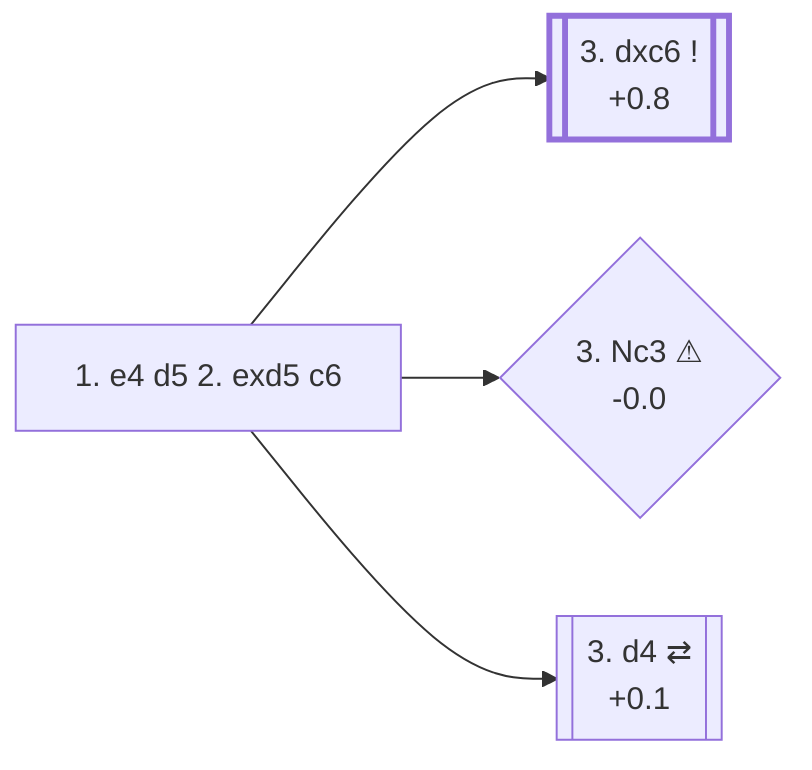

<a name="_TOP_"></a>

# B01 Scandinavian Defense: Blackburne-Kloosterboer Gambit <br> 1. e4 d5 2. exd5 c6 #

Rather than recapturing on d5, Black offers a second pawn to open lines quickly for the pieces. This try is a fringe weapon: 6.3% in online blitz/bullet, but essentially unseen in masters games (0.1%, 32 games total in the reference sample) — see [B01](https://github.com/onclemarcel/chess_flashcards/blob/main/e4_openings/B01_Scandinavian.md#_exd5_).

### Overview

*Quick map of every move covered on this card — see the [shape key](https://github.com/onclemarcel/chess_flashcards/blob/main/start.md#content-diagram-optional) in start.md.*

<!-- content-diagram:start -->

<!-- content-diagram:end -->

<a name="_c6_"></a>

[](https://lichess.org/analysis/standard/rnbqkbnr/pp2pppp/2p5/3P4/8/8/PPPP1PPP/RNBQKBNR_w_KQkq_-_0_3)

*... 1. e4 d5 2. exd5 c6 — Blackburne-Kloosterboer Gambit*

```
rnbqkbnr/pp2pppp/2p5/3P4/8/8/PPPP1PPP/RNBQKBNR w KQkq - 0 3
```

|  | +0.8 |
| --- | --- |

<!-- lichess-stats:start fen="rnbqkbnr/pp2pppp/2p5/3P4/8/8/PPPP1PPP/RNBQKBNR w KQkq - 0 3" db="lichess,masters" speeds="bullet,blitz" ratings="1800,2000,2200,2500" moves="8" -->
| Move | Online | W/D/B | Masters | W/D/B | |
| :--- | ---: | :--- | ---: | :--- | :-- |
| dxc6 | 3.1 M (51.4%) | ⬜⬜⬜⬜⬜⬛⬛⬛⬛⬛ 46/4/50 | 22 (68.8%) | ⬜⬜⬜⬜⬜⬜⬜⬜🟫⬛ 77/9/14 |  |
| Nc3 | 1.4 M (22.5%) | ⬜⬜⬜⬜⬜⬛⬛⬛⬛⬛ 46/4/50 | 0 | — | ⚠ |
| d4 | 691 k (11.3%) | ⬜⬜⬜⬜⬜⬛⬛⬛⬛⬛ 49/4/47 | 8 (25.0%) | — |  |
| Nf3 | 572 k (9.4%) | ⬜⬜⬜⬜⬜⬛⬛⬛⬛⬛ 49/4/48 | 0 | — | ⚠ |
| c4 | 183 k (3.0%) | ⬜⬜⬜⬜⬜⬛⬛⬛⬛⬛ 51/4/45 | 2 (6.2%) | — | ⚠ |
| d6 | 78 k (1.3%) | ⬜⬜⬜⬜⬜⬛⬛⬛⬛⬛ 48/5/47 | 0 | — | ⚠ |
| d3 | 13 k (0.2%) | ⬜⬜⬜⬜⬛⬛⬛⬛⬛⬛ 42/4/54 | 0 | — | ⚠ |
| Qf3 | 11 k (0.2%) | ⬜⬜⬜⬜🟫⬛⬛⬛⬛⬛ 43/4/53 | 0 | — | ⚠ |

*Online: bullet/blitz, 1800+ — 6.1 M games. Masters: 32 games. [Open in the explorer](https://lichess.org/analysis/standard/rnbqkbnr/pp2pppp/2p5/3P4/8/8/PPPP1PPP/RNBQKBNR_w_KQkq_-_0_3#explorer) — updated 2026-08-27*
<!-- lichess-stats:end -->

> [!NOTE]
> This gambit is not sound by opening principles: White simply ends up a clean pawn with no target to attack. Black's practical compensation is quick development (**... Nxc6**, later **... e5**) and the surprise value of an offbeat line most opponents have not prepared against — this is a blitz/bullet weapon, not a masters try.

### Candidate moves

* [**3. dxc6**](#_dxc6_) (+0.8): the main line — accepting is simplest and best, over two thirds of the (few) masters games and just over half of online games
* [**3. Nc3**](#_Nc3_) (-0.0 ⚠): declining keeps the tension but is objectively weaker than just taking the pawn — played 22.5% online yet essentially never at masters level
* [**3. d4**](#_d4_) (+0.1): declines and builds the centre instead, transposing towards a well-known structure a pawn up

---

> [!TIP]
> Declining with **3. Nc3** (-0.0) is markedly weaker than simply accepting with **3. dxc6** (+0.8): it gives back the initiative for free without any compensation in return. If an opponent offers this gambit, taking the pawn is the simplest way to keep the advantage.
>
> <a name="_Nc3_"></a>
>
> ### 3. Nc3
>
> [](https://lichess.org/analysis/standard/rnbqkbnr/pp2pppp/2p5/3P4/8/2N5/PPPP1PPP/R1BQKBNR_b_KQkq_-_1_3)
>
> *... 3. Nc3 — declining the pawn back*
>
> ```
> rnbqkbnr/pp2pppp/2p5/3P4/8/2N5/PPPP1PPP/R1BQKBNR b KQkq - 1 3
> ```
>
> |  | -0.0 |
> | --- | --- |
>
> [*Back to 2... c6*](#_c6_)
> [*Back to TOP*](#_TOP_)

---

> [!NOTE]
> **3. d4** also declines the pawn, but keeps a small, solid edge (+0.1) rather than the near-equality of 3. Nc3: Black is all but forced into **3... cxd5** (97.3% online, 99.7% masters), transposing into the [Caro-Kann Defense, Exchange Variation](https://github.com/onclemarcel/chess_flashcards/blob/main/e4_openings/B10_Caro_Kann.md) — a well-known, symmetrical structure with no special theory tied to this move order.
>
> <a name="_d4_"></a>
>
> ### 3. d4
>
> [](https://lichess.org/analysis/standard/rnbqkbnr/pp2pppp/2p5/3P4/3P4/8/PPP2PPP/RNBQKBNR_b_KQkq_-_0_3)
>
> *... 3. d4 — heads for a Caro-Kann Exchange structure*
>
> ```
> rnbqkbnr/pp2pppp/2p5/3P4/3P4/8/PPP2PPP/RNBQKBNR b KQkq - 0 3
> ```
>
> |  | +0.1 |
> | --- | --- |
>
> [*Back to 2... c6*](#_c6_)
> [*Back to TOP*](#_TOP_)

---

<a name="_dxc6_"></a>

### 3. dxc6 — take the pawn

**3. dxc6** is simply the correct response: White is not obliged to return the extra pawn, and Black has no forced follow-up strong enough to justify the sacrifice at a high level.

[](https://lichess.org/analysis/standard/rnbqkbnr/pp2pppp/2P5/8/8/8/PPPP1PPP/RNBQKBNR_b_KQkq_-_0_3)

*... 3. dxc6*

```
rnbqkbnr/pp2pppp/2P5/8/8/8/PPPP1PPP/RNBQKBNR b KQkq - 0 3
```

|  | +0.8 |
| --- | --- |

<!-- lichess-stats:start fen="rnbqkbnr/pp2pppp/2P5/8/8/8/PPPP1PPP/RNBQKBNR b KQkq - 0 3" db="lichess,masters" speeds="bullet,blitz" ratings="1800,2000,2200,2500" moves="8" -->
| Move | Online | W/D/B | Masters | W/D/B | |
| :--- | ---: | :--- | ---: | :--- | :-- |
| Nxc6 | 1.9 M (60.3%) | ⬜⬜⬜⬜⬜⬛⬛⬛⬛⬛ 46/4/50 | 22 (100.0%) | ⬜⬜⬜⬜⬜⬜⬜⬜🟫⬛ 77/9/14 |  |
| e5 | 693 k (21.9%) | ⬜⬜⬜⬜⬜⬛⬛⬛⬛⬛ 46/3/51 | 0 | — | ⚠ |
| Nf6 | 370 k (11.7%) | ⬜⬜⬜⬜⬜⬛⬛⬛⬛⬛ 46/3/51 | 0 | — | ⚠ |
| e6 | 64 k (2.0%) | ⬜⬜⬜⬜⬜⬛⬛⬛⬛⬛ 46/4/50 | 0 | — | ⚠ |
| a6 | 40 k (1.3%) | ⬜⬜⬜⬜⬜⬛⬛⬛⬛⬛ 45/3/52 | 0 | — | ⚠ |
| Qc7 | 38 k (1.2%) | ⬜⬜⬜⬜⬛⬛⬛⬛⬛⬛ 43/3/54 | 0 | — | ⚠ |
| bxc6 | 18 k (0.6%) | ⬜⬜⬜⬜⬜⬜⬛⬛⬛⬛ 57/4/40 | 0 | — | ⚠ |
| Qb6 | 14 k (0.4%) | ⬜⬜⬜⬜⬜⬛⬛⬛⬛⬛ 46/3/51 | 0 | — | ⚠ |

*Online: bullet/blitz, 1800+ — 3.2 M games. Masters: 22 games. [Open in the explorer](https://lichess.org/analysis/standard/rnbqkbnr/pp2pppp/2P5/8/8/8/PPPP1PPP/RNBQKBNR_b_KQkq_-_0_3#explorer) — updated 2026-08-27*
<!-- lichess-stats:end -->

* **3... Nxc6** (+0.9, 60.3% online, 100% of the — very few — masters games): the point of the gambit — Black develops with tempo instead of recapturing with a pawn, aiming for quick ... e5 and piece activity
* **3... e5** (21.9% online): stakes the centre immediately, delaying the recapture on c6 by one more move
* **3... Nf6** (11.7% online): develops first, c6 can be picked up later with **... Nxc6** or left for the bishop

[](https://lichess.org/analysis/standard/r1bqkbnr/pp2pppp/2n5/8/8/8/PPPP1PPP/RNBQKBNR_w_KQkq_-_0_4)

*... 3... Nxc6 — Black is a pawn down for quick development*

```
r1bqkbnr/pp2pppp/2n5/8/8/8/PPPP1PPP/RNBQKBNR w KQkq - 0 4
```

|  | +0.9 |
| --- | --- |

White has a clean extra pawn and no immediate weaknesses: the safest plan is to finish development (Nf3, Nc3/Be2/Be3, castle) without rushing to win the piece back or grab more material.

[*Back to 2... c6*](#_c6_)
[*Back to TOP*](#_TOP_)
