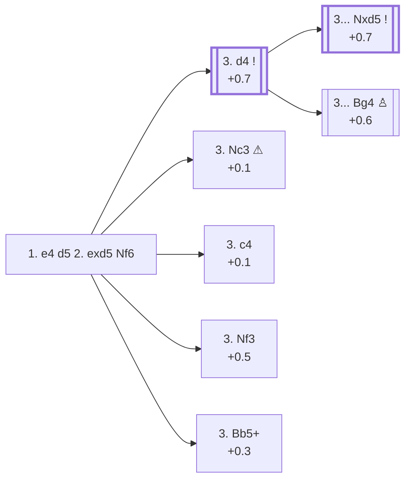

<a name="_TOP_"></a>

# B01 Scandinavian Defense: Modern Variation <br> 1. e4 d5 2. exd5 Nf6 #

Instead of recapturing right away, Black attacks the d5 pawn with the knight, delaying **... Qxd5** to avoid losing a tempo to White's development. This is the second most popular reply in both online play (26.1%) and masters games (29.5%) — see [B01](https://github.com/onclemarcel/chess_flashcards/blob/main/e4_openings/B01_1e4d5_Scandinavian.md#_exd5_).

### Overview

*Quick map of every move covered on this card — see the [shape key](https://github.com/onclemarcel/chess_flashcards/blob/main/start.md#content-diagram-optional) in start.md. Note that 3. Nc3's masters share (4.0%) sits just above the rhombus threshold (masters < 2%), so the shape stays a plain rectangle even though the ⚠ gap is real and discussed below — the two signals are independent on purpose.*

<!-- content-diagram:start -->

<!-- content-diagram:end -->

<a name="_Nf6_"></a>

[](https://lichess.org/analysis/standard/rnbqkb1r/ppp1pppp/5n2/3P4/8/8/PPPP1PPP/RNBQKBNR_w_KQkq_-_1_3)

*... 1. e4 d5 2. exd5 Nf6 — Modern Variation*

```
rnbqkb1r/ppp1pppp/5n2/3P4/8/8/PPPP1PPP/RNBQKBNR w KQkq - 1 3
```

|  | +0.5 |
| --- | --- |

<!-- lichess-stats:start fen="rnbqkb1r/ppp1pppp/5n2/3P4/8/8/PPPP1PPP/RNBQKBNR w KQkq - 1 3" db="lichess,masters" speeds="bullet,blitz" ratings="1800,2000,2200,2500" moves="8" -->
| Move | Online | W/D/B | Masters | W/D/B | |
| :--- | ---: | :--- | ---: | :--- | :-- |
| Nc3 | 8.7 M (34.6%) | ⬜⬜⬜⬜⬜⬛⬛⬛⬛⬛ 46/5/48 | 277 (4.0%) | ⬜⬜⬜⬜🟫🟫🟫⬛⬛⬛ 35/32/32 |  |
| d4 | 6.1 M (24.0%) | ⬜⬜⬜⬜⬜⬛⬛⬛⬛⬛ 48/5/47 | 3.7 k (53.2%) | ⬜⬜⬜⬜🟫🟫🟫⬛⬛⬛ 41/34/25 |  |
| c4 | 4.3 M (17.2%) | ⬜⬜⬜⬜⬜⬛⬛⬛⬛⬛ 45/4/51 | 873 (12.6%) | ⬜⬜⬜⬜🟫🟫🟫🟫⬛⬛ 37/37/26 |  |
| Nf3 | 3.8 M (14.9%) | ⬜⬜⬜⬜⬜⬛⬛⬛⬛⬛ 49/5/46 | 999 (14.4%) | ⬜⬜⬜⬜⬜🟫🟫🟫⬛⬛ 46/34/20 |  |
| Bb5+ | 1.2 M (4.9%) | ⬜⬜⬜⬜⬜🟫⬛⬛⬛⬛ 51/5/44 | 1.0 k (15.0%) | ⬜⬜⬜⬜🟫🟫🟫🟫⬛⬛ 41/35/24 |  |
| Bc4 | 343 k (1.4%) | ⬜⬜⬜⬜⬜⬛⬛⬛⬛⬛ 46/4/50 | 8 (0.1%) | — |  |
| d6 | 275 k (1.1%) | ⬜⬜⬜⬜⬜⬛⬛⬛⬛⬛ 45/5/51 | 0 | — | ⚠ |
| d3 | 82 k (0.3%) | ⬜⬜⬜⬜🟫⬛⬛⬛⬛⬛ 44/5/51 | 0 | — | ⚠ |
| Be2 | 0 | — | 23 (0.3%) | ⬜⬜⬜⬜🟫🟫🟫⬛⬛⬛ 43/26/30 |  |
| b3 | 0 | — | 14 (0.2%) | — |  |

*Online: bullet/blitz, 1800+ — 25.2 M games. Masters: 6.9 k games. [Open in the explorer](https://lichess.org/analysis/standard/rnbqkb1r/ppp1pppp/5n2/3P4/8/8/PPPP1PPP/RNBQKBNR_w_KQkq_-_1_3#explorer) — updated 2026-08-24*
<!-- lichess-stats:end -->

> [!NOTE]
> Masters concentrate on **3. d4** (53.2%), simply holding the extra pawn and finishing development. Online play spreads out much more evenly across d4, Nc3, c4 and Nf3 — a sign that the sharper tries below are less rigorously tested than the main line.

### Candidate moves

* [**3. d4**](#_d4_) (+0.7): the main line — holds d5 and prepares c4/Nf3
* [**3. Nc3**](#_Nc3_) (+0.1 ⚠): popular online (34.6%) but rare in masters (4.0%) — it defends nothing extra and just returns the pawn
* [**3. c4 / 3. Nf3 / 3. Bb5+**](#_Modern_alt_): each played 12%+ of masters games, and worth a closer look later

---

> [!TIP]
> **3. Nc3** looks like a natural developing move, which is exactly why it is popular in blitz/bullet (34.6% online) — it *looks* like it keeps everything defended. It doesn't: nothing guards d5, so Black simply takes the pawn back for free, and the game equalises immediately (+0.1) instead of the +0.7 White keeps after 3. d4. Masters essentially never play it (4.0%). Watch for this pattern — both to avoid it as White and to punish it as Black.
>
> <a name="_Nc3_"></a>
>
> ### 3. Nc3
>
> [](https://lichess.org/analysis/standard/rnbqkb1r/ppp1pppp/5n2/3P4/8/2N5/PPPP1PPP/R1BQKBNR_b_KQkq_-_2_3)
>
> *... 3. Nc3 — d5 is still hanging*
>
> ```
> rnbqkb1r/ppp1pppp/5n2/3P4/8/2N5/PPPP1PPP/R1BQKBNR b KQkq - 2 3
> ```
>
> |  | +0.1 |
> | --- | --- |
>
> **3... Nxd5** is the point: Black just recaptures, and the extra pawn White won on move 2 is gone for nothing.
>
> [](https://lichess.org/analysis/standard/rnbqkb1r/ppp1pppp/8/3n4/8/2N5/PPPP1PPP/R1BQKBNR_w_KQkq_-_0_4)
>
> *... 3... Nxd5 — the pawn is back, material is level*
>
> ```
> rnbqkb1r/ppp1pppp/8/3n4/8/2N5/PPPP1PPP/R1BQKBNR w KQkq - 0 4
> ```
>
> |  | +0.1 |
> | --- | --- |
>
> [*Back to 2... Nf6*](#_Nf6_)
> [*Back to TOP*](#_TOP_)

---

> [!NOTE]
> **3. c4**, **3. Nf3** and **3. Bb5+** are each played in 12%+ of masters games — clearly not fringe tries, and each worth a deeper card of its own later. None of the three carries a distinct name in standard theory or in Lichess's own opening database (unlike 3. d4's Marshall Variation below); they are simply referred to by their move.
>
> <a name="_Modern_alt_"></a>
>
> ### 3. c4
>
> [](https://lichess.org/analysis/standard/rnbqkb1r/ppp1pppp/5n2/3P4/2P5/8/PP1P1PPP/RNBQKBNR_b_KQkq_-_0_3)
>
> *... 3. c4 — defends d5 a second time*
>
> ```
> rnbqkb1r/ppp1pppp/5n2/3P4/2P5/8/PP1P1PPP/RNBQKBNR b KQkq - 0 3
> ```
>
> |  | +0.1 |
> | --- | --- |
>
> Black usually answers with **... c6** (52.8% masters) or **... e6** (46.6% masters), both preparing to challenge the c4/d5 pawn duo.
>
> ### 3. Nf3
>
> [](https://lichess.org/analysis/standard/rnbqkb1r/ppp1pppp/5n2/3P4/8/5N2/PPPP1PPP/RNBQKB1R_b_KQkq_-_2_3)
>
> *... 3. Nf3 — quiet development, often transposing into 3. d4 lines*
>
> ```
> rnbqkb1r/ppp1pppp/5n2/3P4/8/5N2/PPPP1PPP/RNBQKB1R b KQkq - 2 3
> ```
>
> |  | +0.5 |
> | --- | --- |
>
> Interestingly, **3. Nf3** scores the best of these three for White in masters play (45.7% wins, against 37–41% for c4 and Bb5+) — quite possibly because it is the least deeply prepared against of the three.
>
> ### 3. Bb5+
>
> [](https://lichess.org/analysis/standard/rnbqkb1r/ppp1pppp/5n2/1B1P4/8/8/PPPP1PPP/RNBQK1NR_b_KQkq_-_2_3)
>
> *... 3. Bb5+ — a check before committing to the centre*
>
> ```
> rnbqkb1r/ppp1pppp/5n2/1B1P4/8/8/PPPP1PPP/RNBQK1NR b KQkq - 2 3
> ```
>
> |  | +0.3 |
> | --- | --- |
>
> Black answers **... Bd7** (83.0% masters) far more often than **... Nbd7** (15.9%), simply offering the trade of bishops.
>
> [*Back to 2... Nf6*](#_Nf6_)
> [*Back to TOP*](#_TOP_)

---

<a name="_d4_"></a>

### 3. d4

**3. d4** is the soundest way to defend the extra pawn: White keeps the centre and simply continues developing.

[](https://lichess.org/analysis/standard/rnbqkb1r/ppp1pppp/5n2/3P4/3P4/8/PPP2PPP/RNBQKBNR_b_KQkq_-_0_3)

*... 3. d4*

```
rnbqkb1r/ppp1pppp/5n2/3P4/3P4/8/PPP2PPP/RNBQKBNR b KQkq - 0 3
```

|  | +0.7 |
| --- | --- |

<!-- lichess-stats:start fen="rnbqkb1r/ppp1pppp/5n2/3P4/3P4/8/PPP2PPP/RNBQKBNR b KQkq - 0 3" db="lichess,masters" speeds="bullet,blitz" ratings="1800,2000,2200,2500" moves="8" -->
| Move | Online | W/D/B | Masters | W/D/B | |
| :--- | ---: | :--- | ---: | :--- | :-- |
| Nxd5 | 3.1 M (50.8%) | ⬜⬜⬜⬜⬜⬛⬛⬛⬛⬛ 49/5/46 | 2.5 k (67.6%) | ⬜⬜⬜⬜🟫🟫🟫🟫⬛⬛ 41/35/24 |  |
| Bg4 | 1.4 M (23.0%) | ⬜⬜⬜⬜🟫⬛⬛⬛⬛⬛ 43/5/52 | 1.1 k (30.5%) | ⬜⬜⬜⬜🟫🟫🟫⬛⬛⬛ 42/32/26 |  |
| c6 | 641 k (10.5%) | ⬜⬜⬜⬜⬜⬛⬛⬛⬛⬛ 49/5/47 | 9 (0.2%) | — |  |
| Qxd5 | 541 k (8.9%) | ⬜⬜⬜⬜⬜⬛⬛⬛⬛⬛ 49/5/46 | 56 (1.5%) | ⬜⬜⬜⬜⬜🟫🟫🟫⬛⬛ 50/30/20 |  |
| e6 | 239 k (3.9%) | ⬜⬜⬜⬜⬜⬛⬛⬛⬛⬛ 51/4/44 | 1 (0.0%) | — | ⚠ |
| Bf5 | 73 k (1.2%) | ⬜⬜⬜⬜⬜⬛⬛⬛⬛⬛ 52/4/44 | 1 (0.0%) | — | ⚠ |
| g6 | 60 k (1.0%) | ⬜⬜⬜⬜⬜⬛⬛⬛⬛⬛ 49/5/47 | 5 (0.1%) | — |  |
| c5 | 11 k (0.2%) | ⬜⬜⬜⬜⬜🟫⬛⬛⬛⬛ 50/5/45 | 0 | — | ⚠ |

*Online: bullet/blitz, 1800+ — 6.1 M games. Masters: 3.7 k games. [Open in the explorer](https://lichess.org/analysis/standard/rnbqkb1r/ppp1pppp/5n2/3P4/3P4/8/PPP2PPP/RNBQKBNR_b_KQkq_-_0_3#explorer) — updated 2026-08-24*
<!-- lichess-stats:end -->

* **3... Nxd5** (+0.7, 67.6% masters): the *Marshall Variation* — Black recaptures immediately, accepting an isolated-queen-pawn-style structure after a later c4
* **3... Bg4** (+0.6, 30.5% masters): the *Portuguese Gambit* — pins Nf3 before it develops, postponing the recapture by one more move in exchange for a lead in development

Following **3... Nxd5**, White most often plays **4. c4** (40.7% masters, kicking the knight and gaining space) or **4. Nf3** (51.5% masters, simple development). Both transpose into well-known Marshall Variation theory that deserves its own card.

<a name="_Marshall_"></a>

[](https://lichess.org/analysis/standard/rnbqkb1r/ppp1pppp/8/3n4/3P4/8/PPP2PPP/RNBQKBNR_w_KQkq_-_0_4)

*... 3... Nxd5 — Marshall Variation*

```
rnbqkb1r/ppp1pppp/8/3n4/3P4/8/PPP2PPP/RNBQKBNR w KQkq - 0 4
```

|  | +0.7 |
| --- | --- |

<!-- lichess-stats:start fen="rnbqkb1r/ppp1pppp/8/3n4/3P4/8/PPP2PPP/RNBQKBNR w KQkq - 0 4" db="lichess,masters" speeds="bullet,blitz" ratings="1800,2000,2200,2500" moves="5" -->
| Move | Online | W/D/B | Masters | W/D/B | |
| :--- | ---: | :--- | ---: | :--- | :-- |
| c4 | 1.6 M (51.4%) | ⬜⬜⬜⬜⬜⬛⬛⬛⬛⬛ 49/5/46 | 1.0 k (40.7%) | ⬜⬜⬜⬜🟫🟫🟫⬛⬛⬛ 41/32/28 |  |
| Nf3 | 1.1 M (33.9%) | ⬜⬜⬜⬜⬜🟫⬛⬛⬛⬛ 50/5/45 | 1.3 k (51.5%) | ⬜⬜⬜⬜🟫🟫🟫🟫⬛⬛ 41/38/21 |  |
| Nc3 | 133 k (4.3%) | ⬜⬜⬜⬜⬜⬛⬛⬛⬛⬛ 46/5/48 | 0 | — | ⚠ |
| c3 | 95 k (3.1%) | ⬜⬜⬜⬜⬜⬛⬛⬛⬛⬛ 49/5/46 | 0 | — | ⚠ |
| Bc4 | 72 k (2.3%) | ⬜⬜⬜⬜⬜⬛⬛⬛⬛⬛ 47/5/48 | 16 (0.6%) | — |  |
| Be2 | 0 | — | 125 (5.0%) | ⬜⬜⬜⬜🟫🟫🟫⬛⬛⬛ 42/32/26 |  |
| g3 | 0 | — | 26 (1.0%) | ⬜⬜⬜⬜🟫🟫🟫🟫⬛⬛ 42/35/23 |  |

*Online: bullet/blitz, 1800+ — 3.1 M games. Masters: 2.5 k games. [Open in the explorer](https://lichess.org/analysis/standard/rnbqkb1r/ppp1pppp/8/3n4/3P4/8/PPP2PPP/RNBQKBNR_w_KQkq_-_0_4#explorer) — updated 2026-08-24*
<!-- lichess-stats:end -->

[*Back to 2... Nf6*](#_Nf6_)
[*Back to TOP*](#_TOP_)
