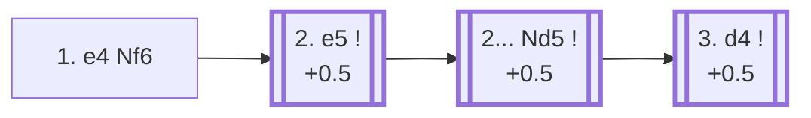

<a name="_TOP_"></a>

# B02 Alekhine Defense <br> 1. e4 Nf6 #

Spun off from [B00's King's Pawn Game](https://github.com/onclemarcel/chess_flashcards/blob/main/e4_openings/B00_KPG.md): named after fourth World Champion Alexander Alekhine, who introduced it in 1921. Black provokes White's centre forward, inviting e4-e5-d4-c4 style expansion, with the plan of undermining the resulting broad pawn front later rather than contesting the centre directly. A genuinely hypermodern try — rare (1.6% of masters games) and objectively a touch worse for Black than the classical replies, but a real trap for an unprepared opponent who doesn't know how to build the centre correctly.

### Overview

*Quick map of every move covered on this card — see the [shape key](https://github.com/onclemarcel/chess_flashcards/blob/main/start.md#content-diagram-optional) in start.md. 2. Nc3 is discussed below but has no anchor of its own, so it's left off this map rather than pointing nowhere.*

<!-- content-diagram:start -->

<!-- content-diagram:end -->

<a name="_initial_move_"></a>

[](https://lichess.org/analysis/standard/rnbqkb1r/pppppppp/5n2/8/4P3/8/PPPP1PPP/RNBQKBNR_w_KQkq_-_1_2)

*... 1. e4 Nf6 — Alekhine Defense*

```
rnbqkb1r/pppppppp/5n2/8/4P3/8/PPPP1PPP/RNBQKBNR w KQkq - 1 2
```

|  | +0.7 |
| --- | --- |

<!-- lichess-stats:start fen="rnbqkb1r/pppppppp/5n2/8/4P3/8/PPPP1PPP/RNBQKBNR w KQkq - 1 2" db="lichess,masters" speeds="bullet,blitz" ratings="1800,2000,2200,2500" moves="4" -->
| Move | Online | W/D/B | Masters | W/D/B | |
| :--- | ---: | :--- | ---: | :--- | :-- |
| e5 | 20.3 M (53.7%) | ⬜⬜⬜⬜⬜⬛⬛⬛⬛⬛ 48/4/48 | 18 k (84.9%) | ⬜⬜⬜⬜🟫🟫🟫🟫⬛⬛ 38/37/25 |  |
| Nc3 | 10.7 M (28.2%) | ⬜⬜⬜⬜⬜⬛⬛⬛⬛⬛ 48/5/47 | 2.7 k (12.6%) | ⬜⬜⬜🟫🟫🟫🟫⬛⬛⬛ 31/38/30 |  |
| Nf3 | 2.3 M (6.2%) | ⬜⬜⬜⬜🟫⬛⬛⬛⬛⬛ 43/4/53 | 0 | — | ⚠ |
| d3 | 2.2 M (5.8%) | ⬜⬜⬜⬜⬜⬛⬛⬛⬛⬛ 47/5/48 | 477 (2.2%) | ⬜⬜⬜🟫🟫🟫⬛⬛⬛⬛ 31/31/38 |  |
| Bc4 | 0 | — | 22 (0.1%) | ⬜⬜⬜⬜🟫⬛⬛⬛⬛⬛ 41/9/50 |  |

*Online: bullet/blitz, 1800+ — 37.9 M games. Masters: 21 k games. [Open in the explorer](https://lichess.org/analysis/standard/rnbqkb1r/pppppppp/5n2/8/4P3/8/PPPP1PPP/RNBQKBNR_w_KQkq_-_1_2#explorer) — updated 2026-08-31*
<!-- lichess-stats:end -->

### Candidate moves

* [**2. e5**](#_e5_) (+0.5): chases the knight immediately — by far masters' main try (84.9%), and the line this card follows.
* [**2. Nc3**](#_Nc3_) (+0.3, 12.6% masters): a quieter approach — covered below.
* **2. d3** (0.0, 2.2% masters, mention-only): the *Maroczy Variation* — simply avoids the whole gambit-style theory. Masters split between **2... d5** (47.2%) and **2... e5** (37.2%). Not built out further here (backlog).
* **2. Bc4** (mention-only): the *Krejcik Variation* — covered below.

[*Back to TOP*](#_TOP_)

---

<a name="_Nc3_"></a>

## 2. Nc3

[](https://lichess.org/analysis/standard/rnbqkb1r/pppppppp/5n2/8/4P3/2N5/PPPP1PPP/R1BQKBNR_b_KQkq_-_2_2)

*... 2. Nc3*

```
rnbqkb1r/pppppppp/5n2/8/4P3/2N5/PPPP1PPP/R1BQKBNR b KQkq - 2 2
```

|  | +0.3 |
| --- | --- |

`eco.md` names this the *Scandinavian Variation*, but live-verified neither this bare position nor the "2... d5" reply below carry a distinct Lichess tag — both stay generically B02. Masters' clear main try is **2... d5** (67.0%), with **2... e5** (22.4%) a real second choice.

> [!NOTE]
> **2... d5 3. e5 Nfd7 4. e6!?**, the *Spielmann Gambit* (+0.2, mention-only), sacrifices the e-pawn immediately to rip open Black's kingside before development — **4... fxe6** is masters' unanimous reply (100%, a 62-game sample).

Not built out further here otherwise (backlog).

[*Back to 1... Nf6*](#_initial_move_)
[*Back to TOP*](#_TOP_)

---

> [!NOTE]
> **2. Bc4!?**, the *Krejcik Variation* (−0.8, mention-only), develops actively but hangs e4 outright — a genuine database curiosity (22 masters games) and, per Stockfish, a real error. **2... Nxe4** is masters' clear reply (68.2%), simply winning the pawn.
>
> [*Back to 1... Nf6*](#_initial_move_)
> [*Back to TOP*](#_TOP_)

---

<a name="_e5_"></a>

## 2. e5

[](https://lichess.org/analysis/standard/rnbqkb1r/pppppppp/5n2/4P3/8/8/PPPP1PPP/RNBQKBNR_b_KQkq_-_0_2)

*... 2. e5*

```
rnbqkb1r/pppppppp/5n2/4P3/8/8/PPPP1PPP/RNBQKBNR b KQkq - 0 2
```

|  | +0.5 |
| --- | --- |

<!-- lichess-stats:start fen="rnbqkb1r/pppppppp/5n2/4P3/8/8/PPPP1PPP/RNBQKBNR b KQkq - 0 2" db="lichess,masters" speeds="bullet,blitz" ratings="1800,2000,2200,2500" moves="3" -->
| Move | Online | W/D/B | Masters | W/D/B | |
| :--- | ---: | :--- | ---: | :--- | :-- |
| Nd5 | 18.7 M (92.1%) | ⬜⬜⬜⬜⬜⬛⬛⬛⬛⬛ 48/5/48 | 18 k (99.2%) | ⬜⬜⬜⬜🟫🟫🟫🟫⬛⬛ 38/37/25 |  |
| Ng8 | 947 k (4.7%) | ⬜⬜⬜⬜⬜⬛⬛⬛⬛⬛ 49/4/47 | 132 (0.7%) | ⬜⬜⬜⬜⬜🟫🟫⬛⬛⬛ 49/23/28 |  |
| Ne4 | 438 k (2.2%) | ⬜⬜⬜⬜⬜⬛⬛⬛⬛⬛ 51/3/45 | 14 (0.1%) | — |  |

*Online: bullet/blitz, 1800+ — 20.3 M games. Masters: 18 k games. [Open in the explorer](https://lichess.org/analysis/standard/rnbqkb1r/pppppppp/5n2/4P3/8/8/PPPP1PPP/RNBQKBNR_b_KQkq_-_0_2#explorer) — updated 2026-08-31*
<!-- lichess-stats:end -->

**2... Nd5** is essentially forced (99.2% of masters games) — the knight has nowhere else useful to go and every other retreat gives up the whole point of the opening.

> [!NOTE]
> **2... Ne4!?**, the *Mokele Mbembe* (+1.4, mention-only, named for a legendary Congolese cryptid — a nod to how obscure the try is), and **2... Ng8**, the *Brooklyn Variation* (+0.7, mention-only, simply retreating home), are both genuine database curiosities (14 and 132 masters games respectively) that give up the whole point of provoking White's centre.

[*Back to 1. e4 Nf6*](#_initial_move_)
[*Back to TOP*](#_TOP_)

---

<a name="_Nd5_"></a>

## 2... Nd5

[](https://lichess.org/analysis/standard/rnbqkb1r/pppppppp/8/3nP3/8/8/PPPP1PPP/RNBQKBNR_w_KQkq_-_1_3)

*... 2... Nd5*

```
rnbqkb1r/pppppppp/8/3nP3/8/8/PPPP1PPP/RNBQKBNR w KQkq - 1 3
```

|  | +0.5 |
| --- | --- |

<!-- lichess-stats:start fen="rnbqkb1r/pppppppp/8/3nP3/8/8/PPPP1PPP/RNBQKBNR w KQkq - 1 3" db="lichess,masters" speeds="bullet,blitz" ratings="1800,2000,2200,2500" moves="4" -->
| Move | Online | W/D/B | Masters | W/D/B | |
| :--- | ---: | :--- | ---: | :--- | :-- |
| d4 | 8.5 M (45.5%) | ⬜⬜⬜⬜⬜⬛⬛⬛⬛⬛ 48/5/48 | 15 k (84.3%) | ⬜⬜⬜⬜🟫🟫🟫🟫⬛⬛ 39/38/23 |  |
| c4 | 6.2 M (33.4%) | ⬜⬜⬜⬜⬜⬛⬛⬛⬛⬛ 47/4/49 | 1.7 k (9.4%) | ⬜⬜⬜🟫🟫🟫🟫⬛⬛⬛ 34/35/31 |  |
| Nf3 | 1.6 M (8.4%) | ⬜⬜⬜⬜⬜⬛⬛⬛⬛⬛ 48/4/48 | 198 (1.1%) | ⬜⬜⬜⬜🟫🟫🟫⬛⬛⬛ 35/34/31 |  |
| Nc3 | 1.2 M (6.5%) | ⬜⬜⬜⬜⬜🟫⬛⬛⬛⬛ 51/5/43 | 702 (3.9%) | ⬜⬜⬜🟫🟫🟫🟫⬛⬛⬛ 31/38/31 |  |

*Online: bullet/blitz, 1800+ — 18.7 M games. Masters: 18 k games. [Open in the explorer](https://lichess.org/analysis/standard/rnbqkb1r/pppppppp/8/3nP3/8/8/PPPP1PPP/RNBQKBNR_w_KQkq_-_1_3#explorer) — updated 2026-08-31*
<!-- lichess-stats:end -->

**3. d4** is masters' clear main try (84.3%) — building the broad pawn centre the whole opening is designed to provoke.

* [**3. d4**](#_d4_): masters' clear main try — the line this card follows.
* **3. c4** (9.4% masters): the *Two Pawns Attack* family — covered below.
* [**3. Nc3**](#_Saemisch_) (3.9% masters, mention-only): the *Sämisch Attack* — covered below.
* [**3. b3**](#_Welling_) (mention-only): the *Welling Variation* — covered below.

[*Back to 2. e5*](#_e5_)
[*Back to TOP*](#_TOP_)

---

> [!NOTE]
> **3. Nc3!?**, the *Sämisch Attack* (+0.1, mention-only), develops naturally, threatening Nxd5 while keeping the option of a later e4-e5-style clamp. **3... Nxc3** is masters' clear reply (69.2%), simplifying at once.
>
> <a name="_Saemisch_"></a>
>
> [*Back to 2... Nd5*](#_Nd5_)
> [*Back to TOP*](#_TOP_)

---

> [!NOTE]
> **3. b3!?**, the *Welling Variation* (−0.2, mention-only), fianchettoes before committing the centre — a genuine database curiosity (a 7-game masters sample) and, per Stockfish, a real if minor concession. Masters split between **3... g6** and **3... d6** (both 42.9%).
>
> <a name="_Welling_"></a>
>
> [*Back to 2... Nd5*](#_Nd5_)
> [*Back to TOP*](#_TOP_)

---

> [!NOTE]
> **3. Bc4 Nb6 4. Bb3 c5 5. d3!?**, the *Kmoch Variation* (+0.1, mention-only), retreats the bishop to b3 before committing the centre — a genuine database curiosity (a 15-game masters sample). **5... Nc6** is masters' clear reply (80.0%).
>
> [*Back to 2... Nd5*](#_Nd5_)
> [*Back to TOP*](#_TOP_)

---

<a name="_c4_"></a>

## 3. c4 — Two Pawns Attack

[](https://lichess.org/analysis/standard/rnbqkb1r/pppppppp/8/3nP3/2P5/8/PP1P1PPP/RNBQKBNR_b_KQkq_c3_0_3)

*... 3. c4 — Two Pawns Attack*

```
rnbqkb1r/pppppppp/8/3nP3/2P5/8/PP1P1PPP/RNBQKBNR b KQkq c3 0 3
```

|  | +0.5 |
| --- | --- |

Chases the knight a second time. **3... Nb6** is masters' near-unanimous reply (99.9%).

<a name="_Nb6_"></a>

[](https://lichess.org/analysis/standard/rnbqkb1r/pppppppp/1n6/4P3/2P5/8/PP1P1PPP/RNBQKBNR_w_KQkq_-_1_4)

*... 3... Nb6*

```
rnbqkb1r/pppppppp/1n6/4P3/2P5/8/PP1P1PPP/RNBQKBNR w KQkq - 1 4
```

|  | +0.5 |
| --- | --- |

* [**4. c5**](#_Lasker_) (mention-only): the *Two Pawns Attack, Lasker Variation* proper — pushes a second pawn, gaining more space at the cost of a further structural commitment — covered below.
* [**4. b3**](#_Steiner_) (mention-only): the *Steiner Variation* — covered below.

[*Back to 2... Nd5*](#_Nd5_)
[*Back to TOP*](#_TOP_)

---

> [!NOTE]
> **4. b3!?**, the *Steiner Variation* (−0.2, mention-only), fianchettoes instead of pushing further — masters split between **4... d6** (41.3%) and **4... g6** (34.8%).
>
> <a name="_Steiner_"></a>
>
> [*Back to 3... Nb6*](#_Nb6_)
> [*Back to TOP*](#_TOP_)

---

<a name="_Lasker_"></a>

### 4. c5 — Two Pawns Attack, Lasker Variation

[](https://lichess.org/analysis/standard/rnbqkb1r/pppppppp/1n6/2P1P3/8/8/PP1P1PPP/RNBQKBNR_b_KQkq_-_0_4)

*... 4. c5 — Two Pawns Attack, Lasker Variation*

```
rnbqkb1r/pppppppp/1n6/2P1P3/8/8/PP1P1PPP/RNBQKBNR b KQkq - 0 4
```

|  | +0.3 |
| --- | --- |

`eco.md` merges this with the deeper Mikenas line under one label ("Two Pawns' (Lasker's) Attack"); Lichess separates them — this position is its own *Lasker Variation*. **4... Nd5** is masters' unanimous reply (100%), the only useful square for the knight.

> [!NOTE]
> **5. Bc4 e6 6. Nc3 d6!?**, the *Mikenas Variation* (+0.4, mention-only), completes development while Black immediately challenges the advanced c5/e5 pawns — a genuine database curiosity at this exact move order (a 5-game masters sample).

Not built out further here (backlog) — deeper Two Pawns Attack theory is its own extensive body of work.

[*Back to 3... Nb6*](#_Nb6_)
[*Back to TOP*](#_TOP_)

---

<a name="_d4_"></a>

## 3. d4 — Normal Variation

[](https://lichess.org/analysis/standard/rnbqkb1r/pppppppp/8/3nP3/3P4/8/PPP2PPP/RNBQKBNR_b_KQkq_d3_0_3)

*... 3. d4 — Normal Variation*

```
rnbqkb1r/pppppppp/8/3nP3/3P4/8/PPP2PPP/RNBQKBNR b KQkq d3 0 3
```

|  | +0.5 |
| --- | --- |

Black's near-forced **3... d6** (98.3% of masters games) immediately strikes at the e5 pawn, beginning the real fight over White's centre — see the [dedicated card](https://github.com/onclemarcel/chess_flashcards/blob/main/e4_openings/B03_Alekhine_Defense.md) for the theory past this point.

> [!NOTE]
> **3... b5!?**, the *O'Sullivan Gambit* (+1.4, mention-only), offers the b-pawn to divert White's own light-squared bishop rather than challenging e5 directly — a genuine database curiosity with zero masters games recorded despite a real 140k-game online sample.

[*Back to 2... Nd5*](#_Nd5_)
[*Back to TOP*](#_TOP_)
