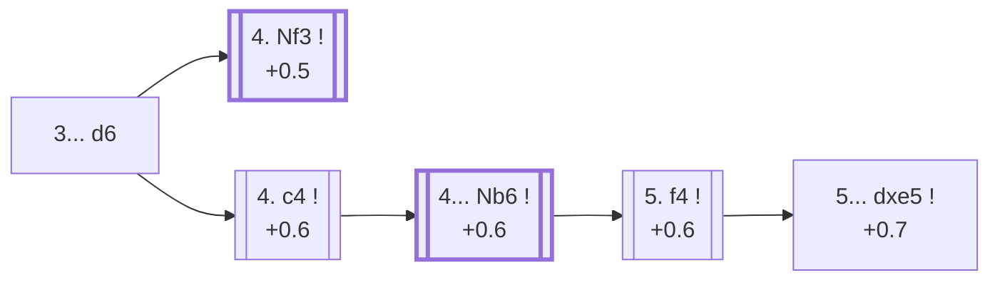

<a name="_TOP_"></a>

# B03 Alekhine Defense <br> 1. e4 Nf6 2. e5 Nd5 3. d4 d6 #

Spun off from [B02's 3. d4](https://github.com/onclemarcel/chess_flashcards/blob/main/e4_openings/B02_Alekhine_Defense.md#_d4_): Black immediately strikes at the e5 pawn — near-forced (98.3% of masters games), since anything else lets White simply finish development with a free extra tempo. White now has a genuine choice between developing quietly or expanding the centre even further.

### Overview

*Quick map of every move covered on this card — see the [shape key](https://github.com/onclemarcel/chess_flashcards/blob/main/start.md#content-diagram-optional) in start.md.*

<!-- content-diagram:start -->

<!-- content-diagram:end -->

<a name="_initial_move_"></a>

[](https://lichess.org/analysis/standard/rnbqkb1r/ppp1pppp/3p4/3nP3/3P4/8/PPP2PPP/RNBQKBNR_w_KQkq_-_0_4)

*... 3... d6*

```
rnbqkb1r/ppp1pppp/3p4/3nP3/3P4/8/PPP2PPP/RNBQKBNR w KQkq - 0 4
```

|  | +0.5 |
| --- | --- |

<!-- lichess-stats:start fen="rnbqkb1r/ppp1pppp/3p4/3nP3/3P4/8/PPP2PPP/RNBQKBNR w KQkq - 0 4" db="lichess,masters" speeds="bullet,blitz" ratings="1800,2000,2200,2500" moves="4" -->
| Move | Online | W/D/B | Masters | W/D/B | |
| :--- | ---: | :--- | ---: | :--- | :-- |
| c4 | 2.4 M (41.4%) | ⬜⬜⬜⬜⬜⬛⬛⬛⬛⬛ 45/5/50 | 4.4 k (29.9%) | ⬜⬜⬜⬜🟫🟫🟫🟫⬛⬛ 39/36/25 |  |
| Nf3 | 1.6 M (27.7%) | ⬜⬜⬜⬜⬜⬛⬛⬛⬛⬛ 48/6/46 | 9.7 k (65.0%) | ⬜⬜⬜⬜🟫🟫🟫🟫⬛⬛ 39/39/22 |  |
| exd6 | 768 k (13.4%) | ⬜⬜⬜⬜⬜⬛⬛⬛⬛⬛ 48/5/47 | 157 (1.1%) | ⬜⬜⬜⬜🟫🟫🟫⬛⬛⬛ 34/34/31 |  |
| f4 | 625 k (10.9%) | ⬜⬜⬜⬜⬜⬛⬛⬛⬛⬛ 46/4/50 | 0 | — | ⚠ |
| Bc4 | 0 | — | 404 (2.7%) | ⬜⬜⬜⬜🟫🟫🟫⬛⬛⬛ 37/33/30 |  |

*Online: bullet/blitz, 1800+ — 5.7 M games. Masters: 15 k games. [Open in the explorer](https://lichess.org/analysis/standard/rnbqkb1r/ppp1pppp/3p4/3nP3/3P4/8/PPP2PPP/RNBQKBNR_w_KQkq_-_0_4#explorer) — updated 2026-08-31*
<!-- lichess-stats:end -->

### Candidate moves

* [**4. Nf3**](https://github.com/onclemarcel/chess_flashcards/blob/main/e4_openings/B04_Alekhine_Modern_Variation.md) (+0.5): the *Modern Variation* — masters' clear main try (65.0%), developing naturally before deciding anything else — covered on its own card.
* [**4. c4**](#_c4_) (+0.6): expands the centre further instead — a real second choice (29.9% masters), covered below.

> [!NOTE]
> **4. Bc4!?**, the *Balogh Variation* (0.0, mention-only), develops actively without committing the centre further — a real but distinctly minor try (2.7% masters). Masters split between **4... Nb6** (67.8%) and **4... c6** (26.5%).

[*Back to TOP*](#_TOP_)

---

<a name="_c4_"></a>

## 4. c4

[](https://lichess.org/analysis/standard/rnbqkb1r/ppp1pppp/3p4/3nP3/2PP4/8/PP3PPP/RNBQKBNR_b_KQkq_c3_0_4)

*... 4. c4*

```
rnbqkb1r/ppp1pppp/3p4/3nP3/2PP4/8/PP3PPP/RNBQKBNR b KQkq c3 0 4
```

|  | +0.6 |
| --- | --- |

<!-- lichess-stats:start fen="rnbqkb1r/ppp1pppp/3p4/3nP3/2PP4/8/PP3PPP/RNBQKBNR b KQkq c3 0 4" db="lichess,masters" speeds="bullet,blitz" ratings="1800,2000,2200,2500" moves="2" -->
| Move | Online | W/D/B | Masters | W/D/B | |
| :--- | ---: | :--- | ---: | :--- | :-- |
| Nb6 | 2.4 M (99.5%) | ⬜⬜⬜⬜⬜⬛⬛⬛⬛⬛ 45/5/50 | 4.4 k (100.0%) | ⬜⬜⬜⬜🟫🟫🟫🟫⬛⬛ 39/36/25 |  |
| dxe5 | 3.5 k (0.1%) | ⬜⬜⬜⬜⬜⬜🟫⬛⬛⬛ 63/4/33 | 0 | — | ⚠ |

*Online: bullet/blitz, 1800+ — 2.4 M games. Masters: 4.4 k games. [Open in the explorer](https://lichess.org/analysis/standard/rnbqkb1r/ppp1pppp/3p4/3nP3/2PP4/8/PP3PPP/RNBQKBNR_b_KQkq_c3_0_4#explorer) — updated 2026-08-31*
<!-- lichess-stats:end -->

**4... Nb6** is completely forced (100% of masters games) — the c4 pawn attacks the d5 knight directly and there's nowhere else useful for it to go.

[*Back to 3... d6*](#_initial_move_)
[*Back to TOP*](#_TOP_)

---

<a name="_Nb6_"></a>

## 4... Nb6

[](https://lichess.org/analysis/standard/rnbqkb1r/ppp1pppp/1n1p4/4P3/2PP4/8/PP3PPP/RNBQKBNR_w_KQkq_-_1_5)

*... 4... Nb6*

```
rnbqkb1r/ppp1pppp/1n1p4/4P3/2PP4/8/PP3PPP/RNBQKBNR w KQkq - 1 5
```

|  | +0.6 |
| --- | --- |

<!-- lichess-stats:start fen="rnbqkb1r/ppp1pppp/1n1p4/4P3/2PP4/8/PP3PPP/RNBQKBNR w KQkq - 1 5" db="lichess,masters" speeds="bullet,blitz" ratings="1800,2000,2200,2500" moves="3" -->
| Move | Online | W/D/B | Masters | W/D/B | |
| :--- | ---: | :--- | ---: | :--- | :-- |
| exd6 | 3.4 M (54.1%) | ⬜⬜⬜⬜⬜⬛⬛⬛⬛⬛ 47/5/48 | 3.9 k (71.8%) | ⬜⬜⬜⬜🟫🟫🟫🟫⬛⬛ 39/36/25 |  |
| f4 | 2.0 M (32.1%) | ⬜⬜⬜⬜🟫⬛⬛⬛⬛⬛ 44/4/52 | 1.4 k (25.9%) | ⬜⬜⬜⬜🟫🟫🟫🟫⬛⬛ 39/36/25 |  |
| Nf3 | 548 k (8.8%) | ⬜⬜⬜⬜🟫⬛⬛⬛⬛⬛ 44/4/51 | 120 (2.2%) | ⬜⬜⬜🟫🟫🟫🟫⬛⬛⬛ 26/43/31 |  |

*Online: bullet/blitz, 1800+ — 6.3 M games. Masters: 5.4 k games. [Open in the explorer](https://lichess.org/analysis/standard/rnbqkb1r/ppp1pppp/1n1p4/4P3/2PP4/8/PP3PPP/RNBQKBNR_w_KQkq_-_1_5#explorer) — updated 2026-08-31*
<!-- lichess-stats:end -->

* **5. exd6** (+0.5, 71.8% masters): the *Exchange Variation* — simplifies immediately, cashing in the space advantage for a simpler position rather than pushing further. Deeper still, the **Karpov Variation** — a long, near-forced sequence (5... cxd6 6. Nf3 g6 7. Be2 Bg7 8. O-O O-O 9. h3 Nc6 10. Nc3 Bf5 11. Bf4) reaching a real, heavily-analysed tabiya — is its own extensive body of work, not built out further here (backlog).
* [**5. f4**](#_f4_) (+0.6, 25.9% masters): the ***Four Pawns Attack*** — see below.

[*Back to 4. c4*](#_c4_)
[*Back to TOP*](#_TOP_)

---

> [!TIP]
> **5. f4**, the *Four Pawns Attack*, is the most ambitious try in the whole Alekhine complex — White builds a pawn front on d4/e5/f4/c4 all at once, betting that Black can't undermine it fast enough before it becomes overwhelming. Sharp and double-edged rather than simply "better for White": the extra space is real, but every pawn move is also a long-term structural commitment.
>
> <a name="_f4_"></a>
>
> ### 5. f4 — Four Pawns Attack
>
> [](https://lichess.org/analysis/standard/rnbqkb1r/ppp1pppp/1n1p4/4P3/2PP1P2/8/PP4PP/RNBQKBNR_b_KQkq_f3_0_5)
>
> *... 5. f4 — Four Pawns Attack*
>
> ```
> rnbqkb1r/ppp1pppp/1n1p4/4P3/2PP1P2/8/PP4PP/RNBQKBNR b KQkq f3 0 5
> ```
>
> |  | +0.6 |
> | --- | --- |
>
> **5... dxe5** (72.4% masters) is the near-automatic reply — trading off before the centre gets any bigger rather than letting White choose the moment.
>
> <a name="_dxe5_fpa_"></a>
>
> ### 5... dxe5
>
> [](https://lichess.org/analysis/standard/rnbqkb1r/ppp1pppp/1n6/4p3/2PP1P2/8/PP4PP/RNBQKBNR_w_KQkq_-_0_6)
>
> *... 5... dxe5*
>
> ```
> rnbqkb1r/ppp1pppp/1n6/4p3/2PP1P2/8/PP4PP/RNBQKBNR w KQkq - 0 6
> ```
>
> |  | +0.7 |
> | --- | --- |
>
> <!-- lichess-stats:start fen="rnbqkb1r/ppp1pppp/1n6/4p3/2PP1P2/8/PP4PP/RNBQKBNR w KQkq - 0 6" db="lichess,masters" speeds="bullet,blitz" ratings="1800,2000,2200,2500" moves="4" -->
> | Move | Online | W/D/B | Masters | W/D/B | |
> | :--- | ---: | :--- | ---: | :--- | :-- |
> | fxe5 | 1.3 M (98.9%) | ⬜⬜⬜⬜🟫⬛⬛⬛⬛⬛ 43/4/53 | 1.0 k (100.0%) | ⬜⬜⬜⬜🟫🟫🟫🟫⬛⬛ 39/38/24 |  |
> | dxe5 | 5.5 k (0.4%) | ⬜⬜⬜🟫⬛⬛⬛⬛⬛⬛ 35/7/59 | 0 | — | ⚠ |
> | Nf3 | 4.0 k (0.3%) | ⬜⬜⬜⬜⬛⬛⬛⬛⬛⬛ 41/4/56 | 0 | — | ⚠ |
> | c5 | 1.8 k (0.1%) | ⬜⬜⬜⬜⬜⬜⬛⬛⬛⬛ 55/3/42 | 0 | — | ⚠ |
> 
> *Online: bullet/blitz, 1800+ — 1.3 M games. Masters: 1.0 k games. [Open in the explorer](https://lichess.org/analysis/standard/rnbqkb1r/ppp1pppp/1n6/4p3/2PP1P2/8/PP4PP/RNBQKBNR_w_KQkq_-_0_6#explorer) — updated 2026-08-31*
> <!-- lichess-stats:end -->
>
> **6. fxe5** is essentially forced (100% of masters games, 98.9% online) — recapturing to keep the d4/e5/c4 pawn front intact rather than let Black simplify further.
>
> <a name="_fxe5_"></a>
>
> #### 6. fxe5
>
> [](https://lichess.org/analysis/standard/rnbqkb1r/ppp1pppp/1n6/4P3/2PP4/8/PP4PP/RNBQKBNR_b_KQkq_-_0_6)
>
> *... 6. fxe5*
>
> ```
> rnbqkb1r/ppp1pppp/1n6/4P3/2PP4/8/PP4PP/RNBQKBNR b KQkq - 0 6
> ```
>
> |  | +0.7 |
> | --- | --- |
>
> * [**6... Nc6**](#_Nc6_fpa_) (64.9% masters): masters' clear favourite — covered below.
> * **6... Bf5** (19.5% masters, mention-only): the *Trifunovic Variation* — a real second try, developing before committing further; no further named B03 sub-line — not built out further here (backlog).
> * **6... c5** (14.3% masters, mention-only): a real minor try, striking at d4 immediately.
> * **6... g6!?** (1.3% masters, mention-only): the *Fianchetto Variation* — genuinely rare.
>
> Not built out further here otherwise (backlog) — **6... g5!?**, the *Planinc Variation*, is a genuine database curiosity with zero masters games recorded.
>
> [*Back to 4... Nb6*](#_Nb6_)
> [*Back to TOP*](#_TOP_)

---

<a name="_Nc6_fpa_"></a>

### 6... Nc6

[](https://lichess.org/analysis/standard/r1bqkb1r/ppp1pppp/1nn5/4P3/2PP4/8/PP4PP/RNBQKBNR_w_KQkq_-_1_7)

*... 6... Nc6*

```
r1bqkb1r/ppp1pppp/1nn5/4P3/2PP4/8/PP4PP/RNBQKBNR w KQkq - 1 7
```

|  | +0.5 |
| --- | --- |

**7. Be3** is masters' near-unanimous continuation (97.6%), live-tagged the *Four Pawns Attack, Main Line* — a real name `eco.md`'s own generic "7.Be3" label doesn't carry.

<a name="_Be3_fpa_"></a>

[](https://lichess.org/analysis/standard/r1bqkb1r/ppp1pppp/1nn5/4P3/2PP4/4B3/PP4PP/RN1QKBNR_b_KQkq_-_2_7)

*... 7. Be3 — Four Pawns Attack, Main Line*

```
r1bqkb1r/ppp1pppp/1nn5/4P3/2PP4/4B3/PP4PP/RN1QKBNR b KQkq - 2 7
```

|  | +0.8 |
| --- | --- |

**7... Bf5** is masters' overwhelming reply (99.2%). Deeper named tries at this exact tabiya — the **Korchnoi Variation** (7... Bf5, continuing 8. Nc3 e6 9. Nf3 Be7 10. Be2 O-O), the **Ilyin-Genevsky Variation** (8. e6 fxe6 9. c5), and the **Tartakower Variation** (a deeper still 11-ply sequence reaching a castled tabiya for both sides) — are each their own extensive body of work, not built out further here (backlog).

[*Back to 6. fxe5*](#_fxe5_)
[*Back to TOP*](#_TOP_)
