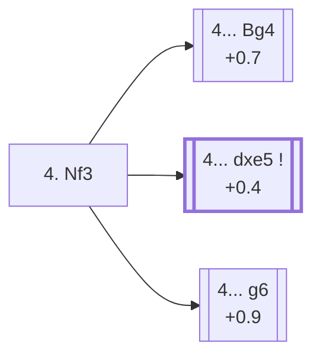

<a name="_TOP_"></a>

# B04 Alekhine Defense: Modern Variation <br> 1. e4 Nf6 2. e5 Nd5 3. d4 d6 4. Nf3 #

Spun off from [B03's 3... d6](https://github.com/onclemarcel/chess_flashcards/blob/main/e4_openings/B03_Alekhine_Defense.md): rather than push the centre further with c4/f4, White simply develops — masters' clear main try at move 4 (65.0%). Black's reply here is a genuine three-way split, closer than almost anywhere else in this repository.

### Overview

*Quick map of every move covered on this card — see the [shape key](https://github.com/onclemarcel/chess_flashcards/blob/main/start.md#content-diagram-optional) in start.md. None of the three replies is presented as dominant — see the note below on the gap between masters' preference and the engine's.*

<!-- content-diagram:start -->

<!-- content-diagram:end -->

<a name="_initial_move_"></a>

[](https://lichess.org/analysis/standard/rnbqkb1r/ppp1pppp/3p4/3nP3/3P4/5N2/PPP2PPP/RNBQKB1R_b_KQkq_-_1_4)

*... 4. Nf3 — Modern Variation*

```
rnbqkb1r/ppp1pppp/3p4/3nP3/3P4/5N2/PPP2PPP/RNBQKB1R b KQkq - 1 4
```

|  | +0.5 |
| --- | --- |

<!-- lichess-stats:start fen="rnbqkb1r/ppp1pppp/3p4/3nP3/3P4/5N2/PPP2PPP/RNBQKB1R b KQkq - 1 4" db="lichess,masters" speeds="bullet,blitz" ratings="1800,2000,2200,2500" moves="6" -->
| Move | Online | W/D/B | Masters | W/D/B | |
| :--- | ---: | :--- | ---: | :--- | :-- |
| Bg4 | 721 k (38.1%) | ⬜⬜⬜⬜⬜⬛⬛⬛⬛⬛ 48/6/46 | 3.3 k (34.0%) | ⬜⬜⬜⬜🟫🟫🟫🟫⬛⬛ 42/35/23 |  |
| dxe5 | 420 k (22.2%) | ⬜⬜⬜⬜⬜🟫⬛⬛⬛⬛ 49/6/46 | 2.6 k (26.8%) | ⬜⬜⬜⬜🟫🟫🟫🟫⬛⬛ 35/44/21 |  |
| g6 | 407 k (21.6%) | ⬜⬜⬜⬜⬜⬛⬛⬛⬛⬛ 48/5/47 | 2.4 k (24.1%) | ⬜⬜⬜⬜🟫🟫🟫🟫⬛⬛ 40/40/21 |  |
| Nc6 | 177 k (9.4%) | ⬜⬜⬜⬜⬜⬛⬛⬛⬛⬛ 49/5/46 | 350 (3.6%) | ⬜⬜⬜⬜🟫🟫🟫⬛⬛⬛ 42/29/28 |  |
| Nb6 | 59 k (3.1%) | ⬜⬜⬜⬜⬜⬛⬛⬛⬛⬛ 47/5/48 | 688 (7.0%) | ⬜⬜⬜🟫🟫🟫🟫⬛⬛⬛ 33/36/31 |  |
| Bf5 | 48 k (2.6%) | ⬜⬜⬜⬜⬜⬛⬛⬛⬛⬛ 50/5/45 | 0 | — | ⚠ |
| c6 | 0 | — | 389 (4.0%) | ⬜⬜⬜⬜🟫🟫🟫🟫⬛⬛ 39/39/22 |  |

*Online: bullet/blitz, 1800+ — 1.9 M games. Masters: 9.8 k games. [Open in the explorer](https://lichess.org/analysis/standard/rnbqkb1r/ppp1pppp/3p4/3nP3/3P4/5N2/PPP2PPP/RNBQKB1R_b_KQkq_-_1_4#explorer) — updated 2026-08-24*
<!-- lichess-stats:end -->

> [!NOTE]
> Masters' most popular try, **4... Bg4** (34.0%), pins the knight before it can be kicked by a later h3/g4 — but Stockfish actually prefers **4... dxe5** (+0.4, the best of the three) over Bg4 (+0.7), a real 0.3-pawn gap. Tradition and practical experience don't always line up exactly with engine preference, even at master level.

### Candidate moves

* [**4... Bg4**](#_Bg4_) (+0.7): masters' single most popular try (34.0%) — pins the f3 knight immediately.
* [**4... dxe5**](#_dxe5_) (+0.4): trades off the tension right away (26.8% masters) — the engine's preferred choice.
* [**4... g6**](#_g6_) (+0.9): fianchettoes instead (24.1% masters) — the least accurate of the three per Stockfish, though still fully playable.

[*Back to TOP*](#_TOP_)

---

<a name="_Bg4_"></a>

## 4... Bg4

[](https://lichess.org/analysis/standard/rn1qkb1r/ppp1pppp/3p4/3nP3/3P2b1/5N2/PPP2PPP/RNBQKB1R_w_KQkq_-_2_5)

*... 4... Bg4*

```
rn1qkb1r/ppp1pppp/3p4/3nP3/3P2b1/5N2/PPP2PPP/RNBQKB1R w KQkq - 2 5
```

|  | +0.7 |
| --- | --- |

White typically continues **5. Be2** or **5. exd6**, meeting the pin without weakening the kingside with h3 too early — its own body of theory, not covered further here.

[*Back to 4. Nf3*](#_initial_move_)
[*Back to TOP*](#_TOP_)

---

<a name="_dxe5_"></a>

## 4... dxe5

[](https://lichess.org/analysis/standard/rnbqkb1r/ppp1pppp/8/3np3/3P4/5N2/PPP2PPP/RNBQKB1R_w_KQkq_-_0_5)

*... 4... dxe5*

```
rnbqkb1r/ppp1pppp/8/3np3/3P4/5N2/PPP2PPP/RNBQKB1R w KQkq - 0 5
```

|  | +0.4 |
| --- | --- |

White recaptures with **5. Nxe5**, reaching a simplified position with a small, stable edge — the calmest of Black's three main tries, not covered further here.

[*Back to 4. Nf3*](#_initial_move_)
[*Back to TOP*](#_TOP_)

---

<a name="_g6_"></a>

## 4... g6

[](https://lichess.org/analysis/standard/rnbqkb1r/ppp1pp1p/3p2p1/3nP3/3P4/5N2/PPP2PPP/RNBQKB1R_w_KQkq_-_0_5)

*... 4... g6*

```
rnbqkb1r/ppp1pp1p/3p2p1/3nP3/3P4/5N2/PPP2PPP/RNBQKB1R w KQkq - 0 5
```

|  | +0.9 |
| --- | --- |

Fianchettoing before resolving the central tension — playable, but the least precise of the three main tries per Stockfish. Not covered further here.

[*Back to 4. Nf3*](#_initial_move_)
[*Back to TOP*](#_TOP_)
