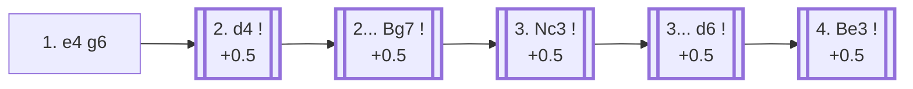

<a name="_TOP_"></a>

# B06 Modern Defense <br> 1. e4 g6 #

Spun off from [B00's King's Pawn Game](https://github.com/onclemarcel/chess_flashcards/blob/main/e4_openings/B00_KPG.md): also called the Robatsch Defense, after Austrian player Karl Robatsch. Black fianchettoes the king's bishop before committing anything in the centre, planning to strike back at White's pawns from the flank once they're overextended rather than contesting the centre directly — a hypermodern approach in the same spirit as the Alekhine Defense.

### Overview

*Quick map of every move covered on this card — see the [shape key](https://github.com/onclemarcel/chess_flashcards/blob/main/start.md#content-diagram-optional) in start.md.*

<!-- content-diagram:start -->

<!-- content-diagram:end -->

<a name="_initial_move_"></a>

[](https://lichess.org/analysis/standard/rnbqkbnr/pppppp1p/6p1/8/4P3/8/PPPP1PPP/RNBQKBNR_w_KQkq_-_0_2)

*... 1. e4 g6 — Modern Defense*

```
rnbqkbnr/pppppp1p/6p1/8/4P3/8/PPPP1PPP/RNBQKBNR w KQkq - 0 2
```

|  | +0.6 |
| --- | --- |

<!-- lichess-stats:start fen="rnbqkbnr/pppppp1p/6p1/8/4P3/8/PPPP1PPP/RNBQKBNR w KQkq - 0 2" db="lichess,masters" speeds="bullet,blitz" ratings="1800,2000,2200,2500" moves="4" -->
| Move | Online | W/D/B | Masters | W/D/B | |
| :--- | ---: | :--- | ---: | :--- | :-- |
| d4 | 26.6 M (49.0%) | ⬜⬜⬜⬜⬜⬛⬛⬛⬛⬛ 49/4/46 | 33 k (95.1%) | ⬜⬜⬜⬜🟫🟫🟫⬛⬛⬛ 37/33/30 |  |
| Nf3 | 12.2 M (22.4%) | ⬜⬜⬜⬜⬜⬛⬛⬛⬛⬛ 48/4/48 | 268 (0.8%) | ⬜⬜⬜🟫🟫🟫⬛⬛⬛⬛ 29/31/40 |  |
| Nc3 | 6.0 M (11.1%) | ⬜⬜⬜⬜⬜⬛⬛⬛⬛⬛ 50/4/46 | 870 (2.5%) | ⬜⬜⬜🟫🟫🟫⬛⬛⬛⬛ 32/30/37 |  |
| f4 | 2.5 M (4.6%) | ⬜⬜⬜⬜⬜⬛⬛⬛⬛⬛ 48/4/49 | 0 | — | ⚠ |
| h4 | 0 | — | 173 (0.5%) | ⬜⬜⬜🟫🟫🟫⬛⬛⬛⬛ 33/24/43 |  |

*Online: bullet/blitz, 1800+ — 54.3 M games. Masters: 35 k games. [Open in the explorer](https://lichess.org/analysis/standard/rnbqkbnr/pppppp1p/6p1/8/4P3/8/PPPP1PPP/RNBQKBNR_w_KQkq_-_0_2#explorer) — updated 2026-08-27*
<!-- lichess-stats:end -->

**2. d4** is masters' overwhelming choice (95.1%) — grabbing the centre while Black hasn't contested it at all yet.

[*Back to TOP*](#_TOP_)

---

<a name="_d4_"></a>

## 2. d4

[](https://lichess.org/analysis/standard/rnbqkbnr/pppppp1p/6p1/8/3PP3/8/PPP2PPP/RNBQKBNR_b_KQkq_d3_0_2)

*... 2. d4*

```
rnbqkbnr/pppppp1p/6p1/8/3PP3/8/PPP2PPP/RNBQKBNR b KQkq d3 0 2
```

|  | +0.5 |
| --- | --- |

<!-- lichess-stats:start fen="rnbqkbnr/pppppp1p/6p1/8/3PP3/8/PPP2PPP/RNBQKBNR b KQkq d3 0 2" db="lichess,masters" speeds="bullet,blitz" ratings="1800,2000,2200,2500" moves="4" -->
| Move | Online | W/D/B | Masters | W/D/B | |
| :--- | ---: | :--- | ---: | :--- | :-- |
| Bg7 | 27.2 M (90.8%) | ⬜⬜⬜⬜⬜⬛⬛⬛⬛⬛ 49/4/46 | 37 k (88.9%) | ⬜⬜⬜⬜🟫🟫🟫⬛⬛⬛ 37/33/30 |  |
| d6 | 914 k (3.1%) | ⬜⬜⬜⬜⬜⬛⬛⬛⬛⬛ 50/4/45 | 2.9 k (7.0%) | ⬜⬜⬜🟫🟫🟫🟫⬛⬛⬛ 35/36/29 |  |
| Nf6 | 534 k (1.8%) | ⬜⬜⬜⬜⬜⬛⬛⬛⬛⬛ 45/5/50 | 242 (0.6%) | ⬜⬜⬜⬜⬜🟫🟫⬛⬛⬛ 44/24/32 |  |
| c6 | 267 k (0.9%) | ⬜⬜⬜⬜⬜⬛⬛⬛⬛⬛ 47/5/48 | 1.4 k (3.3%) | ⬜⬜⬜⬜🟫🟫🟫🟫⬛⬛ 39/36/25 |  |

*Online: bullet/blitz, 1800+ — 29.9 M games. Masters: 41 k games. [Open in the explorer](https://lichess.org/analysis/standard/rnbqkbnr/pppppp1p/6p1/8/3PP3/8/PPP2PPP/RNBQKBNR_b_KQkq_d3_0_2#explorer) — updated 2026-08-27*
<!-- lichess-stats:end -->

**2... Bg7** is masters' near-unanimous choice (88.9%) — completing the fianchetto before deciding anything about the centre.

* [**2... Bg7**](#_Bg7_) (88.9% masters): masters' clear main try — the line this card follows.
* **2... d6** (7.0% masters, mention-only): a real second try, delaying the fianchetto by a move.

> [!NOTE]
> **2... Nf6 3. e5 Nh5 4. g4 Ng7!?**, the *Norwegian Defence* (+0.2, mention-only), reroutes the knight to an awkward square instead of fianchettoing directly — a genuine database curiosity (a 3-game masters sample), live-verified as untagged at this exact leaf.

[*Back to 1. e4 g6*](#_initial_move_)
[*Back to TOP*](#_TOP_)

---

<a name="_Bg7_"></a>

## 2... Bg7

[](https://lichess.org/analysis/standard/rnbqk1nr/ppppppbp/6p1/8/3PP3/8/PPP2PPP/RNBQKBNR_w_KQkq_-_1_3)

*... 2... Bg7*

```
rnbqk1nr/ppppppbp/6p1/8/3PP3/8/PPP2PPP/RNBQKBNR w KQkq - 1 3
```

|  | +0.5 |
| --- | --- |

**3. Nc3** is masters' clear main try (64.7%) — developing naturally rather than committing to a specific plan (c4, f4, or Be3) just yet.

* [**3. Nc3**](#_Nc3_) (64.7% masters): masters' clear main try — the line this card follows.
* **3. f4** (mention-only): the *Three Pawns Attack* — covered below.

[*Back to 2. d4*](#_d4_)
[*Back to TOP*](#_TOP_)

---

> [!NOTE]
> **3. f4!?**, the *Three Pawns Attack* (+0.4, mention-only), builds the broad pawn front immediately rather than developing the knight first. Masters split between **3... d6** (39.6%) and **3... d5** (27.3%).
>
> <a name="_f4_TPA_"></a>
>
> [*Back to 2. d4*](#_d4_)
> [*Back to TOP*](#_TOP_)

---

<a name="_Nc3_"></a>

## 3. Nc3

[](https://lichess.org/analysis/standard/rnbqk1nr/ppppppbp/6p1/8/3PP3/2N5/PPP2PPP/R1BQKBNR_b_KQkq_-_2_3)

*... 3. Nc3*

```
rnbqk1nr/ppppppbp/6p1/8/3PP3/2N5/PPP2PPP/R1BQKBNR b KQkq - 2 3
```

|  | +0.5 |
| --- | --- |

<!-- lichess-stats:start fen="rnbqk1nr/ppppppbp/6p1/8/3PP3/2N5/PPP2PPP/R1BQKBNR b KQkq - 2 3" db="lichess,masters" speeds="bullet,blitz" ratings="1800,2000,2200,2500" moves="6" -->
| Move | Online | W/D/B | Masters | W/D/B | |
| :--- | ---: | :--- | ---: | :--- | :-- |
| d6 | 4.9 M (45.8%) | ⬜⬜⬜⬜⬜🟫⬛⬛⬛⬛ 51/4/44 | 15 k (61.1%) | ⬜⬜⬜⬜🟫🟫🟫⬛⬛⬛ 37/32/31 |  |
| c5 | 1.7 M (16.1%) | ⬜⬜⬜⬜⬜⬛⬛⬛⬛⬛ 49/4/47 | 808 (3.3%) | ⬜⬜⬜⬜🟫🟫🟫⬛⬛⬛ 45/29/25 |  |
| e6 | 1.4 M (13.0%) | ⬜⬜⬜⬜⬜⬜⬛⬛⬛⬛ 55/4/41 | 0 | — | ⚠ |
| c6 | 955 k (8.9%) | ⬜⬜⬜⬜⬜⬛⬛⬛⬛⬛ 49/5/46 | 6.9 k (28.5%) | ⬜⬜⬜⬜🟫🟫🟫⬛⬛⬛ 38/33/30 |  |
| b6 | 464 k (4.3%) | ⬜⬜⬜⬜⬜⬜⬛⬛⬛⬛ 56/4/41 | 0 | — | ⚠ |
| Nf6 | 308 k (2.9%) | ⬜⬜⬜⬜⬜⬜⬛⬛⬛⬛ 57/4/39 | 0 | — | ⚠ |
| a6 | 0 | — | 993 (4.1%) | ⬜⬜⬜🟫🟫🟫⬛⬛⬛⬛ 32/29/39 |  |
| d5 | 0 | — | 497 (2.1%) | ⬜⬜⬜⬜🟫🟫🟫🟫⬛⬛ 41/38/22 |  |
| Nc6 | 0 | — | 171 (0.7%) | ⬜⬜⬜⬜⬜🟫🟫🟫⬛⬛ 45/35/20 |  |

*Online: bullet/blitz, 1800+ — 10.7 M games. Masters: 24 k games. [Open in the explorer](https://lichess.org/analysis/standard/rnbqk1nr/ppppppbp/6p1/8/3PP3/2N5/PPP2PPP/R1BQKBNR_b_KQkq_-_2_3#explorer) — updated 2026-08-27*
<!-- lichess-stats:end -->

**3... d6** is masters' clear main try (61.1%) — the *Standard Line*, finally contesting e5/c5 while keeping the king's knight's development flexible (Nf6 or Ne7/Nh6 depending on White's setup).

* [**3... d6**](#_d6_) (+0.5, 61.1% masters): the *Standard Line* — covered below.
* [**3... c5**](#_c5_) (+0.7, 3.3% masters): the *Modern Pterodactyl* — see the note below.
* **3... c6** (28.5% masters, mention-only): a real second try, preparing ... d5 — covered below.

[*Back to 2... Bg7*](#_Bg7_)
[*Back to TOP*](#_TOP_)

---

> [!NOTE]
> **3... c6 4. f4 d5 5. e5 h5!?**, the *Gurgenidze Defense* (+0.6, mention-only — `eco.md` calls it the *Gurgenidze Variation*), locks the centre before immediately fixing the kingside pawn structure with an early ... h5, discouraging g4 — a real, if secondary, try (726 masters games). Masters split between **6. Nf3** (65.0%) and **6. Be3** (29.9%).
>
> [*Back to 2... Bg7*](#_Bg7_)
> [*Back to TOP*](#_TOP_)

---

> [!NOTE]
> **3... c5**, the *Modern Pterodactyl*, strikes at d4 immediately while keeping the option of ... Qa5 to pin the c3-knight — the same idea recurs under two other codes/move orders (A42 via 1. Nf3, B27 via 1. e4 c5), not duplicated here.
>
> <a name="_c5_"></a>
>
> ### 3... c5 — Modern Pterodactyl
>
> [](https://lichess.org/analysis/standard/rnbqk1nr/pp1pppbp/6p1/2p5/3PP3/2N5/PPP2PPP/R1BQKBNR_w_KQkq_c6_0_4)
>
> *... 3... c5 — Modern Pterodactyl*
>
> ```
> rnbqk1nr/pp1pppbp/6p1/2p5/3PP3/2N5/PPP2PPP/R1BQKBNR w KQkq c6 0 4
> ```
>
> |  | +0.7 |
> | --- | --- |
>
> **4. dxc5** is masters' clear main try (39.5%) — not the "book" 4. Be3 that gives the line its most commonly cited name (only 7.2% masters); **4. d5** (29.8%) and **4. Nf3** (21.9%) are both real too. Not built out further here (backlog).
>
> [*Back to 3. Nc3*](#_Nc3_)
> [*Back to TOP*](#_TOP_)

---

<a name="_d6_"></a>

## 3... d6 — Standard Line

[](https://lichess.org/analysis/standard/rnbqk1nr/ppp1ppbp/3p2p1/8/3PP3/2N5/PPP2PPP/R1BQKBNR_w_KQkq_-_0_4)

*... 3... d6 — reaching the Modern Defense: Standard Line tabiya*

```
rnbqk1nr/ppp1ppbp/3p2p1/8/3PP3/2N5/PPP2PPP/R1BQKBNR w KQkq - 0 4
```

|  | +0.5 |
| --- | --- |

White's most common follow-up is **4. Be3** (40.5% masters), preparing Qd2 and long castling for a kingside pawn storm — a setup nearly identical in spirit to the [Pirc Defense's 150 Attack](https://github.com/onclemarcel/chess_flashcards/blob/main/e4_openings/B07_Pirc_Defense.md#_Be3_), since the resulting structures are so similar once Black eventually adds ... Nf6.

* [**4. Be3**](#_Be3_) (+0.5): masters' clear preference (40.5%) — see below.
* [**4. Nf3**](#_Nf3_TKV_) (mention-only): the *Two Knights Variation* — covered below.
* [**4. f4**](#_f4_PAA_) (mention-only): the *Pseudo-Austrian Attack* — covered below.

[*Back to 3. Nc3*](#_Nc3_)
[*Back to TOP*](#_TOP_)

---

> [!NOTE]
> **4. Nf3!?**, the *Two Knights Variation* (+0.5, mention-only), develops naturally instead of committing to the Be3/Qd2 attacking setup — a real, well-tested try (5.5k masters games). Masters split between **4... Nf6** (51.8%) and **4... a6** (29.1%). Deeper still, **4... c6!?**, the *Suttles Variation* (+0.5, mention-only), delays ... Nf6 to prepare ... d5 or ... b5 instead — masters split between **5. Be3** (25.3%) and **5. Be2** (23.8%).
>
> <a name="_Nf3_TKV_"></a>
>
> [*Back to 3... d6*](#_d6_)
> [*Back to TOP*](#_TOP_)

---

> [!NOTE]
> **4. f4!?**, the *Pseudo-Austrian Attack* (+0.4, mention-only — the same pawn-storm idea as the real [Pirc Austrian Attack](https://github.com/onclemarcel/chess_flashcards/blob/main/e4_openings/B09_Pirc_Austrian_Attack.md), reached here a move without the king's knight committed to f6 first), is a real, well-tested try (5.4k masters games). Masters split between **4... Nf6** (42.9%) and **4... a6** (28.1%).
>
> <a name="_f4_PAA_"></a>
>
> [*Back to 3... d6*](#_d6_)
> [*Back to TOP*](#_TOP_)

---

<a name="_Be3_"></a>

## 4. Be3

[](https://lichess.org/analysis/standard/rnbqk1nr/ppp1ppbp/3p2p1/8/3PP3/2N1B3/PPP2PPP/R2QKBNR_b_KQkq_-_1_4)

*... 4. Be3*

```
rnbqk1nr/ppp1ppbp/3p2p1/8/3PP3/2N1B3/PPP2PPP/R2QKBNR b KQkq - 1 4
```

|  | +0.5 |
| --- | --- |

<!-- lichess-stats:start fen="rnbqk1nr/ppp1ppbp/3p2p1/8/3PP3/2N1B3/PPP2PPP/R2QKBNR b KQkq - 1 4" db="lichess,masters" speeds="bullet,blitz" ratings="1800,2000,2200,2500" moves="6" -->
| Move | Online | W/D/B | Masters | W/D/B | |
| :--- | ---: | :--- | ---: | :--- | :-- |
| Nf6 | 1.3 M (37.9%) | ⬜⬜⬜⬜⬜🟫⬛⬛⬛⬛ 53/4/43 | 1.0 k (12.3%) | ⬜⬜⬜⬜🟫🟫🟫⬛⬛⬛ 43/33/24 |  |
| a6 | 555 k (16.5%) | ⬜⬜⬜⬜⬜⬛⬛⬛⬛⬛ 47/5/49 | 4.7 k (56.6%) | ⬜⬜⬜⬜🟫🟫🟫⬛⬛⬛ 37/31/32 |  |
| Nc6 | 530 k (15.7%) | ⬜⬜⬜⬜⬜⬛⬛⬛⬛⬛ 50/4/46 | 125 (1.5%) | ⬜⬜⬜⬜⬜🟫🟫⬛⬛⬛ 53/20/27 |  |
| Nd7 | 356 k (10.6%) | ⬜⬜⬜⬜⬜⬜⬛⬛⬛⬛ 54/4/43 | 375 (4.5%) | ⬜⬜⬜⬜🟫🟫🟫⬛⬛⬛ 43/27/30 |  |
| c6 | 309 k (9.2%) | ⬜⬜⬜⬜⬜⬛⬛⬛⬛⬛ 50/4/46 | 2.0 k (24.3%) | ⬜⬜⬜⬜🟫🟫🟫⬛⬛⬛ 40/31/29 |  |
| e6 | 100 k (3.0%) | ⬜⬜⬜⬜⬜⬜⬛⬛⬛⬛ 58/4/38 | 18 (0.2%) | — |  |

*Online: bullet/blitz, 1800+ — 3.4 M games. Masters: 8.3 k games. [Open in the explorer](https://lichess.org/analysis/standard/rnbqk1nr/ppp1ppbp/3p2p1/8/3PP3/2N1B3/PPP2PPP/R2QKBNR_b_KQkq_-_1_4#explorer) — updated 2026-08-27*
<!-- lichess-stats:end -->

> [!NOTE]
> Masters' most popular try, **4... a6** (56.6%), is another online/masters inversion: online play favours the more natural-looking **4... Nf6** instead (37.9% online, only 12.3% masters). The a6/b5-style queenside expansion (a "Modern Benoni-ish" or hypermodern approach, striking on the wing rather than developing normally) is a real repertoire idea worth knowing specifically because it's under-represented in online play relative to how often masters actually choose it.

**4... a6** prepares ... b5 queenside expansion before committing the king's knight — masters' clear main try (56.6%). Deeper Modern Defense theory past this point is its own extensive body of work, not covered further here.

[*Back to 3... d6*](#_d6_)
[*Back to TOP*](#_TOP_)
