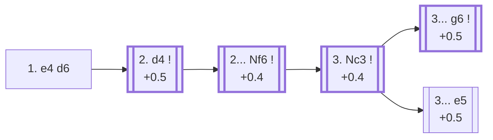

<a name="_TOP_"></a>

# B07 Pirc Defense <br> 1. e4 d6 #

Spun off from [B00's King's Pawn Game](https://github.com/onclemarcel/chess_flashcards/blob/main/e4_openings/B00_KPG.md): named after Slovenian grandmaster Vasja Pirc. Black delays committing the centre, planning ... Nf6, ... g6 and ... Bg7 in some order before deciding how (or whether) to challenge White's pawns — a close cousin of the [Modern Defense](https://github.com/onclemarcel/chess_flashcards/blob/main/e4_openings/B06_Modern_Defense.md), reached here by a different move order (... d6 before ... g6 rather than after).

### Overview

*Quick map of every move covered on this card — see the [shape key](https://github.com/onclemarcel/chess_flashcards/blob/main/start.md#content-diagram-optional) in start.md.*

<!-- content-diagram:start -->

<!-- content-diagram:end -->

<a name="_initial_move_"></a>

[](https://lichess.org/analysis/standard/rnbqkbnr/ppp1pppp/3p4/8/4P3/8/PPPP1PPP/RNBQKBNR_w_KQkq_-_0_2)

*... 1. e4 d6*

```
rnbqkbnr/ppp1pppp/3p4/8/4P3/8/PPPP1PPP/RNBQKBNR w KQkq - 0 2
```

|  | +0.4 |
| --- | --- |

<!-- lichess-stats:start fen="rnbqkbnr/ppp1pppp/3p4/8/4P3/8/PPPP1PPP/RNBQKBNR w KQkq - 0 2" db="lichess,masters" speeds="bullet,blitz" ratings="1800,2000,2200,2500" moves="4" -->
| Move | Online | W/D/B | Masters | W/D/B | |
| :--- | ---: | :--- | ---: | :--- | :-- |
| d4 | 34.1 M (54.0%) | ⬜⬜⬜⬜⬜⬛⬛⬛⬛⬛ 49/4/47 | 43 k (95.0%) | ⬜⬜⬜⬜🟫🟫🟫🟫⬛⬛ 38/36/26 |  |
| Nf3 | 13.9 M (22.0%) | ⬜⬜⬜⬜⬜⬛⬛⬛⬛⬛ 47/4/48 | 285 (0.6%) | ⬜⬜⬜🟫🟫🟫🟫⬛⬛⬛ 27/38/35 |  |
| Nc3 | 6.4 M (10.1%) | ⬜⬜⬜⬜⬜⬛⬛⬛⬛⬛ 51/4/45 | 1.1 k (2.5%) | ⬜⬜⬜⬜🟫🟫🟫⬛⬛⬛ 37/34/29 |  |
| f4 | 2.7 M (4.2%) | ⬜⬜⬜⬜⬜⬛⬛⬛⬛⬛ 49/4/48 | 356 (0.8%) | ⬜⬜⬜⬜🟫🟫🟫⬛⬛⬛ 38/34/28 |  |

*Online: bullet/blitz, 1800+ — 63.2 M games. Masters: 45 k games. [Open in the explorer](https://lichess.org/analysis/standard/rnbqkbnr/ppp1pppp/3p4/8/4P3/8/PPPP1PPP/RNBQKBNR_w_KQkq_-_0_2#explorer) — updated 2026-08-26*
<!-- lichess-stats:end -->

**2. d4** is masters' overwhelming choice (95.0%). The same position is also reachable by the opposite move order, 1. d4 d6 2. e4 — see [`A41_Queens_Pawn_Game.md`](https://github.com/onclemarcel/chess_flashcards/blob/main/d4_openings/A41_Queens_Pawn_Game.md).

[*Back to TOP*](#_TOP_)

---

<a name="_d4_"></a>

## 2. d4

[](https://lichess.org/analysis/standard/rnbqkbnr/ppp1pppp/3p4/8/3PP3/8/PPP2PPP/RNBQKBNR_b_KQkq_d3_0_2)

*... 2. d4*

```
rnbqkbnr/ppp1pppp/3p4/8/3PP3/8/PPP2PPP/RNBQKBNR b KQkq d3 0 2
```

|  | +0.5 |
| --- | --- |

<!-- lichess-stats:start fen="rnbqkbnr/ppp1pppp/3p4/8/3PP3/8/PPP2PPP/RNBQKBNR b KQkq d3 0 2" db="lichess,masters" speeds="bullet,blitz" ratings="1800,2000,2200,2500" moves="4" -->
| Move | Online | W/D/B | Masters | W/D/B | |
| :--- | ---: | :--- | ---: | :--- | :-- |
| Nf6 | 18.9 M (51.1%) | ⬜⬜⬜⬜⬜⬛⬛⬛⬛⬛ 48/5/47 | 43 k (83.4%) | ⬜⬜⬜⬜🟫🟫🟫🟫⬛⬛ 38/37/25 |  |
| g6 | 5.9 M (15.9%) | ⬜⬜⬜⬜⬜⬛⬛⬛⬛⬛ 49/4/46 | 7.2 k (14.0%) | ⬜⬜⬜⬜🟫🟫🟫⬛⬛⬛ 38/33/29 |  |
| c6 | 3.2 M (8.6%) | ⬜⬜⬜⬜⬜⬛⬛⬛⬛⬛ 49/4/47 | 295 (0.6%) | ⬜⬜⬜⬜🟫🟫🟫⬛⬛⬛ 43/28/29 |  |
| Nd7 | 2.7 M (7.4%) | ⬜⬜⬜⬜⬜⬛⬛⬛⬛⬛ 49/4/48 | 0 | — | ⚠ |
| e5 | 0 | — | 570 (1.1%) | ⬜⬜⬜⬜⬜🟫🟫🟫⬛⬛ 46/35/19 |  |

*Online: bullet/blitz, 1800+ — 36.9 M games. Masters: 51 k games. [Open in the explorer](https://lichess.org/analysis/standard/rnbqkbnr/ppp1pppp/3p4/8/3PP3/8/PPP2PPP/RNBQKBNR_b_KQkq_d3_0_2#explorer) — updated 2026-08-26*
<!-- lichess-stats:end -->

**2... Nf6** is masters' clear main try (83.4%) — developing before committing the kingside pawns.

[*Back to 1. e4 d6*](#_initial_move_)
[*Back to TOP*](#_TOP_)

---

<a name="_Nf6_"></a>

## 2... Nf6

[](https://lichess.org/analysis/standard/rnbqkb1r/ppp1pppp/3p1n2/8/3PP3/8/PPP2PPP/RNBQKBNR_w_KQkq_-_1_3)

*... 2... Nf6*

```
rnbqkb1r/ppp1pppp/3p1n2/8/3PP3/8/PPP2PPP/RNBQKBNR w KQkq - 1 3
```

|  | +0.4 |
| --- | --- |

**3. Nc3** is masters' overwhelming choice (90.6%) — protecting e4 before Black can pressure it.

[*Back to 2. d4*](#_d4_)
[*Back to TOP*](#_TOP_)

---

<a name="_Nc3_"></a>

## 3. Nc3

[](https://lichess.org/analysis/standard/rnbqkb1r/ppp1pppp/3p1n2/8/3PP3/2N5/PPP2PPP/R1BQKBNR_b_KQkq_-_2_3)

*... 3. Nc3*

```
rnbqkb1r/ppp1pppp/3p1n2/8/3PP3/2N5/PPP2PPP/R1BQKBNR b KQkq - 2 3
```

|  | +0.4 |
| --- | --- |

<!-- lichess-stats:start fen="rnbqkb1r/ppp1pppp/3p1n2/8/3PP3/2N5/PPP2PPP/R1BQKBNR b KQkq - 2 3" db="lichess,masters" speeds="bullet,blitz" ratings="1800,2000,2200,2500" moves="4" -->
| Move | Online | W/D/B | Masters | W/D/B | |
| :--- | ---: | :--- | ---: | :--- | :-- |
| g6 | 8.9 M (57.1%) | ⬜⬜⬜⬜⬜⬛⬛⬛⬛⬛ 50/4/45 | 19 k (49.1%) | ⬜⬜⬜⬜🟫🟫🟫🟫⬛⬛ 38/38/24 |  |
| Nbd7 | 1.9 M (12.5%) | ⬜⬜⬜⬜⬜⬛⬛⬛⬛⬛ 48/4/48 | 2.7 k (6.9%) | ⬜⬜⬜⬜🟫🟫🟫⬛⬛⬛ 37/32/31 |  |
| c6 | 1.9 M (12.0%) | ⬜⬜⬜⬜⬜⬛⬛⬛⬛⬛ 49/4/47 | 3.8 k (9.7%) | ⬜⬜⬜⬜🟫🟫🟫⬛⬛⬛ 42/30/28 |  |
| e5 | 1.8 M (11.6%) | ⬜⬜⬜⬜🟫⬛⬛⬛⬛⬛ 45/7/48 | 13 k (33.6%) | ⬜⬜⬜⬜🟫🟫🟫🟫⬛⬛ 36/39/25 |  |

*Online: bullet/blitz, 1800+ — 15.5 M games. Masters: 39 k games. [Open in the explorer](https://lichess.org/analysis/standard/rnbqkb1r/ppp1pppp/3p1n2/8/3PP3/2N5/PPP2PPP/R1BQKBNR_b_KQkq_-_2_3#explorer) — updated 2026-08-26*
<!-- lichess-stats:end -->

### Candidate moves

* [**3... g6**](https://github.com/onclemarcel/chess_flashcards/blob/main/e4_openings/B08_Pirc_Defense_Tabiya.md) (+0.5): the real Pirc Defense proper — masters' clear main try (49.1%) — covered on its own card.
* [**3... e5**](#_e5_) (+0.5): a genuine independent alternative (33.6% masters), staying closer to a delayed Philidor structure since White has committed the knight to c3 rather than f3 — covered below.
* [**3... c6**](#_c6_) (+0.8, 9.7% masters): the *Czech Defense* — see the note below.
* [**3... Nbd7**](#_Nbd7_) (+0.6, 6.9% masters): the *Lion Defense* — see the note below.

[*Back to 2... Nf6*](#_Nf6_)
[*Back to TOP*](#_TOP_)

---

> [!NOTE]
> **3... e5** strikes at the centre directly instead of fianchettoing — a real, substantial alternative (33.6% of masters games at this fork) rather than a minor sideline, since White's knight already sits on c3 instead of f3 here (unlike the true Philidor Defense).
>
> <a name="_e5_"></a>
>
> ### 3... e5
>
> [](https://lichess.org/analysis/standard/rnbqkb1r/ppp2ppp/3p1n2/4p3/3PP3/2N5/PPP2PPP/R1BQKBNR_w_KQkq_e6_0_4)
>
> *... 3... e5*
>
> ```
> rnbqkb1r/ppp2ppp/3p1n2/4p3/3PP3/2N5/PPP2PPP/R1BQKBNR w KQkq e6 0 4
> ```
>
> |  | +0.5 |
> | --- | --- |
>
> Not built out further here (backlog).
>
> [*Back to 3. Nc3*](#_Nc3_)
> [*Back to TOP*](#_TOP_)

---

> [!NOTE]
> **3... c6**, the *Czech Defense*, prepares a quick ... Qa5/... b5 queenside counterplay before committing the king's bishop, staying closer to the Caro-Kann's own light-squared plan than the fianchetto ideas above.
>
> <a name="_c6_"></a>
>
> ### 3... c6 — Czech Defense
>
> [](https://lichess.org/analysis/standard/rnbqkb1r/pp2pppp/2pp1n2/8/3PP3/2N5/PPP2PPP/R1BQKBNR_w_KQkq_-_0_4)
>
> *... 3... c6 — Czech Defense*
>
> ```
> rnbqkb1r/pp2pppp/2pp1n2/8/3PP3/2N5/PPP2PPP/R1BQKBNR w KQkq - 0 4
> ```
>
> |  | +0.8 |
> | --- | --- |
>
> **4. f4** is masters' clear main try (42.1%), building a broad pawn centre before Black can strike back. Not built out further here (backlog).
>
> [*Back to 3. Nc3*](#_Nc3_)
> [*Back to TOP*](#_TOP_)

---

> [!NOTE]
> **3... Nbd7**, the *Lion Defense*, develops the queen's knight before committing a kingside setup at all — flexible, but noticeably slower than the main Pirc's immediate fianchetto.
>
> <a name="_Nbd7_"></a>
>
> ### 3... Nbd7 — Lion Defense
>
> [](https://lichess.org/analysis/standard/r1bqkb1r/pppnpppp/3p1n2/8/3PP3/2N5/PPP2PPP/R1BQKBNR_w_KQkq_-_3_4)
>
> *... 3... Nbd7 — Lion Defense*
>
> ```
> r1bqkb1r/pppnpppp/3p1n2/8/3PP3/2N5/PPP2PPP/R1BQKBNR w KQkq - 3 4
> ```
>
> |  | +0.6 |
> | --- | --- |
>
> **4. Nf3** is masters' clear main try (53.2%), developing naturally; **4. f4** (22.7%) grabs more space immediately. Not built out further here (backlog).
>
> [*Back to 3. Nc3*](#_Nc3_)
> [*Back to TOP*](#_TOP_)
