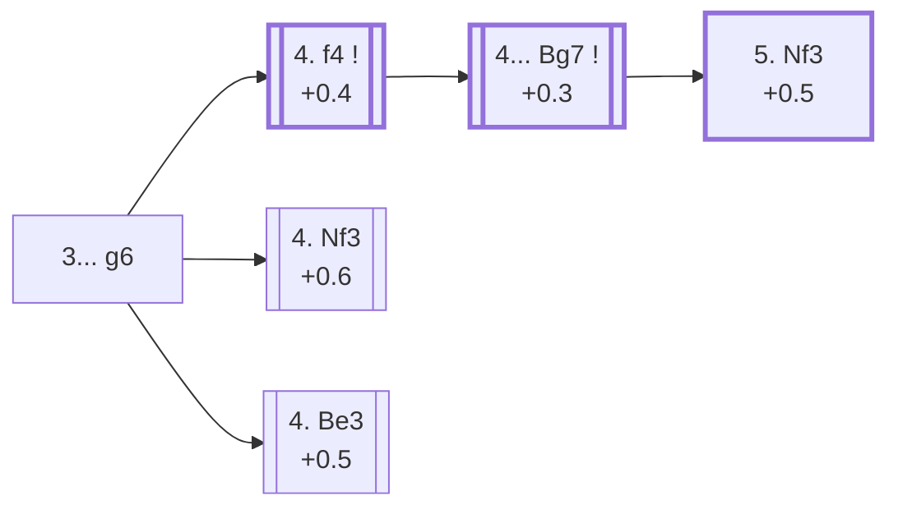

<a name="_TOP_"></a>

# B08 Pirc Defense <br> 1. e4 d6 2. d4 Nf6 3. Nc3 g6 #

Spun off from [B07's 3. Nc3](https://github.com/onclemarcel/chess_flashcards/blob/main/e4_openings/B07_Pirc_Defense.md#_Nc3_): Black completes the fianchetto, reaching the real Pirc Defense tabiya (the explorer still tags this exact position generically as "B07 Pirc Defense" — the more specific codes only attach one move later, once White commits to a plan). White's 4th move here is a genuine three-way near-even split, each leading to a completely different kind of game.

### Overview

*Quick map of every move covered on this card — see the [shape key](https://github.com/onclemarcel/chess_flashcards/blob/main/start.md#content-diagram-optional) in start.md. None of the three tries is presented as dominant — masters split 25.0% / 23.2% / 21.4% between them.*

<!-- content-diagram:start -->

<!-- content-diagram:end -->

<a name="_initial_move_"></a>

[](https://lichess.org/analysis/standard/rnbqkb1r/ppp1pp1p/3p1np1/8/3PP3/2N5/PPP2PPP/R1BQKBNR_w_KQkq_-_0_4)

*... 3... g6 — Pirc Defense tabiya*

```
rnbqkb1r/ppp1pp1p/3p1np1/8/3PP3/2N5/PPP2PPP/R1BQKBNR w KQkq - 0 4
```

|  | +0.5 |
| --- | --- |

<!-- lichess-stats:start fen="rnbqkb1r/ppp1pp1p/3p1np1/8/3PP3/2N5/PPP2PPP/R1BQKBNR w KQkq - 0 4" db="lichess,masters" speeds="bullet,blitz" ratings="1800,2000,2200,2500" moves="6" -->
| Move | Online | W/D/B | Masters | W/D/B | |
| :--- | ---: | :--- | ---: | :--- | :-- |
| Nf3 | 2.0 M (19.9%) | ⬜⬜⬜⬜⬜⬛⬛⬛⬛⬛ 49/5/46 | 4.6 k (23.2%) | ⬜⬜⬜🟫🟫🟫🟫⬛⬛⬛ 33/44/24 |  |
| f4 | 2.0 M (19.8%) | ⬜⬜⬜⬜⬜🟫⬛⬛⬛⬛ 52/5/44 | 5.0 k (25.0%) | ⬜⬜⬜⬜🟫🟫🟫🟫⬛⬛ 37/38/25 |  |
| Be3 | 1.4 M (13.8%) | ⬜⬜⬜⬜⬜⬛⬛⬛⬛⬛ 51/4/45 | 4.3 k (21.4%) | ⬜⬜⬜⬜🟫🟫🟫🟫⬛⬛ 43/35/22 |  |
| Bg5 | 1.3 M (13.2%) | ⬜⬜⬜⬜⬜🟫⬛⬛⬛⬛ 54/4/42 | 1.9 k (9.8%) | ⬜⬜⬜⬜🟫🟫🟫⬛⬛⬛ 44/32/24 |  |
| f3 | 845 k (8.4%) | ⬜⬜⬜⬜⬜⬛⬛⬛⬛⬛ 52/4/44 | 680 (3.4%) | ⬜⬜⬜⬜🟫🟫🟫⬛⬛⬛ 38/28/34 |  |
| Bd3 | 684 k (6.8%) | ⬜⬜⬜⬜⬜⬛⬛⬛⬛⬛ 47/4/50 | 0 | — | ⚠ |
| g3 | 0 | — | 1.6 k (7.8%) | ⬜⬜⬜⬜🟫🟫🟫🟫⬛⬛ 36/38/26 |  |

*Online: bullet/blitz, 1800+ — 10.1 M games. Masters: 20 k games. [Open in the explorer](https://lichess.org/analysis/standard/rnbqkb1r/ppp1pp1p/3p1np1/8/3PP3/2N5/PPP2PPP/R1BQKBNR_w_KQkq_-_0_4#explorer) — updated 2026-08-26*
<!-- lichess-stats:end -->

### Candidate moves

* [**4. f4**](#_f4_) (+0.4): the ***Austrian Attack*** — masters' narrow plurality (25.0%), grabbing maximum space immediately.
* [**4. Nf3**](#_Nf3_) (+0.6): the *Classical Variation* — a close second (23.2%), developing quietly before committing to a plan.
* [**4. Be3**](#_Be3_) (+0.5): the *150 Attack* — nearly as common (21.4%), preparing Qd2 and long castling for a direct kingside pawn storm.

[*Back to TOP*](#_TOP_)

---

<a name="_f4_"></a>

## 4. f4 — Austrian Attack

[](https://lichess.org/analysis/standard/rnbqkb1r/ppp1pp1p/3p1np1/8/3PPP2/2N5/PPP3PP/R1BQKBNR_b_KQkq_f3_0_4)

*... 4. f4 — Austrian Attack*

```
rnbqkb1r/ppp1pp1p/3p1np1/8/3PPP2/2N5/PPP3PP/R1BQKBNR b KQkq f3 0 4
```

|  | +0.4 |
| --- | --- |

<!-- lichess-stats:start fen="rnbqkb1r/ppp1pp1p/3p1np1/8/3PPP2/2N5/PPP3PP/R1BQKBNR b KQkq f3 0 4" db="lichess,masters" speeds="bullet,blitz" ratings="1800,2000,2200,2500" moves="3" -->
| Move | Online | W/D/B | Masters | W/D/B | |
| :--- | ---: | :--- | ---: | :--- | :-- |
| Bg7 | 2.0 M (94.9%) | ⬜⬜⬜⬜⬜🟫⬛⬛⬛⬛ 51/5/44 | 5.0 k (98.7%) | ⬜⬜⬜⬜🟫🟫🟫🟫⬛⬛ 37/38/25 |  |
| c6 | 33 k (1.6%) | ⬜⬜⬜⬜⬜🟫⬛⬛⬛⬛ 54/5/41 | 43 (0.9%) | ⬜⬜⬜⬜⬜🟫🟫🟫⬛⬛ 47/35/19 |  |
| Bg4 | 17 k (0.8%) | ⬜⬜⬜⬜⬜⬜⬛⬛⬛⬛ 54/4/42 | 0 | — | ⚠ |
| c5 | 0 | — | 9 (0.2%) | — |  |

*Online: bullet/blitz, 1800+ — 2.1 M games. Masters: 5.0 k games. [Open in the explorer](https://lichess.org/analysis/standard/rnbqkb1r/ppp1pp1p/3p1np1/8/3PPP2/2N5/PPP3PP/R1BQKBNR_b_KQkq_f3_0_4#explorer) — updated 2026-08-26*
<!-- lichess-stats:end -->

**4... Bg7** is close to automatic (98.7% of masters games) — completing development before deciding how to meet the further e5 or f5 push.

[*Back to 3... g6*](#_initial_move_)
[*Back to TOP*](#_TOP_)

---

<a name="_Bg7_"></a>

## 4... Bg7 — the Austrian Attack tabiya

[](https://lichess.org/analysis/standard/rnbqk2r/ppp1ppbp/3p1np1/8/3PPP2/2N5/PPP3PP/R1BQKBNR_w_KQkq_-_1_5)

*... 4... Bg7 — reaching the main Austrian Attack tabiya*

```
rnbqk2r/ppp1ppbp/3p1np1/8/3PPP2/2N5/PPP3PP/R1BQKBNR w KQkq - 1 5
```

|  | +0.3 |
| --- | --- |

From here White typically continues **5. Nf3**, aiming to complete development before the further e5 or f5 push — the sharpest of the Pirc's three main systems.

* [**5. Nf3**](#_Nf3_fpa_) (+0.5): see below.

[*Back to 4. f4*](#_f4_)
[*Back to TOP*](#_TOP_)

---

<a name="_Nf3_fpa_"></a>

## 5. Nf3

[](https://lichess.org/analysis/standard/rnbqk2r/ppp1ppbp/3p1np1/8/3PPP2/2N2N2/PPP3PP/R1BQKB1R_b_KQkq_-_2_5)

*... 5. Nf3*

```
rnbqk2r/ppp1ppbp/3p1np1/8/3PPP2/2N2N2/PPP3PP/R1BQKB1R b KQkq - 2 5
```

|  | +0.5 |
| --- | --- |

<!-- lichess-stats:start fen="rnbqk2r/ppp1ppbp/3p1np1/8/3PPP2/2N2N2/PPP3PP/R1BQKB1R b KQkq - 2 5" db="lichess,masters" speeds="bullet,blitz" ratings="1800,2000,2200,2500" moves="5" -->
| Move | Online | W/D/B | Masters | W/D/B | |
| :--- | ---: | :--- | ---: | :--- | :-- |
| O-O | 1.6 M (71.3%) | ⬜⬜⬜⬜⬜🟫⬛⬛⬛⬛ 51/5/44 | 4.8 k (70.3%) | ⬜⬜⬜⬜🟫🟫🟫⬛⬛⬛ 37/36/27 |  |
| c5 | 291 k (13.0%) | ⬜⬜⬜⬜⬜⬛⬛⬛⬛⬛ 48/5/47 | 1.9 k (27.9%) | ⬜⬜⬜⬜🟫🟫🟫🟫⬛⬛ 37/43/20 |  |
| Bg4 | 130 k (5.8%) | ⬜⬜⬜⬜⬜⬜⬛⬛⬛⬛ 57/4/39 | 20 (0.3%) | ⬜⬜⬜⬜⬜⬜⬜⬜🟫⬛ 80/5/15 |  |
| c6 | 70 k (3.1%) | ⬜⬜⬜⬜⬜🟫⬛⬛⬛⬛ 54/4/41 | 60 (0.9%) | ⬜⬜⬜⬜⬜⬜🟫🟫⬛⬛ 57/20/23 |  |
| Nc6 | 52 k (2.3%) | ⬜⬜⬜⬜⬜🟫⬛⬛⬛⬛ 54/4/42 | 21 (0.3%) | ⬜⬜⬜🟫🟫🟫⬛⬛⬛⬛ 33/29/38 |  |

*Online: bullet/blitz, 1800+ — 2.2 M games. Masters: 6.8 k games. [Open in the explorer](https://lichess.org/analysis/standard/rnbqk2r/ppp1ppbp/3p1np1/8/3PPP2/2N2N2/PPP3PP/R1BQKB1R_b_KQkq_-_2_5#explorer) — updated 2026-08-26*
<!-- lichess-stats:end -->

**5... O-O** is masters' clear main try (70.3%) — castling into safety before choosing between the sharper ...c5 counterstrike and quieter plans. **5... c5** (27.9% masters) is the sharper alternative, striking at White's centre immediately rather than castling first. Deeper Austrian Attack theory past this point (6. Bd3/6. Be2, and the resulting middlegame plans) is its own extensive body of work, not covered further here.

[*Back to 4... Bg7*](#_Bg7_)
[*Back to TOP*](#_TOP_)

---

> [!NOTE]
> **4. Nf3**, the *Classical Variation*, develops naturally without committing to a specific plan yet — the quietest of the Pirc's three main systems.
>
> <a name="_Nf3_"></a>
>
> ### 4. Nf3
>
> [](https://lichess.org/analysis/standard/rnbqkb1r/ppp1pp1p/3p1np1/8/3PP3/2N2N2/PPP2PPP/R1BQKB1R_b_KQkq_-_1_4)
>
> *... 4. Nf3 — Classical Variation*
>
> ```
> rnbqkb1r/ppp1pp1p/3p1np1/8/3PP3/2N2N2/PPP2PPP/R1BQKB1R b KQkq - 1 4
> ```
>
> |  | +0.6 |
> | --- | --- |
>
> <!-- lichess-stats:start fen="rnbqkb1r/ppp1pp1p/3p1np1/8/3PP3/2N2N2/PPP2PPP/R1BQKB1R b KQkq - 1 4" db="lichess,masters" speeds="bullet,blitz" ratings="1800,2000,2200,2500" moves="3" -->
> | Move | Online | W/D/B | Masters | W/D/B | |
> | :--- | ---: | :--- | ---: | :--- | :-- |
> | Bg7 | 4.2 M (95.5%) | ⬜⬜⬜⬜⬜⬛⬛⬛⬛⬛ 49/5/47 | 5.5 k (97.5%) | ⬜⬜⬜🟫🟫🟫🟫⬛⬛⬛ 32/44/24 |  |
> | c6 | 79 k (1.8%) | ⬜⬜⬜⬜⬜⬛⬛⬛⬛⬛ 48/5/47 | 104 (1.8%) | ⬜⬜⬜⬜🟫🟫🟫🟫⬛⬛ 39/37/24 |  |
> | Bg4 | 49 k (1.1%) | ⬜⬜⬜⬜⬜🟫⬛⬛⬛⬛ 52/5/43 | 0 | — | ⚠ |
> | a6 | 0 | — | 17 (0.3%) | — |  |
> 
> *Online: bullet/blitz, 1800+ — 4.4 M games. Masters: 5.6 k games. [Open in the explorer](https://lichess.org/analysis/standard/rnbqkb1r/ppp1pp1p/3p1np1/8/3PP3/2N2N2/PPP2PPP/R1BQKB1R_b_KQkq_-_1_4#explorer) — updated 2026-08-26*
> <!-- lichess-stats:end -->
>
> **4... Bg7** is close to automatic (97.5% of masters games) — completing the fianchetto before deciding on a central plan, exactly as against 4. f4. Deeper Classical Variation theory is its own extensive body of work, not covered further here.
>
> [*Back to 3... g6*](#_initial_move_)
> [*Back to TOP*](#_TOP_)

---

> [!NOTE]
> **4. Be3**, the *150 Attack* (named for its popularity among English club players around the 150 BCF/ECF grading mark, not a move number), skips normal development entirely in favour of a direct plan: Qd2, O-O-O, and a pawn storm against Black's fianchettoed king.
>
> <a name="_Be3_"></a>
>
> ### 4. Be3 — 150 Attack
>
> [](https://lichess.org/analysis/standard/rnbqkb1r/ppp1pp1p/3p1np1/8/3PP3/2N1B3/PPP2PPP/R2QKBNR_b_KQkq_-_1_4)
>
> *... 4. Be3 — 150 Attack*
>
> ```
> rnbqkb1r/ppp1pp1p/3p1np1/8/3PP3/2N1B3/PPP2PPP/R2QKBNR b KQkq - 1 4
> ```
>
> |  | +0.5 |
> | --- | --- |
>
> <!-- lichess-stats:start fen="rnbqkb1r/ppp1pp1p/3p1np1/8/3PP3/2N1B3/PPP2PPP/R2QKBNR b KQkq - 1 4" db="lichess,masters" speeds="bullet,blitz" ratings="1800,2000,2200,2500" moves="4" -->
> | Move | Online | W/D/B | Masters | W/D/B | |
> | :--- | ---: | :--- | ---: | :--- | :-- |
> | Bg7 | 1.1 M (77.7%) | ⬜⬜⬜⬜⬜⬛⬛⬛⬛⬛ 52/4/44 | 1.3 k (30.4%) | ⬜⬜⬜⬜🟫🟫🟫🟫⬛⬛ 43/39/18 |  |
> | c6 | 212 k (15.2%) | ⬜⬜⬜⬜⬜⬛⬛⬛⬛⬛ 47/5/48 | 2.5 k (57.1%) | ⬜⬜⬜⬜⬜🟫🟫🟫⬛⬛ 45/32/23 |  |
> | Ng4 | 38 k (2.7%) | ⬜⬜⬜⬜⬜⬛⬛⬛⬛⬛ 48/4/48 | 0 | — | ⚠ |
> | a6 | 33 k (2.4%) | ⬜⬜⬜⬜⬜⬛⬛⬛⬛⬛ 47/5/48 | 491 (11.4%) | ⬜⬜⬜🟫🟫🟫🟫⬛⬛⬛ 34/41/25 |  |
> | Nbd7 | 0 | — | 21 (0.5%) | ⬜⬜⬜🟫🟫🟫🟫🟫⬛⬛ 33/52/14 |  |
> 
> *Online: bullet/blitz, 1800+ — 1.4 M games. Masters: 4.3 k games. [Open in the explorer](https://lichess.org/analysis/standard/rnbqkb1r/ppp1pp1p/3p1np1/8/3PP3/2N1B3/PPP2PPP/R2QKBNR_b_KQkq_-_1_4#explorer) — updated 2026-08-26*
> <!-- lichess-stats:end -->
>
> A genuine "sound-but-not-learned" club-level weapon: simple to play, doesn't require deep theory, and punishes an opponent who doesn't react quickly with their own queenside counterplay. Masters' preference here is a real online/masters inversion: **4... c6** (57.1% masters), preparing ... Qa5/... b5 counterplay before completing development, is the more sophisticated master-level answer — while online play instead defaults to the natural-looking **4... Bg7** (77.7% online, only 30.4% masters), completing the fianchetto immediately. Deeper 150 Attack theory is its own extensive body of work, not covered further here.
>
> [*Back to 3... g6*](#_initial_move_)
> [*Back to TOP*](#_TOP_)
