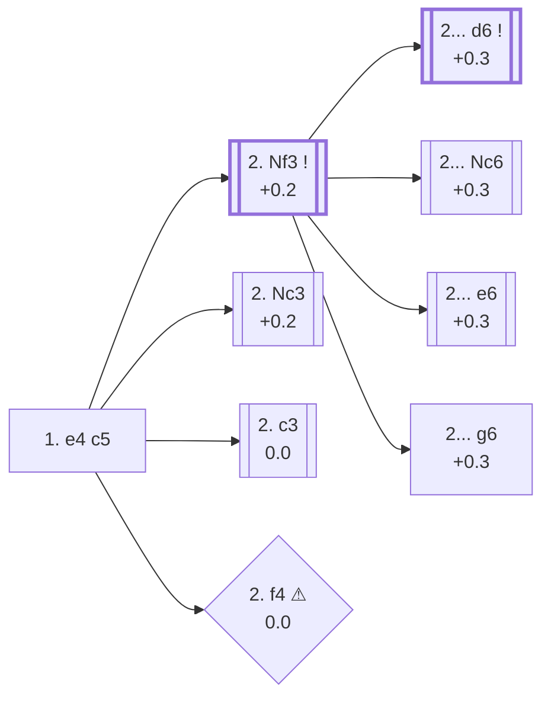

<a name="_TOP_"></a>

# B20 Sicilian Defense <br> 1. e4 c5 #

Black avoids symmetry from the very first move and fights for the centre on the queenside instead of matching White pawn for pawn. It's the single most popular reply to 1. e4 at every serious level of the game — 45.9% of masters games, more than any other Black try — and covers by far the largest body of opening theory in chess, spanning dozens of independent named systems (Najdorf, Dragon, Sveshnikov, Taimanov, Kan, and many more) that each deserve their own dedicated cards. This page only covers the first branch, three plies deep; everything past that fans out into future cards.

### Overview

*Quick map of every move covered on this card — see the [shape key](https://github.com/onclemarcel/chess_flashcards/blob/main/start.md#content-diagram-optional) in start.md.*

<!-- content-diagram:start -->

<!-- content-diagram:end -->

<a name="_initial_move_"></a>

[](https://lichess.org/analysis/standard/rnbqkbnr/pp1ppppp/8/2p5/4P3/8/PPPP1PPP/RNBQKBNR_w_KQkq_c6_0_2)

*... 1. e4 c5 — Sicilian Defense*

```
rnbqkbnr/pp1ppppp/8/2p5/4P3/8/PPPP1PPP/RNBQKBNR w KQkq c6 0 2
```

|  | +0.3 |
| --- | --- |

<!-- lichess-stats:start fen="rnbqkbnr/pp1ppppp/8/2p5/4P3/8/PPPP1PPP/RNBQKBNR w KQkq c6 0 2" db="lichess,masters" speeds="bullet,blitz" ratings="1800,2000,2200,2500" moves="8" -->
| Move | Online | W/D/B | Masters | W/D/B | |
| :--- | ---: | :--- | ---: | :--- | :-- |
| Nf3 | 171.9 M (55.2%) | ⬜⬜⬜⬜⬜⬛⬛⬛⬛⬛ 48/5/47 | 497 k (82.7%) | ⬜⬜⬜🟫🟫🟫🟫⬛⬛⬛ 32/43/25 |  |
| Nc3 | 40.7 M (13.1%) | ⬜⬜⬜⬜⬜⬛⬛⬛⬛⬛ 50/4/45 | 45 k (7.5%) | ⬜⬜⬜🟫🟫🟫🟫⬛⬛⬛ 31/40/29 |  |
| d4 | 27.9 M (9.0%) | ⬜⬜⬜⬜⬜⬛⬛⬛⬛⬛ 50/4/46 | 3.4 k (0.6%) | ⬜⬜⬜🟫🟫🟫🟫⬛⬛⬛ 26/39/35 |  |
| c3 | 18.8 M (6.0%) | ⬜⬜⬜⬜⬜⬛⬛⬛⬛⬛ 50/5/45 | 38 k (6.3%) | ⬜⬜⬜🟫🟫🟫🟫⬛⬛⬛ 28/44/28 |  |
| Bc4 | 13.8 M (4.4%) | ⬜⬜⬜⬜⬜⬛⬛⬛⬛⬛ 46/4/50 | 0 | — | ⚠ |
| f4 | 13.7 M (4.4%) | ⬜⬜⬜⬜⬜⬛⬛⬛⬛⬛ 47/4/49 | 2.7 k (0.4%) | ⬜⬜⬜🟫🟫🟫🟫⬛⬛⬛ 28/38/34 |  |
| d3 | 6.8 M (2.2%) | ⬜⬜⬜⬜⬜⬛⬛⬛⬛⬛ 47/4/48 | 3.2 k (0.5%) | ⬜⬜⬜⬜🟫🟫🟫⬛⬛⬛ 34/34/32 |  |
| b4 | 4.2 M (1.4%) | ⬜⬜⬜⬜⬜⬛⬛⬛⬛⬛ 50/4/47 | 0 | — | ⚠ |
| b3 | 0 | — | 3.1 k (0.5%) | ⬜⬜⬜🟫🟫🟫⬛⬛⬛⬛ 32/34/34 |  |
| Ne2 | 0 | — | 2.9 k (0.5%) | ⬜⬜⬜⬜🟫🟫🟫🟫⬛⬛ 37/37/26 |  |

*Online: bullet/blitz, 1800+ — 311.7 M games. Masters: 601 k games. [Open in the explorer](https://lichess.org/analysis/standard/rnbqkbnr/pp1ppppp/8/2p5/4P3/8/PPPP1PPP/RNBQKBNR_w_KQkq_c6_0_2#explorer) — updated 2026-08-31*
<!-- lichess-stats:end -->

### Candidate moves

* [**2. Nf3**](#_Nf3_) (+0.2): the *Open Sicilian* — masters' overwhelming preference (82.7%), preparing d4 to trade off Black's c-pawn and open the centre. Leads to the sharpest and most theoretically dense Sicilian lines.
* [**2. Nc3**](#_Nc3_) (+0.2): the *Closed Sicilian* — develops without committing to d4, often followed by g3 and a slower, more positional game.
* [**2. c3**](#_c3_) (0.0): the *Alapin Variation* — prepares d4 with the pawn already supported by c3, sidestepping Open Sicilian theory almost entirely. A favourite of players who want to reach a solid, well-understood middlegame without memorising forcing lines.
* [**2. f4**](#_f4_) (0.0 ⚠): the *Grand Prix Attack* — aims straight for a kingside attack rather than central control. Far more common online (4.4%) than in masters play (0.4%), since **2... d5!** strikes back in the centre immediately and is considered Black's simplest equalizer.

[*Back to TOP*](#_TOP_)

---

<a name="_Nf3_"></a>

### 2. Nf3 — Open Sicilian

[](https://lichess.org/analysis/standard/rnbqkbnr/pp1ppppp/8/2p5/4P3/5N2/PPPP1PPP/RNBQKB1R_b_KQkq_-_1_2)

*... 2. Nf3 — Open Sicilian*

```
rnbqkbnr/pp1ppppp/8/2p5/4P3/5N2/PPPP1PPP/RNBQKB1R b KQkq - 1 2
```

|  | +0.2 |
| --- | --- |

<!-- lichess-stats:start fen="rnbqkbnr/pp1ppppp/8/2p5/4P3/5N2/PPPP1PPP/RNBQKB1R b KQkq - 1 2" db="lichess,masters" speeds="bullet,blitz" ratings="1800,2000,2200,2500" moves="8" -->
| Move | Online | W/D/B | Masters | W/D/B | |
| :--- | ---: | :--- | ---: | :--- | :-- |
| Nc6 | 66.9 M (38.6%) | ⬜⬜⬜⬜⬜⬛⬛⬛⬛⬛ 49/5/46 | 135 k (26.9%) | ⬜⬜⬜🟫🟫🟫🟫🟫⬛⬛ 32/44/24 |  |
| d6 | 56.3 M (32.5%) | ⬜⬜⬜⬜⬜⬛⬛⬛⬛⬛ 48/5/47 | 231 k (46.1%) | ⬜⬜⬜🟫🟫🟫🟫🟫⬛⬛ 30/46/24 |  |
| e6 | 34.0 M (19.7%) | ⬜⬜⬜⬜⬜⬛⬛⬛⬛⬛ 47/5/49 | 115 k (23.0%) | ⬜⬜⬜🟫🟫🟫🟫⬛⬛⬛ 34/37/28 |  |
| g6 | 8.8 M (5.1%) | ⬜⬜⬜⬜⬜⬛⬛⬛⬛⬛ 47/5/48 | 10 k (2.1%) | ⬜⬜⬜⬜🟫🟫🟫🟫⬛⬛ 37/39/24 |  |
| a6 | 3.7 M (2.1%) | ⬜⬜⬜⬜⬜⬛⬛⬛⬛⬛ 46/5/49 | 4.9 k (1.0%) | ⬜⬜⬜⬜🟫🟫🟫⬛⬛⬛ 35/35/30 |  |
| Nf6 | 1.6 M (0.9%) | ⬜⬜⬜⬜🟫⬛⬛⬛⬛⬛ 45/5/51 | 3.6 k (0.7%) | ⬜⬜⬜⬜🟫🟫🟫🟫⬛⬛ 37/38/25 |  |
| d5 | 853 k (0.5%) | ⬜⬜⬜⬜⬜⬛⬛⬛⬛⬛ 46/5/49 | 0 | — | ⚠ |
| b6 | 463 k (0.3%) | ⬜⬜⬜⬜⬜⬛⬛⬛⬛⬛ 50/4/45 | 588 (0.1%) | ⬜⬜⬜⬜🟫🟫🟫⬛⬛⬛ 37/29/34 |  |
| Qc7 | 0 | — | 55 (0.0%) | ⬜⬜⬜⬜🟫🟫🟫🟫⬛⬛ 38/38/24 |  |

*Online: bullet/blitz, 1800+ — 173.1 M games. Masters: 501 k games. [Open in the explorer](https://lichess.org/analysis/standard/rnbqkbnr/pp1ppppp/8/2p5/4P3/5N2/PPPP1PPP/RNBQKB1R_b_KQkq_-_1_2#explorer) — updated 2026-08-31*
<!-- lichess-stats:end -->

Masters are close to evenly split three ways here, and each answer opens into its own vast body of theory:

* [**2... d6**](https://github.com/onclemarcel/chess_flashcards/blob/main/e4_openings/B50_Sicilian_d6_Open.md) (+0.3, 46.1% masters): prepares ... Nf6 without allowing e5 tricks, keeping options open between the [*Najdorf*](https://github.com/onclemarcel/chess_flashcards/blob/main/e4_openings/B50_Sicilian_d6_Open.md), *Classical*, and *Dragon* families depending on how the game continues after 3. d4 cxd4 4. Nxd4 Nf6 5. Nc3.
* [**2... Nc6**](https://github.com/onclemarcel/chess_flashcards/blob/main/e4_openings/B30_Sicilian_Nc6_Open.md) (+0.3, 26.9% masters): develops naturally and keeps flexible, heading toward the [*Sveshnikov*](https://github.com/onclemarcel/chess_flashcards/blob/main/e4_openings/B30_Sicilian_Nc6_Open.md), *Taimanov*, or a *Rossolimo*-style **3. Bb5** setup.
* [**2... e6**](https://github.com/onclemarcel/chess_flashcards/blob/main/e4_openings/B40_Sicilian_e6_Open.md) (+0.3, 23.0% masters): flexible and solid, aiming for the [*Taimanov* or *Kan*](https://github.com/onclemarcel/chess_flashcards/blob/main/e4_openings/B40_Sicilian_e6_Open.md) systems, often delaying ... Nf6 or ... d6 for a move or two.
* [**2... g6**](https://github.com/onclemarcel/chess_flashcards/blob/main/e4_openings/B34_Sicilian_g6_Accelerated_Dragon.md) (+0.3, 2.1% masters): the [*Accelerated Dragon*](https://github.com/onclemarcel/chess_flashcards/blob/main/e4_openings/B34_Sicilian_g6_Accelerated_Dragon.md) — fianchettoes at once, skipping ... d6 to reach a Dragon-style setup a tempo faster, at the cost of allowing White's Maroczy Bind (**3. c4**) since the c-pawn hasn't committed to d6 yet.

All four are fully sound main systems.

[*Back to 1... c5*](#_initial_move_)
[*Back to TOP*](#_TOP_)

---

> [!NOTE]
> **2. c3** offers a completely different kind of game from the Open Sicilian: quieter, less forcing, and much less theory-dependent — a popular practical choice against opponents who know their Sicilian theory cold.
>
> <a name="_c3_"></a>
>
> ### 2. c3 — Alapin Variation
>
> [](https://lichess.org/analysis/standard/rnbqkbnr/pp1ppppp/8/2p5/4P3/2P5/PP1P1PPP/RNBQKBNR_b_KQkq_-_0_2)
>
> *... 2. c3 — Alapin Variation*
>
> ```
> rnbqkbnr/pp1ppppp/8/2p5/4P3/2P5/PP1P1PPP/RNBQKBNR b KQkq - 0 2
> ```
>
> |  | 0.0 |
> | --- | --- |
>
> <!-- lichess-stats:start fen="rnbqkbnr/pp1ppppp/8/2p5/4P3/2P5/PP1P1PPP/RNBQKBNR b KQkq - 0 2" db="lichess,masters" speeds="bullet,blitz" ratings="1800,2000,2200,2500" moves="6" -->
> | Move | Online | W/D/B | Masters | W/D/B | |
> | :--- | ---: | :--- | ---: | :--- | :-- |
> | Nc6 | 4.7 M (24.8%) | ⬜⬜⬜⬜⬜🟫⬛⬛⬛⬛ 52/4/43 | 0 | — | ⚠ |
> | d5 | 3.7 M (19.7%) | ⬜⬜⬜⬜⬜🟫⬛⬛⬛⬛ 49/6/45 | 13 k (33.2%) | ⬜⬜⬜🟫🟫🟫🟫⬛⬛⬛ 28/45/27 |  |
> | e6 | 3.1 M (16.3%) | ⬜⬜⬜⬜⬜⬛⬛⬛⬛⬛ 50/5/46 | 3.0 k (7.9%) | ⬜⬜⬜🟫🟫🟫🟫⬛⬛⬛ 29/42/29 |  |
> | d6 | 2.9 M (15.1%) | ⬜⬜⬜⬜⬜⬛⬛⬛⬛⬛ 50/5/45 | 2.7 k (7.2%) | ⬜⬜⬜🟫🟫🟫🟫⬛⬛⬛ 34/35/30 |  |
> | Nf6 | 2.6 M (13.6%) | ⬜⬜⬜⬜⬜⬛⬛⬛⬛⬛ 48/6/47 | 17 k (44.6%) | ⬜⬜🟫🟫🟫🟫🟫⬛⬛⬛ 26/46/27 |  |
> | g6 | 955 k (5.1%) | ⬜⬜⬜⬜⬜⬛⬛⬛⬛⬛ 47/5/47 | 1.3 k (3.3%) | ⬜⬜⬜🟫🟫🟫🟫⬛⬛⬛ 34/37/30 |  |
> | e5 | 0 | — | 497 (1.3%) | ⬜⬜⬜🟫🟫🟫🟫⬛⬛⬛ 35/37/28 |  |
> 
> *Online: bullet/blitz, 1800+ — 18.8 M games. Masters: 38 k games. [Open in the explorer](https://lichess.org/analysis/standard/rnbqkbnr/pp1ppppp/8/2p5/4P3/2P5/PP1P1PPP/RNBQKBNR_b_KQkq_-_0_2#explorer) — updated 2026-08-31*
> <!-- lichess-stats:end -->
>
> **2... Nf6** (44.6% masters) is the main try, attacking e4 at once: after **3. e5 Nd5**, the knight is well placed on d5 and Black continues ... d6, ... Nc6, and ... g6/... e6 depending on taste. **2... d5** (33.2% masters) strikes back in the centre immediately instead, and after **3. exd5 Qxd5 4. d4**, White develops with tempo against the queen — a structure similar in spirit to the Center Game.
>
> [*Back to 2. Nf3*](#_Nf3_)
> [*Back to TOP*](#_TOP_)

---

> [!NOTE]
> **2. Nc3** keeps options flexible and is a common way to reach a Closed Sicilian setup — White often follows up with g3, Bg2, d3, and f4, aiming for a slow kingside build-up rather than central confrontation.
>
> <a name="_Nc3_"></a>
>
> ### 2. Nc3 — Closed Sicilian
>
> [](https://lichess.org/analysis/standard/rnbqkbnr/pp1ppppp/8/2p5/4P3/2N5/PPPP1PPP/R1BQKBNR_b_KQkq_-_1_2)
>
> *... 2. Nc3 — Closed Sicilian*
>
> ```
> rnbqkbnr/pp1ppppp/8/2p5/4P3/2N5/PPPP1PPP/R1BQKBNR b KQkq - 1 2
> ```
>
> |  | +0.2 |
> | --- | --- |
>
> <!-- lichess-stats:start fen="rnbqkbnr/pp1ppppp/8/2p5/4P3/2N5/PPPP1PPP/R1BQKBNR b KQkq - 1 2" db="lichess,masters" speeds="bullet,blitz" ratings="1800,2000,2200,2500" moves="6" -->
> | Move | Online | W/D/B | Masters | W/D/B | |
> | :--- | ---: | :--- | ---: | :--- | :-- |
> | Nc6 | 17.7 M (42.7%) | ⬜⬜⬜⬜⬜⬛⬛⬛⬛⬛ 50/4/45 | 26 k (57.5%) | ⬜⬜⬜🟫🟫🟫🟫⬛⬛⬛ 31/41/28 |  |
> | e6 | 9.3 M (22.4%) | ⬜⬜⬜⬜⬜⬛⬛⬛⬛⬛ 49/4/47 | 6.7 k (14.7%) | ⬜⬜⬜🟫🟫🟫🟫⬛⬛⬛ 32/36/32 |  |
> | d6 | 9.2 M (22.3%) | ⬜⬜⬜⬜⬜🟫⬛⬛⬛⬛ 51/4/44 | 8.1 k (17.9%) | ⬜⬜⬜🟫🟫🟫🟫⬛⬛⬛ 31/42/27 |  |
> | g6 | 2.5 M (6.1%) | ⬜⬜⬜⬜⬜⬛⬛⬛⬛⬛ 50/5/46 | 1.3 k (2.9%) | ⬜⬜⬜⬜🟫🟫🟫⬛⬛⬛ 36/35/29 |  |
> | a6 | 1.7 M (4.0%) | ⬜⬜⬜⬜⬜⬛⬛⬛⬛⬛ 48/5/47 | 3.1 k (6.8%) | ⬜⬜⬜🟫🟫🟫🟫⬛⬛⬛ 31/35/34 |  |
> | Nf6 | 343 k (0.8%) | ⬜⬜⬜⬜⬜⬛⬛⬛⬛⬛ 50/4/46 | 0 | — | ⚠ |
> | b6 | 0 | — | 28 (0.1%) | ⬜⬜⬜⬜🟫🟫🟫⬛⬛⬛ 43/25/32 |  |
> 
> *Online: bullet/blitz, 1800+ — 41.4 M games. Masters: 46 k games. [Open in the explorer](https://lichess.org/analysis/standard/rnbqkbnr/pp1ppppp/8/2p5/4P3/2N5/PPPP1PPP/R1BQKBNR_b_KQkq_-_1_2#explorer) — updated 2026-08-31*
> <!-- lichess-stats:end -->
>
> **2... Nc6** (57.5% masters) is by far the main reply, often meeting **3. g3** with **3... g6**, both sides fianchettoing for a symmetrical-looking but strategically rich middlegame.
>
> [*Back to 2. Nf3*](#_Nf3_)
> [*Back to TOP*](#_TOP_)

---

> [!TIP]
> **2. f4** goes straight for a kingside attack rather than the centre, but it hands Black an easy, well-known way to strike back before White's plan gets going.
>
> <a name="_f4_"></a>
>
> ### 2. f4 — Grand Prix Attack
>
> [](https://lichess.org/analysis/standard/rnbqkbnr/pp1ppppp/8/2p5/4PP2/8/PPPP2PP/RNBQKBNR_b_KQkq_f3_0_2)
>
> *... 2. f4 — Grand Prix Attack*
>
> ```
> rnbqkbnr/pp1ppppp/8/2p5/4PP2/8/PPPP2PP/RNBQKBNR b KQkq f3 0 2
> ```
>
> |  | 0.0 |
> | --- | --- |
>
> <!-- lichess-stats:start fen="rnbqkbnr/pp1ppppp/8/2p5/4PP2/8/PPPP2PP/RNBQKBNR b KQkq f3 0 2" db="lichess,masters" speeds="bullet,blitz" ratings="1800,2000,2200,2500" moves="6" -->
> | Move | Online | W/D/B | Masters | W/D/B | |
> | :--- | ---: | :--- | ---: | :--- | :-- |
> | Nc6 | 5.4 M (38.4%) | ⬜⬜⬜⬜⬜⬛⬛⬛⬛⬛ 47/4/49 | 689 (25.6%) | ⬜⬜⬜⬜🟫🟫🟫⬛⬛⬛ 36/31/33 |  |
> | d6 | 2.8 M (19.7%) | ⬜⬜⬜⬜⬜⬛⬛⬛⬛⬛ 49/4/48 | 72 (2.7%) | ⬜⬜⬜⬜🟫🟫🟫⬛⬛⬛ 39/35/26 |  |
> | e6 | 2.5 M (17.7%) | ⬜⬜⬜⬜⬜⬛⬛⬛⬛⬛ 46/4/50 | 488 (18.1%) | ⬜⬜⬜🟫🟫🟫🟫⬛⬛⬛ 30/39/32 |  |
> | d5 | 2.0 M (14.4%) | ⬜⬜⬜⬜⬜⬛⬛⬛⬛⬛ 45/4/51 | 1.0 k (37.4%) | ⬜⬜🟫🟫🟫🟫⬛⬛⬛⬛ 23/43/34 |  |
> | g6 | 692 k (4.9%) | ⬜⬜⬜⬜⬜⬛⬛⬛⬛⬛ 45/4/51 | 367 (13.6%) | ⬜⬜🟫🟫🟫🟫⬛⬛⬛⬛ 23/39/38 |  |
> | e5 | 212 k (1.5%) | ⬜⬜⬜⬜⬜⬛⬛⬛⬛⬛ 46/3/51 | 0 | — | ⚠ |
> | Nf6 | 0 | — | 41 (1.5%) | ⬜⬜⬜🟫🟫🟫⬛⬛⬛⬛ 32/27/41 |  |
> 
> *Online: bullet/blitz, 1800+ — 14.0 M games. Masters: 2.7 k games. [Open in the explorer](https://lichess.org/analysis/standard/rnbqkbnr/pp1ppppp/8/2p5/4PP2/8/PPPP2PP/RNBQKBNR_b_KQkq_f3_0_2#explorer) — updated 2026-08-31*
> <!-- lichess-stats:end -->
>
> **2... d5!** (37.4% masters, the top try) hits back in the centre before White's kingside plan gets moving: after **3. exd5 Nf6**, Black regains the pawn with a comfortable game, since the knight both attacks d5 and prepares to meet **4. Nc3** with ... Nxd5. This is why the Grand Prix scores much better online (4.4% of tries) than in masters practice (0.4%) — it rewards an opponent who doesn't know the simple central answer.
>
> [*Back to 2. Nf3*](#_Nf3_)
> [*Back to TOP*](#_TOP_)
