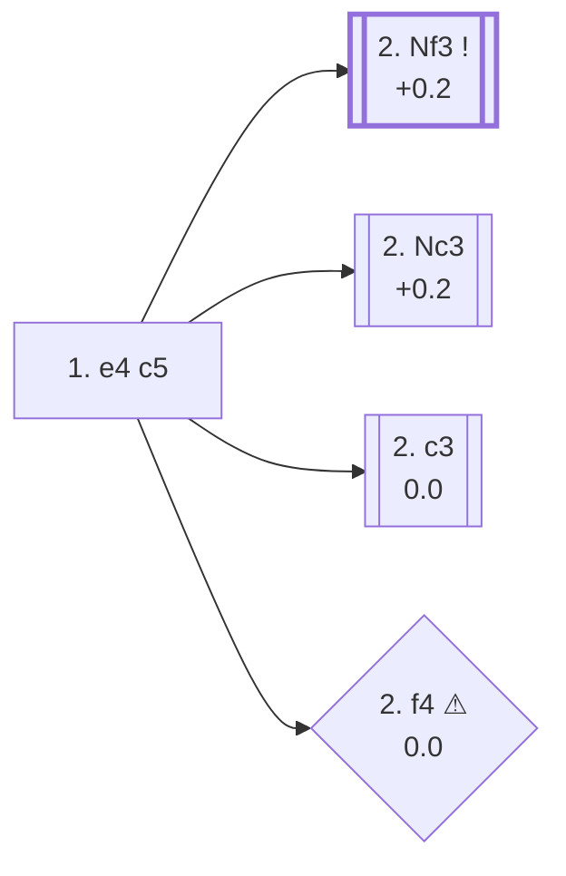

<a name="_TOP_"></a>

# B20 Sicilian Defense <br> 1. e4 c5 #

Black avoids symmetry from the very first move and fights for the centre on the queenside instead of matching White pawn for pawn. It's the single most popular reply to 1. e4 at every serious level of the game — 45.9% of masters games, more than any other Black try — and covers by far the largest body of opening theory in chess, spanning dozens of independent named systems (Najdorf, Dragon, Sveshnikov, Taimanov, Kan, and many more) that each deserve their own dedicated cards.

**Corrected 2026-08-31**: this card used to build **2. f4**, **2. c3**, **2. Nc3**, and the whole **2. Nf3** hub in place, as if they all stayed B20. Live-confirmed via the Lichess explorer's own `opening` field: those moves are actually **B21** (McDonnell Attack), **B22** (Alapin Variation), **B23** (Closed), and **B27** (the bare "2. Nf3" position itself) respectively — the same "wrong root code" pattern found repeatedly throughout this whole ECO sweep. Moved to [`B21_Sicilian_McDonnell_Smith_Morra.md`](https://github.com/onclemarcel/chess_flashcards/blob/main/e4_openings/B21_Sicilian_McDonnell_Smith_Morra.md), [`B22_Sicilian_Alapin.md`](https://github.com/onclemarcel/chess_flashcards/blob/main/e4_openings/B22_Sicilian_Alapin.md), [`B23_Sicilian_Closed.md`](https://github.com/onclemarcel/chess_flashcards/blob/main/e4_openings/B23_Sicilian_Closed.md), and [`B27_Sicilian_Open.md`](https://github.com/onclemarcel/chess_flashcards/blob/main/e4_openings/B27_Sicilian_Open.md). This card now covers only its own root plus its genuinely B20-coded siblings.

### Overview

*Quick map of every move covered on this card — see the [shape key](https://github.com/onclemarcel/chess_flashcards/blob/main/start.md#content-diagram-optional) in start.md.*

<!-- content-diagram:start -->

<!-- content-diagram:end -->

<a name="_initial_move_"></a>

[](https://lichess.org/analysis/standard/rnbqkbnr/pp1ppppp/8/2p5/4P3/8/PPPP1PPP/RNBQKBNR_w_KQkq_c6_0_2)

*... 1. e4 c5 — Sicilian Defense*

```
rnbqkbnr/pp1ppppp/8/2p5/4P3/8/PPPP1PPP/RNBQKBNR w KQkq c6 0 2
```

|  | +0.3 |
| --- | --- |

<!-- lichess-stats:start fen="rnbqkbnr/pp1ppppp/8/2p5/4P3/8/PPPP1PPP/RNBQKBNR w KQkq c6 0 2" db="lichess,masters" speeds="bullet,blitz" ratings="1800,2000,2200,2500" moves="8" -->
| Move | Online | W/D/B | Masters | W/D/B | |
| :--- | ---: | :--- | ---: | :--- | :-- |
| Nf3 | 171.9 M (55.2%) | ⬜⬜⬜⬜⬜⬛⬛⬛⬛⬛ 48/5/47 | 497 k (82.7%) | ⬜⬜⬜🟫🟫🟫🟫⬛⬛⬛ 32/43/25 |  |
| Nc3 | 40.7 M (13.1%) | ⬜⬜⬜⬜⬜⬛⬛⬛⬛⬛ 50/4/45 | 45 k (7.5%) | ⬜⬜⬜🟫🟫🟫🟫⬛⬛⬛ 31/40/29 |  |
| d4 | 27.9 M (9.0%) | ⬜⬜⬜⬜⬜⬛⬛⬛⬛⬛ 50/4/46 | 3.4 k (0.6%) | ⬜⬜⬜🟫🟫🟫🟫⬛⬛⬛ 26/39/35 |  |
| c3 | 18.8 M (6.0%) | ⬜⬜⬜⬜⬜⬛⬛⬛⬛⬛ 50/5/45 | 38 k (6.3%) | ⬜⬜⬜🟫🟫🟫🟫⬛⬛⬛ 28/44/28 |  |
| Bc4 | 13.8 M (4.4%) | ⬜⬜⬜⬜⬜⬛⬛⬛⬛⬛ 46/4/50 | 0 | — | ⚠ |
| f4 | 13.7 M (4.4%) | ⬜⬜⬜⬜⬜⬛⬛⬛⬛⬛ 47/4/49 | 2.7 k (0.4%) | ⬜⬜⬜🟫🟫🟫🟫⬛⬛⬛ 28/38/34 |  |
| d3 | 6.8 M (2.2%) | ⬜⬜⬜⬜⬜⬛⬛⬛⬛⬛ 47/4/48 | 3.2 k (0.5%) | ⬜⬜⬜⬜🟫🟫🟫⬛⬛⬛ 34/34/32 |  |
| b4 | 4.2 M (1.4%) | ⬜⬜⬜⬜⬜⬛⬛⬛⬛⬛ 50/4/47 | 0 | — | ⚠ |
| b3 | 0 | — | 3.1 k (0.5%) | ⬜⬜⬜🟫🟫🟫⬛⬛⬛⬛ 32/34/34 |  |
| Ne2 | 0 | — | 2.9 k (0.5%) | ⬜⬜⬜⬜🟫🟫🟫🟫⬛⬛ 37/37/26 |  |

*Online: bullet/blitz, 1800+ — 311.7 M games. Masters: 601 k games. [Open in the explorer](https://lichess.org/analysis/standard/rnbqkbnr/pp1ppppp/8/2p5/4P3/8/PPPP1PPP/RNBQKBNR_w_KQkq_c6_0_2#explorer) — updated 2026-09-02*
<!-- lichess-stats:end -->

### Candidate moves

* [**2. Nf3**](https://github.com/onclemarcel/chess_flashcards/blob/main/e4_openings/B27_Sicilian_Open.md) (+0.2, 82.7% masters): the *Open Sicilian* — masters' overwhelming preference, preparing d4 to trade off Black's c-pawn and open the centre. Live-confirmed its own code, **B27** — covered on its own card, forking further into B30/B34/B40/B50.
* [**2. Nc3**](https://github.com/onclemarcel/chess_flashcards/blob/main/e4_openings/B23_Sicilian_Closed.md) (+0.2, 7.5% masters): the *Closed Sicilian* — develops without committing to d4. Live-confirmed its own code, **B23** — covered on its own card.
* [**2. c3**](https://github.com/onclemarcel/chess_flashcards/blob/main/e4_openings/B22_Sicilian_Alapin.md) (0.0, 6.3% masters): the *Alapin Variation* — prepares d4 with the pawn already supported. Live-confirmed its own code, **B22** — covered on its own card.
* [**2. f4**](https://github.com/onclemarcel/chess_flashcards/blob/main/e4_openings/B21_Sicilian_McDonnell_Smith_Morra.md) (0.0 ⚠, 0.4% masters): live-tagged the *McDonnell Attack* (`eco.md`: "Grand Prix Attack" — a real name divergence, since Lichess reserves "Grand Prix Attack" for the same idea reached via 2. Nc3 Nc6 3. f4 instead). Live-confirmed its own code, **B21** — covered on its own card.
* **2. g3** (mention-only): live-tagged the *Lasker-Dunne Attack* — see the note below.
* **2. b4** (mention-only): the *Wing Gambit* — see the note below.
* **2. Ne2** (mention-only): the *Keres Variation* — see the note below.

[*Back to TOP*](#_TOP_)

---

> [!NOTE]
> **2. g3!?**, live-tagged the *Lasker-Dunne Attack* (0.0, mention-only — `eco.md` calls it the "Steinitz Variation," a real name divergence), fianchettoes immediately without committing the queen's knight or the c-pawn. Masters split between **2... Nc6** (45.3%) and **2... d5** (35.9%).
>
> <a name="_g3_"></a>
>
> [*Back to TOP*](#_TOP_)

---

> [!NOTE]
> **2. Ne2!?**, the *Keres Variation* (0.0, mention-only), keeps options flexible between transposing into an Alapin-style c3 setup or a Closed Sicilian with Nbc3. Masters split between **2... Nc6** (37.3%) and **2... d6** (29.9%).
>
> <a name="_Ne2_"></a>
>
> [*Back to TOP*](#_TOP_)

---

> [!NOTE]
> **2. b4!?**, the *Wing Gambit* (mention-only), sacrifices the b-pawn for rapid development and open lines against Black's own queenside — a real, well-tested gambit (688 masters games), not just a blunder-tier try.
>
> <a name="_b4_"></a>
>
> ### 2. b4 — Wing Gambit
>
> [](https://lichess.org/analysis/standard/rnbqkbnr/pp1ppppp/8/2p5/1P2P3/8/P1PP1PPP/RNBQKBNR_b_KQkq_b3_0_2)
>
> *... 2. b4 — Wing Gambit*
>
> ```
> rnbqkbnr/pp1ppppp/8/2p5/1P2P3/8/P1PP1PPP/RNBQKBNR b KQkq b3 0 2
> ```
>
> |  | −0.3 |
> | --- | --- |
>
> **2... cxb4** is masters' overwhelming reply (87.9%), simply accepting the pawn. White's own 3rd move then forks into two named sub-lines:
>
> * **3. c4** (mention-only): the *Santasiere Variation* — a genuine database rarity (only 3 masters games).
> * **3. a3** (mention-only): the *Marshall Variation* — masters' main try at this fork, forking further into the *Marienbad Variation* (3... d5 4. exd5 Qxd5 5. Bb2) and the *Carlsbad Variation* (3... bxa3).
>
> Not built out further here (backlog) — deeper Wing Gambit theory is its own extensive body of work.
>
> [*Back to TOP*](#_TOP_)

---

> [!NOTE]
> **2. c4!?** intending **2... d6 3. Nc3 Nc6 4. g3 h5!?**, the *Gloria Variation* (+0.2, mention-only), is a genuine database curiosity reached via an unusual early c4 — an extremely rare line (only 3 masters games) where Black immediately lashes out with the h-pawn against White's own fianchetto plan.
>
> <a name="_Gloria_"></a>
>
> [*Back to TOP*](#_TOP_)
