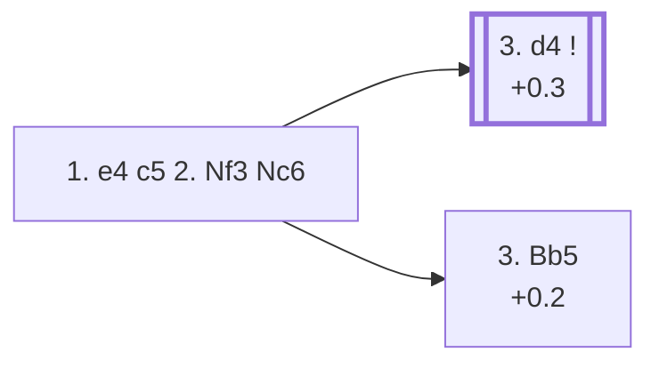

<a name="_TOP_"></a>

# B30 Sicilian Defense, 2... Nc6 <br> 1. e4 c5 2. Nf3 Nc6 #

Developing the queenside knight immediately keeps Black's options wide open — the c6-knight supports a future ... e5 or ... d5 break and doesn't commit to a pawn structure the way 2... d6 or 2... e6 do. White has two genuinely independent main plans here: open the centre with 3. d4, or sidestep Open Sicilian theory almost entirely with 3. Bb5.

### Overview

*Quick map of every move covered on this card — see the [shape key](https://github.com/onclemarcel/chess_flashcards/blob/main/start.md#content-diagram-optional) in start.md.*

<!-- content-diagram:start -->

<!-- content-diagram:end -->

<a name="_initial_move_"></a>

[](https://lichess.org/analysis/standard/r1bqkbnr/pp1ppppp/2n5/2p5/4P3/5N2/PPPP1PPP/RNBQKB1R_w_KQkq_-_2_3)

*... 1. e4 c5 2. Nf3 Nc6*

```
r1bqkbnr/pp1ppppp/2n5/2p5/4P3/5N2/PPPP1PPP/RNBQKB1R w KQkq - 2 3
```

|  | +0.3 |
| --- | --- |

<!-- lichess-stats:start fen="r1bqkbnr/pp1ppppp/2n5/2p5/4P3/5N2/PPPP1PPP/RNBQKB1R w KQkq - 2 3" db="lichess,masters" speeds="bullet,blitz" ratings="1800,2000,2200,2500" moves="6" -->
| Move | Online | W/D/B | Masters | W/D/B | |
| :--- | ---: | :--- | ---: | :--- | :-- |
| d4 | 35.3 M (52.7%) | ⬜⬜⬜⬜⬜⬛⬛⬛⬛⬛ 48/5/47 | 78 k (57.9%) | ⬜⬜⬜🟫🟫🟫🟫🟫⬛⬛ 30/45/24 |  |
| Bb5 | 9.3 M (14.0%) | ⬜⬜⬜⬜⬜🟫⬛⬛⬛⬛ 51/5/44 | 39 k (28.6%) | ⬜⬜⬜⬜🟫🟫🟫🟫⬛⬛ 34/43/22 |  |
| c3 | 7.0 M (10.4%) | ⬜⬜⬜⬜⬜⬛⬛⬛⬛⬛ 50/5/46 | 3.7 k (2.7%) | ⬜⬜⬜🟫🟫🟫🟫⬛⬛⬛ 34/41/26 |  |
| Bc4 | 6.4 M (9.5%) | ⬜⬜⬜⬜⬜⬛⬛⬛⬛⬛ 47/4/49 | 436 (0.3%) | ⬜⬜⬜🟫🟫🟫🟫⬛⬛⬛ 34/37/29 |  |
| Nc3 | 4.3 M (6.4%) | ⬜⬜⬜⬜⬜⬛⬛⬛⬛⬛ 49/5/47 | 12 k (8.8%) | ⬜⬜⬜🟫🟫🟫🟫🟫⬛⬛ 34/45/21 |  |
| d3 | 1.5 M (2.2%) | ⬜⬜⬜⬜⬜⬛⬛⬛⬛⬛ 48/5/47 | 1.1 k (0.8%) | ⬜⬜⬜🟫🟫🟫⬛⬛⬛⬛ 29/31/40 |  |

*Online: bullet/blitz, 1800+ — 66.8 M games. Masters: 135 k games. [Open in the explorer](https://lichess.org/analysis/standard/r1bqkbnr/pp1ppppp/2n5/2p5/4P3/5N2/PPPP1PPP/RNBQKB1R_w_KQkq_-_2_3#explorer) — updated 2026-09-02*
<!-- lichess-stats:end -->

### Candidate moves

* [**3. d4**](https://github.com/onclemarcel/chess_flashcards/blob/main/e4_openings/B32_Sicilian_Open.md) (+0.3): the Open Sicilian — masters' main choice (57.9%), striking the centre immediately. Even this bare move is already live-tagged **B32**, not B30 — see [`B32_Sicilian_Open.md`](https://github.com/onclemarcel/chess_flashcards/blob/main/e4_openings/B32_Sicilian_Open.md) for the whole Open Sicilian fork (Flohr/Nimzo-American/Löwenthal-Kalashnikov/the Lasker-Pelikan-Sveshnikov complex/the Accelerated Dragon).
* [**3. Bb5**](#_Bb5_) (+0.2): the *Rossolimo Variation* — pins the knight instead, aiming to trade it off for the bishop and inflict doubled pawns, all without touching d4. A serious, independent try (28.6% of masters games), not a sideline.

[*Back to TOP*](#_TOP_)

---

> [!NOTE]
> **3. d4** is already live-tagged **B32** the moment it's played — confirmed via the explorer's own `opening` field on the bare post-3.d4 position, before Black has even recaptured. Not built out on this card at all: see [`B32_Sicilian_Open.md`](https://github.com/onclemarcel/chess_flashcards/blob/main/e4_openings/B32_Sicilian_Open.md) for the whole Open Sicilian tree — 3... cxd4 4. Nxd4 forks into the Flohr (4... Qc7), Nimzo-American (4... d5), and Löwenthal→Kalashnikov (4... e5) Variations that stay B32, plus 4... Nf6 (→ [B33](https://github.com/onclemarcel/chess_flashcards/blob/main/e4_openings/B33_Sicilian_Lasker_Pelikan.md), the Lasker-Pelikan/Sveshnikov complex) and 4... g6 (→ the Accelerated Dragon family, [B34](https://github.com/onclemarcel/chess_flashcards/blob/main/e4_openings/B34_Sicilian_g6_Accelerated_Dragon.md)-[B39](https://github.com/onclemarcel/chess_flashcards/blob/main/e4_openings/B39_Sicilian_Accelerated_Dragon_Maroczy_Breyer.md)).

> [!NOTE]
> **3. Bb5** avoids Open Sicilian theory almost entirely — a popular practical weapon at every level, from club players who don't want to face the Sveshnikov or Najdorf to grandmasters looking for a safe edge.
>
> <a name="_Bb5_"></a>
>
> ### 3. Bb5 — Rossolimo Variation
>
> [](https://lichess.org/analysis/standard/r1bqkbnr/pp1ppppp/2n5/1Bp5/4P3/5N2/PPPP1PPP/RNBQK2R_b_KQkq_-_3_3)
>
> *... 3. Bb5 — Rossolimo Variation*
>
> ```
> r1bqkbnr/pp1ppppp/2n5/1Bp5/4P3/5N2/PPPP1PPP/RNBQK2R b KQkq - 3 3
> ```
>
> |  | +0.2 |
> | --- | --- |
>
> <!-- lichess-stats:start fen="r1bqkbnr/pp1ppppp/2n5/1Bp5/4P3/5N2/PPPP1PPP/RNBQK2R b KQkq - 3 3" db="lichess,masters" speeds="bullet,blitz" ratings="1800,2000,2200,2500" moves="6" -->
> | Move | Online | W/D/B | Masters | W/D/B | |
> | :--- | ---: | :--- | ---: | :--- | :-- |
> | g6 | 2.6 M (27.9%) | ⬜⬜⬜⬜⬜🟫⬛⬛⬛⬛ 50/6/44 | 19 k (50.0%) | ⬜⬜⬜🟫🟫🟫🟫🟫⬛⬛ 34/45/20 |  |
> | e6 | 1.6 M (17.5%) | ⬜⬜⬜⬜⬜🟫⬛⬛⬛⬛ 51/5/44 | 9.7 k (25.0%) | ⬜⬜⬜🟫🟫🟫🟫⬛⬛⬛ 32/43/25 |  |
> | d6 | 1.5 M (16.5%) | ⬜⬜⬜⬜⬜🟫⬛⬛⬛⬛ 52/5/43 | 4.7 k (12.1%) | ⬜⬜⬜⬜🟫🟫🟫🟫⬛⬛ 35/43/22 |  |
> | Nd4 | 1.1 M (11.5%) | ⬜⬜⬜⬜⬜⬛⬛⬛⬛⬛ 50/4/45 | 0 | — | ⚠ |
> | a6 | 754 k (8.1%) | ⬜⬜⬜⬜⬜🟫⬛⬛⬛⬛ 53/5/42 | 0 | — | ⚠ |
> | Nf6 | 501 k (5.4%) | ⬜⬜⬜⬜⬜⬛⬛⬛⬛⬛ 49/5/45 | 2.7 k (6.9%) | ⬜⬜⬜🟫🟫🟫🟫⬛⬛⬛ 34/39/26 |  |
> | e5 | 0 | — | 775 (2.0%) | ⬜⬜⬜⬜🟫🟫🟫🟫⬛⬛ 40/39/21 |  |
> | Qb6 | 0 | — | 455 (1.2%) | ⬜⬜⬜⬜🟫🟫🟫⬛⬛⬛ 42/31/26 |  |
> 
> *Online: bullet/blitz, 1800+ — 9.3 M games. Masters: 39 k games. [Open in the explorer](https://lichess.org/analysis/standard/r1bqkbnr/pp1ppppp/2n5/1Bp5/4P3/5N2/PPPP1PPP/RNBQK2R_b_KQkq_-_3_3#explorer) — updated 2026-09-02*
> <!-- lichess-stats:end -->
>
> **3... g6** (50.0% masters, fianchettoing to meet a future Bxc6 recapture with the bishop rather than a pawn) is already live-tagged **B31** — see [`B31_Sicilian_Rossolimo_Fianchetto.md`](https://github.com/onclemarcel/chess_flashcards/blob/main/e4_openings/B31_Sicilian_Rossolimo_Fianchetto.md), not built out further here. **3... e6** (25.0%) and **3... d6** (12.1%) stay B30, simply preparing to meet **4. Bxc6** with a pawn recapture and accept the doubled c-pawns for the bishop pair.
>
> [*Back to 1... Nc6*](#_initial_move_)
> [*Back to TOP*](#_TOP_)
