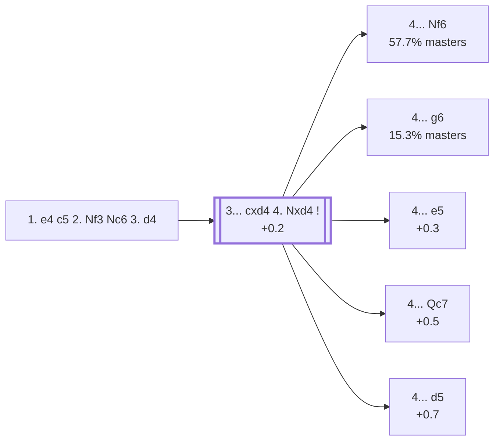

<a name="_TOP_"></a>

# B32 Sicilian Defense: Open <br> 1. e4 c5 2. Nf3 Nc6 3. d4 #

Spun off from [`B30_Sicilian_Nc6_Open.md`](https://github.com/onclemarcel/chess_flashcards/blob/main/e4_openings/B30_Sicilian_Nc6_Open.md)'s own "3. d4" section — a genuine "wrong root code" fix, the same shape found repeatedly across this whole project: even the bare **3. d4** move, before Black has recaptured, is already live-tagged **B32** ("Sicilian Defense: Open"), not B30. White strikes the centre at once; Black's own reply on move 4, after the near-forced **3... cxd4 4. Nxd4**, decides which of several separately-coded Open Sicilian systems the game heads into.

### Overview

*Quick map of every move covered on this card — see the [shape key](https://github.com/onclemarcel/chess_flashcards/blob/main/start.md#content-diagram-optional) in start.md.*

<!-- content-diagram:start -->

<!-- content-diagram:end -->

<a name="_initial_move_"></a>

[](https://lichess.org/analysis/standard/r1bqkbnr/pp1ppppp/2n5/2p5/3PP3/5N2/PPP2PPP/RNBQKB1R_b_KQkq_d3_0_3)

*... 1. e4 c5 2. Nf3 Nc6 3. d4*

```
r1bqkbnr/pp1ppppp/2n5/2p5/3PP3/5N2/PPP2PPP/RNBQKB1R b KQkq d3 0 3
```

|  | +0.3 |
| --- | --- |

Black's recapture is essentially forced (**3... cxd4**, 100% of masters games at this sample size), and White's is nearly so (**4. Nxd4**).

[*Back to TOP*](#_TOP_)

---

<a name="_Nxd4_"></a>

### 3... cxd4 4. Nxd4 — the Open Sicilian fork

[](https://lichess.org/analysis/standard/r1bqkbnr/pp1ppppp/2n5/8/3NP3/8/PPP2PPP/RNBQKB1R_b_KQkq_-_0_4)

*... 3... cxd4 4. Nxd4*

```
r1bqkbnr/pp1ppppp/2n5/8/3NP3/8/PPP2PPP/RNBQKB1R b KQkq - 0 4
```

|  | +0.2 |
| --- | --- |

<!-- lichess-stats:start fen="r1bqkbnr/pp1ppppp/2n5/8/3NP3/8/PPP2PPP/RNBQKB1R b KQkq - 0 4" db="lichess,masters" speeds="bullet,blitz" ratings="1800,2000,2200,2500" moves="8" -->
| Move | Online | W/D/B | Masters | W/D/B | |
| :--- | ---: | :--- | ---: | :--- | :-- |
| e5 | 9.1 M (27.6%) | ⬜⬜⬜⬜⬜⬛⬛⬛⬛⬛ 48/5/47 | 9.3 k (11.8%) | ⬜⬜⬜🟫🟫🟫🟫⬛⬛⬛ 33/42/25 |  |
| Nf6 | 8.3 M (25.0%) | ⬜⬜⬜⬜⬜⬛⬛⬛⬛⬛ 47/5/48 | 45 k (57.7%) | ⬜⬜⬜🟫🟫🟫🟫🟫⬛⬛ 28/49/22 |  |
| g6 | 6.8 M (20.4%) | ⬜⬜⬜⬜⬜⬛⬛⬛⬛⬛ 47/5/48 | 12 k (15.3%) | ⬜⬜⬜⬜🟫🟫🟫🟫⬛⬛ 34/42/24 |  |
| e6 | 3.1 M (9.5%) | ⬜⬜⬜⬜⬜⬛⬛⬛⬛⬛ 48/5/47 | 4.5 k (5.8%) | ⬜⬜⬜🟫🟫🟫🟫⬛⬛⬛ 30/40/30 |  |
| d6 | 2.5 M (7.7%) | ⬜⬜⬜⬜⬜⬛⬛⬛⬛⬛ 51/5/45 | 189 (0.2%) | ⬜⬜⬜⬜🟫🟫🟫🟫⬛⬛ 40/40/20 |  |
| Nxd4 | 1.3 M (3.9%) | ⬜⬜⬜⬜⬜🟫⬛⬛⬛⬛ 54/5/41 | 0 | — | ⚠ |
| a6 | 770 k (2.3%) | ⬜⬜⬜⬜⬜⬛⬛⬛⬛⬛ 50/4/46 | 0 | — | ⚠ |
| Qb6 | 642 k (1.9%) | ⬜⬜⬜⬜⬜⬛⬛⬛⬛⬛ 46/4/50 | 3.8 k (4.8%) | ⬜⬜⬜🟫🟫🟫⬛⬛⬛⬛ 33/31/37 |  |
| Qc7 | 0 | — | 3.2 k (4.1%) | ⬜⬜⬜🟫🟫🟫🟫⬛⬛⬛ 31/38/30 |  |
| d5 | 0 | — | 169 (0.2%) | ⬜⬜⬜⬜🟫🟫🟫🟫⬛⬛ 37/41/22 |  |

*Online: bullet/blitz, 1800+ — 33.2 M games. Masters: 78 k games. [Open in the explorer](https://lichess.org/analysis/standard/r1bqkbnr/pp1ppppp/2n5/8/3NP3/8/PPP2PPP/RNBQKB1R_b_KQkq_-_0_4#explorer) — updated 2026-09-02*
<!-- lichess-stats:end -->

* [**4... Nf6**](https://github.com/onclemarcel/chess_flashcards/blob/main/e4_openings/B33_Sicilian_Lasker_Pelikan.md) (57.7% masters): already live-tagged **B33** — see `B33_Sicilian_Lasker_Pelikan.md`, the Lasker-Pelikan/Sveshnikov complex.
* [**4... g6**](https://github.com/onclemarcel/chess_flashcards/blob/main/e4_openings/B34_Sicilian_g6_Accelerated_Dragon.md) (15.3% masters): the *Accelerated Dragon* — stays B32 at this exact ply (see the top-level game example below), then forks into **B34-B39** at White's own 5th move. See `B34_Sicilian_g6_Accelerated_Dragon.md` onward, not built out further here.
* [**4... e5**](#_e5_) (11.8% masters): the *Löwenthal Variation* — see below.
* **4... e6** (5.8% masters): stays generic B32/B33-adjacent — no further named code in this range; usually transposes into Taimanov/Kan lines from `B40_Sicilian_e6_Open.md`.
* [**4... Qc7**](#_Qc7_) (4.1% masters): the *Flohr Variation* — see below.
* [**4... d5**](#_d5_) (0.2% masters): the *Nimzo-American Variation* — see below.

*A Carlsen–Caruana game (2014 World Cup) is the explorer's own top masters example of 4... g6, and another Carlsen–Caruana game (2018 World Championship, twice) tops the 4... Nf6 list — both confirmed live via `tools/explore.py --top`, not assumed.*

[*Back to TOP*](#_TOP_)

---

<a name="_e5_"></a>

### 4... e5 — Löwenthal Variation

[](https://lichess.org/analysis/standard/r1bqkbnr/pp1p1ppp/2n5/4p3/3NP3/8/PPP2PPP/RNBQKB1R_w_KQkq_e6_0_5)

*... 4... e5 — Löwenthal Variation*

```
r1bqkbnr/pp1p1ppp/2n5/4p3/3NP3/8/PPP2PPP/RNBQKB1R w KQkq e6 0 5
```

|  | +0.3 |
| --- | --- |

<!-- lichess-stats:start fen="r1bqkbnr/pp1p1ppp/2n5/4p3/3NP3/8/PPP2PPP/RNBQKB1R w KQkq e6 0 5" db="lichess,masters" speeds="bullet,blitz" ratings="1800,2000,2200,2500" moves="6" -->
| Move | Online | W/D/B | Masters | W/D/B | |
| :--- | ---: | :--- | ---: | :--- | :-- |
| Nb5 | 4.5 M (48.9%) | ⬜⬜⬜⬜⬜⬛⬛⬛⬛⬛ 49/5/46 | 9.0 k (97.1%) | ⬜⬜⬜🟫🟫🟫🟫⬛⬛⬛ 33/42/24 |  |
| Nxc6 | 2.7 M (29.3%) | ⬜⬜⬜⬜⬜⬛⬛⬛⬛⬛ 46/5/49 | 55 (0.6%) | ⬜⬜🟫🟫🟫🟫⬛⬛⬛⬛ 18/36/45 |  |
| Nb3 | 1.0 M (10.9%) | ⬜⬜⬜⬜⬜⬛⬛⬛⬛⬛ 49/4/46 | 73 (0.8%) | ⬜⬜🟫🟫🟫🟫⬛⬛⬛⬛ 23/38/38 |  |
| Nf3 | 539 k (5.9%) | ⬜⬜⬜⬜⬜⬛⬛⬛⬛⬛ 47/5/49 | 51 (0.6%) | ⬜⬜⬜🟫🟫🟫⬛⬛⬛⬛ 25/29/45 |  |
| Nf5 | 276 k (3.0%) | ⬜⬜⬜⬜⬜⬛⬛⬛⬛⬛ 47/4/48 | 49 (0.5%) | ⬜🟫🟫🟫🟫🟫⬛⬛⬛⬛ 16/47/37 |  |
| Nc3 | 118 k (1.3%) | ⬜⬜⬜⬛⬛⬛⬛⬛⬛⬛ 26/3/71 | 0 | — | ⚠ |
| Ne2 | 0 | — | 42 (0.5%) | ⬜⬜⬜🟫🟫🟫⬛⬛⬛⬛ 29/31/40 |  |

*Online: bullet/blitz, 1800+ — 9.1 M games. Masters: 9.3 k games. [Open in the explorer](https://lichess.org/analysis/standard/r1bqkbnr/pp1p1ppp/2n5/4p3/3NP3/8/PPP2PPP/RNBQKB1R_w_KQkq_e6_0_5#explorer) — updated 2026-09-02*
<!-- lichess-stats:end -->

Immediately striking back in the centre, accepting a slightly weak d5-square in exchange for active piece play — an ancestor of the same Sveshnikov/Kalashnikov family of ideas reached one move order later via `B33_Sicilian_Lasker_Pelikan.md`.

> [!NOTE]
> **5. Nb5 d6** is the *Kalashnikov Variation* — a real name divergence from `eco.md`'s own "Labourdonnais-Loewenthal Variation" label at this exact leaf (the live tag keeps "Löwenthal" for the shallower 4... e5 itself, then switches names once the knight actually hops to b5).
>
> <a name="_Kalashnikov_"></a>
>
> [](https://lichess.org/analysis/standard/r1bqkbnr/pp3ppp/2np4/1N2p3/4P3/8/PPP2PPP/RNBQKB1R_w_KQkq_-_0_6)
>
> *... 5. Nb5 d6 — Kalashnikov Variation*
>
> ```
> r1bqkbnr/pp3ppp/2np4/1N2p3/4P3/8/PPP2PPP/RNBQKB1R w KQkq - 0 6
> ```
>
> |  | +0.4 |
> | --- | --- |
>
> The knight jumps to b5 rather than retreating, eyeing d6/c7; Black shores up the centre with **5... d6**, a close relative of the Sveshnikov's own piece-activity-for-structure trade.
>
> [*Back to TOP*](#_TOP_)

[*Back to 3... cxd4 4. Nxd4*](#_Nxd4_)
[*Back to TOP*](#_TOP_)

---

<a name="_Qc7_"></a>

### 4... Qc7 — Flohr Variation

[](https://lichess.org/analysis/standard/r1b1kbnr/ppqppppp/2n5/8/3NP3/8/PPP2PPP/RNBQKB1R_w_KQkq_-_1_5)

*... 4... Qc7 — Flohr Variation*

```
r1b1kbnr/ppqppppp/2n5/8/3NP3/8/PPP2PPP/RNBQKB1R w KQkq - 1 5
```

|  | +0.5 |
| --- | --- |

A quiet, flexible try — the queen eyes e5/c-file pressure without committing the centre pawns yet, most often transposing into a Taimanov-style set-up after a later ... e6.

[*Back to 3... cxd4 4. Nxd4*](#_Nxd4_)
[*Back to TOP*](#_TOP_)

---

<a name="_d5_"></a>

### 4... d5 — Nimzo-American Variation

[](https://lichess.org/analysis/standard/r1bqkbnr/pp2pppp/2n5/3p4/3NP3/8/PPP2PPP/RNBQKB1R_w_KQkq_d6_0_5)

*... 4... d5 — Nimzo-American Variation*

```
r1bqkbnr/pp2pppp/2n5/3p4/3NP3/8/PPP2PPP/RNBQKB1R w KQkq d6 0 5
```

|  | +0.7 |
| --- | --- |

A real database rarity (0.2% of masters games) — striking the centre with the d-pawn immediately rather than developing first, `eco.md`'s own entry calls it simply the "Nimzovich Variation." Stockfish rates it as White's most comfortable reply of the whole fork, a genuine practical concession for the surprise value.

[*Back to 3... cxd4 4. Nxd4*](#_Nxd4_)
[*Back to TOP*](#_TOP_)
