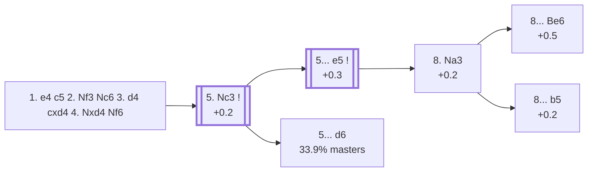

<a name="_TOP_"></a>

# B33 Sicilian Defense: Open, Lasker-Pelikan / Sveshnikov Complex <br> 1. e4 c5 2. Nf3 Nc6 3. d4 cxd4 4. Nxd4 Nf6 #

Spun off from [`B32_Sicilian_Open.md`](https://github.com/onclemarcel/chess_flashcards/blob/main/e4_openings/B32_Sicilian_Open.md)'s own "4... Nf6" branch — masters' single most popular reply at that fork (57.7%), and already live-tagged **B33** the moment it's played. White's own reply is close to forced: **5. Nc3** (99.8% of masters games).

### Overview

*Quick map of every move covered on this card — see the [shape key](https://github.com/onclemarcel/chess_flashcards/blob/main/start.md#content-diagram-optional) in start.md.*

<!-- content-diagram:start -->

<!-- content-diagram:end -->

<a name="_initial_move_"></a>

[](https://lichess.org/analysis/standard/r1bqkb1r/pp1ppppp/2n2n2/8/3NP3/8/PPP2PPP/RNBQKB1R_w_KQkq_-_1_5)

*... 3. d4 cxd4 4. Nxd4 Nf6*

```
r1bqkb1r/pp1ppppp/2n2n2/8/3NP3/8/PPP2PPP/RNBQKB1R w KQkq - 1 5
```

|  | +0.2 |
| --- | --- |

<!-- lichess-stats:start fen="r1bqkb1r/pp1ppppp/2n2n2/8/3NP3/8/PPP2PPP/RNBQKB1R w KQkq - 1 5" db="lichess,masters" speeds="bullet,blitz" ratings="1800,2000,2200,2500" moves="6" -->
| Move | Online | W/D/B | Masters | W/D/B | |
| :--- | ---: | :--- | ---: | :--- | :-- |
| Nc3 | 6.7 M (80.3%) | ⬜⬜⬜⬜⬜⬛⬛⬛⬛⬛ 47/5/48 | 45 k (99.8%) | ⬜⬜⬜🟫🟫🟫🟫🟫⬛⬛ 28/49/22 |  |
| Nxc6 | 1.3 M (15.3%) | ⬜⬜⬜⬜🟫⬛⬛⬛⬛⬛ 45/5/50 | 56 (0.1%) | ⬜⬜🟫🟫🟫🟫⬛⬛⬛⬛ 23/38/39 |  |
| f3 | 204 k (2.5%) | ⬜⬜⬜⬜⬜⬛⬛⬛⬛⬛ 45/5/50 | 19 (0.0%) | — |  |
| Be3 | 25 k (0.3%) | ⬜⬜⬜⬜⬛⬛⬛⬛⬛⬛ 41/4/55 | 2 (0.0%) | — | ⚠ |
| Bc4 | 23 k (0.3%) | ⬜⬜⬜⬜🟫⬛⬛⬛⬛⬛ 43/4/53 | 0 | — | ⚠ |
| e5 | 20 k (0.2%) | ⬜⬜⬜⬜⬛⬛⬛⬛⬛⬛ 39/3/58 | 0 | — | ⚠ |
| Qd3 | 0 | — | 1 (0.0%) | — |  |
| Na3 | 0 | — | 1 (0.0%) | — |  |

*Online: bullet/blitz, 1800+ — 8.3 M games. Masters: 45 k games. [Open in the explorer](https://lichess.org/analysis/standard/r1bqkb1r/pp1ppppp/2n2n2/8/3NP3/8/PPP2PPP/RNBQKB1R_w_KQkq_-_1_5#explorer) — updated 2026-09-02*
<!-- lichess-stats:end -->

[*Back to TOP*](#_TOP_)

---

<a name="_Nc3_"></a>

### 5. Nc3

[](https://lichess.org/analysis/standard/r1bqkb1r/pp1ppppp/2n2n2/8/3NP3/2N5/PPP2PPP/R1BQKB1R_b_KQkq_-_2_5)

*... 5. Nc3*

```
r1bqkb1r/pp1ppppp/2n2n2/8/3NP3/2N5/PPP2PPP/R1BQKB1R b KQkq - 2 5
```

|  | +0.2 |
| --- | --- |

<!-- lichess-stats:start fen="r1bqkb1r/pp1ppppp/2n2n2/8/3NP3/2N5/PPP2PPP/R1BQKB1R b KQkq - 2 5" db="lichess,masters" speeds="bullet,blitz" ratings="1800,2000,2200,2500" moves="6" -->
| Move | Online | W/D/B | Masters | W/D/B | |
| :--- | ---: | :--- | ---: | :--- | :-- |
| e5 | 3.7 M (51.7%) | ⬜⬜⬜⬜⬜⬛⬛⬛⬛⬛ 48/5/47 | 28 k (59.9%) | ⬜⬜🟫🟫🟫🟫🟫🟫⬛⬛ 24/58/18 |  |
| d6 | 1.2 M (16.9%) | ⬜⬜⬜⬜⬜⬛⬛⬛⬛⬛ 46/5/49 | 16 k (33.9%) | ⬜⬜⬜🟫🟫🟫🟫⬛⬛⬛ 33/36/30 |  |
| e6 | 1.1 M (15.4%) | ⬜⬜⬜⬜⬜⬛⬛⬛⬛⬛ 45/5/50 | 1.9 k (4.2%) | ⬜⬜⬜🟫🟫🟫🟫🟫⬛⬛ 34/45/21 |  |
| g6 | 687 k (9.7%) | ⬜⬜⬜⬜⬜⬛⬛⬛⬛⬛ 47/5/48 | 594 (1.3%) | ⬜⬜⬜⬜🟫🟫🟫⬛⬛⬛ 43/31/26 |  |
| a6 | 276 k (3.9%) | ⬜⬜⬜⬜⬜⬛⬛⬛⬛⬛ 51/5/45 | 0 | — | ⚠ |
| Qb6 | 49 k (0.7%) | ⬜⬜⬜⬜⬜⬛⬛⬛⬛⬛ 45/4/51 | 171 (0.4%) | ⬜⬜⬜🟫🟫🟫⬛⬛⬛⬛ 36/26/37 |  |
| h5 | 0 | — | 94 (0.2%) | ⬜⬜🟫🟫🟫⬛⬛⬛⬛⬛ 26/28/47 |  |

*Online: bullet/blitz, 1800+ — 7.1 M games. Masters: 47 k games. [Open in the explorer](https://lichess.org/analysis/standard/r1bqkb1r/pp1ppppp/2n2n2/8/3NP3/2N5/PPP2PPP/R1BQKB1R_b_KQkq_-_2_5#explorer) — updated 2026-09-02*
<!-- lichess-stats:end -->

* [**5... e5**](#_e5_) (59.9% masters): the *Lasker-Pelikan Variation* — see below.
* [**5... d6**](https://github.com/onclemarcel/chess_flashcards/blob/main/e4_openings/B50_Sicilian_d6_Open.md) (33.9% masters): transposes into the same Najdorf/Classical/Dragon family reached via 2... d6.
* **5... e6** (4.2% masters): the *Taimanov*-adjacent set-up, no further named code in this range.

[*Back to 4... Nf6*](#_initial_move_)
[*Back to TOP*](#_TOP_)

---

<a name="_e5_"></a>

### 5... e5 — Lasker-Pelikan Variation

[](https://lichess.org/analysis/standard/r1bqkb1r/pp1p1ppp/2n2n2/4p3/3NP3/2N5/PPP2PPP/R1BQKB1R_w_KQkq_e6_0_6)

*... 5... e5 — Lasker-Pelikan Variation*

```
r1bqkb1r/pp1p1ppp/2n2n2/4p3/3NP3/2N5/PPP2PPP/R1BQKB1R w KQkq e6 0 6
```

|  | +0.3 |
| --- | --- |

<!-- lichess-stats:start fen="r1bqkb1r/pp1p1ppp/2n2n2/4p3/3NP3/2N5/PPP2PPP/R1BQKB1R w KQkq e6 0 6" db="lichess,masters" speeds="bullet,blitz" ratings="1800,2000,2200,2500" moves="6" -->
| Move | Online | W/D/B | Masters | W/D/B | |
| :--- | ---: | :--- | ---: | :--- | :-- |
| Ndb5 | 2.4 M (65.9%) | ⬜⬜⬜⬜⬜🟫⬛⬛⬛⬛ 50/6/45 | 27 k (98.1%) | ⬜⬜🟫🟫🟫🟫🟫🟫⬛⬛ 25/58/17 |  |
| Nxc6 | 462 k (12.6%) | ⬜⬜⬜⬜🟫⬛⬛⬛⬛⬛ 45/6/49 | 59 (0.2%) | ⬜⬜🟫🟫🟫🟫⬛⬛⬛⬛ 20/39/41 |  |
| Nb3 | 401 k (10.9%) | ⬜⬜⬜⬜⬜⬛⬛⬛⬛⬛ 46/5/49 | 180 (0.6%) | ⬜🟫🟫🟫🟫🟫🟫⬛⬛⬛ 12/60/28 |  |
| Nf3 | 184 k (5.0%) | ⬜⬜⬜⬜🟫⬛⬛⬛⬛⬛ 42/5/53 | 35 (0.1%) | ⬜⬜🟫🟫🟫🟫⬛⬛⬛⬛ 17/37/46 |  |
| Nf5 | 145 k (4.0%) | ⬜⬜⬜⬜🟫⬛⬛⬛⬛⬛ 42/5/53 | 130 (0.5%) | ⬜⬜⬜🟫🟫🟫🟫⬛⬛⬛ 26/41/33 |  |
| Nde2 | 35 k (1.0%) | ⬜⬜⬜⬜⬜⬛⬛⬛⬛⬛ 47/5/47 | 130 (0.5%) | ⬜⬜⬜🟫🟫🟫🟫🟫⬛⬛ 29/48/23 |  |

*Online: bullet/blitz, 1800+ — 3.7 M games. Masters: 28 k games. [Open in the explorer](https://lichess.org/analysis/standard/r1bqkb1r/pp1p1ppp/2n2n2/4p3/3NP3/2N5/PPP2PPP/R1BQKB1R_w_KQkq_e6_0_6#explorer) — updated 2026-09-02*
<!-- lichess-stats:end -->

Kicking the knight looks like it costs a tempo — and objectively it does give White a small structural target on d5 for later — but Black gets active, well-coordinated pieces in exchange. This whole family (the *Lasker-Pelikan Variation*, older book name *Pelikan* alone) has become one of the main Sicilian weapons at the very top level. **6. Ndb5** (98.1% of masters games!) is close to the only serious try — the knight heads back toward d6, and after **6... d6**, White pins the f6-knight with **7. Bg5** while eyeing the d5 outpost. **7... a6** is essentially forced (99.8%) and **8. Na3** is masters' overwhelming choice (97.3%), reaching the family's own main tabiya.

<a name="_tabiya_"></a>

[](https://lichess.org/analysis/standard/r1bqkb1r/1p3ppp/p1np1n2/4p1B1/4P3/N1N5/PPP2PPP/R2QKB1R_b_KQkq_-_1_8)

*... 6. Ndb5 d6 7. Bg5 a6 8. Na3 — Lasker-Pelikan main tabiya*

```
r1bqkb1r/1p3ppp/p1np1n2/4p1B1/4P3/N1N5/PPP2PPP/R2QKB1R b KQkq - 1 8
```

|  | +0.2 |
| --- | --- |

<!-- lichess-stats:start fen="r1bqkb1r/1p3ppp/p1np1n2/4p1B1/4P3/N1N5/PPP2PPP/R2QKB1R b KQkq - 1 8" db="lichess,masters" speeds="bullet,blitz" ratings="1800,2000,2200,2500" moves="6" -->
| Move | Online | W/D/B | Masters | W/D/B | |
| :--- | ---: | :--- | ---: | :--- | :-- |
| b5 | 1.2 M (71.6%) | ⬜⬜⬜⬜⬜🟫⬛⬛⬛⬛ 49/7/44 | 24 k (96.0%) | ⬜⬜🟫🟫🟫🟫🟫🟫⬛⬛ 24/59/17 |  |
| Be7 | 355 k (21.5%) | ⬜⬜⬜⬜⬜⬛⬛⬛⬛⬛ 50/5/45 | 116 (0.5%) | ⬜⬜⬜⬜⬜🟫🟫🟫🟫⬛ 49/37/14 |  |
| Be6 | 88 k (5.3%) | ⬜⬜⬜⬜⬜⬛⬛⬛⬛⬛ 48/6/46 | 880 (3.4%) | ⬜⬜⬜⬜🟫🟫🟫🟫⬛⬛ 40/37/23 |  |
| h6 | 18 k (1.1%) | ⬜⬜⬜⬜⬜⬜⬛⬛⬛⬛ 55/4/41 | 3 (0.0%) | — | ⚠ |
| d5 | 2.8 k (0.2%) | ⬜⬜⬜⬜🟫⬛⬛⬛⬛⬛ 35/12/53 | 8 (0.0%) | — |  |
| Bg4 | 1.8 k (0.1%) | ⬜⬜⬜⬜⬜⬜⬛⬛⬛⬛ 60/4/36 | 0 | — | ⚠ |
| Rb8 | 0 | — | 13 (0.1%) | — |  |

*Online: bullet/blitz, 1800+ — 1.7 M games. Masters: 26 k games. [Open in the explorer](https://lichess.org/analysis/standard/r1bqkb1r/1p3ppp/p1np1n2/4p1B1/4P3/N1N5/PPP2PPP/R2QKB1R_b_KQkq_-_1_8#explorer) — updated 2026-09-02*
<!-- lichess-stats:end -->

* [**8... b5**](#_Sveshnikov_): the *Sveshnikov Variation* — Black's actual masters main try here, and the specific line the "Sveshnikov" name attaches to live (not the earlier 5... e5 ply, contrary to how the name is often used loosely).
* [**8... Be6**](#_Bird_): the *Bird Variation*.

[*Back to 5. Nc3*](#_Nc3_)
[*Back to TOP*](#_TOP_)

---

<a name="_Sveshnikov_"></a>

> [!NOTE]
> **8... b5**, kicking the a3-knight before it can settle, is live-tagged the *Sveshnikov Variation* itself — Black's real main try at this fork.
>
> [](https://lichess.org/analysis/standard/r1bqkb1r/5ppp/p1np1n2/1p2p1B1/4P3/N1N5/PPP2PPP/R2QKB1R_w_KQkq_b6_0_9)
>
> *... 8... b5 — Sveshnikov Variation*
>
> ```
> r1bqkb1r/5ppp/p1np1n2/1p2p1B1/4P3/N1N5/PPP2PPP/R2QKB1R w KQkq b6 0 9
> ```
>
> |  | +0.2 |
> | --- | --- |
>
> **9. Bxf6** (99.8% of games that continue from here) trades off the defender before it can support ... b4, and after **9... gxf6 10. Nd5**, Black's most-tested reply is **10... f5** (71.5% masters), the real point of the whole Sveshnikov idea — accepting doubled f-pawns and a weak d5-square for a mobile pawn mass and open lines for the bishop pair. This tabiya is one of the most deeply analysed positions in all of chess theory — the resulting piece-vs-structure battle over d5 is its own extensive body of work, well past this card's own depth budget, and not covered further here. (Masters-database sample size drops to near-zero at this exact 21-ply-deep position — confirmed live rather than guessed — so no further stats table is given past 10. Nd5.)
>
> [*Back to 5... e5*](#_e5_)
> [*Back to TOP*](#_TOP_)

---

<a name="_Bird_"></a>

> [!NOTE]
> **8... Be6** is the *Bird Variation* — developing quietly instead of kicking the knight immediately.
>
> [](https://lichess.org/analysis/standard/r2qkb1r/1p3ppp/p1npbn2/4p1B1/4P3/N1N5/PPP2PPP/R2QKB1R_w_KQkq_-_2_9)
>
> *... 8... Be6 — Bird Variation*
>
> ```
> r2qkb1r/1p3ppp/p1npbn2/4p1B1/4P3/N1N5/PPP2PPP/R2QKB1R w KQkq - 2 9
> ```
>
> |  | +0.5 |
> | --- | --- |
>
> A real database rarity next to the Sveshnikov's own 8... b5 (880 masters games vs. 24 k), objectively slightly more comfortable for White per Stockfish.
>
> [*Back to 5... e5*](#_e5_)
> [*Back to TOP*](#_TOP_)
