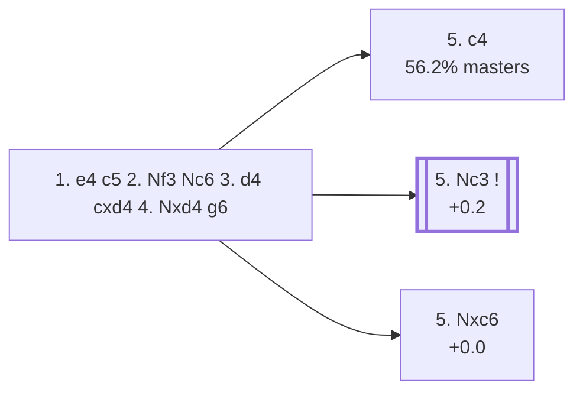

<a name="_TOP_"></a>

# B34 Sicilian Defense: Accelerated Dragon, Exchange / Modern Variations <br> 1. e4 c5 2. Nf3 Nc6 3. d4 cxd4 4. Nxd4 g6 #

**Root fixed 2026-09-02**, correcting the naming caveat flagged during the B20-B29 batch: this card used to be rooted at the bare "2... g6" (a different, genuinely **B27**-coded position — the *Hyperaccelerated Dragon*, see [`B27_Sicilian_Open.md`](https://github.com/onclemarcel/chess_flashcards/blob/main/e4_openings/B27_Sicilian_Open.md#_g6_)). The real Accelerated Dragon/"Accelerated Fianchetto" complex — the one `eco.md` actually assigns codes B34-B39 to — is reached by developing the queen's knight *first*: **2... Nc6 3. d4 cxd4 4. Nxd4 g6**. Even this move itself stays **B32** (confirmed live) — Black hasn't earned a B34 tag yet. It's only White's own 5th move that splits the position into the two named B34 lines.

Spun off from [`B32_Sicilian_Open.md`](https://github.com/onclemarcel/chess_flashcards/blob/main/e4_openings/B32_Sicilian_Open.md)'s own "4... g6" branch (15.3% of masters' replies at that fork) — Black fianchettoes at once, heading for a Dragon-style set-up a tempo faster than the ... d6/... g6 move order allows.

### Overview

*Quick map of every move covered on this card — see the [shape key](https://github.com/onclemarcel/chess_flashcards/blob/main/start.md#content-diagram-optional) in start.md.*

<!-- content-diagram:start -->

<!-- content-diagram:end -->

<a name="_initial_move_"></a>

[](https://lichess.org/analysis/standard/r1bqkbnr/pp1ppp1p/2n3p1/8/3NP3/8/PPP2PPP/RNBQKB1R_w_KQkq_-_0_5)

*... 3. d4 cxd4 4. Nxd4 g6 — Accelerated Dragon*

```
r1bqkbnr/pp1ppp1p/2n3p1/8/3NP3/8/PPP2PPP/RNBQKB1R w KQkq - 0 5
```

|  | +0.4 |
| --- | --- |

<!-- lichess-stats:start fen="r1bqkbnr/pp1ppp1p/2n3p1/8/3NP3/8/PPP2PPP/RNBQKB1R w KQkq - 0 5" db="lichess,masters" speeds="bullet,blitz" ratings="1800,2000,2200,2500" moves="6" -->
| Move | Online | W/D/B | Masters | W/D/B | |
| :--- | ---: | :--- | ---: | :--- | :-- |
| Nc3 | 3.7 M (47.7%) | ⬜⬜⬜⬜⬜⬛⬛⬛⬛⬛ 48/5/47 | 5.3 k (37.9%) | ⬜⬜⬜🟫🟫🟫🟫⬛⬛⬛ 34/39/27 |  |
| Nxc6 | 1.5 M (19.3%) | ⬜⬜⬜⬜⬜⬛⬛⬛⬛⬛ 45/5/50 | 110 (0.8%) | ⬜⬜⬜🟫🟫🟫⬛⬛⬛⬛ 32/26/42 |  |
| c4 | 1.1 M (14.6%) | ⬜⬜⬜⬜⬜🟫⬛⬛⬛⬛ 48/7/45 | 7.8 k (56.2%) | ⬜⬜⬜🟫🟫🟫🟫🟫⬛⬛ 35/46/19 |  |
| Be3 | 835 k (10.6%) | ⬜⬜⬜⬜⬜⬛⬛⬛⬛⬛ 45/5/49 | 258 (1.9%) | ⬜⬜⬜🟫🟫🟫⬛⬛⬛⬛ 26/35/38 |  |
| Bc4 | 170 k (2.2%) | ⬜⬜⬜⬜⬜⬛⬛⬛⬛⬛ 45/5/51 | 0 | — | ⚠ |
| c3 | 169 k (2.2%) | ⬜⬜⬜⬜🟫⬛⬛⬛⬛⬛ 42/5/53 | 0 | — | ⚠ |
| Be2 | 0 | — | 252 (1.8%) | ⬜⬜⬜🟫🟫🟫🟫⬛⬛⬛ 33/37/30 |  |
| Nb3 | 0 | — | 91 (0.7%) | ⬜⬜⬜⬜🟫🟫🟫⬛⬛⬛ 40/34/26 |  |

*Online: bullet/blitz, 1800+ — 7.8 M games. Masters: 14 k games. [Open in the explorer](https://lichess.org/analysis/standard/r1bqkbnr/pp1ppp1p/2n3p1/8/3NP3/8/PPP2PPP/RNBQKB1R_w_KQkq_-_0_5#explorer) — updated 2026-09-02*
<!-- lichess-stats:end -->

**A genuine finding, worth stating plainly rather than assumed from the two named B34 entries alone**: masters' actual most popular try here is **5. c4** (56.2%, the Maróczy Bind — see [`B36_Sicilian_Accelerated_Dragon_Maroczy.md`](https://github.com/onclemarcel/chess_flashcards/blob/main/e4_openings/B36_Sicilian_Accelerated_Dragon_Maroczy.md)), well ahead of either of this card's own two named lines, **5. Nc3** (37.9%, the *Modern Variation*) and **5. Nxc6** (0.8%, the *Exchange Variation*).

### Candidate moves

* **5. c4** (56.2% masters): the Maróczy Bind — see `B36_Sicilian_Accelerated_Dragon_Maroczy.md`, not built out further here.
* [**5. Nc3**](#_Nc3_) (37.9% masters, +0.2): the *Modern Variation* — see below.
* [**5. Nxc6**](#_Nxc6_) (0.8% masters, +0.0): the *Exchange Variation* — see below.

[*Back to TOP*](#_TOP_)

---

<a name="_Nxc6_"></a>

### 5. Nxc6 — Exchange Variation

[](https://lichess.org/analysis/standard/r1bqkbnr/pp1ppp1p/2N3p1/8/4P3/8/PPP2PPP/RNBQKB1R_b_KQkq_-_0_5)

*... 5. Nxc6 — Exchange Variation*

```
r1bqkbnr/pp1ppp1p/2N3p1/8/4P3/8/PPP2PPP/RNBQKB1R b KQkq - 0 5
```

|  | +0.0 |
| --- | --- |

Trading immediately off the queenside knight before Black's fianchetto is even complete — a real database rarity (0.8% masters) and, per Stockfish, dead level. Play continues **5... dxc6**, and White has given up the centre-space fight almost entirely in exchange for simplification.

[*Back to 4... g6*](#_initial_move_)
[*Back to TOP*](#_TOP_)

---

<a name="_Nc3_"></a>

### 5. Nc3 — Modern Variation

[](https://lichess.org/analysis/standard/r1bqkbnr/pp1ppp1p/2n3p1/8/3NP3/2N5/PPP2PPP/R1BQKB1R_b_KQkq_-_1_5)

*... 5. Nc3 — Modern Variation*

```
r1bqkbnr/pp1ppp1p/2n3p1/8/3NP3/2N5/PPP2PPP/R1BQKB1R b KQkq - 1 5
```

|  | +0.2 |
| --- | --- |

Developing naturally, keeping the c-pawn back for now. Black completes the fianchetto with **5... Bg7 6. Be3 Nf6 7. Bc4**, reaching the *Modern Bc4 Variation* — its own code, **B35**.

[*Back to 4... g6*](#_initial_move_)
[*Back to TOP*](#_TOP_)

---

> [!NOTE]
> **5. Nc3 Bg7 6. Be3 Nf6 7. Bc4** is [**B35**](https://github.com/onclemarcel/chess_flashcards/blob/main/e4_openings/B35_Sicilian_Accelerated_Dragon_Bc4.md), not built out on this card — a real independent try (the *Modern Bc4 Variation*, eyeing f7 the way the regular Dragon's own Yugoslav Attack does), not just a transposition. See `B35_Sicilian_Accelerated_Dragon_Bc4.md`.

[*Back to TOP*](#_TOP_)
