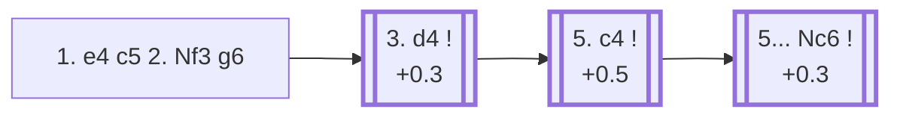

<a name="_TOP_"></a>

# B34 Sicilian Defense: Accelerated Dragon <br> 1. e4 c5 2. Nf3 g6 #

Black fianchettoes at once, heading for a Dragon-style setup a full tempo faster than the ... d6/... g6 move order allows — the point being that Black hasn't committed the d-pawn yet, keeping the option of a quick ... d5 in one go later. The cost is that White gets an extra option not available against the regular Dragon: clamping down on d5 immediately with the Maroczy Bind.

### Overview

*Quick map of every move covered on this card — see the [shape key](https://github.com/onclemarcel/chess_flashcards/blob/main/start.md#content-diagram-optional) in start.md.*

<!-- content-diagram:start -->

<!-- content-diagram:end -->

<a name="_initial_move_"></a>

[](https://lichess.org/analysis/standard/rnbqkbnr/pp1ppp1p/6p1/2p5/4P3/5N2/PPPP1PPP/RNBQKB1R_w_KQkq_-_0_3)

*... 1. e4 c5 2. Nf3 g6 — Accelerated Dragon*

```
rnbqkbnr/pp1ppp1p/6p1/2p5/4P3/5N2/PPPP1PPP/RNBQKB1R w KQkq - 0 3
```

|  | +0.3 |
| --- | --- |

<!-- lichess-stats:start fen="rnbqkbnr/pp1ppp1p/6p1/2p5/4P3/5N2/PPPP1PPP/RNBQKB1R w KQkq - 0 3" db="lichess,masters" speeds="bullet,blitz" ratings="1800,2000,2200,2500" moves="4" -->
| Move | Online | W/D/B | Masters | W/D/B | |
| :--- | ---: | :--- | ---: | :--- | :-- |
| d4 | 5.3 M (59.3%) | ⬜⬜⬜⬜⬜⬛⬛⬛⬛⬛ 47/5/48 | 7.0 k (64.6%) | ⬜⬜⬜⬜🟫🟫🟫🟫⬛⬛ 36/40/24 |  |
| c3 | 1.3 M (14.7%) | ⬜⬜⬜⬜⬜⬛⬛⬛⬛⬛ 47/5/48 | 2.1 k (19.3%) | ⬜⬜⬜⬜🟫🟫🟫🟫⬛⬛ 42/35/23 |  |
| Bc4 | 897 k (10.1%) | ⬜⬜⬜⬜⬜⬛⬛⬛⬛⬛ 47/4/49 | 366 (3.4%) | ⬜⬜⬜⬜🟫🟫🟫⬛⬛⬛ 38/32/30 |  |
| Nc3 | 576 k (6.5%) | ⬜⬜⬜⬜⬜⬛⬛⬛⬛⬛ 47/5/49 | 0 | — | ⚠ |
| c4 | 0 | — | 833 (7.6%) | ⬜⬜⬜⬜🟫🟫🟫🟫⬛⬛ 37/42/22 |  |

*Online: bullet/blitz, 1800+ — 8.9 M games. Masters: 11 k games. [Open in the explorer](https://lichess.org/analysis/standard/rnbqkbnr/pp1ppp1p/6p1/2p5/4P3/5N2/PPPP1PPP/RNBQKB1R_w_KQkq_-_0_3#explorer) — updated 2026-08-27*
<!-- lichess-stats:end -->

### Candidate moves

* [**3. d4**](#_d4_) (+0.3): the Open Sicilian — masters' main choice (64.6%).
* **3. c3** (masters 19.3%): an Alapin-style approach, side-stepping Open Sicilian theory while the fianchetto is still in progress.

[*Back to TOP*](#_TOP_)

---

<a name="_d4_"></a>

### 3. d4 — Open Sicilian

As usual, **3... cxd4 4. Nxd4** follows almost automatically, and Black completes the fianchetto with **4... Bg7**, reaching the true starting point of Accelerated Dragon theory.

[](https://lichess.org/analysis/standard/rnbqk1nr/pp1pppbp/6p1/8/3NP3/8/PPP2PPP/RNBQKB1R_w_KQkq_-_1_5)

*... 3. d4 cxd4 4. Nxd4 Bg7*

```
rnbqk1nr/pp1pppbp/6p1/8/3NP3/8/PPP2PPP/RNBQKB1R w KQkq - 1 5
```

|  | +0.4 |
| --- | --- |

<!-- lichess-stats:start fen="rnbqk1nr/pp1pppbp/6p1/8/3NP3/8/PPP2PPP/RNBQKB1R w KQkq - 1 5" db="lichess,masters" speeds="bullet,blitz" ratings="1800,2000,2200,2500" moves="6" -->
| Move | Online | W/D/B | Masters | W/D/B | |
| :--- | ---: | :--- | ---: | :--- | :-- |
| Nc3 | 1.1 M (50.6%) | ⬜⬜⬜⬜⬜⬛⬛⬛⬛⬛ 48/5/47 | 700 (43.1%) | ⬜⬜⬜🟫🟫🟫🟫⬛⬛⬛ 36/36/29 |  |
| Be3 | 486 k (22.0%) | ⬜⬜⬜⬜⬜⬛⬛⬛⬛⬛ 45/5/50 | 31 (1.9%) | ⬜🟫🟫🟫🟫🟫⬛⬛⬛⬛ 13/45/42 |  |
| c4 | 323 k (14.6%) | ⬜⬜⬜⬜⬜🟫⬛⬛⬛⬛ 49/7/44 | 831 (51.2%) | ⬜⬜⬜⬜🟫🟫🟫🟫⬛⬛ 43/38/19 |  |
| c3 | 132 k (6.0%) | ⬜⬜⬜⬜🟫⬛⬛⬛⬛⬛ 42/5/53 | 0 | — | ⚠ |
| Bc4 | 61 k (2.8%) | ⬜⬜⬜⬜⬜⬛⬛⬛⬛⬛ 45/5/51 | 5 (0.3%) | — |  |
| Nb3 | 23 k (1.1%) | ⬜⬜⬜⬜⬜⬛⬛⬛⬛⬛ 46/5/49 | 23 (1.4%) | ⬜⬜⬜🟫🟫🟫🟫⬛⬛⬛ 26/39/35 |  |
| Be2 | 0 | — | 25 (1.5%) | ⬜⬜🟫🟫🟫🟫🟫⬛⬛⬛ 20/48/32 |  |

*Online: bullet/blitz, 1800+ — 2.2 M games. Masters: 1.6 k games. [Open in the explorer](https://lichess.org/analysis/standard/rnbqk1nr/pp1pppbp/6p1/8/3NP3/8/PPP2PPP/RNBQKB1R_w_KQkq_-_1_5#explorer) — updated 2026-08-27*
<!-- lichess-stats:end -->

* [**5. c4**](#_c4_) (51.2% masters): the *Maroczy Bind* — clamps down on d5 for good with pawns on c4 and e4, the critical test of the whole Accelerated Dragon and the main reason some players prefer the slower ... d6 move order instead. See below.
* **5. Nc3** (43.1% masters): develops naturally and transposes toward regular Dragon structures once Black plays ... d6 and ... Nf6 — not covered further here.

Both are considered fully critical; which one a Black player fears more is largely a matter of preparation.

[*Back to 1... g6*](#_initial_move_)
[*Back to TOP*](#_TOP_)

---

<a name="_c4_"></a>

### 5. c4 — Maróczy Bind

[](https://lichess.org/analysis/standard/rnbqk1nr/pp1pppbp/6p1/8/2PNP3/8/PP3PPP/RNBQKB1R_b_KQkq_c3_0_5)

*... 5. c4 — Maróczy Bind*

```
rnbqk1nr/pp1pppbp/6p1/8/2PNP3/8/PP3PPP/RNBQKB1R b KQkq c3 0 5
```

|  | +0.5 |
| --- | --- |

<!-- lichess-stats:start fen="rnbqk1nr/pp1pppbp/6p1/8/2PNP3/8/PP3PPP/RNBQKB1R b KQkq c3 0 5" db="lichess,masters" speeds="bullet,blitz" ratings="1800,2000,2200,2500" moves="4" -->
| Move | Online | W/D/B | Masters | W/D/B | |
| :--- | ---: | :--- | ---: | :--- | :-- |
| Nc6 | 489 k (83.4%) | ⬜⬜⬜⬜⬜🟫⬛⬛⬛⬛ 49/7/44 | 2.4 k (88.6%) | ⬜⬜⬜⬜🟫🟫🟫🟫⬛⬛ 43/40/17 |  |
| Nf6 | 29 k (5.0%) | ⬜⬜⬜⬜⬜🟫⬛⬛⬛⬛ 50/6/44 | 128 (4.7%) | ⬜⬜⬜⬜⬜🟫🟫🟫🟫⬛ 46/39/15 |  |
| d6 | 28 k (4.8%) | ⬜⬜⬜⬜⬜🟫⬛⬛⬛⬛ 53/6/42 | 0 | — | ⚠ |
| Qb6 | 21 k (3.5%) | ⬜⬜⬜⬜⬜⬛⬛⬛⬛⬛ 49/5/47 | 116 (4.3%) | ⬜⬜⬜⬜🟫🟫🟫🟫⬛⬛ 37/42/21 |  |
| b6 | 0 | — | 29 (1.1%) | ⬜⬜⬜🟫🟫🟫⬛⬛⬛⬛ 34/28/38 |  |

*Online: bullet/blitz, 1800+ — 586 k games. Masters: 2.7 k games. [Open in the explorer](https://lichess.org/analysis/standard/rnbqk1nr/pp1pppbp/6p1/8/2PNP3/8/PP3PPP/RNBQKB1R_b_KQkq_c3_0_5#explorer) — updated 2026-08-27*
<!-- lichess-stats:end -->

**5... Nc6** is masters' clear main try (88.6%) — developing naturally and pressuring d4 before White can consolidate the bind.

[](https://lichess.org/analysis/standard/r1bqk1nr/pp1pppbp/2n3p1/8/2PNP3/8/PP3PPP/RNBQKB1R_w_KQkq_-_1_6)

*... 5... Nc6 — reaching the main Maróczy Bind tabiya*

```
r1bqk1nr/pp1pppbp/2n3p1/8/2PNP3/8/PP3PPP/RNBQKB1R w KQkq - 1 6
```

|  | +0.3 |
| --- | --- |

<!-- lichess-stats:start fen="r1bqk1nr/pp1pppbp/2n3p1/8/2PNP3/8/PP3PPP/RNBQKB1R w KQkq - 1 6" db="lichess,masters" speeds="bullet,blitz" ratings="1800,2000,2200,2500" moves="3" -->
| Move | Online | W/D/B | Masters | W/D/B | |
| :--- | ---: | :--- | ---: | :--- | :-- |
| Be3 | 1.4 M (86.1%) | ⬜⬜⬜⬜⬜🟫⬛⬛⬛⬛ 50/7/43 | 6.8 k (93.1%) | ⬜⬜⬜⬜🟫🟫🟫🟫⬛⬛ 40/41/19 |  |
| Nc2 | 104 k (6.6%) | ⬜⬜⬜⬜⬜🟫⬛⬛⬛⬛ 52/5/42 | 469 (6.4%) | ⬜⬜⬜⬜🟫🟫🟫⬛⬛⬛ 44/32/24 |  |
| Nxc6 | 73 k (4.6%) | ⬜⬜⬜⬜🟫⬛⬛⬛⬛⬛ 45/6/49 | 0 | — | ⚠ |
| Nb3 | 0 | — | 12 (0.2%) | — |  |

*Online: bullet/blitz, 1800+ — 1.6 M games. Masters: 7.3 k games. [Open in the explorer](https://lichess.org/analysis/standard/r1bqk1nr/pp1pppbp/2n3p1/8/2PNP3/8/PP3PPP/RNBQKB1R_w_KQkq_-_1_6#explorer) — updated 2026-08-27*
<!-- lichess-stats:end -->

**6. Be3** is masters' overwhelming choice (93.1%) — completing development and eyeing a later Qd2/Rc1 or Nb3 plan while the bind's queenside space advantage does its slow work. Deeper Maróczy Bind theory (Black's ... Ng4/... Nxd4 exchanging tries, and White's own Nc2/Nb3 regrouping ideas) is its own extensive body of work, not covered further here.

[*Back to 1... g6*](#_initial_move_)
[*Back to TOP*](#_TOP_)
