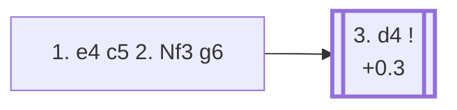

<a name="_TOP_"></a>

# B34 Sicilian Defense: Accelerated Dragon <br> 1. e4 c5 2. Nf3 g6 #

Black fianchettoes at once, heading for a Dragon-style setup a full tempo faster than the ... d6/... g6 move order allows — the point being that Black hasn't committed the d-pawn yet, keeping the option of a quick ... d5 in one go later. The cost is that White gets an extra option not available against the regular Dragon: clamping down on d5 immediately with the Maroczy Bind.

### Overview

*Quick map of every move covered on this card — see the [shape key](https://github.com/onclemarcel/chess_flashcards/blob/main/start.md#content-diagram-optional) in start.md.*

<!-- content-diagram:start -->

<!-- content-diagram:end -->

<a name="_initial_move_"></a>

[](https://lichess.org/analysis/standard/rnbqkbnr/pp1ppp1p/6p1/2p5/4P3/5N2/PPPP1PPP/RNBQKB1R_w_KQkq_-_0_3)

*... 1. e4 c5 2. Nf3 g6 — Accelerated Dragon*

```
rnbqkbnr/pp1ppp1p/6p1/2p5/4P3/5N2/PPPP1PPP/RNBQKB1R w KQkq - 0 3
```

|  | +0.3 |
| --- | --- |

<!-- lichess-stats:start fen="rnbqkbnr/pp1ppp1p/6p1/2p5/4P3/5N2/PPPP1PPP/RNBQKB1R w KQkq - 0 3" db="lichess,masters" speeds="bullet,blitz" ratings="1800,2000,2200,2500" moves="4" -->
| Move | Online | W/D/B | Masters | W/D/B | |
| :--- | ---: | :--- | ---: | :--- | :-- |
| d4 | 5.3 M (59.3%) | ⬜⬜⬜⬜⬜⬛⬛⬛⬛⬛ 47/5/48 | 7.0 k (64.6%) | ⬜⬜⬜⬜🟫🟫🟫🟫⬛⬛ 36/40/24 |  |
| c3 | 1.3 M (14.7%) | ⬜⬜⬜⬜⬜⬛⬛⬛⬛⬛ 47/5/48 | 2.1 k (19.3%) | ⬜⬜⬜⬜🟫🟫🟫🟫⬛⬛ 42/35/23 |  |
| Bc4 | 897 k (10.1%) | ⬜⬜⬜⬜⬜⬛⬛⬛⬛⬛ 47/4/49 | 366 (3.4%) | ⬜⬜⬜⬜🟫🟫🟫⬛⬛⬛ 38/32/30 |  |
| Nc3 | 576 k (6.5%) | ⬜⬜⬜⬜⬜⬛⬛⬛⬛⬛ 47/5/49 | 0 | — | ⚠ |
| c4 | 0 | — | 833 (7.6%) | ⬜⬜⬜⬜🟫🟫🟫🟫⬛⬛ 37/42/22 |  |

*Online: bullet/blitz, 1800+ — 8.9 M games. Masters: 11 k games. [Open in the explorer](https://lichess.org/analysis/standard/rnbqkbnr/pp1ppp1p/6p1/2p5/4P3/5N2/PPPP1PPP/RNBQKB1R_w_KQkq_-_0_3#explorer) — updated 2026-08-24*
<!-- lichess-stats:end -->

### Candidate moves

* [**3. d4**](#_d4_) (+0.3): the Open Sicilian — masters' main choice (64.6%).
* **3. c3** (masters 19.3%): an Alapin-style approach, side-stepping Open Sicilian theory while the fianchetto is still in progress.

[*Back to TOP*](#_TOP_)

---

<a name="_d4_"></a>

### 3. d4 — Open Sicilian

As usual, **3... cxd4 4. Nxd4** follows almost automatically, and Black completes the fianchetto with **4... Bg7**, reaching the true starting point of Accelerated Dragon theory.

[](https://lichess.org/analysis/standard/rnbqk1nr/pp1pppbp/6p1/8/3NP3/8/PPP2PPP/RNBQKB1R_w_KQkq_-_1_5)

*... 3. d4 cxd4 4. Nxd4 Bg7*

```
rnbqk1nr/pp1pppbp/6p1/8/3NP3/8/PPP2PPP/RNBQKB1R w KQkq - 1 5
```

|  | +0.4 |
| --- | --- |

<!-- lichess-stats:start fen="rnbqk1nr/pp1pppbp/6p1/8/3NP3/8/PPP2PPP/RNBQKB1R w KQkq - 1 5" db="lichess,masters" speeds="bullet,blitz" ratings="1800,2000,2200,2500" moves="6" -->
| Move | Online | W/D/B | Masters | W/D/B | |
| :--- | ---: | :--- | ---: | :--- | :-- |
| Nc3 | 1.1 M (50.6%) | ⬜⬜⬜⬜⬜⬛⬛⬛⬛⬛ 48/5/47 | 700 (43.1%) | ⬜⬜⬜🟫🟫🟫🟫⬛⬛⬛ 36/36/29 |  |
| Be3 | 486 k (22.0%) | ⬜⬜⬜⬜⬜⬛⬛⬛⬛⬛ 45/5/50 | 31 (1.9%) | ⬜🟫🟫🟫🟫🟫⬛⬛⬛⬛ 13/45/42 |  |
| c4 | 323 k (14.6%) | ⬜⬜⬜⬜⬜🟫⬛⬛⬛⬛ 49/7/44 | 831 (51.2%) | ⬜⬜⬜⬜🟫🟫🟫🟫⬛⬛ 43/38/19 |  |
| c3 | 132 k (6.0%) | ⬜⬜⬜⬜🟫⬛⬛⬛⬛⬛ 42/5/53 | 0 | — | ⚠ |
| Bc4 | 61 k (2.8%) | ⬜⬜⬜⬜⬜⬛⬛⬛⬛⬛ 45/5/51 | 5 (0.3%) | — |  |
| Nb3 | 23 k (1.1%) | ⬜⬜⬜⬜⬜⬛⬛⬛⬛⬛ 46/5/49 | 23 (1.4%) | ⬜⬜⬜🟫🟫🟫🟫⬛⬛⬛ 26/39/35 |  |
| Be2 | 0 | — | 25 (1.5%) | ⬜⬜🟫🟫🟫🟫🟫⬛⬛⬛ 20/48/32 |  |

*Online: bullet/blitz, 1800+ — 2.2 M games. Masters: 1.6 k games. [Open in the explorer](https://lichess.org/analysis/standard/rnbqk1nr/pp1pppbp/6p1/8/3NP3/8/PPP2PPP/RNBQKB1R_w_KQkq_-_1_5#explorer) — updated 2026-08-24*
<!-- lichess-stats:end -->

* **5. c4** (51.2% masters): the *Maroczy Bind* — clamps down on d5 for good with pawns on c4 and e4, the critical test of the whole Accelerated Dragon and the main reason some players prefer the slower ... d6 move order instead.
* **5. Nc3** (43.1% masters): develops naturally and transposes toward regular Dragon structures once Black plays ... d6 and ... Nf6.

Both are considered fully critical; which one a Black player fears more is largely a matter of preparation.

[*Back to 1... g6*](#_initial_move_)
[*Back to TOP*](#_TOP_)
