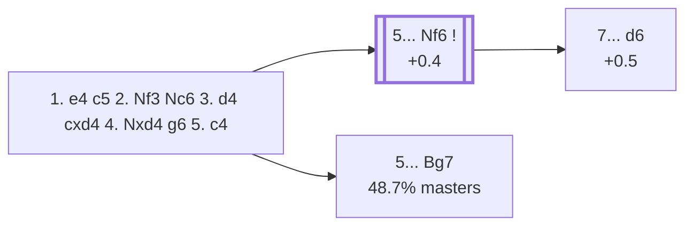

<a name="_TOP_"></a>

# B36 Sicilian Defense: Accelerated Dragon, Maróczy Bind <br> 1. e4 c5 2. Nf3 Nc6 3. d4 cxd4 4. Nxd4 g6 5. c4 #

Spun off from [`B34_Sicilian_g6_Accelerated_Dragon.md`](https://github.com/onclemarcel/chess_flashcards/blob/main/e4_openings/B34_Sicilian_g6_Accelerated_Dragon.md)'s own candidate list — masters' actual most popular try at that fork (56.2%), well ahead of either of B34's own two named lines. White clamps down on d5 for good with pawns on c4 and e4, the critical test of the whole Accelerated Dragon and the main reason some players prefer the slower ... d6/... g6 move order instead.

### Overview

*Quick map of every move covered on this card — see the [shape key](https://github.com/onclemarcel/chess_flashcards/blob/main/start.md#content-diagram-optional) in start.md.*

<!-- content-diagram:start -->

<!-- content-diagram:end -->

<a name="_initial_move_"></a>

[](https://lichess.org/analysis/standard/r1bqkbnr/pp1ppp1p/2n3p1/8/2PNP3/8/PP3PPP/RNBQKB1R_b_KQkq_c3_0_5)

*... 5. c4 — Maróczy Bind*

```
r1bqkbnr/pp1ppp1p/2n3p1/8/2PNP3/8/PP3PPP/RNBQKB1R b KQkq c3 0 5
```

|  | +0.4 |
| --- | --- |

<!-- lichess-stats:start fen="r1bqkbnr/pp1ppp1p/2n3p1/8/2PNP3/8/PP3PPP/RNBQKB1R b KQkq c3 0 5" db="lichess,masters" speeds="bullet,blitz" ratings="1800,2000,2200,2500" moves="6" -->
| Move | Online | W/D/B | Masters | W/D/B | |
| :--- | ---: | :--- | ---: | :--- | :-- |
| Bg7 | 1.1 M (77.0%) | ⬜⬜⬜⬜⬜🟫⬛⬛⬛⬛ 50/7/43 | 4.9 k (48.7%) | ⬜⬜⬜⬜🟫🟫🟫🟫⬛⬛ 39/41/20 |  |
| Nf6 | 298 k (21.1%) | ⬜⬜⬜⬜🟫⬛⬛⬛⬛⬛ 41/9/50 | 5.1 k (49.9%) | ⬜⬜⬜🟫🟫🟫🟫🟫⬛⬛ 33/51/16 |  |
| d6 | 12 k (0.9%) | ⬜⬜⬜⬜⬜🟫⬛⬛⬛⬛ 46/8/46 | 126 (1.2%) | ⬜⬜⬜⬜🟫🟫🟫🟫⬛⬛ 42/40/17 |  |
| Nxd4 | 7.0 k (0.5%) | ⬜⬜⬜⬜⬜⬛⬛⬛⬛⬛ 48/5/46 | 0 | — | ⚠ |
| Qb6 | 2.0 k (0.1%) | ⬜⬜⬜⬜⬜⬛⬛⬛⬛⬛ 49/5/47 | 5 (0.0%) | — |  |
| a6 | 1.3 k (0.1%) | ⬜⬜⬜⬜⬜⬜⬛⬛⬛⬛ 58/5/37 | 0 | — | ⚠ |
| Bh6 | 0 | — | 8 (0.1%) | — |  |
| Qa5+ | 0 | — | 3 (0.0%) | — |  |

*Online: bullet/blitz, 1800+ — 1.4 M games. Masters: 10 k games. [Open in the explorer](https://lichess.org/analysis/standard/r1bqkbnr/pp1ppp1p/2n3p1/8/2PNP3/8/PP3PPP/RNBQKB1R_b_KQkq_c3_0_5#explorer) — updated 2026-09-02*
<!-- lichess-stats:end -->

### Candidate moves

* [**5... Nf6**](#_Nf6_) (49.9% masters): develops naturally, staying B36 — see below.
* [**5... Bg7**](https://github.com/onclemarcel/chess_flashcards/blob/main/e4_openings/B37_Sicilian_Accelerated_Dragon_Maroczy_Bg7.md) (48.7% masters, essentially a coin-flip against Nf6): already live-tagged **B37** — see `B37_Sicilian_Accelerated_Dragon_Maroczy_Bg7.md`, not built out further here.

[*Back to TOP*](#_TOP_)

---

<a name="_Nf6_"></a>

### 5... Nf6

[](https://lichess.org/analysis/standard/r1bqkb1r/pp1ppp1p/2n2np1/8/2PNP3/8/PP3PPP/RNBQKB1R_w_KQkq_-_1_6)

*... 5... Nf6*

```
r1bqkb1r/pp1ppp1p/2n2np1/8/2PNP3/8/PP3PPP/RNBQKB1R w KQkq - 1 6
```

|  | +0.4 |
| --- | --- |

<!-- lichess-stats:start fen="r1bqkb1r/pp1ppp1p/2n2np1/8/2PNP3/8/PP3PPP/RNBQKB1R w KQkq - 1 6" db="lichess,masters" speeds="bullet,blitz" ratings="1800,2000,2200,2500" moves="6" -->
| Move | Online | W/D/B | Masters | W/D/B | |
| :--- | ---: | :--- | ---: | :--- | :-- |
| Nc3 | 257 k (85.2%) | ⬜⬜⬜⬜🟫⬛⬛⬛⬛⬛ 41/9/49 | 5.0 k (99.9%) | ⬜⬜⬜🟫🟫🟫🟫🟫⬛⬛ 33/51/16 |  |
| Be3 | 32 k (10.6%) | ⬜⬜⬜⬜⬛⬛⬛⬛⬛⬛ 36/6/59 | 2 (0.0%) | — | ⚠ |
| f3 | 5.6 k (1.8%) | ⬜⬜⬜⬜🟫⬛⬛⬛⬛⬛ 43/8/49 | 1 (0.0%) | — | ⚠ |
| Nxc6 | 3.6 k (1.2%) | ⬜⬜⬜⬜🟫⬛⬛⬛⬛⬛ 44/7/49 | 2 (0.0%) | — | ⚠ |
| Nc2 | 2.7 k (0.9%) | ⬜⬜⬜⬜🟫⬛⬛⬛⬛⬛ 42/5/53 | 0 | — | ⚠ |
| Be2 | 198 (0.1%) | ⬜⬜⬜⬜🟫⬛⬛⬛⬛⬛ 40/7/53 | 0 | — | ⚠ |

*Online: bullet/blitz, 1800+ — 302 k games. Masters: 5.1 k games. [Open in the explorer](https://lichess.org/analysis/standard/r1bqkb1r/pp1ppp1p/2n2np1/8/2PNP3/8/PP3PPP/RNBQKB1R_w_KQkq_-_1_6#explorer) — updated 2026-09-02*
<!-- lichess-stats:end -->

Attacking the d4-knight before completing the fianchetto — White's most natural reply is **6. Nc3**, and after **6... Nxd4 7. Qxd4**, Black plays **7... d6** (+0.5), reaching the *Gurgenidze Variation*.

[*Back to 5. c4*](#_initial_move_)
[*Back to TOP*](#_TOP_)

---

<a name="_Gurgenidze_"></a>

> [!NOTE]
> **6. Nc3 Nxd4 7. Qxd4 d6** is the *Gurgenidze Variation* — the queen recaptures on d4 instead of a knight, and Black immediately challenges it with ... d6, preparing ... Bg7/... Be6/... Qa5-family counterplay against the centralised queen.
>
> [](https://lichess.org/analysis/standard/r1bqkb1r/pp2pp1p/3p1np1/8/2PQP3/2N5/PP3PPP/R1B1KB1R_w_KQkq_-_0_8)
>
> *... 6. Nc3 Nxd4 7. Qxd4 d6 — Gurgenidze Variation*
>
> ```
> r1bqkb1r/pp2pp1p/3p1np1/8/2PQP3/2N5/PP3PPP/R1B1KB1R w KQkq - 0 8
> ```
>
> |  | +0.5 |
> | --- | --- |
>
> White's queen has to move again (typically **8. Be2** or **8. e5**), giving Black a tempo to complete development — deeper theory not covered further here.
>
> [*Back to 5... Nf6*](#_Nf6_)
> [*Back to TOP*](#_TOP_)
