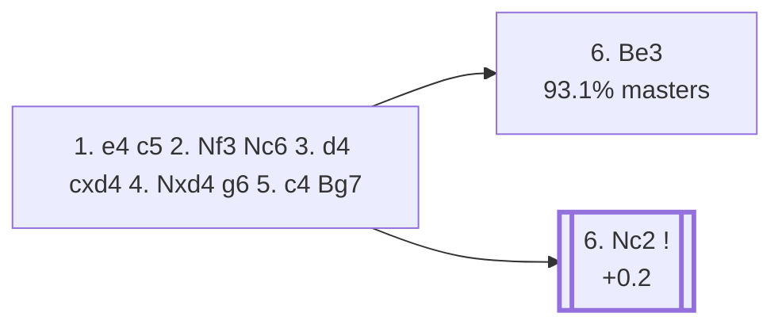

<a name="_TOP_"></a>

# B37 Sicilian Defense: Accelerated Dragon, Maróczy Bind <br> 1. e4 c5 2. Nf3 Nc6 3. d4 cxd4 4. Nxd4 g6 5. c4 Bg7 #

Spun off from [`B36_Sicilian_Accelerated_Dragon_Maroczy.md`](https://github.com/onclemarcel/chess_flashcards/blob/main/e4_openings/B36_Sicilian_Accelerated_Dragon_Maroczy.md)'s own candidate list — completing the fianchetto immediately rather than kicking the knight first, a near coin-flip with 5... Nf6 in practice (48.7% vs. 49.9% masters).

### Overview

*Quick map of every move covered on this card — see the [shape key](https://github.com/onclemarcel/chess_flashcards/blob/main/start.md#content-diagram-optional) in start.md.*

<!-- content-diagram:start -->

<!-- content-diagram:end -->

<a name="_initial_move_"></a>

[](https://lichess.org/analysis/standard/r1bqk1nr/pp1pppbp/2n3p1/8/2PNP3/8/PP3PPP/RNBQKB1R_w_KQkq_-_1_6)

*... 5... Bg7*

```
r1bqk1nr/pp1pppbp/2n3p1/8/2PNP3/8/PP3PPP/RNBQKB1R w KQkq - 1 6
```

|  | +0.3 |
| --- | --- |

<!-- lichess-stats:start fen="r1bqk1nr/pp1pppbp/2n3p1/8/2PNP3/8/PP3PPP/RNBQKB1R w KQkq - 1 6" db="lichess,masters" speeds="bullet,blitz" ratings="1800,2000,2200,2500" moves="6" -->
| Move | Online | W/D/B | Masters | W/D/B | |
| :--- | ---: | :--- | ---: | :--- | :-- |
| Be3 | 1.4 M (86.1%) | ⬜⬜⬜⬜⬜🟫⬛⬛⬛⬛ 50/7/43 | 6.8 k (93.1%) | ⬜⬜⬜⬜🟫🟫🟫🟫⬛⬛ 40/41/19 |  |
| Nc2 | 104 k (6.6%) | ⬜⬜⬜⬜⬜🟫⬛⬛⬛⬛ 52/5/42 | 469 (6.4%) | ⬜⬜⬜⬜🟫🟫🟫⬛⬛⬛ 44/32/24 |  |
| Nxc6 | 73 k (4.6%) | ⬜⬜⬜⬜🟫⬛⬛⬛⬛⬛ 45/6/49 | 8 (0.1%) | — |  |
| Nc3 | 20 k (1.3%) | ⬜⬜⬜🟫⬛⬛⬛⬛⬛⬛ 33/4/63 | 7 (0.1%) | — |  |
| Nb3 | 16 k (1.0%) | ⬜⬜⬜⬜⬜⬛⬛⬛⬛⬛ 51/5/45 | 12 (0.2%) | — |  |
| Nf3 | 4.2 k (0.3%) | ⬜⬜⬜⬜⬜⬛⬛⬛⬛⬛ 47/5/48 | 0 | — | ⚠ |
| Nb5 | 0 | — | 7 (0.1%) | — |  |

*Online: bullet/blitz, 1800+ — 1.6 M games. Masters: 7.3 k games. [Open in the explorer](https://lichess.org/analysis/standard/r1bqk1nr/pp1pppbp/2n3p1/8/2PNP3/8/PP3PPP/RNBQKB1R_w_KQkq_-_1_6#explorer) — updated 2026-09-02*
<!-- lichess-stats:end -->

### Candidate moves

* **6. Be3** (93.1% masters): White's overwhelming main try — already live-tagged **B38**, see `B38_Sicilian_Accelerated_Dragon_Maroczy_Be3.md`, not built out further here.
* [**6. Nc2**](#_Nc2_) (6.4% masters, +0.2): the *Simagin Variation* — see below.

[*Back to TOP*](#_TOP_)

---

<a name="_Nc2_"></a>

> [!NOTE]
> **6. Nc2** retreats the knight rather than developing the bishop, an unusual-looking regrouping try (6.4% of masters games at this fork) that keeps options open for a later Nc3/Be2/f3 set-up. **6... d6 7. Be2 Nh6** is the *Simagin Variation* — Black develops the king's knight to h6 instead of f6, eyeing f5 or g4 without blocking the g7-bishop's diagonal.
>
> [](https://lichess.org/analysis/standard/r1bqk2r/pp2ppbp/2np2pn/8/2P1P3/8/PPN1BPPP/RNBQK2R_w_KQkq_-_2_8)
>
> *... 6. Nc2 d6 7. Be2 Nh6 — Simagin Variation*
>
> ```
> r1bqk2r/pp2ppbp/2np2pn/8/2P1P3/8/PPN1BPPP/RNBQK2R w KQkq - 2 8
> ```
>
> |  | +0.2 |
> | --- | --- |
>
> A genuine database rarity (only 24 masters games at this exact tabiya) — deeper theory not covered further here.
>
> [*Back to 5... Bg7*](#_initial_move_)
> [*Back to TOP*](#_TOP_)
