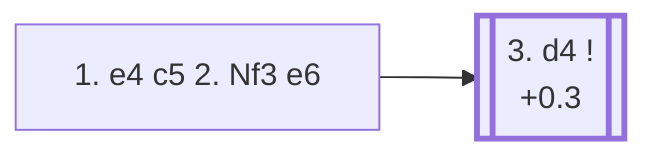

<a name="_TOP_"></a>

# B40 Sicilian Defense, 2... e6 <br> 1. e4 c5 2. Nf3 e6 #

The most flexible of the main Sicilian tries: Black delays committing the queenside knight or the kingside setup, keeping the option of a Taimanov-style ... Nc6, a Kan-style ... a6, or even a French-like ... d5 all available. The trade-off is a slightly slower pace than the more direct 2... d6 and 2... Nc6 lines.

### Overview

*Quick map of every move covered on this card — see the [shape key](https://github.com/onclemarcel/chess_flashcards/blob/main/start.md#content-diagram-optional) in start.md.*

<!-- content-diagram:start -->

<!-- content-diagram:end -->

<a name="_initial_move_"></a>

[](https://lichess.org/analysis/standard/rnbqkbnr/pp1p1ppp/4p3/2p5/4P3/5N2/PPPP1PPP/RNBQKB1R_w_KQkq_-_0_3)

*... 1. e4 c5 2. Nf3 e6*

```
rnbqkbnr/pp1p1ppp/4p3/2p5/4P3/5N2/PPPP1PPP/RNBQKB1R w KQkq - 0 3
```

|  | +0.3 |
| --- | --- |

<!-- lichess-stats:start fen="rnbqkbnr/pp1p1ppp/4p3/2p5/4P3/5N2/PPPP1PPP/RNBQKB1R w KQkq - 0 3" db="lichess,masters" speeds="bullet,blitz" ratings="1800,2000,2200,2500" moves="6" -->
| Move | Online | W/D/B | Masters | W/D/B | |
| :--- | ---: | :--- | ---: | :--- | :-- |
| d4 | 21.6 M (58.4%) | ⬜⬜⬜⬜⬜⬛⬛⬛⬛⬛ 46/5/49 | 83 k (71.5%) | ⬜⬜⬜🟫🟫🟫🟫⬛⬛⬛ 35/37/28 |  |
| c3 | 4.8 M (13.0%) | ⬜⬜⬜⬜⬜⬛⬛⬛⬛⬛ 49/5/46 | 8.7 k (7.6%) | ⬜⬜⬜🟫🟫🟫🟫⬛⬛⬛ 31/41/28 |  |
| Nc3 | 3.0 M (8.1%) | ⬜⬜⬜⬜⬜⬛⬛⬛⬛⬛ 47/4/49 | 7.2 k (6.3%) | ⬜⬜⬜🟫🟫🟫🟫⬛⬛⬛ 36/37/27 |  |
| Bc4 | 2.2 M (5.8%) | ⬜⬜⬜⬜⬜⬛⬛⬛⬛⬛ 44/4/52 | 0 | — | ⚠ |
| d3 | 1.4 M (3.8%) | ⬜⬜⬜⬜⬜⬛⬛⬛⬛⬛ 49/5/46 | 6.0 k (5.2%) | ⬜⬜⬜⬜🟫🟫🟫⬛⬛⬛ 35/33/31 |  |
| c4 | 1.1 M (3.0%) | ⬜⬜⬜⬜⬜⬛⬛⬛⬛⬛ 48/5/46 | 0 | — | ⚠ |
| b3 | 0 | — | 4.3 k (3.7%) | ⬜⬜⬜🟫🟫🟫🟫⬛⬛⬛ 35/35/30 |  |
| g3 | 0 | — | 3.5 k (3.1%) | ⬜⬜⬜🟫🟫🟫🟫⬛⬛⬛ 35/37/28 |  |

*Online: bullet/blitz, 1800+ — 36.9 M games. Masters: 115 k games. [Open in the explorer](https://lichess.org/analysis/standard/rnbqkbnr/pp1p1ppp/4p3/2p5/4P3/5N2/PPPP1PPP/RNBQKB1R_w_KQkq_-_0_3#explorer) — updated 2026-08-25*
<!-- lichess-stats:end -->

### Candidate moves

* [**3. d4**](#_d4_) (+0.3): the Open Sicilian — masters' main choice by a clear margin (71.5%).
* **3. c3** (masters 7.6%): an Alapin-style approach, avoiding Open Sicilian theory.
* **3. Nc3** (masters 6.3%): keeps options flexible, similar in spirit to a Closed Sicilian.
* **3. d3** (masters 5.2%): a quiet King's-Indian-Attack-style set-up.

[*Back to TOP*](#_TOP_)

---

<a name="_d4_"></a>

### 3. d4 — Open Sicilian

As in the other Open Sicilian lines, **3... cxd4 4. Nxd4** is essentially automatic. What's different here is what comes next: with the knight not yet committed to c6 or f6, Black has three genuinely comparable main systems, and masters show no strong preference among them.

[](https://lichess.org/analysis/standard/rnbqkbnr/pp1p1ppp/4p3/8/3NP3/8/PPP2PPP/RNBQKB1R_b_KQkq_-_0_4)

*... 3. d4 cxd4 4. Nxd4*

```
rnbqkbnr/pp1p1ppp/4p3/8/3NP3/8/PPP2PPP/RNBQKB1R b KQkq - 0 4
```

|  | +0.4 |
| --- | --- |

<!-- lichess-stats:start fen="rnbqkbnr/pp1p1ppp/4p3/8/3NP3/8/PPP2PPP/RNBQKB1R b KQkq - 0 4" db="lichess,masters" speeds="bullet,blitz" ratings="1800,2000,2200,2500" moves="8" -->
| Move | Online | W/D/B | Masters | W/D/B | |
| :--- | ---: | :--- | ---: | :--- | :-- |
| a6 | 7.4 M (40.2%) | ⬜⬜⬜⬜⬜⬛⬛⬛⬛⬛ 45/4/51 | 33 k (39.8%) | ⬜⬜⬜🟫🟫🟫🟫⬛⬛⬛ 35/35/30 |  |
| Nc6 | 5.3 M (28.7%) | ⬜⬜⬜⬜⬜⬛⬛⬛⬛⬛ 47/5/48 | 31 k (36.8%) | ⬜⬜⬜🟫🟫🟫🟫⬛⬛⬛ 33/40/27 |  |
| Nf6 | 4.0 M (21.5%) | ⬜⬜⬜⬜🟫⬛⬛⬛⬛⬛ 44/5/51 | 18 k (21.6%) | ⬜⬜⬜⬜🟫🟫🟫🟫⬛⬛ 37/38/25 |  |
| Bc5 | 674 k (3.7%) | ⬜⬜⬜⬜⬜⬛⬛⬛⬛⬛ 45/4/51 | 383 (0.5%) | ⬜⬜⬜⬜🟫🟫🟫⬛⬛⬛ 39/33/28 |  |
| d6 | 279 k (1.5%) | ⬜⬜⬜⬜⬜⬛⬛⬛⬛⬛ 49/4/47 | 233 (0.3%) | ⬜⬜⬜⬜🟫🟫🟫⬛⬛⬛ 37/30/33 |  |
| Qb6 | 273 k (1.5%) | ⬜⬜⬜⬜⬛⬛⬛⬛⬛⬛ 39/5/56 | 837 (1.0%) | ⬜⬜⬜⬜🟫🟫🟫⬛⬛⬛ 39/34/27 |  |
| d5 | 211 k (1.1%) | ⬜⬜⬜⬜⬜🟫⬛⬛⬛⬛ 52/5/44 | 0 | — | ⚠ |
| Qc7 | 72 k (0.4%) | ⬜⬜⬜⬜⬜⬛⬛⬛⬛⬛ 48/4/48 | 30 (0.0%) | ⬜⬜⬜⬜🟫🟫🟫🟫⬛⬛ 40/43/17 |  |
| Bb4+ | 0 | — | 11 (0.0%) | — |  |

*Online: bullet/blitz, 1800+ — 18.5 M games. Masters: 83 k games. [Open in the explorer](https://lichess.org/analysis/standard/rnbqkbnr/pp1p1ppp/4p3/8/3NP3/8/PPP2PPP/RNBQKB1R_b_KQkq_-_0_4#explorer) — updated 2026-08-25*
<!-- lichess-stats:end -->

* [**4... a6**](#_a6_) (39.8% masters): the *Kan Variation* (also called the Paulsen) — keeps the knight home a move longer, ruling out Nb5 ideas immediately, similar in spirit to the Najdorf but with ... e6 already played instead of ... d6. See below.
* [**4... Nc6**](#_Nc6_) (36.8% masters): the *Taimanov Variation* — develops naturally, often following up with ... Qc7 and ... a6, keeping the option of ... d6 or ... d5 open. See below.
* **4... Nf6** (21.6% masters): the *Four Knights Sicilian* — attacks e4 directly; after **5. Nc3 Nc6**, both knight pairs face off in the centre. Not covered further here.

Each of these three systems is a substantial independent body of theory in its own right.

[*Back to 1... e6*](#_initial_move_)
[*Back to TOP*](#_TOP_)

---

<a name="_a6_"></a>

### 4... a6 — Kan Variation

[](https://lichess.org/analysis/standard/rnbqkbnr/1p1p1ppp/p3p3/8/3NP3/8/PPP2PPP/RNBQKB1R_w_KQkq_-_0_5)

*... 4... a6 — Kan Variation*

```
rnbqkbnr/1p1p1ppp/p3p3/8/3NP3/8/PPP2PPP/RNBQKB1R w KQkq - 0 5
```

|  | +0.4 |
| --- | --- |

<!-- lichess-stats:start fen="rnbqkbnr/1p1p1ppp/a3p3/8/3NP3/8/PPP2PPP/RNBQKB1R w KQkq - 0 5" db="lichess,masters" speeds="bullet,blitz" ratings="1800,2000,2200,2500" moves="4" -->
...generated table...
<!-- lichess-stats:end -->

> [!NOTE]
> Masters' actual main try, **5. Bd3** (48.6%), is a real online/masters inversion: online play instead favours the more natural-looking **5. Nc3** (53.4% online, only 33.2% masters). Bd3 aims straight at the kingside while keeping the knight flexible between c3 and d2 — a more subtle try that takes some experience to prefer over simply developing the queen's knight.

**5. Bd3** is masters' clear main try (48.6%) — see the note above. Deeper Kan theory (Black's flexible ... Qc7/... Nc6/... b5 setups) is its own extensive body of work, not covered further here.

[*Back to 3. d4*](#_d4_)
[*Back to TOP*](#_TOP_)

---

<a name="_Nc6_"></a>

### 4... Nc6 — Taimanov Variation

[](https://lichess.org/analysis/standard/r1bqkbnr/pp1p1ppp/2n1p3/8/3NP3/8/PPP2PPP/RNBQKB1R_w_KQkq_-_1_5)

*... 4... Nc6 — Taimanov Variation*

```
r1bqkbnr/pp1p1ppp/2n1p3/8/3NP3/8/PPP2PPP/RNBQKB1R w KQkq - 1 5
```

|  | +0.3 |
| --- | --- |

<!-- lichess-stats:start fen="r1bqkbnr/pp1p1ppp/2n1p3/8/3NP3/8/PPP2PPP/RNBQKB1R w KQkq - 1 5" db="lichess,masters" speeds="bullet,blitz" ratings="1800,2000,2200,2500" moves="3" -->
...generated table...
<!-- lichess-stats:end -->

**5. Nc3** is masters' overwhelming choice (85.5%) — developing naturally before deciding on a plan, with **5. Nb5** (9.7%) a real second choice, immediately probing the d6 square the way it does against the Sveshnikov and Najdorf. Deeper Taimanov theory (Black's typical ... Qc7/... a6/... Nf6 set-up) is its own extensive body of work, not covered further here.

[*Back to 3. d4*](#_d4_)
[*Back to TOP*](#_TOP_)
