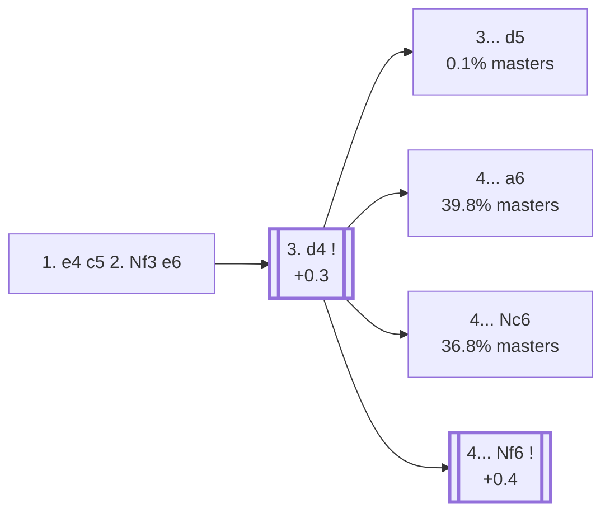

<a name="_TOP_"></a>

# B40 Sicilian Defense, 2... e6 <br> 1. e4 c5 2. Nf3 e6 #

The most flexible of the main Sicilian tries: Black delays committing the queenside knight or the kingside setup, keeping the option of a Taimanov-style ... Nc6, a Kan-style ... a6, or even a French-like ... d5 all available. The trade-off is a slightly slower pace than the more direct 2... d6 and 2... Nc6 lines. Live-tagged the *French Variation* throughout this whole range (`eco.md`'s own root entry just says "Sicilian Defence").

### Overview

*Quick map of every move covered on this card — see the [shape key](https://github.com/onclemarcel/chess_flashcards/blob/main/start.md#content-diagram-optional) in start.md.*

<!-- content-diagram:start -->

<!-- content-diagram:end -->

<a name="_initial_move_"></a>

[](https://lichess.org/analysis/standard/rnbqkbnr/pp1p1ppp/4p3/2p5/4P3/5N2/PPPP1PPP/RNBQKB1R_w_KQkq_-_0_3)

*... 1. e4 c5 2. Nf3 e6*

```
rnbqkbnr/pp1p1ppp/4p3/2p5/4P3/5N2/PPPP1PPP/RNBQKB1R w KQkq - 0 3
```

|  | +0.3 |
| --- | --- |

<!-- lichess-stats:start fen="rnbqkbnr/pp1p1ppp/4p3/2p5/4P3/5N2/PPPP1PPP/RNBQKB1R w KQkq - 0 3" db="lichess,masters" speeds="bullet,blitz" ratings="1800,2000,2200,2500" moves="6" -->
| Move | Online | W/D/B | Masters | W/D/B | |
| :--- | ---: | :--- | ---: | :--- | :-- |
| d4 | 21.6 M (58.4%) | ⬜⬜⬜⬜⬜⬛⬛⬛⬛⬛ 46/5/49 | 83 k (71.5%) | ⬜⬜⬜🟫🟫🟫🟫⬛⬛⬛ 35/37/28 |  |
| c3 | 4.8 M (13.0%) | ⬜⬜⬜⬜⬜⬛⬛⬛⬛⬛ 49/5/46 | 8.7 k (7.6%) | ⬜⬜⬜🟫🟫🟫🟫⬛⬛⬛ 31/41/28 |  |
| Nc3 | 3.0 M (8.1%) | ⬜⬜⬜⬜⬜⬛⬛⬛⬛⬛ 47/4/49 | 7.2 k (6.3%) | ⬜⬜⬜🟫🟫🟫🟫⬛⬛⬛ 36/37/27 |  |
| Bc4 | 2.2 M (5.8%) | ⬜⬜⬜⬜⬜⬛⬛⬛⬛⬛ 44/4/52 | 0 | — | ⚠ |
| d3 | 1.4 M (3.8%) | ⬜⬜⬜⬜⬜⬛⬛⬛⬛⬛ 49/5/46 | 6.0 k (5.2%) | ⬜⬜⬜⬜🟫🟫🟫⬛⬛⬛ 35/33/31 |  |
| c4 | 1.1 M (3.0%) | ⬜⬜⬜⬜⬜⬛⬛⬛⬛⬛ 48/5/46 | 0 | — | ⚠ |
| b3 | 0 | — | 4.3 k (3.7%) | ⬜⬜⬜🟫🟫🟫🟫⬛⬛⬛ 35/35/30 |  |
| g3 | 0 | — | 3.5 k (3.1%) | ⬜⬜⬜🟫🟫🟫🟫⬛⬛⬛ 35/37/28 |  |

*Online: bullet/blitz, 1800+ — 36.9 M games. Masters: 115 k games. [Open in the explorer](https://lichess.org/analysis/standard/rnbqkbnr/pp1p1ppp/4p3/2p5/4P3/5N2/PPPP1PPP/RNBQKB1R_w_KQkq_-_0_3#explorer) — updated 2026-09-02*
<!-- lichess-stats:end -->

### Candidate moves

* [**3. d4**](#_d4_) (+0.3): the Open Sicilian — masters' main choice by a clear margin (71.5%).
* **3. c3** (masters 7.6%): an Alapin-style approach, avoiding Open Sicilian theory.
* **3. Nc3** (masters 6.3%): keeps options flexible, similar in spirit to a Closed Sicilian.
* **3. d3** (masters 5.2%): a quiet King's-Indian-Attack-style set-up.

Black's own reply to 3. d4 is close to automatic — [**3... cxd4**](#_d4_) (99.8% masters) — but [**3... d5**](#_Marshall_) (a real database rarity, 0.1%) is a genuine independent try, the *Marshall Counterattack*. See below.

[*Back to TOP*](#_TOP_)

---

<a name="_Marshall_"></a>

> [!NOTE]
> **3... d5**, the *Marshall Counterattack* (`eco.md`: "Marshall Variation"), strikes back in the centre immediately rather than taking on d4 first — a genuine database rarity (0.1% masters) with a sharp, gambit-like point.
>
> [](https://lichess.org/analysis/standard/rnbqkbnr/pp3ppp/4p3/2pp4/3PP3/5N2/PPP2PPP/RNBQKB1R_w_KQkq_d6_0_4)
>
> *... 3... d5 — Marshall Counterattack*
>
> ```
> rnbqkbnr/pp3ppp/4p3/2pp4/3PP3/5N2/PPP2PPP/RNBQKB1R w KQkq d6 0 4
> ```
>
> |  | +0.7 |
> | --- | --- |
>
> **4. exd5** (82.5% of the small sample) is close to automatic — Black gets open lines and quick development for the pawn, similar in spirit to other Scandinavian-adjacent gambit ideas, but Stockfish rates White's extra pawn as a real, if modest, practical plus. Deeper theory not covered further here.
>
> [*Back to TOP*](#_TOP_)

---

<a name="_d4_"></a>

### 3. d4 — Open Sicilian

As in the other Open Sicilian lines, **3... cxd4 4. Nxd4** is essentially automatic. What's different here is what comes next: with the knight not yet committed to c6 or f6, Black has three genuinely comparable main systems, and masters show no strong preference among them.

[](https://lichess.org/analysis/standard/rnbqkbnr/pp1p1ppp/4p3/8/3NP3/8/PPP2PPP/RNBQKB1R_b_KQkq_-_0_4)

*... 3. d4 cxd4 4. Nxd4*

```
rnbqkbnr/pp1p1ppp/4p3/8/3NP3/8/PPP2PPP/RNBQKB1R b KQkq - 0 4
```

|  | +0.4 |
| --- | --- |

<!-- lichess-stats:start fen="rnbqkbnr/pp1p1ppp/4p3/8/3NP3/8/PPP2PPP/RNBQKB1R b KQkq - 0 4" db="lichess,masters" speeds="bullet,blitz" ratings="1800,2000,2200,2500" moves="8" -->
| Move | Online | W/D/B | Masters | W/D/B | |
| :--- | ---: | :--- | ---: | :--- | :-- |
| a6 | 7.4 M (40.2%) | ⬜⬜⬜⬜⬜⬛⬛⬛⬛⬛ 45/4/51 | 33 k (39.8%) | ⬜⬜⬜🟫🟫🟫🟫⬛⬛⬛ 35/35/30 |  |
| Nc6 | 5.3 M (28.7%) | ⬜⬜⬜⬜⬜⬛⬛⬛⬛⬛ 47/5/48 | 31 k (36.8%) | ⬜⬜⬜🟫🟫🟫🟫⬛⬛⬛ 33/40/27 |  |
| Nf6 | 4.0 M (21.5%) | ⬜⬜⬜⬜🟫⬛⬛⬛⬛⬛ 44/5/51 | 18 k (21.6%) | ⬜⬜⬜⬜🟫🟫🟫🟫⬛⬛ 37/38/25 |  |
| Bc5 | 674 k (3.7%) | ⬜⬜⬜⬜⬜⬛⬛⬛⬛⬛ 45/4/51 | 383 (0.5%) | ⬜⬜⬜⬜🟫🟫🟫⬛⬛⬛ 39/33/28 |  |
| d6 | 279 k (1.5%) | ⬜⬜⬜⬜⬜⬛⬛⬛⬛⬛ 49/4/47 | 233 (0.3%) | ⬜⬜⬜⬜🟫🟫🟫⬛⬛⬛ 37/30/33 |  |
| Qb6 | 273 k (1.5%) | ⬜⬜⬜⬜⬛⬛⬛⬛⬛⬛ 39/5/56 | 837 (1.0%) | ⬜⬜⬜⬜🟫🟫🟫⬛⬛⬛ 39/34/27 |  |
| d5 | 211 k (1.1%) | ⬜⬜⬜⬜⬜🟫⬛⬛⬛⬛ 52/5/44 | 0 | — | ⚠ |
| Qc7 | 72 k (0.4%) | ⬜⬜⬜⬜⬜⬛⬛⬛⬛⬛ 48/4/48 | 30 (0.0%) | ⬜⬜⬜⬜🟫🟫🟫🟫⬛⬛ 40/43/17 |  |
| Bb4+ | 0 | — | 11 (0.0%) | — |  |

*Online: bullet/blitz, 1800+ — 18.5 M games. Masters: 83 k games. [Open in the explorer](https://lichess.org/analysis/standard/rnbqkbnr/pp1p1ppp/4p3/8/3NP3/8/PPP2PPP/RNBQKB1R_b_KQkq_-_0_4#explorer) — updated 2026-09-02*
<!-- lichess-stats:end -->

* [**4... a6**](https://github.com/onclemarcel/chess_flashcards/blob/main/e4_openings/B41_Sicilian_Kan_Variation.md) (39.8% masters): the *Kan Variation* (also called the Paulsen) — already live-tagged **B41**, see `B41_Sicilian_Kan_Variation.md`, not built out further here.
* [**4... Nc6**](https://github.com/onclemarcel/chess_flashcards/blob/main/e4_openings/B44_Sicilian_Taimanov_Szen.md) (36.8% masters): the *Taimanov Variation* — already live-tagged **B44**, see `B44_Sicilian_Taimanov_Szen.md`, not built out further here.
* [**4... Nf6**](#_Nf6_) (21.6% masters, +0.4): the *Four Knights Sicilian*, forking further into the *Pin Variation* — stays genuinely B40. See below.

Each of these three systems is a substantial independent body of theory in its own right.

[*Back to 1... e6*](#_initial_move_)
[*Back to TOP*](#_TOP_)

---

> [!NOTE]
> **4... a6** (39.8% masters) is already live-tagged **B41**, the *Kan Variation* — see [`B41_Sicilian_Kan_Variation.md`](https://github.com/onclemarcel/chess_flashcards/blob/main/e4_openings/B41_Sicilian_Kan_Variation.md), not built out further here. **4... Nc6** (36.8% masters) is already live-tagged **B44**, the *Taimanov Variation* — see [`B44_Sicilian_Taimanov_Szen.md`](https://github.com/onclemarcel/chess_flashcards/blob/main/e4_openings/B44_Sicilian_Taimanov_Szen.md), not built out further here.

---

<a name="_Nf6_"></a>

### 4... Nf6 — Pin Variation

[](https://lichess.org/analysis/standard/rnbqkb1r/pp1p1ppp/4pn2/8/3NP3/8/PPP2PPP/RNBQKB1R_w_KQkq_-_1_5)

*... 4... Nf6 — the Four Knights Sicilian*

```
rnbqkb1r/pp1p1ppp/4pn2/8/3NP3/8/PPP2PPP/RNBQKB1R w KQkq - 1 5
```

|  | +0.4 |
| --- | --- |

<!-- lichess-stats:start fen="rnbqkb1r/pp1p1ppp/4pn2/8/3NP3/8/PPP2PPP/RNBQKB1R w KQkq - 1 5" db="lichess,masters" speeds="bullet,blitz" ratings="1800,2000,2200,2500" moves="4" -->
| Move | Online | W/D/B | Masters | W/D/B | |
| :--- | ---: | :--- | ---: | :--- | :-- |
| Nc3 | 3.1 M (78.0%) | ⬜⬜⬜⬜🟫⬛⬛⬛⬛⬛ 45/5/50 | 17 k (93.6%) | ⬜⬜⬜⬜🟫🟫🟫🟫⬛⬛ 37/38/25 |  |
| Bd3 | 485 k (12.2%) | ⬜⬜⬜⬜⬜⬛⬛⬛⬛⬛ 46/6/49 | 1.1 k (6.1%) | ⬜⬜⬜🟫🟫🟫🟫⬛⬛⬛ 32/37/31 |  |
| e5 | 118 k (3.0%) | ⬜⬜⬜⬜⬛⬛⬛⬛⬛⬛ 40/4/57 | 0 | — | ⚠ |
| f3 | 110 k (2.8%) | ⬜⬜⬜⬜🟫⬛⬛⬛⬛⬛ 42/5/53 | 9 (0.1%) | — |  |
| Nd2 | 0 | — | 34 (0.2%) | ⬜⬜⬜⬜🟫🟫🟫🟫⬛⬛ 41/35/24 |  |

*Online: bullet/blitz, 1800+ — 4.0 M games. Masters: 18 k games. [Open in the explorer](https://lichess.org/analysis/standard/rnbqkb1r/pp1p1ppp/4pn2/8/3NP3/8/PPP2PPP/RNBQKB1R_w_KQkq_-_1_5#explorer) — updated 2026-09-02*
<!-- lichess-stats:end -->

**5. Nc3** is masters' overwhelming choice (93.6%). Rather than the symmetrical **5... Nc6** (transposing toward the regular Taimanov/B44 tabiya), Black's other real try is **5... Bb4**, pinning the c3-knight immediately — the *Pin Variation*, which stays genuinely B40 despite sitting three plies past the card's own root.

<a name="_Pin_"></a>

[](https://lichess.org/analysis/standard/rnbqk2r/pp1p1ppp/4pn2/8/1b1NP3/2N5/PPP2PPP/R1BQKB1R_w_KQkq_-_3_6)

*... 5. Nc3 Bb4 — Pin Variation*

```
rnbqk2r/pp1p1ppp/4pn2/8/1b1NP3/2N5/PPP2PPP/R1BQKB1R w KQkq - 3 6
```

|  | +0.7 |
| --- | --- |

<!-- lichess-stats:start fen="rnbqk2r/pp1p1ppp/4pn2/8/1b1NP3/2N5/PPP2PPP/R1BQKB1R w KQkq - 3 6" db="lichess,masters" speeds="bullet,blitz" ratings="1800,2000,2200,2500" moves="4" -->
| Move | Online | W/D/B | Masters | W/D/B | |
| :--- | ---: | :--- | ---: | :--- | :-- |
| Bd3 | 397 k (40.0%) | ⬜⬜⬜⬜⬜⬛⬛⬛⬛⬛ 47/4/48 | 72 (13.8%) | ⬜⬜⬜⬜🟫🟫🟫⬛⬛⬛ 40/28/32 |  |
| e5 | 176 k (17.7%) | ⬜⬜⬜⬜⬜⬛⬛⬛⬛⬛ 50/4/46 | 429 (82.3%) | ⬜⬜⬜⬜⬜🟫🟫🟫⬛⬛ 49/28/23 |  |
| f3 | 118 k (11.8%) | ⬜⬜⬜⬜🟫⬛⬛⬛⬛⬛ 42/4/54 | 0 | — | ⚠ |
| Bg5 | 91 k (9.1%) | ⬜⬜⬜⬛⬛⬛⬛⬛⬛⬛ 33/4/64 | 0 | — | ⚠ |
| Nb5 | 0 | — | 12 (2.3%) | — |  |
| Qd3 | 0 | — | 5 (1.0%) | — |  |

*Online: bullet/blitz, 1800+ — 993 k games. Masters: 521 games. [Open in the explorer](https://lichess.org/analysis/standard/rnbqk2r/pp1p1ppp/4pn2/8/1b1NP3/2N5/PPP2PPP/R1BQKB1R_w_KQkq_-_3_6#explorer) — updated 2026-09-02*
<!-- lichess-stats:end -->

**A genuine finding, worth stating plainly rather than assumed from `eco.md`'s own naming order alone**: masters' actual main try here is **6. e5** (82.3%, the *Koch Variation*), pushing the e-pawn to gain space and hit the f6-knight — well ahead of **6. Bd3** (13.8%, the *Jaffe Variation*, `eco.md`'s own first-listed name).

* [**6. e5**](#_Koch_): the *Koch Variation* — see below.
* [**6. Bd3**](#_Jaffe_): the *Jaffe Variation* — see below.

[*Back to 4... Nf6*](#_Nf6_)
[*Back to TOP*](#_TOP_)

---

<a name="_Koch_"></a>

> [!NOTE]
> **6. e5** — the *Koch Variation* — kicks the f6-knight immediately.
>
> [](https://lichess.org/analysis/standard/rnbqk2r/pp1p1ppp/4pn2/4P3/1b1N4/2N5/PPP2PPP/R1BQKB1R_b_KQkq_-_0_6)
>
> *... 6. e5 — Koch Variation*
>
> ```
> rnbqk2r/pp1p1ppp/4pn2/4P3/1b1N4/2N5/PPP2PPP/R1BQKB1R b KQkq - 0 6
> ```
>
> |  | +0.8 |
> | --- | --- |
>
> **6... Nd5** is masters' clear main try (92.1%), heading for a strong central outpost. Deeper theory not covered further here.
>
> [*Back to 5. Nc3 Bb4*](#_Pin_)
> [*Back to TOP*](#_TOP_)

---

<a name="_Jaffe_"></a>

> [!NOTE]
> **6. Bd3 e5** is the *Jaffe Variation* — Black strikes back in the centre immediately, right after White develops the bishop rather than pushing e5.
>
> [](https://lichess.org/analysis/standard/rnbqk2r/pp1p1ppp/5n2/4p3/1b1NP3/2NB4/PPP2PPP/R1BQK2R_w_KQkq_-_0_7)
>
> *... 6. Bd3 e5 — Jaffe Variation*
>
> ```
> rnbqk2r/pp1p1ppp/5n2/4p3/1b1NP3/2NB4/PPP2PPP/R1BQK2R w KQkq - 0 7
> ```
>
> |  | +0.6 |
> | --- | --- |
>
> A genuine database rarity (only 19 masters games) — White's knight must retreat, most often to f5 or e2. Deeper theory not covered further here.
>
> [*Back to 5. Nc3 Bb4*](#_Pin_)
> [*Back to TOP*](#_TOP_)
