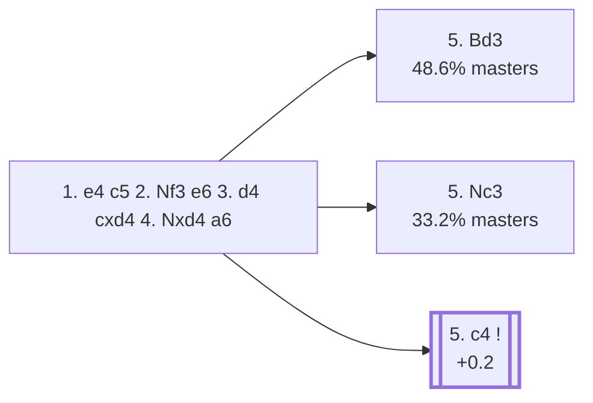

<a name="_TOP_"></a>

# B41 Sicilian Defense: Kan Variation <br> 1. e4 c5 2. Nf3 e6 3. d4 cxd4 4. Nxd4 a6 #

Spun off from [`B40_Sicilian_e6_Open.md`](https://github.com/onclemarcel/chess_flashcards/blob/main/e4_openings/B40_Sicilian_e6_Open.md)'s own "3. d4" branch — masters' single most popular reply there (39.8%). Also called the *Paulsen Variation* — Black keeps the knight home a move longer than the Taimanov, ruling out Nb5 ideas immediately, similar in spirit to the Najdorf but with ... e6 already played instead of ... d6.

### Overview

*Quick map of every move covered on this card — see the [shape key](https://github.com/onclemarcel/chess_flashcards/blob/main/start.md#content-diagram-optional) in start.md.*

<!-- content-diagram:start -->

<!-- content-diagram:end -->

<a name="_initial_move_"></a>

[](https://lichess.org/analysis/standard/rnbqkbnr/1p1p1ppp/p3p3/8/3NP3/8/PPP2PPP/RNBQKB1R_w_KQkq_-_0_5)

*... 4... a6 — Kan Variation*

```
rnbqkbnr/1p1p1ppp/p3p3/8/3NP3/8/PPP2PPP/RNBQKB1R w KQkq - 0 5
```

|  | +0.4 |
| --- | --- |

<!-- lichess-stats:start fen="rnbqkbnr/1p1p1ppp/p3p3/8/3NP3/8/PPP2PPP/RNBQKB1R w KQkq - 0 5" db="lichess,masters" speeds="bullet,blitz" ratings="1800,2000,2200,2500" moves="6" -->
| Move | Online | W/D/B | Masters | W/D/B | |
| :--- | ---: | :--- | ---: | :--- | :-- |
| Nc3 | 4.0 M (53.4%) | ⬜⬜⬜⬜🟫⬛⬛⬛⬛⬛ 44/4/52 | 11 k (33.2%) | ⬜⬜⬜🟫🟫🟫⬛⬛⬛⬛ 33/33/34 |  |
| c4 | 1.4 M (18.9%) | ⬜⬜⬜⬜⬜⬛⬛⬛⬛⬛ 47/5/48 | 4.2 k (12.7%) | ⬜⬜⬜🟫🟫🟫🟫⬛⬛⬛ 35/35/29 |  |
| Bd3 | 903 k (12.0%) | ⬜⬜⬜⬜⬜⬛⬛⬛⬛⬛ 47/5/48 | 16 k (48.6%) | ⬜⬜⬜🟫🟫🟫🟫⬛⬛⬛ 35/37/28 |  |
| Be3 | 229 k (3.0%) | ⬜⬜⬜⬜🟫⬛⬛⬛⬛⬛ 43/4/53 | 0 | — | ⚠ |
| Be2 | 170 k (2.3%) | ⬜⬜⬜⬜🟫⬛⬛⬛⬛⬛ 44/5/52 | 975 (3.0%) | ⬜⬜⬜⬜🟫🟫🟫⬛⬛⬛ 36/33/30 |  |
| Bc4 | 149 k (2.0%) | ⬜⬜⬜⬜⬛⬛⬛⬛⬛⬛ 41/4/56 | 0 | — | ⚠ |
| g3 | 0 | — | 316 (1.0%) | ⬜⬜⬜🟫🟫🟫⬛⬛⬛⬛ 28/35/36 |  |
| a3 | 0 | — | 149 (0.5%) | ⬜⬜⬜⬜⬜🟫🟫🟫⬛⬛ 49/27/24 |  |

*Online: bullet/blitz, 1800+ — 7.5 M games. Masters: 33 k games. [Open in the explorer](https://lichess.org/analysis/standard/rnbqkbnr/1p1p1ppp/p3p3/8/3NP3/8/PPP2PPP/RNBQKB1R_w_KQkq_-_0_5#explorer) — updated 2026-09-02*
<!-- lichess-stats:end -->

> [!NOTE]
> Masters' actual main try, **5. Bd3** (48.6%), is a real online/masters inversion: online play instead favours the more natural-looking **5. Nc3** (53.4% online, only 33.2% masters). Bd3 aims straight at the kingside while keeping the knight flexible between c3 and d2 — a more subtle try that takes some experience to prefer over simply developing the queen's knight.

### Candidate moves

* **5. Bd3** (48.6% masters): already live-tagged **B42** — see [`B42_Sicilian_Kan_Modern_Variation.md`](https://github.com/onclemarcel/chess_flashcards/blob/main/e4_openings/B42_Sicilian_Kan_Modern_Variation.md), not built out further here.
* **5. Nc3** (33.2% masters): already live-tagged **B43** — see [`B43_Sicilian_Kan_Knight_Variation.md`](https://github.com/onclemarcel/chess_flashcards/blob/main/e4_openings/B43_Sicilian_Kan_Knight_Variation.md), not built out further here.
* [**5. c4**](#_c4_) (12.7% masters): the *Maroczy Bind* — stays genuinely B41. See below.

[*Back to TOP*](#_TOP_)

---

<a name="_c4_"></a>

### 5. c4 — Maróczy Bind

[](https://lichess.org/analysis/standard/rnbqkbnr/1p1p1ppp/p3p3/8/2PNP3/8/PP3PPP/RNBQKB1R_b_KQkq_c3_0_5)

*... 5. c4 — Maróczy Bind*

```
rnbqkbnr/1p1p1ppp/p3p3/8/2PNP3/8/PP3PPP/RNBQKB1R b KQkq c3 0 5
```

|  | +0.2 |
| --- | --- |

<!-- lichess-stats:start fen="rnbqkbnr/1p1p1ppp/p3p3/8/2PNP3/8/PP3PPP/RNBQKB1R b KQkq c3 0 5" db="lichess,masters" speeds="bullet,blitz" ratings="1800,2000,2200,2500" moves="4" -->
| Move | Online | W/D/B | Masters | W/D/B | |
| :--- | ---: | :--- | ---: | :--- | :-- |
| Qc7 | 688 k (45.4%) | ⬜⬜⬜⬜⬜⬛⬛⬛⬛⬛ 46/5/49 | 314 (7.2%) | ⬜⬜⬜⬜🟫🟫🟫⬛⬛⬛ 38/31/32 |  |
| Nf6 | 399 k (26.4%) | ⬜⬜⬜⬜⬜⬛⬛⬛⬛⬛ 46/6/48 | 3.8 k (87.3%) | ⬜⬜⬜🟫🟫🟫🟫⬛⬛⬛ 35/36/29 |  |
| Nc6 | 161 k (10.7%) | ⬜⬜⬜⬜⬜🟫⬛⬛⬛⬛ 51/5/44 | 0 | — | ⚠ |
| b6 | 92 k (6.1%) | ⬜⬜⬜⬜⬜⬛⬛⬛⬛⬛ 48/4/48 | 56 (1.3%) | ⬜⬜🟫🟫🟫🟫⬛⬛⬛⬛ 20/45/36 |  |
| d6 | 0 | — | 53 (1.2%) | ⬜⬜⬜⬜⬜🟫🟫🟫⬛⬛ 47/28/25 |  |

*Online: bullet/blitz, 1800+ — 1.5 M games. Masters: 4.4 k games. [Open in the explorer](https://lichess.org/analysis/standard/rnbqkbnr/1p1p1ppp/p3p3/8/2PNP3/8/PP3PPP/RNBQKB1R_b_KQkq_c3_0_5#explorer) — updated 2026-09-02*
<!-- lichess-stats:end -->

Live-tagged the *Réti Variation* (`eco.md`'s own entry just calls the whole branch "Maroczy bind," without this fuller name). **5... Nf6** is masters' clear main try (87.3%), attacking e4 immediately.

[*Back to 4... a6*](#_initial_move_)
[*Back to TOP*](#_TOP_)

---

> [!NOTE]
> **5... Nf6 6. Nc3 Bb4 7. Bd3 Nc6 8. Bc2** is the *Bronstein Variation* — a deep, well-tested tabiya (98 masters games) inside the Maróczy Bind, genuinely level per Stockfish.
>
> [](https://lichess.org/analysis/standard/r1bqk2r/1p1p1ppp/p1n1pn2/8/1bPNP3/2N5/PPB2PPP/R1BQK2R_b_KQkq_-_6_8)
>
> *... 5... Nf6 6. Nc3 Bb4 7. Bd3 Nc6 8. Bc2 — Bronstein Variation*
>
> ```
> r1bqk2r/1p1p1ppp/p1n1pn2/8/1bPNP3/2N5/PPB2PPP/R1BQK2R b KQkq - 6 8
> ```
>
> |  | 0.0 |
> | --- | --- |
>
> Deeper theory past this point is not covered further here.
>
> [*Back to 4... a6*](#_initial_move_)
> [*Back to TOP*](#_TOP_)
